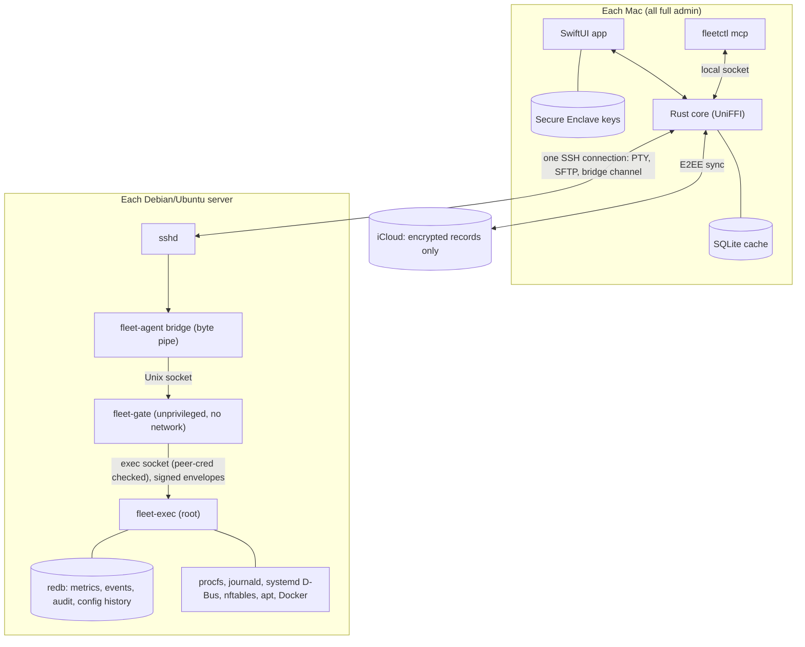
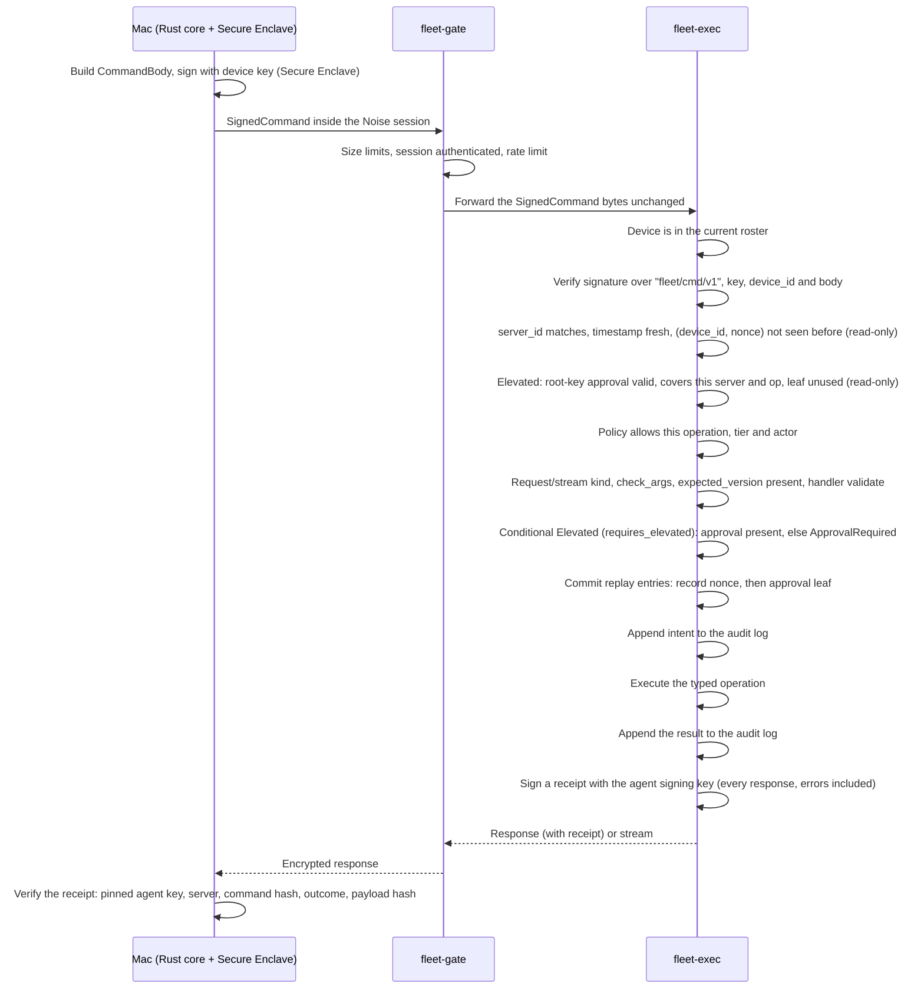
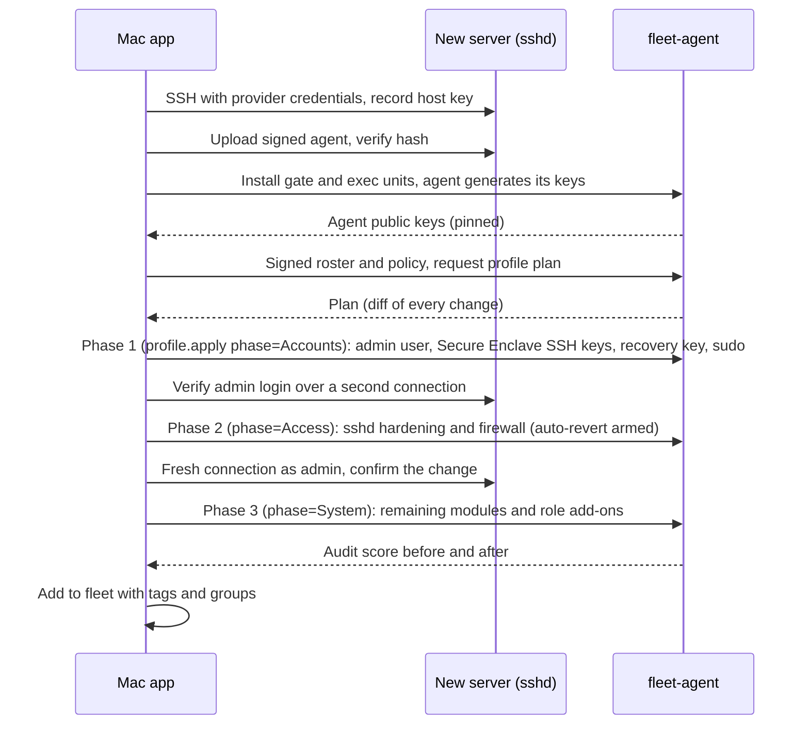

# Fleet: Linux Server Control Plane for macOS

**Design document** · Version 0.3 · September 2026 · Status: as built (0.3 folds the implementation notes into the design; the code is authoritative where they differ)
*"Fleet" is a working name.*

---

## Contents

1. [Overview](#1-overview)
2. [Feature specification](#2-feature-specification)
3. [System architecture](#3-system-architecture)
4. [Server agent](#4-server-agent)
5. [Security architecture](#5-security-architecture)
6. [Wire protocol](#6-wire-protocol)
7. [Mac application](#7-mac-application)
8. [AI integration (MCP)](#8-ai-integration-mcp)
9. [Provisioning](#9-provisioning)
10. [Agent lifecycle](#10-agent-lifecycle)
11. [Performance budgets](#11-performance-budgets)
12. [Tech stack and repository layout](#12-tech-stack-and-repository-layout)
13. [Testing and verification](#13-testing-and-verification)
14. [Roadmap](#14-roadmap)
15. [Open questions](#15-open-questions)

---

## 1. Overview

Fleet is a native macOS control plane for a personal fleet of 10–100 Debian and Ubuntu servers. It has two parts:

- **`fleet-agent`**, a lean Rust agent on each server. It collects telemetry, records history and events, and performs typed operations, each one cryptographically authorized.
- **The Fleet app**, a SwiftUI app with a Rust core, installed on each of the operator's Macs. It provides the dashboard, terminal, file access, administration tools, server provisioning, and an MCP server for AI agents.

### 1.1 Design principles

1. **Security first.** The agent performs no action without a signature from a hardware-backed key on an enrolled Mac.
2. **Lean.** The agent uses a few MB of RAM, near-zero CPU when idle, and opens no network ports.
3. **Don't reinvent `sshd`.** The terminal and file transfer use SSH directly. The agent handles structured data and control only.
4. **Every change is reversible or auditable, ideally both.**
5. **Fleet-first.** Every feature works the same on one server or a hundred.

### 1.2 Goals

- One app to monitor, access, administer and provision every server.
- Live metrics with 7 days of history on every server.
- Fast enough to feel local: the dashboard opens instantly from cache, and live data arrives in under 250 ms plus network latency.
- Maximum security: end-to-end encryption, signed commands, signed policies, hardware-backed keys, and a tamper-evident audit log.
- Full access from several Macs, with keys synced end-to-end encrypted.
- Safe, full-power access for AI agents through MCP.

### 1.3 Non-goals

- Several human users with different roles. There is one operator, possibly on several Macs.
- Kubernetes (explicitly dropped).
- Distributions other than Debian/Ubuntu, and systems without systemd.
- Push notifications when no Mac is running.
- Mobile, Windows or Linux clients.
- Replacing general configuration-management tools beyond provisioning profiles.

### 1.4 Decision log

| # | Topic | Decision | Rationale |
|---|---|---|---|
| 1 | Users and scale | Single operator, 10–100 servers | No per-user permissions needed; bulk actions across many servers matter |
| 2 | Reachability | Public IPs, SSH open | Existing SSH can be reused as the transport |
| 3 | Transport | Everything tunneled through SSH; no new ports | Reuses a hardened, audited daemon; nothing new exposed to the internet |
| 4 | Distributions | Debian/Ubuntu only | Target systemd, journald, apt and nftables directly, without abstraction layers |
| 5 | Mac client | Native SwiftUI, with a Rust core via UniFFI | Best Mac experience; protocol code shared with the agent |
| 6 | Agent installation | Installed and updated by the Mac app over SSH | No extra tooling needed |
| 7 | Agent privileges | Split into an unprivileged gate and a root executor | Revised from "runs as root" to meet the maximum-security goal |
| 8 | History | 7 days on each agent | About 30–60 MB per server |
| 9 | Alerts | Shown in the app only; agents keep recording events while Macs are offline | No outbound traffic from agents |
| 10 | AI | MCP server with full operational access, except that Elevated operations and large bulk actions need the operator's Touch ID | Cannot touch keys, the device roster or policies; prompt injection can't reach root-equivalent actions unattended |
| 11 | Encryption | Noise end-to-end encryption inside SSH, per-command signatures, signed policies | Defense in depth |
| 12 | Recovery | Printed 24-word code kept in a safe, with an optional memorized passphrase; the code also opens an iCloud escrow of the sync key | Works even if every Mac is lost, without re-discovering servers |
| 13 | Multiple Macs | Each Mac has its own hardware keys; all are full admins | Access from every Mac |
| 14 | Kubernetes | Out of scope | Docker Compose covers the needs of a single operator |
| 15 | Provisioning roles | Docker/Compose, web/reverse proxy, game server | The operator's actual workloads |
| 16 | Risk tiers | Root-equivalent operations are **Elevated** and need a root-key approval (Touch ID), one approval per batch | A device-key signature alone must not be enough to gain root on a server |
| 17 | Recovery time lock | Without a passphrase, a recovery roster activates after a delay (72 h by default) that any enrolled Mac can veto | A stolen paper code alone can't take the fleet instantly |
| 18 | Monitor key | A per-Mac key usable while the app is locked, limited to read-only telemetry and events | Alerts keep arriving while the app is locked |

---

## 2. Feature specification

Priorities: **P0** is required for the v1 launch, **P1** is part of v1 but can follow shortly after, and **P2** comes later.

### 2.1 Fleet management

| Pri | Feature |
|---|---|
| P0 | Server inventory: add a server manually or import from `~/.ssh/config` or a Termius export; groups, tags and search |
| P0 | Fleet table columns: health, CPU/RAM/disk, uptime, kernel version, pending updates (security updates counted separately), reboot needed, agent version, last seen |
| P0 | Jump host support (`ProxyJump`) |
| P0 | Command palette (⌘K) that reaches every action; the whole app is usable from the keyboard |
| P1 | Cloud discovery: read-only import from the Hetzner, DigitalOcean and AWS APIs |

### 2.2 Monitoring and alerts

| Pri | Feature |
|---|---|
| P0 | Live metrics: CPU per core (including steal and iowait), load, memory, swap, disk usage and I/O per device, network per interface, and temperatures where available |
| P0 | Process view: sort, kill and renice; CPU, memory and I/O per process |
| P0 | 7-day history: native-resolution samples for the last hour (1 second while a Mac shows the server, 10 seconds otherwise), then 1-minute rollups (minimum, average, maximum) |
| P0 | Alert rules evaluated on the agent: disk, memory, load, service down, brute-force attempts, certificate expiry, new listening port and others; shown in the app |
| P0 | "While you were away" digest when the app launches or the Mac wakes |
| P1 | Per-process history: the top 10 processes by CPU and by memory, recorded every minute |
| P1 | Network connections and bandwidth per process |
| P1 | Health checks: HTTP and TCP probes run by the agent against local services |

### 2.3 Access

| Pri | Feature |
|---|---|
| P0 | Terminal (SwiftTerm) with tabs and splits; sessions survive disconnects because they're backed by tmux on the server |
| P0 | File browser over SFTP: browse, drag-and-drop upload and download, edit in place with a diff shown before saving, change permissions and ownership |
| P0 | Saved command snippets |
| P1 | Typing into several terminals at once |
| P1 | Session recording and replay (asciicast v2), stored locally on the Mac |
| P1 | Disk explorer (like `ncdu`) and large-file finder |
| P1 | Runbooks: snippets with parameters, multiple steps, conditions and schedules |

### 2.4 Logs and security

| Pri | Feature |
|---|---|
| P0 | Log viewer: query and live-tail journald by unit, priority and time range; full-text search; web access logs (Logs tab: Journal, Log files with `logfiles.list`/`logfile.tail`, Web access with `weblog.query` by status class, path prefix and client) |
| P0 | Login history: successful and failed SSH logins, source IP and country, sessions |
| P0 | Built-in intrusion blocking: detects SSH brute force and web scanners and bans them for a set time; the operator's own IPs are never banned |
| P0 | Change alerts: new listening port, new user or sudoer, `authorized_keys` changed, login from a new IP or country, critical file changed |
| P0 | Open ports, each mapped to its process |
| P0 | Hardening audit with a score and one-click fixes (it uses the same modules as provisioning) |
| P1 | Vulnerability matching: installed packages checked against the Debian Security Tracker and Ubuntu security notices |
| P1 | TLS certificate discovery and expiry monitoring |

### 2.5 System administration

| Pri | Feature |
|---|---|
| P0 | systemd services: status, start, stop, restart, enable, disable, and each unit's logs |
| P0 | Firewall: view and edit rules, with auto-revert (see 4.10) |
| P0 | Packages: update and upgrade (everything or security only), install, remove, hold and unhold, history |
| P0 | Docker: containers, images, volumes, networks, logs and stats; deploy and update Compose projects |
| P0 | SSH key management: the operator's non-Mac keys (the extra section of `/etc/fleet/authorized_keys/<user>`, section 5.9) across the fleet, with rotate and revoke |
| P1 | Cron jobs and systemd timers: view and edit |
| P1 | User and group management |
| P1 | WireGuard mesh: a private encrypted network between selected servers |
| P2 | Rolling reboots, one group at a time |

### 2.6 Change safety

| Pri | Feature |
|---|---|
| P0 | Auto-revert for firewall, `sshd` and network changes unless confirmed within 60 seconds from a fresh connection |
| P0 | Config history for `/etc`: every change, whether made by Fleet or anything else, is versioned, with diffs and one-click rollback |
| P0 | Canary bulk actions: run on one server first, then the rest; stop on the first failure; preview changes with a dry run |
| P0 | Conflict protection: each command states the version it expects, and outdated commands are rejected |
| P1 | Drift detection: find configuration differences between servers in the same group |

### 2.7 Fleet intelligence

| Pri | Feature |
|---|---|
| P1 | Fleet search: packages and versions, open ports, processes, users, files and logs across every server at once |
| P1 | Unified timeline, per server and fleet-wide: metric spikes, logins, restarts, package changes, config changes and AI actions |

Fleet search runs on the Mac (`fleet_core::fleetsearch`): the query goes out as `search.*` ops to every Ready server concurrently (kinds one after the other per server), and results are merged into groups (packages, ports, processes, users, files, logs) sorted by text; a server that fails or is not connected is listed, never fails the search. ⌘F opens it. The timeline (`fleet_core::timeline`) catches each server up with `events.query` from a per-server cursor kept in memory, verifies every event against the pinned agent signing key like a live one (failures are counted, never shown), adds the audit mirror's result entries with their actor (AI actions marked; Read-tier operations by anything but an AI client are left out, since the app's own polling would drown the real events; titles are plain wording such as "Service restart", the catalog name stays in `name`), and merges newest first; a live event for the server shown triggers an incremental catch-up.

### 2.8 Provisioning

| Pri | Feature |
|---|---|
| P0 | One-click provisioning of a fresh server, designed so you can't lock yourself out |
| P0 | Baseline and Strict profiles; any rule can be turned off per server |
| P0 | Role add-ons: Docker/Compose, web/reverse proxy |
| P0 | Re-applying a profile at any time is safe, so it doubles as drift enforcement |
| P1 | Game server role add-on |
| P1 | cloud-init export |

### 2.9 AI (MCP)

| Pri | Feature |
|---|---|
| P1 | MCP server exposing typed tools for every feature |
| P1 | Every AI action is audited and attributed; global pause switch |
| P1 | Elevated operations and bulk actions above a threshold require the operator's Touch ID, even for AI |
| P1 | Server-sourced content (logs, files) is marked as untrusted in tool results, to limit prompt injection |
| P1 | "Explain" buttons on log lines, alerts and config files, using an LLM provider the operator configures (off by default; secrets redacted before sending) |

### 2.10 Multiple Macs and recovery

| Pri | Feature |
|---|---|
| P0 | Hardware keys on each Mac; a signed device roster; adding a Mac with a QR code and verification code; revoking a Mac |
| P0 | End-to-end encrypted sync of app data through iCloud |
| P0 | Printed recovery code |
| P0 | App lock with Touch ID, FileVault check, alerts when the device roster changes |
| P1 | Recovery drill |

---

## 3. System architecture



### 3.1 Components

| Component | Where it runs | Responsibilities |
|---|---|---|
| SwiftUI app | Mac | All UI; Secure Enclave key operations (CryptoKit); Touch ID (LocalAuthentication); iCloud sync (CloudKit); terminal (SwiftTerm) |
| Rust core | Mac, inside the app | SSH connections (russh), Noise sessions, protocol, bulk-action execution, local cache, provisioning orchestration, sync merge logic, vulnerability matching |
| `fleetctl mcp` | Mac, launched by the AI client | MCP server over stdio; forwards tool calls to the running app |
| `fleet-agent bridge` | Server, started for each SSH connection | Unprivileged byte pipe from the SSH channel to the gate socket; holds no keys |
| `fleet-gate` | Server, long-running, unprivileged | Noise handshake, device authentication, decryption, size and rate limits; forwards chunks without reassembling them |
| `fleet-exec` | Server, long-running, root | Re-verifies every signed command and approval, enforces policy, runs typed operations, signs receipts for every response and signs events, telemetry, storage, events, intrusion blocking, config history, auto-revert |
| `sshd` | Server | Transport, terminal sessions and SFTP; unchanged apart from hardening |

### 3.2 Transport

- **One SSH connection per server**, opened by the Rust core with `russh`, carrying several channels at once:
  - **Terminal sessions:** PTY channels, attached to tmux sessions.
  - **Files:** the SFTP subsystem (`russh-sftp`).
  - **Agent channel:** an exec channel running `fleet-agent bridge`. This deliberately uses an exec channel rather than Unix-socket forwarding, so it keeps working when hardening sets `AllowStreamLocalForwarding no` and `AllowTcpForwarding no`.
- **Two layers of encryption:** SSH protects the network path, and a Noise session inside the agent channel runs end-to-end between the Rust core and `fleet-gate`. If SSH is ever compromised, the attacker still can't talk to the agent. The Noise session ends at the gate, so the gate sees agent traffic in plaintext; the executor's signed receipts (section 5.6) keep a compromised gate from forging results.
- **Keepalive and reconnection:** SSH keepalive every 15 seconds. Reconnection uses exponential backoff from 1 to 60 seconds with jitter, and at most 20 handshakes run at once so waking the Mac doesn't flood the network.
- **Host key pinning:** `sshd` host keys are recorded at provisioning or adoption, and a changed host key blocks the connection with a clear warning. Servers created from a Fleet cloud-init file get host keys generated on the Mac and injected, so there is no trust-on-first-use (section 9.7). Elsewhere the first connection is trust-on-first-use, and the app shows the fingerprint for comparison with the provider's console. When Fleet itself replaces a host key (hardening), the new key is reported over the existing Noise session and the pin is updated before `sshd` reloads.

---

## 4. Server agent

### 4.1 Process model

A single static binary, `fleet-agent` (musl, `#![forbid(unsafe_code)]` in all first-party crates), runs in one of five modes.

| Mode | Runs as | Lifetime | Network access |
|---|---|---|---|
| `gate` | System user `fleet-gate` | systemd service | None (`PrivateNetwork=yes`; only filesystem Unix sockets work) |
| `exec` | root | systemd service | Yes (needed by apt, SteamCMD, and local RCON) |
| `bridge` | The SSH login user (admin or recovery) | One per SSH channel | Only the Unix socket |
| `install` | root, once | Installer | n/a |
| `revert <id>` | root | Started by an auto-revert timer (section 4.10) | n/a |

**Socket:** `/run/fleet/agent.sock`, owned by `fleet-gate:fleet` with mode `0660`. The admin user belongs to the `fleet` group. Connecting to the socket grants nothing on its own; the Noise handshake and device authentication are still required.

**Gate ↔ exec:** the executor listens on `/run/fleet-exec/exec.sock`. The directory is `root:fleet-gate 0710` (tmpfiles.d, and re-asserted by exec at start with `lchown`): the gate can traverse it and connect, but never create, rename or replace entries. The socket is `root:fleet-gate 0660` (connecting needs write permission on the socket inode, not the directory; the gate unit gets `SupplementaryGroups=fleet-gate` and keeps `/run/fleet-exec` out of `ReadWritePaths`). Exec binds it as `.tmp/exec.sock.new` inside a root-only (`0700`) scratch directory that it recreates on every start, sets mode and group there, and renames it into place, so no root `chmod`/`chown` ever resolves a path the gate could swap for a symlink. Exec checks `SO_PEERCRED` on every connection: only the `fleet-gate` uid is accepted. The two services keep separate sandboxes.

**Symlink rules for root code:** the only gate-writable locations are `/run/fleet` and `/var/lib/fleet/gate`. Root never follows a path there: ownership is set with `lchown`, modes with `fchmod` on a descriptor or on paths inside root-only directories, temp files are created `O_EXCL | O_NOFOLLOW`, and key files are read with `O_NOFOLLOW` straight into zeroizing buffers. `install` writes the gate's Noise key in the root-only exec directory, sets its owner and mode there, and renames it into the gate directory (the rename replaces, never follows, a planted symlink). Directories are checked not to be symlinks after creation; each has a root-owned parent, so the check can't be raced. `O_NOFOLLOW` is a per-target constant (no `libc` dependency, no `unsafe`).

**Limits:** exec accepts at most 64 concurrent gate connections and 32 MiB of reassembly buffers across them (a connection that exceeds the total is closed); stream frames are read incrementally, so an announced length reserves no memory. Streams are capped at `limits.max_stream_sessions` overall, 8 per device and 16 per gate connection (`Busy`, signed, before the nonce is consumed). The gate never rate-limits `StreamCancel` (it only frees resources), so a client over its limit can still stop its streams without losing the session. The gate caps sessions still in setup at 64; when that pool is full the **oldest** setup is dropped to admit the new one, so unauthenticated floods can slow a real client but never lock it out. Connections that send the recovery mode byte move to a separate setup pool of 8 (also oldest-evicted), so normal-mode floods can't crowd out a recovery login. Unauthenticated sessions count against no per-uid or per-device cap (all Macs share the admin uid); after `DeviceAuth`, live sessions are capped at 8 per device id (`Busy` beyond that); setup (handshake, `DeviceAuth`, exec connect) must finish within 15 s. The gate forwards signed command envelopes byte-for-byte. **The executor never trusts the gate**: it verifies every signature, approval, the policy and freshness itself (section 5.6), and signs a receipt for every response to a command it could decode. A compromised gate can read agent traffic and deny service, but can't issue commands or forge results.

**Roster in the gate:** the gate needs the roster to authenticate sessions. It keeps one long-lived **control connection** to exec (first message `ControlOpen`), over which exec sends the current signed roster and limits at connect time and whenever they change; the gate starts listening on `agent.sock` only once it has a roster, and reconnects if exec restarts. A bridge session reaches exec only after its `DeviceAuth` passed against that roster; the gate then opens the session's own exec connection and re-checks `DeviceAuth` against the roster exec sends on it. The gate refuses a roster older than one it has seen and re-checks each open session's `DeviceAuth` against every new roster, ending sessions of removed devices; exec re-checks the device on every command anyway, so the gate's copy is never an authorization input.

**Gate ↔ exec IPC:** one exec-socket connection per authenticated gate session (no multiplexing) plus the control connection, so session lifetime and backpressure are the stream's. Messages are stream frames carrying postcard `IpcMsg`: exec → gate `RosterUpdate { roster, grace_remaining_ms }` (the gate counts the grace down on its own monotonic clock) and `Limits { commands_per_minute }` on connect and on change; gate → exec `SessionOpen { mode, device_id, key }` after `DeviceAuth` (informational: exec passes the key kind to verification, which can only narrow what the command's own signature allows); then `Chunk`s both ways, starting with exec's `Hello`. The gate forwards one decrypted chunk at a time and decodes a frame only if it fits in one chunk (to refuse wrong-mode commands early); exec reassembles. Exec's frame ids have the top bit clear, gate-originated refusals set it. A `DeviceAuth` failure is answered with `Response { id: 0, Err(Unauthorized) }` before the gate closes. Both sockets are bound under a temporary name and renamed into place once listening. Exec is `Type=notify` (`READY=1`, and `WATCHDOG=1` every `WATCHDOG_USEC/2` via `$NOTIFY_SOCKET`). An IPC frame must hold exactly one message (trailing bytes close the connection).

**`fleet-gate` sandbox (systemd):**

```ini
[Service]
User=fleet-gate
Group=fleet
SupplementaryGroups=fleet-gate
NoNewPrivileges=yes
CapabilityBoundingSet=
AmbientCapabilities=
PrivateNetwork=yes
RestrictAddressFamilies=AF_UNIX
ProtectSystem=strict
ProtectHome=yes
PrivateTmp=yes
PrivateDevices=yes
ProtectKernelTunables=yes
ProtectKernelModules=yes
ProtectKernelLogs=yes
ProtectControlGroups=yes
ProtectClock=yes
ProtectHostname=yes
ProtectProc=invisible
RestrictNamespaces=yes
RestrictRealtime=yes
RestrictSUIDSGID=yes
LockPersonality=yes
MemoryDenyWriteExecute=yes
SystemCallArchitectures=native
SystemCallFilter=@system-service
SystemCallFilter=~@privileged @resources
ReadWritePaths=/run/fleet
MemoryMax=32M
TasksMax=32
```

**`fleet-exec` limits:** `MemoryMax=128M`, `CPUQuota=15%`, `TasksMax=256`, `LimitNOFILE=1024`, `WatchdogSec=30`, and `Restart=on-failure` with backoff. Hardening that root exec and apt tolerate: `ProtectKernelLogs`, `ProtectClock`, `ProtectHostname`, `RestrictRealtime`, `LockPersonality`, `SystemCallArchitectures=native`, `PrivateTmp`. No `ProtectHome` (user-management ops and the profile's `admin.shell` module write home directories). Deliberately not set: `ProtectKernelModules` (hides `/usr/lib/modules`, which kernel package installs write), `RestrictNamespaces` (the Docker role runs compose helpers from exec), and anything that removes root's filesystem write access or capabilities. **Operation dispatch:** exec looks up each verified op by its wire tag in a `fleet_ops::Registry`. Generic handlers live in the `fleet-ops` crate and run against an injectable `SysCtx` (filesystem root, child-process runner with fixed absolute paths, cleared environment, timeout and output cap, clock, `/proc` reader), so they are tested against a temp directory and canned command output; handlers bound to exec's own state (`roster.*`, `policy.update`, `agent.health`) and the provisioning ops (`fleet_hardening::register`) are registered by exec behind the same `OpHandler` trait. An op without a handler answers `Unsupported`. A handler's `validate` (no side effects) runs before the nonce is consumed; `handle` runs after the audit intent and returns a `Payload` or an `OpStream`. Each request runs as its own task (at most 16 per gate connection), so a long operation doesn't hold up others or a `StreamCancel`; everything from verification to the start of `handle` runs without yielding. Operations that start long-running child processes (apt, SteamCMD, `docker compose pull`) run in their own transient systemd scopes named `fleet-op-<id>.scope` (`<id>` is the audit intent seq; built by `fleet_ops::scope::scoped`, `/usr/bin/systemd-run --scope --quiet --collect --unit fleet-op-<id> -- <program> <args>`), so the agent's limits don't throttle them and file changes can be attributed to the operation (section 4.9). Blocking work (file hashing, `/etc` scans, database compaction) runs on the blocking thread pool so it never delays the watchdog. Anything that must survive an exec crash (auto-revert and update rollback deadlines) is armed as an independent transient systemd timer, not as an in-process timer (sections 4.10 and 10.2).

### 4.2 Operation catalog

The agent has **no general-purpose command interface**. Every capability is a typed operation implemented in Rust:

- Arguments are validated against strict types, such as `UnitName` (`^[A-Za-z0-9@._-]+\.(service|timer|socket)$`), `Port`, `Cidr`, `DebPackageName`, and `AbsPath` restricted to allowed root directories.
- External programs are called with fixed absolute paths and a list of arguments. Nothing is passed to a shell, so injection is impossible by construction.

The **capability group** in the first column is the name the policy uses (section 5.4). `fleet-proto` holds the authoritative mapping from every `Op` variant to its group and tier, and a test fails if an operation has no mapping. Another (`fleet-agent` e2e `audit::every_catalog_op_has_a_handler`, over `exec::registry_tags`) fails if a catalog op has no handler in exec's production registry; only `agent.update.*` and `agent.uninstall` are exempt while they are built.

**The authoritative catalog is `crates/fleet-proto/src/v1/op/`**; the table below is a summary. There, each operation has its wire tag and name (`op::tag`, `op::NAMES`), typed arguments (validated newtypes in `v1/args`, checked again on decode), tier (`Op::tier`, computed from arguments for the conditional cases), `authorization`, `is_stream`, `monitor_allowed`, `recovery_allowed`, `auto_revert`, `requires_expected_version`, `may_escalate` and `check_args` (collection bounds and cross-field rules). Results are `Payload` variants and pushed events are `Event` variants in the same crate. Notes:

- Operations without side effects are Read even when not named `*.list`/`*.get`/`*.query`/`*.status`: `audit.run`, `integrity.status`, `profile.check/plan`, `du.scan`, `find.large`, `logfile.tail`, `docker.logs`, `docker.stats`, `config.history`, `processes.history`, `game.backups.list`, `changes.list`.
- `alert_rules.update` is Elevated (section 4.5); `health_checks.update` is Change (loopback probes only).
- Conditional Elevated: `cron.set` for `root` from its arguments, and exec escalates for a user in a privileged group; `users.create` and `users.groups.set` when the groups include any of `root`, `sudo`, `docker`, `disk`, `shadow`, `lxd`, and exec escalates them (`may_escalate`) when sudoers grants any of the groups privilege; `config.rollback` is Elevated by default and Change only for paths below `/srv` and for `/etc` files that aren't protected (`AbsPath::is_protected_config`, section 4.9); `config.paths.set` when any tracked or secret path lies outside `/etc`, `/srv`, `/opt`, `/usr/local/etc` (the handler enforces the same allow-list); `profile.apply` of a custom profile (`ProfileSpec::source` is `Builtin { level, roles }` or `Custom(toml)`; built-ins ship with the reviewed agent release) or with a `password_hash` (whoever sets the sudo password has sudo). `compose.deploy` is tier Change in the catalog and exec escalates it after parsing the file against the deny-list below. The structural check is `fleet_compose::validate` (the `fleet-compose` crate, pure, re-exported as `fleet_ops::compose`), and the Mac runs the same check to know when to ask for Touch ID. **Escalation hook:** for ops with `Op::may_escalate`, exec calls the handler's `OpHandler::requires_elevated` after `validate` (helpers in `fleet_ops::escalation`: `compose_deploy`, `cron_set`/`user_is_privileged` from `/etc/passwd` and `/etc/group`); `true` without a verified root approval on the command is `ApprovalRequired`, before the nonce is consumed.
- **Pipeline checks in exec** (section 5.6), all before the nonce is consumed: `Request` only for non-stream ops and `StreamOpen` only for `Op::is_stream` ops (`Unsupported` otherwise), `Op::check_args` (`InvalidArgument`), `expected_version` present where `requires_expected_version` (`InvalidArgument`), auto-revert ops only when a snapshot module exists for their kind (`Unsupported`). A signed body that doesn't decode gets a signed `InvalidArgument` receipt; the gate forwards such bodies instead of refusing them unsigned.
- **Path arguments** under an allow-list are opened with `fleet_ops::allowed::open_allowed`: longest matching root (canonicalized, so a symlinked root is trusted), `lstat` of every component below it refusing symlinks, `O_NOFOLLOW | O_NONBLOCK` open, `fstat` identity check, and on Linux `/proc/self/fd` to confirm the opened file is under the root (closes the swap-a-directory race; `std` has no `openat`).
- `firewall.apply`, `authorized_keys.set`, `cron.set`, `health_checks.update`, `alert_rules.update`, `bans.config.set`, `config.paths.set` and `mesh.peers.set` replace versioned state wholesale and require `CommandBody::expected_version`.
- Auto-revert ops (`firewall.apply`, `authorized_keys.set`, `mesh.join/leave/peers.set`, and `profile.apply` when its phase may run an SSH or firewall module: `ProfilePhase::Access`, or `All` with access modules in `only`) answer `Payload::ChangePending { change: PendingChange { change_id, deadline_ms, … }, inner }`, where `inner` is the handler's own result (`ProfileApplied` for `profile.apply`). `change.confirm` confirms any of them and `change.revert` reverts any of them at once.
- `profile.apply { spec, plan_hash, phase, password_hash }`: `phase` is `Accounts | Access | System | All` (section 9.1); `password_hash` (`SudoPasswordHash`: crypt(3) `$y$`/`$6$`, 20–256 bytes of `[A-Za-z0-9./$=]`) sets the admin's sudo password, only in `Accounts`/`All`, and makes the op Elevated. It is the only way to send the hash (profile TOML has no `password_hash`). The audit log stores `$blake3$<hex>` of it instead (`Op::audit_payload`), and `Debug` never prints it (nor the profile TOML: `ProfileToml`'s `Debug` shows its length and a BLAKE3 prefix). `All` needs a non-empty `only` that is either all access modules (`ssh.hardening`, `firewall.baseline`: auto-revert) or none of them (`InvalidArgument` otherwise), so an access revert never rolls back other modules and long System modules never run inside the 30 s auto-revert apply timeout.
- Streams (`StreamOpen` only): `metrics.subscribe`, `journal.follow`, `logfile.tail`, `docker.logs`, `docker.stats`. Each `StreamData` chunk is one postcard `Payload`. The monitor subset is `agent.health`, `metrics.subscribe`, `events.query` and `roster.get`.
- `events.query { since_run_id, since_seq, limit ≤ 1000 }` pages the agent's event log (section 4.4) as `Payload::SignedEvents { events, more }`: the signed events exactly as pushed, oldest first, strictly after `(since_run_id, since_seq)` (from the oldest kept when `None` or when that run is no longer stored). The Mac verifies each like a live event.
- `audit.query { after_seq, limit ≤ 1000 }` (tier Read, `agent` group): audit entries for the Mac's mirror with a freshly signed head checkpoint and the archive anchor (section 5.8).
- `connections.list` (`fleet_ops::netconn`): non-listening TCP sockets and connected UDP sockets from `/proc/net/{tcp,tcp6,udp,udp6}` (listeners are `ports.list`'s), each mapped to its process through `/proc/<pid>/fd` like `ports.list`; at most 4096 rows, sorted by process then local port; `rx_bps`/`tx_bps` are 0 (per-socket rates need netlink `sock_diag`).
- `logfiles.list` (`logs::logfiles`): regular files under the `logfile.tail` roots (`/var/log`) with size and mtime, walked with the symlink-free walker (depth 6, 20 000 entries, 5 s, ≤ 2000 files); the denied paths are left out and not entered.
- `weblog.query { range, limit ≤ 1000, status: Option<StatusRange 100..=599>, path_prefix: Option<HttpPath>, client: Option<IpAddr> }` (`logs::weblog`): the JSON access logs of Caddy and nginx (`/var/log/{caddy,nginx}/access.log` and `.1`, opened like `logfile.tail`; symlinked or hard-linked logs are skipped), read backwards from the last 8 MiB of each, 200 000 lines overall, stopping at the first line older than `since`. Lines are parsed strictly (duplicate keys refused, like the web scanner detector, which also learned the web role's nginx `remote` key); fields are length-capped. Answers `WebLogSummary`: matching requests newest first plus counts by status, top 10 clients and paths, scanner hits, `truncated`.
- `search.users` (`users::search`): users whose name or GECOS matches and groups whose name matches (`group:<name>`), from `/etc/passwd` and `/etc/group`, with uid/gid, groups or members and shell.
- `system.reboot { delay_s ≤ 3600 }` (tier Change, `fleet_ops::reboot`): stops any earlier `fleet-reboot` timer, then `systemd-run --on-active=<max(delay, 5)>s --timer-property=AccuracySec=1s --unit=fleet-reboot --collect /usr/bin/systemctl reboot`, so the receipt leaves first and the reboot doesn't depend on exec; emits `reboot.scheduled { at_ms, audit_seq }`. The timer's description carries the target (`Fleet scheduled reboot at=<unix ms>`), which is all `system.reboot.status` needs.
- **Reboot scheduling** (same handler; tags 51–53 beside `system.reboot` 50, which keeps its wire form): `system.reboot.schedule { when }` with `RebootWhen::In { delay_s ≤ 30 days }`, `At { at_ms }` (not in the past, at most 30 days ahead, else `InvalidArgument`) or `Window { start_min, end_min }`, a daily window in the server's **local** time (minutes since local midnight, `0..1440`, `start != end`, an end before the start wraps past midnight). One `date +%H:%M:%S` call (`/usr/bin/date`) gives the server's local time of day. Inside the window with more than the 5 s floor left, the reboot is a one-shot after the floor; closed (or closing within the floor, which would land past the exclusive end) it is `systemd-run --on-calendar='*-*-* HH:MM:00'` for the window start, so systemd applies the server's time zone rules and DST changes before the start are handled (no offset arithmetic on the agent). Any schedule replaces the earlier timer (the newest wins). `system.reboot.cancel` stops `fleet-reboot.timer`/`.service` (idempotent: nothing scheduled is fine). `system.reboot.status` (tier Read) answers `Payload::RebootStatus { at_ms }` from `systemctl show fleet-reboot.timer` (`ActiveState=active` plus the description's `at=`, or for a calendar timer systemd's `NextElapseUSecRealtime` read with `--timestamp=utc` (`Tue 2026-09-29 04:43:00 UTC`, parsed strictly; `show` has no unix form); `Some(0)` when armed without a recorded time, `None` when nothing is scheduled). Schedule and cancel are tier Change and none of the three is a security takeover, so all stay allowed under `security: AgentOnly`. The Mac's bulk sheet offers a window for "reboot if required" (`OpSpec::SystemRebootWindow`), and the server overview shows a scheduled reboot with Cancel.
- `change.revert { change_id }` (tag 412, tier Change, group `firewall` like `change.confirm`): restores the snapshot of a pending auto-revert change now, through the same claim and restore as the timer (section 4.10), then stops both timers and lets the marker pass audit the origin op as `Reverted` and emit `change.reverted`. It restores only the state exec itself snapshotted before the change, so it grants nothing the timer wouldn't do at the deadline, hence Change rather than Elevated, and it needs no fresh connection (unlike confirm). `NotFound` for a change that was confirmed or reverted already, `Busy` while it is still applying or maintenance is already restoring it, `Unsupported` for `AgentUpdate` (that is `agent.update.rollback`). Not a security takeover: a revert only returns to a state Managed policy already had.
- `firewall.counters` (tag 402, tier Read): `Payload::FirewallCounters { version, rules: [{ rule, packets, bytes }] }` from one `nft -j list table inet fleet`; see section 4.8. A separate op rather than new `FirewallState` fields, since postcard structs never grow within a protocol version.
- Mesh arguments: the mesh `network` is at least /16 (IPv4) or /48 (IPv6) long and lies entirely inside RFC 1918 space, 100.64.0.0/10 or fc00::/7; every peer's `allowed_ips` must lie within it (`mesh.join`), and no `allowed_ips` entry may be a default route or shorter than /16 (IPv4) or /48 (IPv6). `mesh.join` also refuses (`InvalidArgument`) a network overlapping any non-default route of another interface (`/proc/net/route`, `/proc/net/ipv6_route`; link-local and multicast ignored), such as a LAN, a Docker bridge or a provider's private network.
- Arguments never carry secrets (no WireGuard preshared keys, no `.env` contents), because operation arguments are stored in the audit log.
- `services` (`fleet_ops::services`) talks to systemd over the system bus (`zbus`, behind a `SystemdApi` trait): `ListUnits` merged with `ListUnitFiles` (disabled units aren't loaded), `LoadUnit` + `GetAll` for status, `Start/Stop/Restart/ReloadUnit` in mode `replace` waiting for the job's `JobRemoved` (120 s, then `Timeout`; the job itself keeps running), `Enable/DisableUnitFiles` then `Reload`. Refused with `PolicyDenied` before the nonce is consumed: any change to a `fleet-*` unit, and `unit.stop`/`unit.disable` of `ssh.service`, `sshd.service` or `ssh.socket` (lockout; restart and reload stay allowed). `PropertiesChanged` signals on unit objects feed `service.state_changed` events and the `ServiceDown` rule.
- `packages` (`fleet_ops::packages`) calls only `/usr/bin/apt-get`, `/usr/bin/apt-mark` and `/usr/bin/dpkg-query`. Mutations run in the op's scope with `DEBIAN_FRONTEND=noninteractive`, `UCF_FORCE_CONFFOLD=1`, `--force-confdef --force-confold` and `DPkg::Lock::Timeout=60` (lock still held after a minute → `Busy`). Every apt transaction is first simulated (`-s`), and refused if it would remove `openssh-server`, `openssh-sftp-server`, `sudo`, `systemd`, `systemd-sysv`, `dbus`, `nftables` or a `fleet*` package, whatever the cause. `pkg.upgradable` parses `apt-get -s dist-upgrade` (`Debug::NoLocking`, so it never waits on a running apt); an upgrade is security when any origin contains `-security`; held packages never appear there. `pkg.upgrade{All}` is `apt-get upgrade --with-new-pkgs` (never removes; upgrades that need removals stay listed). `SecurityOnly` is `apt-get install --only-upgrade name=candidate…` for exactly the security set (not `unattended-upgrade`, whose effect depends on local config, including automatic reboots), and restores the auto-installed marks `install` clears. Results are the `dpkg-query` diff before and after. `pkg.refresh` answers the new `Upgradable`. `pkg.history` is `history.log` plus `dpkg.log` entries apt didn't log (plain `dpkg -i`); both are read as UTC (the baseline sets it). `dpkg.log` is tailed for `packages.changed` events.
- `docker` (`fleet_ops::docker`) talks to the Engine API over `/var/run/docker.sock` (`bollard`, Unix socket transport only, no TCP/TLS; connected lazily, so servers without Docker just answer `Internal`) behind a `DockerApi` trait. `docker.containers.get` redacts every `Config.Env` value. `docker.logs` requests timestamps, clips lines at 16 KiB and batches up to 256 lines per item; `docker.stats` samples one-shot stats every 2 s and computes CPU and rates from its own deltas (`latest_only`). Container events (known actions only; health-check `exec_*` noise dropped) become `container` events and `ContainerDown` levels. `compose.*` runs `/usr/bin/docker compose -f /srv/<p>/compose.yaml --project-directory /srv/<p> -p <p>` with the cleared environment plus `HOME=/root`; mutations run in the op's scope. Deploy refuses (`PolicyDenied`) a symlink in `/srv`, `/srv/<p>` or any in-project host path the file uses (`ComposeVerdict::host_paths`), a non-root-owned directory on the way, and a `.env` that sets any `COMPOSE_*`/`DOCKER_*` key; `expected_version`, when given, is the BLAKE3 version of the current `compose.yaml`. `compose.pull` only pulls; an update is `compose.deploy{pull: true}`. Image update checks are Mac-side (registry digest vs `docker.images.list` digests).
- `cron` (`fleet_ops::cron`): `cron.list` parses the spool, `/etc/crontab` and `/etc/cron.d` without following symlinks; `cron.set` pipes the rendered crontab to `/usr/bin/crontab -u <user> -` (runner stdin); its version is the BLAKE3 version of the spool file. `timers.list` uses `systemctl list-timers --output=json` (falling back to `list-units` names on systemd < 251) plus `systemctl show` for schedules.
- `users` (`fleet_ops::users`) calls `/usr/sbin/{useradd,usermod,userdel,groupadd}` with `--` before the name. Accounts are created without a password. `users.lock` is `--lock --expiredate 1` (expiry blocks key login too); unlock clears the expiry and unlocks only a real locked hash. Refused before the nonce is consumed: root/uid 0, system accounts (outside `UID_MIN..=UID_MAX`), `fleet*` names, and lock/delete/group change of a user whose key file has a roster section (the admin). `users.list` never returns shadow hashes. `authorized_keys.set` rewrites only the extra section (plain `algo base64 comment` lines, no options, no duplicates), keeps every roster block byte for byte, refuses symlinks and unterminated blocks, and versions the extra section only (roster rewrites don't conflict). Its `Revertible` restores the snapshotted extra section under the then-current roster blocks. Exec's roster writer shares the file-format code.

- `shell.exec` (`fleet_ops::shell`) is the **only** exception to "never a shell" (security rule 4), and it is confined to that module: the operator's command text goes to `/bin/sh -c` as `systemd-run --scope -p MemoryMax=2048M -p TasksMax=512 -p CPUQuota=200% … -- setpriv --reuid=<uid> --regid=<gid> --groups=<primary,supplementary…> [--inh-caps=-all --ambient-caps=-all --bounding-set=-all] --reset-env -- env -C <cwd or home> /bin/sh -c <command>` (groups looked up in `/etc/group`; capabilities dropped for every uid but 0; limits from `ShellPolicy::limits`, `ScopeLimits::SHELL` by default), with the op's timeout (scope killed with it) and a combined stdout+stderr cap; the scope is stopped as soon as the shell exits, so background jobs don't outlive the op. Refused with `PolicyDenied` before the nonce is consumed unless the policy has `shell_exec = true` and lists the user in `shell_exec_users`; `fleet*` accounts never, a uid-0 alias never, an account sharing its uid with another never, `root` only when listed as `root`. Always Elevated (root-key approval). The audit intent's `OpSummary::args` is the op's wire payload, so the full command text is in the audit log.
- `health_checks.*` (`fleet_ops::health`): probes connect to `127.0.0.1`/`::1` only (a `Probe` carries a port and a family, never a host; the connector refuses any other address). HTTP probes send a bare `GET <path>` (no body, no cookies or credential headers) and compare the status line; they run inside root `fleet-exec`, an accepted risk given that request shape and the loopback-only target; `tls: true` probes fail with `tls unsupported` (no TLS stack in the agent). The set is stored in `/var/lib/fleet/exec/health-checks.bin`; each check runs at its interval and reports gauges `health.ok:<id>`/`health.latency:<id>`, a `health_check.changed` event when it flips (or first fails) and a `HealthCheckFailed` level. `health_checks.list` answers the set plus the latest results.
- `mesh.*` (`fleet_ops::mesh`, section 2.5): `mesh.join` generates the key pair once with `/usr/bin/wg genkey` into `/etc/wireguard/fleet0.key` (0600; the private key never leaves the server and is in no argument, payload, event or snapshot), writes `/etc/wireguard/fleet0.conf` (0600, atomically; the interface loads the key with a fixed `PostUp = wg set %i private-key …`) and runs `systemctl enable --now` (or `restart`) `wg-quick@fleet0.service`. `mesh.peers.set` rewrites the `[Peer]` sections (versioned by the BLAKE3 version of the config file, returned as `new_version`) and reloads (`wg syncconf`). `mesh.leave` is `disable --now` and removes the config but keeps the key. `mesh.status` answers the public key (`wg pubkey`) for the Mac to distribute, and peers from `wg show fleet0 dump`. The auto-revert snapshot (`MeshRevert`) is the config bytes, whether the key existed, and the unit's active/enabled state. The UDP listen port is opened by the Mac through `firewall.apply` (Fleet's firewall is a versioned model the Mac owns).

| Group | Operations |
|---|---|
| `system` | `system.info`, `metrics.subscribe/query`, `processes.list/history`, `process.signal/renice`, `connections.list`, `events.query`, `health_checks.list/update`, `system.reboot`, `system.reboot.schedule/cancel/status` |
| `logs` | `journal.query/follow`, `logfiles.list`, `logfile.tail` (paths on an allow-list), `weblog.query` |
| `security` | `logins.query`, `bans.list/add/remove`, `bans.config.get/set`, `ports.list`, `certs.list`, `audit.run`, `integrity.status` |
| `services` | `unit.list/status/start/stop/restart/reload/enable/disable` (never on `fleet-*` units) |
| `firewall` | `firewall.get`, `firewall.counters`, `firewall.apply` (auto-revert armed), `change.confirm`, `change.revert`, `changes.list` |
| `packages` | `pkg.list/upgradable/history/refresh`, `pkg.upgrade{scope}`, `pkg.install/remove/hold` |
| `docker` | `docker.containers.*`, `docker.images.*`, `docker.volumes.list/remove`, `docker.networks.list`, `docker.logs/stats`, `compose.list/status/deploy/pull/restart/down` |
| `cron` | `cron.list`, `cron.set`, `timers.list` |
| `users` | `users.list/create/lock/delete`, `users.groups.set`, `groups.create`, `authorized_keys.get/set` |
| `files` | `du.scan`, `find.large` (file reads and writes themselves go over SFTP) |
| `config` | `config.history/diff/rollback`, `config.paths.get/set` |
| `profile` | `profile.check`, `profile.plan`, `profile.apply` |
| `search` | `search.packages/ports/processes/files/journal/users` |
| `mesh` | `mesh.status/join/leave`, `mesh.peers.set` |
| `game` | `game.status/install/update/backup/restore/remove`, `game.backups.list`, `game.rcon` |
| `agent` | `agent.health`, `roster.update/pending/get/veto`, `policy.update`, `agent.update.stage/commit/rollback`, `agent.uninstall.prepare`, `agent.uninstall`, `alert_rules.get/update`, `audit.query` |
| `shell` | `shell.exec`: **policy-gated and off by default**; runs as a chosen user with a timeout and output cap; the full command text goes into the audit log |

**Risk tiers.** Typed operations stop injection, but several of them are still root-equivalent in effect. Every operation therefore has a tier:

| Tier | Signature needed | Operations |
|---|---|---|
| **Read** | Device key, or the monitor key for the monitor subset (section 5.2) | `*.list`, `*.get`, `*.query`, `*.status`, `metrics.*`, `journal.follow`, `config.diff`, `search.*`, `agent.health`, `roster.pending`, and the side-effect-free ops listed above |
| **Change** | Device key | Everything not listed as Read or Elevated |
| **Elevated** | Device key **plus a root-key approval** (Touch ID, section 6.4) | `shell.exec`; `authorized_keys.set`; `alert_rules.update`; `cron.set` for root (and, by exec escalation, for a privileged user); `users.create`/`users.groups.set` into a privileged group (`root`, `sudo`, `docker`, `disk`, `shadow`, `lxd`, or any group sudoers grants); `compose.deploy` using a deny-listed feature (escalation); `config.rollback` outside `/srv` and unprotected `/etc` files; `config.paths.set` outside the config roots; `profile.apply` of a custom profile or with a sudo `password_hash`; `roster.update` and `agent.update.stage` (authorized by their self-signed payloads, section 6.4); `roster.veto`, `policy.update`, `agent.update.commit/rollback`, `agent.uninstall.prepare`, `agent.uninstall`; unknown ops |

The policy can move operations into Elevated but never out of it. One approval covers a whole batch (a bulk run, a policy push to many servers), so an operator touches Touch ID once per decision rather than once per server.

**Compose validation.** Without Elevated approval, `compose.deploy` rejects `privileged`, `cap_add` outside a small allow-list, `pid: host`, `ipc: host`, `network_mode: host`, `userns_mode: host`, `devices`, `security_opt` that disables AppArmor or seccomp, and bind mounts outside `/srv/<project>/`. Any of these would give a container root on the host.

`fleet-compose` implements it on an event-level YAML parser (`yaml-rust2`, pure Rust; `serde_yaml` is deprecated and `serde_yaml_ng` wraps `unsafe-libyaml`) and returns `ComposeVerdict { ok, requires_elevated: Vec<Finding>, errors }`:

- **Errors** (`InvalidArgument`): input over 256 KiB, nesting over 32, more than 100,000 nodes, anchors or aliases (no billion-laughs expansion, no shared nodes), tags, merge keys (`<<`, quoted or not), duplicate or non-scalar keys, more than one document, wrong shapes for checked keys.
- **Findings** (Elevated): `privileged` (also `build.privileged`, `build.entitlements`), `cap_add` outside `CHOWN, DAC_OVERRIDE, FOWNER, SETGID, SETUID, NET_BIND_SERVICE, KILL` (`CAP_` prefix and case ignored), `pid`/`ipc`/`network_mode`/`userns_mode`/`cgroup`/`build.network: host`, a top-level network that is the host network, `devices`, `device_cgroup_rules`, `security_opt` other than `no-new-privileges` and `apparmor=docker-default`, bind mounts in short and long syntax and volume `driver_opts.device` outside `/srv/<project>/` (relative paths resolved lexically against it, `~` always outside, unknown mount types count), host files Compose reads outside it (`env_file`, `label_file`, secret and config `file`, build context, Dockerfile, additional contexts), `include` and `extends.file` (their content isn't validated), and `$` in any of these values (interpolation reads `.env`, which the check can't see). A boolean counts as false only for an explicit false/`no`/`off`/`0`/null.
- **Deploy handler obligations:** write `/srv/<project>/compose.yaml` and run Compose with exactly that `-f` and `--project-directory`, so no `compose.override.yaml` or `COMPOSE_FILE` from `.env` is merged in; check `/srv/<project>` for symlinks a relative bind source could resolve through.

Bulk commands and snippets use `shell.exec` on servers where the policy allows it. Elsewhere they fall back to a plain SSH exec channel, which is authorized by the hardware SSH key, runs as the unprivileged admin user without sudo, and is logged in the Mac's audit log.

### 4.3 Telemetry collection

- **Sources:** `/proc/stat`, `/proc/meminfo`, `/proc/loadavg`, `/proc/diskstats`, `/proc/net/dev`, `/proc/[pid]/{stat,status,io}`, `/sys/class/hwmon`, `statvfs`, and the Docker stats API.
- **Adaptive sampling:** every second while any Mac has the server on screen (a `metrics.subscribe` at 1-second resolution), every 10 seconds otherwise. Connected Macs subscribe at 10 seconds by default (section 7.2).
- **Series cap:** at most 256 series per server. Beyond that, the busiest disks and interfaces are kept individually and the rest are summed; CPU cores beyond 64 are reported in aggregate groups.
- **Streaming:** only values that changed are sent, as compact binary.
- **Per-process history:** each minute, the top 10 processes by CPU and the top 10 by memory are stored.
- **Details** (`fleet-ops` `telemetry`):
  - Series names: `cpu.{busy,user,system,iowait,steal}`, `cpu.{busy,iowait,steal}:<core or group>`, `load.{1,5,15}`, `mem.*`, `swap.*`, `disk.{used,inodes}:<mount>` (percent), `disk.free:<mount>`, `disk.{read,write}:<dev>`, `net.{rx,tx}:<if>`, `temp:<chip>/<label>`.
  - Family budgets keep a tick at about 230 series or fewer: 32 core groups, the 12 busiest whole disks and interfaces (the rest summed as `…:other`), 16 largest filesystems, 16 sensors. The 256 cap is still enforced as a hard limit.
  - Series ids persist in the store, so history keeps its ids across restarts. An id is reused only after its series has been gone longer than the retention.
  - A subscription gets the catalog first, then only the values that changed since its own previous item. Every value is re-sent every 10 minutes, which repairs items dropped under `latest_only` backpressure.
  - A 10-second subscription skips 1-second ticks, so it gets at most one item per 10 seconds.
  - `process.signal`/`process.renice` refuse pid 1, kernel threads (`PF_KTHREAD`), exec itself, anything with comm `fleet-agent`, and anything whose `/proc/<pid>/exe` is exec's binary.
  - `statvfs`, `kill` and `setpriority` go through `rustix`, so first-party code stays free of `unsafe`.

### 4.4 Storage

The agent stores everything in a `redb` database (pure Rust, crash-safe) at `/var/lib/fleet/exec/state.redb`.

| Table | Contents | Retention |
|---|---|---|
| `metrics_raw` | Native-resolution samples (1–10 seconds), flushed from memory every 60 seconds | 1 hour |
| `metrics_1m` | Per-minute minimum, average and maximum in per-series hour blocks (below) | 7 days |
| `top_procs` | Top processes each minute | 7 days |
| `events`, `event_runs` | Every signed event as emitted, keyed `(run ordinal, seq)` (the ordinal counts exec starts, so key order is emission order although `run_id` is random); read by `events.query` and by a lagging connection to re-send what its broadcast queue dropped | 7 days and at most 20,000 events, oldest pruned first |
| `audit` | Hash-chained audit log | 90 days, then archived to `audit-archive/` (section 5.8) |
| `config_*` | Config history (BLAKE3 content-addressed, DEFLATE; section 4.9) | 90 days or 200 versions per file |
| `replay` | `(device_id, nonce)` of accepted commands and `(approval_id, leaf hash)` of used approval leaves | Until the command's or approval's expiry plus clock-skew tolerance |
| `meta` | Current signed roster, hashes of the current epoch's rosters, local rotation time (§5.3 rule 6), pending recovery roster, policy TOML with its approval, `expected_version` and acceptance roster (§5.4), server id, admin user, latest checkpoint, audit archive anchor (§5.8) | Current values |
| `security` | Ban state (config, active bans, strikes, learned Mac addresses), integrity baseline, sources of successful logins, sshd journal cursor (§4.7) | Current values; bans/strikes/learned addresses by their own expiry |

**Pending auto-revert changes are files, not a table.** redb locks the database for one process, so the independent `revert` process (§4.10) couldn't open `state.redb` while exec runs. Each change is `/var/lib/fleet/exec/pending/<id>.bin` (postcard, 0600, written temp + fsync + rename). `fleet-agent revert <id>` reads only that file, restores the snapshot, writes `reverted/<id>.bin`, then deletes the pending file; it never touches redb. Exec, at startup and on a periodic maintenance tick, turns each marker into an `Actor::System` audit entry with `Outcome::Reverted` (or `Failed(Internal)` if restoring failed), emits `change.reverted`, and deletes the marker. At startup it also reverts expired pending files that have no marker yet.

**Metrics storage.** Only the unflushed minute is kept in memory, at most 60 frames (a full hour of 1-second frames would cost about 5 MB of exec's 20 MB budget). Once a minute, one write transaction stores:

- the minute's raw frames
- the minute's rollups, merged into per-series hour blocks keyed `(hour, series id)`
- the minute's top processes
- a changed series catalog

The agent has no zstd (it would bring its C library). Rollup blocks use a 60-bit minute bitmap followed by zigzag-varint deltas of `value × 100`. Raw frames use varint id deltas plus `f32` values. `metrics.query` answers on a regular grid. When the answer would exceed 60 000 points (about 720 KB, inside one frame), the step widens, and a widened raw grid returns real per-bucket min, average and max. Alert rules live in `telemetry_meta` beside the catalog.

The disk budget is 64 MB excluding audit archives (`/var/lib/fleet/exec/audit-archive/`, section 5.8). At the 256-series cap, 7 days of 1-minute rollups are about 30 MB before compression. Metrics are written in batches rather than one transaction per sample, to limit write amplification and flash wear. Pruning runs hourly; the file itself is compacted (`redb` `compact()`) at most daily, only when at least 8 MB and a quarter of the file are unused. It starts only while no request is running (open streams don't hold it back: they touch the database only between items and wait for it like everyone else), and runs anyway once it has been deferred for 3 days. Compaction needs exclusive access to the database, so the table views share it through a read/write lock that compaction takes with `try_write` (never waits; retried at the next maintenance tick). It runs on the blocking thread pool (`Store::compactor`), so exec's own thread keeps serving the watchdog and sockets unless it touches the database meanwhile. Its duration is bounded by the 64 MB budget and logged.

### 4.5 Events and alert rules

- Alert rules are part of each server's signed configuration and are evaluated on the agent. They're edited in the app and pushed as Elevated commands, so one Touch ID approval covers a rule change across the whole fleet (section 6.4).
- **Evaluation** (`fleet-ops` `telemetry::alert`):
  - Metric rules are checked on every sample.
  - A condition must hold for `for_s` before `alert.fired`.
  - A fired alert clears only after the value has fallen below the threshold minus 5% of the threshold (at least 1), and stayed there for `min(for_s, 60 s)`.
  - `BruteForce` counts failures in a sliding `for_s` window.
  - Change kinds (new port, user, keys, login source, integrity) fire once per occurrence and never clear.
  - Changing or removing a rule clears its fired alerts.
  - Other sources report through `AlertInput::observe` (`Observation::Level` / `Occurrence`).
  - `alert_rules.update` requires `expected_version` equal to the current version, and a strictly newer set version.
- When a rule fires, the agent records an event. Connected Macs receive it immediately; others read it in the "while you were away" digest. Every event is written to the `events` table before it is broadcast, so a Mac that was offline, or whose feed lagged, fetches what it missed with `events.query` (a lagging connection also re-sends up to 256 missed events from the log itself). Every source, config history included, emits through the one event bus (queued while exec's state is busy, oldest dropped past 1,024, flushed at every maintenance tick and at shutdown).
- Built-in event sources: service state changes (systemd D-Bus signals), logins and bans, package changes (dpkg log), config changes, new listening ports, user and group changes, `authorized_keys` changes, integrity violations, certificate expiry, and Docker container events.
- **Plumbing** (exec `events`/`sources`): each event is signed and broadcast, then mapped to alert observations: `service.state_changed` → `ServiceDown` level (failed/inactive = 1), `port.new`, `user.changed`, `authorized_keys.changed`, `integrity.violation` and a successful `login` from a new source → occurrences. Failed SSH logins feed `BruteForce` directly, and the certificate poller reports each certificate's days left as a `CertExpiry` level. Background sources run on exec's single-threaded `LocalSet`: the sshd journal follower and the systemd signal subscription restart with exponential backoff (1 s to 5 min); ports (1 min), certificates (6 h), integrity (15 min), dpkg log (5 s) and web logs (2 s) are polled. The system bus is connected lazily: exec starts and serves without D-Bus, and `unit.*` then answers `Internal`. On every (re)subscribe the units named by `ServiceDown` rules are seeded with their current state, so a unit that was already down still fires.
- **Integrity vs. package upgrades:** `dpkg` changes seen while a Fleet `pkg.install/upgrade/remove` runs (and right after it ends) re-baseline only the watched files listed in those packages' `/var/lib/dpkg/info/<pkg>[:<arch>].list`; the integrity poll is skipped while such an op runs. A `dpkg` run outside Fleet stays a violation. (A foreign `dpkg` run concurrent with a Fleet op would be attributed to Fleet.)

### 4.6 Log and login sources

- **journald** is the primary source. The agent runs `journalctl -o json` with cursors to resume where it left off. It spawns the tool rather than linking `libsystemd`, to keep the binary static.
- Classic `/var/log/auth.log` is read if rsyslog is installed. Debian 12+ doesn't install rsyslog by default, so journald must be enough.
- **Sessions** come from `wtmp`/`wtmpdb` (Debian 13+ moved to `wtmpdb` because of the year-2038 problem) and `btmp`. `lastlog2` is read where present.
- **Key fingerprints:** `sshd` runs with `LogLevel VERBOSE` (set by the baseline and at adoption), so each login is logged with its key fingerprint. That lets the agent map sessions to enrolled Macs and end a revoked Mac's sessions.
- **Trusted sshd lines** (exec's sshd follower, `exec::sshd`): besides `_UID=0` (in the `journalctl` match), each line must have `_COMM` `sshd`/`sshd-session` or `_SYSTEMD_UNIT` `ssh.service`/`sshd.service`, and no `CONTAINER_ID` (dockerd, also root, forwards a container's `sshd` output with it). All are trusted journal fields. The cursor is saved after each processed auth event (at most once a second) and on every persist tick.
- **Logins by process:** each `Accepted publickey … SHA256:<fp>` records `(_PID, fingerprint, roster device and key role, time)` (at most 1,024, dropped on `Disconnected from user …`/`session closed`). `change.confirm` reads it (section 4.10), and after a roster change exec sends SIGTERM (`rustix` `kill`) to the per-connection sshd process of every removed or replaced device and monitor SSH key — only a pid whose `/proc/<pid>/stat` comm is `sshd`/`sshd-session` with an `sshd` parent other than init, so never the listener or a reused pid.
- **Web access logs** are read in JSON format from Caddy or nginx when the web role is installed.
- **Details** (`fleet-ops` `logs`/`security`):
  - `journalctl -o json` gets an argv of single `--flag=value` elements built from the validated query. The message filter is a literal substring match done by the agent; it is never passed to `--grep` (PCRE). A query without a cursor reads `--reverse` and stops at `limit` matches (bounded by a scan cap and a deadline); a query with a cursor pages forward. `journal.follow` runs `journalctl --follow`, batches entries arriving within 200 ms, and the child is killed when the stream is dropped. Field values may be strings, byte arrays or `null`. Lines over 256 KiB are skipped and messages are cut to 16 KiB.
  - `logfile.tail` accepts paths under `/var/log` except the binary login databases and `/var/log/journal`. Every directory below the root is checked with `lstat` and the file is opened `O_NOFOLLOW`. Follow polls once a second and detects rotation (a new inode at the path; the old file is drained first) and truncation (size below the read offset).
  - Logins are journald SSH events (`SYSLOG_IDENTIFIER=sshd` or `sshd-session`, since OpenSSH 9.8 logs under the latter) joined with sessions from `wtmpdb last --json` (falling back to 384-byte `wtmp` records) for the session end. Console sessions come from `wtmp`/`wtmpdb` only; `btmp` is used only when journald reported no failures. `lastlog2` isn't read, because `wtmpdb` already has the full history. The country field is left empty for the Mac.

### 4.7 Intrusion blocking

- **Detectors:** SSH authentication failures, invalid users, pre-authentication disconnects, and web scanner patterns (`/.env`, `/wp-login.php`, `/.git/`, and similar).
- **Default policy:** 5 failures within 10 minutes triggers a 1-hour ban. Repeat offenders escalate to 24 hours, then 7 days. All thresholds are configurable.
- **Mechanism:** bans are entries with timeouts in the `@banned4` and `@banned6` nftables sets inside the `inet fleet` table. IPv4 bans cover one address; IPv6 bans cover the whole `/64`, because a single host usually controls at least that much.
- **Never banned:** the public IPs of your enrolled Macs, learned from the source addresses of successful Fleet logins, plus any ranges you configure. The exemption set is checked before the ban sets. Learned addresses expire 7 days after the last successful login from them, so a shared café or carrier-NAT address doesn't stay exempt.
- **What counts as a failure:** `Failed password`/`keyboard-interactive`, `Invalid user`, `maximum authentication attempts exceeded`, and pre-authentication disconnects, resets, timeouts and negotiation failures. `Failed publickey` doesn't count, because clients offer every key in their agent and `LogLevel VERBOSE` logs each rejected one. A web scanner hit is a request that matches a scanner pattern and gets a 4xx response (a real WordPress site answers `/wp-login.php` with 200). Failures are counted per ban key (an IPv4 address or an IPv6 /64). Offences escalate through `ban_steps_s`, with the last step repeating, and are forgotten after 30 days without an offence. Loopback, unspecified and multicast addresses are never banned. **Web bans are opt-in per access log:** exec tails the Caddy and nginx JSON logs (`/var/log/caddy/access.log`, `/var/log/nginx/access.log`) when they exist, but a scanner hit bans only if its log is listed in the root-owned `/etc/fleet/web-bans.conf` (`<path> [max_step_s]` per line; absent = web bans off), because whoever writes the log controls every field. Each listed log caps the ban step (default 1 day), and a web log never bans private, CGNAT, ULA or link-local ranges or the host's own addresses (IPv4 from `/proc/net/fib_trie`, IPv6 from `/proc/net/if_inet6`, re-read with the config every 5 minutes).
- **nftables:** `nft add element inet fleet banned4 { <addr> timeout <n>s }` is run with fixed argv; the element is always formatted from a parsed IP address. Escalating an existing ban deletes and re-adds the element in one transaction, which resets the timeout. The sets `banned4/6` and `exempt4/6` need `flags interval, timeout`. Learned Mac addresses that are already inside a configured exempt range aren't added again, because overlapping intervals conflict. If the nft call fails, the in-memory ban is rolled back.
- **Persistence:** ban state (config, active bans, strikes within 30 days, learned addresses within 7 days) is saved to the `security` table whenever it changed (checked every 30 s and at shutdown) and re-validated on load (canonical ban keys, expired entries dropped, sizes bounded). At startup exec lists each set (`nft -j list set inet fleet <set>`) and re-adds its elements, with their remaining timeouts, **only if the set is empty**: the kernel keeps elements across an exec restart and loses them on reboot or ruleset reload. A set that can't be listed (firewall table not set up yet) is skipped.
- **Detector input:** exec follows `journalctl --follow -o json _UID=0 SYSLOG_IDENTIFIER=sshd SYSLOG_IDENTIFIER=sshd-session`, resuming after the persisted cursor (else `--lines=0`). `_UID` is a trusted journal field: any local user can log under `SYSLOG_IDENTIFIER=sshd` (`logger -t sshd`) but not as uid 0, so forged lines can neither ban an address nor vouch for a Mac's. Failures older than 10 minutes (backlog after a restart) are neither counted nor banned. Failed-login `login` events are capped at 30 per minute; bans and the `BruteForce` rule still see every failure. JSON access logs (`/var/log/caddy/access.log`, `/var/log/nginx/access.log`) are tailed only when they exist, from their end, following rotation.
- **Learning Mac addresses** needs two independent observations that agree within ±60 s:
  1. `fleet-agent bridge` reads `SSH_CONNECTION` and sends the client address to the gate as a header extension (mode byte with bit `0x80`, then `len ≤ 45` and the address text; the Noise prologue binds only the mode). The gate passes it on in `SessionOpen.client_ip`. This is an **untrusted hint**: anyone who can reach the gate socket can send any value, and the gate itself is untrusted. Exec records it only once exec has itself verified a command on that session, from the device the gate named, on a normal (non-recovery) session.
  2. The sshd follower sees `Accepted publickey … from <addr>` whose key fingerprint (`SHA256:…`, logged under `LogLevel VERBOSE`) is that same device's roster SSH key.

  Only then is the address added to `exempt4/6` (7-day timeout, refreshed by later logins). A forged hint with no matching sshd entry, an sshd entry with a key outside the roster, or a hint and entry for different addresses or devices learn nothing. The recovery SSH key has no device id and never teaches an address. Correlation tables hold at most 256 entries per side.

### 4.8 Firewall (cooperative mode)

Fleet **owns only `table inet fleet`**. It never runs `nft flush ruleset` and never modifies tables or chains it doesn't own, including Docker's and ufw's. The table runs in one of two modes:

- **Managed** (provisioned servers): the input chain drops by default and allows established connections, loopback, rate-limited essential ICMP/ICMPv6, SSH, and whatever the server's roles require.
- **Bans only** (adopted servers that already have a firewall, such as ufw): the table's chains accept by default and contain only the ban sets. The existing firewall stays the source of truth, and Fleet shows its rules read-only. Switching to Managed is an explicit, auto-reverted step.

**nftables semantics.** Every base chain on a hook sees the packet, and a drop anywhere is final. An accept in Fleet's table can't override another table's drop, and Fleet's default drop also blocks ports that other software opens. Everything that should be reachable (role ports, the WireGuard mesh, Tailscale, operator rules) must therefore be declared to Fleet. When a new listening port appears that the Managed chain would block, the "new listening port" alert says so and offers to allow it.

**Containers.** Published container ports are filtered in a `forward` chain inside `inet fleet`, matching on `ct status dnat` and `ct original proto-dst` (the port as published, before DNAT). This works the same whether Docker uses its iptables or its nftables backend, and doesn't rely on the iptables-only `DOCKER-USER` chain.

Every rule change goes through auto-revert (section 4.10).

**Implementation** (`fleet_ops::firewall`).

- **Model.** `FirewallRuleSet { mode, rules }`; each rule is chain (input or forward), action, protocol, 1–16 port ranges, optional source CIDR, optional per-source rate limit and a comment (`FwComment`: `[A-Za-z0-9 ._:/-]`, at most 64 bytes). The canonical form sorts and merges each rule's port ranges (nftables refuses overlapping intervals and lists them sorted). The **version** is BLAKE3 (derive-key `"fleet firewall model v1"`) of the postcard-encoded canonical model, first 8 bytes; `0` means the table doesn't exist. `firewall.apply` needs `expected_version` equal to the current version (`VersionConflict { current }` otherwise) and reports the new one in `ChangePending::new_version`.
- **Rendering** is pure and produces one `nft -f -` transaction (script on stdin): `add table inet fleet`; `add set` for `banned4/6` and `exempt4/6` (`flags interval, timeout`, the same declaration every time, so the sets and their elements are never deleted and live bans survive every apply); `add chain` + `delete chain` for `input` and `forward` (the idiom that doesn't fail when they're absent); `add set` + `delete set` for all 16 meter slots `m4_<n>`/`m6_<n>` (meter entries keep the rate of the rule that created them, so meters are always recreated); then `table inet fleet { … }` with the meters in use and both chains. Nothing outside `inet fleet` is named and nothing is flushed.
- **Input chain.** Managed: policy drop; `iif lo` accept; ban drops (`ip saddr != @exempt4 ip saddr @banned4 drop`, same for IPv6, so the exemption is checked first and bans also cut established connections); established/related accept; invalid drop; ICMP errors (100/s) and echo (10/s) rate limited; ICMPv6 errors and echo the same; neighbour discovery with `ip6 hoplimit 255` and MLD from `fe80::/10` unlimited; DHCPv6 replies (`fe80::/10` port 547 → 546); the sshd ports (from `sshd_config` and `sshd_config.d/*.conf`) accepted from the exempt sets, so enrolled Macs and configured ranges keep SSH even under a source-restricted SSH rule; then operator rules in order. Bans only: policy accept, only the ban drops.
- **Forward chain.** Policy accept in both modes; ban drops; in Managed mode established/related accept, the operator's forward rules (`ct status dnat meta l4proto <p> ct original proto-dst <ports>`), then `ct status dnat drop`. Only DNAT'd traffic is filtered; other forwarding is left alone. Hairpin traffic from one container to another's published port is DNAT'd too and needs a forward rule.
- **Rate limits** (SSH, game ports): an accept rule with a limit renders, per address family, `<match> ct state new meta nfproto ipv4 update @m4_<n> { ip saddr limit rate over <r>/minute burst <b> packets } drop` followed by `<match> accept`. Limits are allowed on accept rules only; at most 16 limited rules.
- **Comments** carry the structure: fixed rules are `"base"`, operator rules `"r<index>[ <comment>]"` (each nft rule of one operator rule has the same comment).
- **Parsing** `nft -j list table inet fleet`: operator rules are rebuilt from the JSON expressions (`payload`, `ct`, `meta` matches, the `set` or older `meter` statement, verdicts) and grouped by comment index; the input chain's policy gives the mode. Anything the renderer wouldn't produce (a rule without a comment, a foreign statement, another chain or set) makes the table *unrecognized*: `firewall.get` reports no rules and says why, the version is a digest of the chains, rules and set declarations without handles or elements (bans don't change it), and the next apply replaces the table.
- **Hit counters.** Every operator rule's final verdict rule renders with an nft `counter` statement (`<match> counter accept comment "r<i> …"`; the rate-limit meter drops above it don't count, so a limited rule's hits are what its own verdict handled). `firewall.counters` runs one `nft -j list table inet fleet`, recognizes the table as `firewall.get` does and returns `(rule index, packets, bytes)` for the rules that carry a counter, plus the model `version` they belong to (a table Fleet can't model answers none: its indices mean nothing). Applying recreates the chains, so **counting restarts at every apply**; nftables keeps no timestamps and the agent stores no history, so the honest label is hits since the last apply, not a 24 h window (the Mac's column reads "Hits · since apply"). A table rendered by an older agent has no counters until its next apply (the column shows a dash); the parser already accepted `counter` statements, so such tables still parse to the same model and version. Read-only, so allowed under Agent-only.
- **Read-only context.** `firewall.get` adds a summary of `nft -j list ruleset` (every other table with chain and rule counts and recognised owners: ufw, Docker, firewalld, fail2ban, Tailscale, libvirt) and the output of `ufw status verbose`, in `foreign_ruleset` (capped at 32 KiB, control characters removed). A server without the table reports bans-only with version 0.
- **Checks before anything runs** (`validate` and again in `handle`): the rule set's own limits, rate limits only on accept rules, and in Managed mode at least one input TCP accept rule covering an sshd port and no input drop or reject from any source covering one.
- **Auto-revert.** `FirewallRevert` is registered for `ChangeKind::Firewall` in `Reverters::with_generic`. The snapshot is the table as found: absent (restore deletes the table), a recognized model (restore re-renders it; bans stay as they are now) or, for an unrecognized table, the text of `nft list table inet fleet` (restore deletes the table and loads that text, including its set elements). `Revertible` is synchronous, so it runs nft through `CommandRunner::run_blocking`.
- **Verification:** the Linux harness (section 13) applies a Managed table, confirms it and lets a second apply revert, against real `nft` on the Debian 12 and Ubuntu 24.04 userspace (Docker Desktop's kernel). Still open for the VM matrix: the `nft -j` shapes of limited set statements on older nft (Ubuntu 22.04's 1.0.2), and deleting a meter set right after the chain that used it on other kernels.

### 4.9 Config history

Every change to a tracked file, by Fleet or anything else, is versioned with diffs and rollback. **Secrets are never stored:** files on the secret list are tracked by hash only, so a change raises an event but no content is kept, diffed, mirrored, synced or shown to AI. Rollback is itself a signed operation and recorded in history; rolling back a **protected path** is Elevated (`AbsPath::is_protected_config`: `/etc/sudoers*`, `/etc/shadow`, `/etc/gshadow`, `/etc/passwd`, `/etc/group`, `/etc/ssh/`, `/etc/fleet/`, `/etc/pam.d/`, `/etc/security/`, and files that run code as root: cron, systemd units, the dynamic linker, apt sources and hooks, logrotate, modprobe, udev, shell profiles). Implementation (`fleet_ops::confighist`, tables in `fleet-agent/src/store/config.rs`):

- **Change detection.** `rustix` has no fanotify binding and the agent adds no FFI, so events come from **inotify** (`rustix::fs::inotify`): one watch per tracked directory (at most 8192), new directories watched as they appear, events debounced for 300 ms, queue overflow or a moved/deleted directory triggers a full scan. The full scan runs at start and every 5 minutes: size, mtime, inode, mode and owner first, hashing only on a mismatch; bounded to 100 000 walked entries, 20 000 files, 30 s and 256 MiB read per scan, yielding to exec's loop every 512 entries. A cut-short scan doesn't infer deletions. The first scan (empty history) records the baseline without events. Tracked by default: `/etc` and `/srv/*/{compose,docker-compose}.{yaml,yml}` and `/srv/*/Caddyfile`; `/var/lib/fleet` and `/run/fleet` never. Symlinks are never followed or tracked: every path is resolved with `openat(…, O_NOFOLLOW)` one component at a time.
- **Versions.** A version is recorded when content (BLAKE3), mode or owner changes, or the file disappears. Content up to 1 MiB is kept as a DEFLATE blob (`miniz_oxide`, pure Rust; zstd would bring its C library) addressed by hash and reference-counted, so identical content (a rollback) is stored once. Larger files are hash-only. A blob is inflated with a size limit and re-hashed before any diff or rollback uses it.
- **Secrets.** The built-in list matches `/etc/shadow`, `/etc/gshadow` and their `-` backups, `/etc/ssh/ssh_host_*_key`, `/etc/letsencrypt/**/privkey*`, everything under `/etc/ssl/private` and `/etc/wireguard`, and `/srv/**/.env` (hashed only if an operator rule tracks it). Rules are paths (covering everything below) or globs (`*`, `?`, `**`). Any file containing `PRIVATE KEY-----` (checked across read chunks) is a secret too. `config.paths.set` adding a secret rule drops the kept content of matching history at once. `config.diff` on a secret answers a hash-and-size summary, even against the live file.
- **Attribution.** Handlers that write tracked files record the write themselves (`ConfigTracker::note_write`, as `config.rollback` does), so it's `Fleet{op_tag, audit_seq}` before the watch event arrives. inotify carries no pid; exec's `AttributionContext` (`exec::attribution`) registers every admitted command from its audit intent until it ends, and ops whose write targets follow from their arguments announce them before running (`authorized_keys.set` → its user's file, `roster.update` → `/etc/fleet/authorized_keys/`, `users.*`/`groups.create` → the passwd/shadow/group/gshadow/subuid/subgid files, `mesh.*` → `/etc/wireguard/`, `config.rollback` → its path, `compose.deploy` → `/srv/<project>/compose.yaml`, `unit.enable/disable` → `/etc/systemd/system/`, `pkg.install/upgrade/remove` → `/etc/`, the same rule integrity uses for dpkg). A pid-less watch event on an announced path while the op runs or within 10 s after is `Fleet{op, seq}` (newest announcing op wins); every other pid-less event stays `Unknown` (exec's own background writes, such as the `authorized_keys` roster section, can't be told from other writers without a pid). `profile.apply` announces nothing (its modules' targets aren't known up front). The pid path for a future fanotify source is implemented and tested: exec's own pid → the current op, `/proc/<pid>/cgroup` naming `fleet-op-<seq>.scope` → that op, anything else `External{comm}`, a vanished pid `Unknown`. Scans are always `Unknown`.
- **Diff.** Myers with 3 lines of context after trimming the common prefix and suffix; past 600 edits the middle becomes one replace hunk. Output is capped at 512 KiB (`\ diff truncated`). Non-UTF-8 or NUL-containing content, or content not kept, answers a summary with `binary: true`.
- **Rollback** (`config.rollback`) needs a kept, non-secret, non-deletion version of a tracked path. `/etc/fleet` is refused like Fleet-owned paths (its files have typed, versioned ops of their own), in addition to the Elevated tier for protected paths. The write is a temp file in the same directory (`O_CREAT|O_EXCL|O_NOFOLLOW`, 0600), owner and mode of the current file (or the version's, if the file is gone) set before `fsync` and `renameat`; a target that is a symlink or not a regular file is refused. It isn't an auto-revert op: rolling back again undoes it. The answer is the new version.
- **Retention.** Hourly: versions older than 90 days or beyond the newest 200 per file are dropped (the latest version of a file is always kept), then the oldest kept content is dropped until blobs fit 32 MiB.
- **Tables.** `config_log` (path, version) → record; `config_blobs` and `config_blob_refs` by hash; `config_time` (time, path, version) for fleet-wide history; `config_files` (last observed state per path); `config_meta` (operator paths with their version, total blob bytes). Each change is one write transaction.
- **Files and search** (same lane). `du.scan` and `find.large` walk with the same symlink-free walker, stay on the start path's filesystem, and stop at 2 000 000 entries or 20 s (`truncated`); hard links count once. `search.{packages,ports,processes,files,journal}` reuse `packages::list`, `security::ports::collect`, `telemetry::procs` and the journal argv/parser; `search.files` walks only under `/etc`, `/srv`, `/opt`, `/home`, `/root`, `/var`, `/usr/local` (default: the first four) with a 200 000-entry, 10 s bound. The catalog makes all of these requests, so each answer is one bounded `Response` (≤ 768 KiB of rows).

### 4.10 Auto-revert protocol

1. The executor snapshots the current state (ruleset, `sshd_config.d`, network config) and writes the snapshot to `pending/<id>.bin` (section 4.4), marked `applying`, before touching anything. At most one change per `ChangeKind` is applying or pending (a second one is `Busy`, before its nonce is consumed): a second snapshot would capture the first, unconfirmed change, and the two reverts would fight. The kind's lock is held from the snapshot through the apply.
2. It arms an independent transient **guard** timer, `systemd-run --on-active=<apply timeout + window + 30> --timer-property=AccuracySec=1s --unit=fleet-revert-<id>-guard /usr/lib/fleet/fleet-agent revert <id>`, then applies the change, abandoning the handler after `apply_timeout` (30 s, well below the window) with `Timeout` and restoring at once. Once the apply finished it rewrites the pending file (only while it is still pending, via an atomic rename, so a change a revert already claimed is never resurrected) with `new_version`, the confirm deadline and exec's connection counter, arms the **confirm** timer `fleet-revert-<id>` for the full window (60 seconds by default, configurable in the policy) and stops the guard. The timers don't depend on exec, so an exec crash, watchdog restart or OOM kill can't cancel the revert; the guard covers a crash mid-apply and never fires before the confirm deadline. In exec, `systemd-run`/`systemctl` run through the async `fleet_ops::CommandRunner::run` with a 10 s timeout (the `revert <id>` process and tests may use the blocking forms).
3. The Mac opens a **new** SSH connection and Noise session and sends `change.confirm{change_id}`. A fresh connection proves access still works after the change. Exec refuses it while the change is still applying (`Busy`), over a gate connection opened before the apply finished (`PolicyDenied`; compared by exec's per-run connection counter, any connection of a later exec run counts as new), and, on production agents, unless sshd's journal shows the confirming device's **device** SSH key logging in at or after the change's creation (section 4.6; waited for up to 5 s, else `PolicyDenied`). Exec then stops both timers and deletes the pending entry.
4. If no confirmation arrives in time, the timer restores the snapshot, reloads the affected service, and leaves a `reverted/<id>.bin` marker; exec records it in the audit log and emits a `change.reverted` event. **Version check:** a revert restores only while the state's current version (`Revert::current_version`: the firewall model version, the authorized-keys extra-section version) still equals the change's `new_version`. If it moved on (changed again since), the change is kept and audited `Failed(VersionConflict { current })`, with no `change.reverted`; an unknown version restores (the lockout-safe side).
5. **After a reboot**, exec checks `pending/` at startup and reverts any change whose deadline has passed without confirmation or that was still `applying` (exec crashed mid-apply), and re-arms confirm timers (remaining seconds) for the rest, since transient timers don't survive a reboot. An update interrupted mid-rename (`<id>.updating`) is repaired first. Its maintenance tick also reverts anything past its deadline, in case a timer was lost, skipping changes whose apply is still running.
6. **Claiming:** whoever reverts (the timer's `revert <id>` or exec) first renames `<id>.bin` to `<id>.claimed`; `rename` is atomic, so exactly one wins. A `.claimed` file found at startup is a revert that crashed midway and is finished then.
7. **Corrupt files** in `pending/` or `reverted/` are moved to `quarantine/` and audited (`Actor::System`, `Failed(Internal)`); one bad file never blocks startup.
8. **Plumbing.** Exec runs this protocol generically for every op with `Op::auto_revert`; handlers only apply the change. Each change kind (`payload::ChangeKind`: firewall, mesh, profile, authorized keys, …; `fleet_ops::revertible::change_kind` maps ops to kinds) has a `fleet_ops::Revertible { snapshot(ctx, op), restore(ctx, bytes) }` registered in `fleet_ops::Reverters`. After the audit intent exec snapshots, writes `pending/<id>.bin` (kind, snapshot, deadline, intent seq, `applying`, and origin: device, session, op tag, time, run, connection counter, `new_version`), arms the guard timer (no timer, no apply) and calls the handler; the answer is `Payload::ChangePending { change, inner }` (the handler may return one to report `new_version`; any other payload it returns, e.g. `ProfileApplied`, comes back as `inner`, so real results survive the protocol; decoding bounds tagged-value nesting at 8). If the handler fails or times out, exec restores at once and stops the timers. An auto-revert op whose kind has no module is refused with `Unsupported` before the nonce is consumed. `fleet-agent revert <id>` and exec's own deadline checks restore through `revert::RegistryRevert`, which dispatches by kind to the same `Reverters`; a kind without a module fails, so the revert is audited as failed rather than falsely claiming success. Restores get the change's `new_version` (`Revertible::restore_versioned`), for modules that restore one part only while it is unchanged. **Not on the runtime:** `Revertible` code is synchronous (files, `nft`, `sshd -t`, `systemctl`), so exec runs snapshots and restores on the blocking pool (`ExecConfig::offload`: a `Send` factory building a `RegistryRevert` with its own `SysCtx`/`SystemRunner` per call; `None` runs them inline, for tests with non-`Send` fakes); maintenance hands expired changes to tasks off the main loop (marked `reverting` until done). Startup recovery still restores inline before exec serves anything; confirm timers it must re-arm are armed through the async runner before the loop starts. **Claimed kinds:** a `profile.apply` whose phase may run `firewall.baseline` (`Access`, or `All` listing it) claims `ChangeKind::Firewall` besides `Profile` (`revertible::claimed_kinds`), and any pending profile change blocks `firewall.apply` (`Busy`), so one pending change covers both. Restore modules: firewall (section 4.8), authorized keys, mesh, profile (section 9.9), and in `fleet-agent` itself (they need its paths; `revert::agent_reverters`) agent update and uninstall's SSH restore (`ChangeKind::Ssh`, sections 10.2, 10.3). Timers of an `AgentUpdate` change run the previous binary (`revert::revert_bin`).
9. **Reverting now** (`change.revert`, the UI's "Revert now"). `Exec::revert_now` refuses a change still applying (`Busy`) and one maintenance has already handed out for restoring (`reverting`, `Busy`), then runs the same `revert::run_revert` as the timer: claim by rename (so exactly one of this op, the confirm and the timers wins), restore on the blocking pool, write the marker, delete the claimed file. It then stops both timers and passes the marker through `State::process_markers` at once, so the origin op's audit entry closes as `Reverted` and `change.reverted` is emitted without waiting for the next maintenance tick. Answers: `Empty` (restored, or a timer restored it a moment earlier), `VersionConflict { current }` (the state changed again since, kept), `Internal` (restore failed), `NotFound` (gone). It works over any session, including the one that applied the change; the Mac's banner offers it while the change waits.
10. **Confirming.** Exec gives every gate connection (one authenticated Noise session) a random session id and a per-run counter of its own; `change.confirm` over the session that applied the change, or over any session opened before the apply finished, is refused with `PolicyDenied`, so a confirmation always proves that a new session could be established after the change (step 3 adds the sshd login check). Confirming unlinks `pending/<id>.bin` (racing the timer's claiming rename: exactly one wins; `NotFound` if the revert won), then stops both timers. `changes.list` lists what is pending.

---

## 5. Security architecture

### 5.1 Threat model

**Assets to protect:** control over every server, confidentiality of server data, integrity of the audit trail, and the operator's keys.

| Adversary | Capability | Outcome under this design |
|---|---|---|
| Network attacker in the middle | Intercepts or modifies traffic | Sees only SSH ciphertext. Can't impersonate a server (host key and agent key are pinned) or a Mac (hardware-backed keys) |
| Holder of a stolen SSH credential | SSH login as the admin user | Hardware-backed keys can't be exported. With a legacy credential, the attacker gets a shell but **no agent actions** (a device-key signature is required). Can't add a persistent SSH key, because authorized keys live in a root-owned file (section 5.9). **Not root yet, but treat it as a path to root:** anyone with the admin shell can try to capture the sudo password the next time the operator types it. Shell startup files are root-owned and watched to make that harder, and the operator is steered to agent operations instead of sudo |
| Unprivileged local user or compromised service | Code running on the server | Can't read agent keys. Can reach the socket only if in the `fleet` group, and even then can't authenticate |
| Compromised `fleet-gate` | Controls the gate process | **Sees agent traffic in plaintext** (not terminal or SFTP traffic, which bypass the gate) and can drop or delay messages. Can't forge or replay commands, because the executor re-verifies everything. Can't forge results of state-changing operations, events or audit checkpoints, which the executor signs |
| Compromised build machine or malicious update | Supplies a tampered agent binary | The root-key signature only records the operator's approval, so the app refuses to sign a build unless its hash matches an independent reproducible build (section 5.7). Agents reject unsigned builds and downgrades |
| Stolen Mac, locked | Physical device | The root key needs the current enrolled fingerprints, with no password fallback, so knowing the login password isn't enough to change the roster, policies or agents. The login password alone unlocks device-key operations only if the operator allowed a password fallback for app unlock. Revoke it from another Mac |
| Stolen Mac, app unlocked | Live session | Change-tier access until the app auto-locks (15 minutes idle, or on sleep); Elevated operations still need the owner's fingerprint. Revoking it and roster alerts limit the damage |
| Malware on a Mac | Code running as the user | Can drive Change-tier operations while the app is unlocked, and can type into open terminals (an admin shell). **Can't run Elevated (root-equivalent) operations, extract keys, add SSH keys, or change the roster, policies or agent binaries**, because those need Touch ID. Can try to trick the operator into approving a Touch ID prompt; each prompt names the operation and target servers |
| Prompt injection through server content | Text crafted to manipulate an AI agent | Content is marked as untrusted; every AI action is audited and attributed; pause switch; Elevated operations and bulk actions above a threshold need the operator's Touch ID; AI has no access to keys, roster or policy |
| Root on a server | Anything on that server | **Can't be prevented by any agent.** Detected through the hash-chained audit log (mirrored to connected Macs as it's written), config history, integrity alerts, and chain checkpoints stored on the Mac |
| Loss of every Mac | No enrolled device left | Recovered with the printed code (section 5.11). Server list and pinned keys come back from the iCloud escrow |
| Theft of the recovery paper | Knows the 24 words | Useless without the passphrase, if one is set. Without a passphrase, a recovery roster only activates after the recovery delay (72 hours by default), and any enrolled Mac can veto it in that window. Every server and every connected Mac raises a critical alert as soon as it's submitted |
| Compromised Mac rewrites the roster | Tricks the operator into a root-key signature, then removes the other Macs | Servers may split between competing rosters. The recovery key resolves it: a recovery roster starts a new epoch that supersedes every branch (section 5.3) |

### 5.2 Key inventory

| Key | Algorithm | Stored in | Protection | Purpose |
|---|---|---|---|---|
| Mac root key | P-256 ECDSA | Secure Enclave, one per Mac | Touch ID on every use (`.biometryCurrentSet`, no password fallback) | Signs rosters, approvals for Elevated operations (including policies and alert rule sets), recovery vetoes, and agent release manifests |
| Mac device key | P-256 ECDSA | Secure Enclave | `.userPresence`; signs with the unlock `LAContext`, usable while the app is unlocked | Signs commands; binds each Noise session to the device |
| Mac monitor key | P-256 ECDSA | Secure Enclave | Usable by the app while locked | Authenticates read-only monitor sessions: telemetry subscriptions, events, `agent.health` and `roster.get` only |
| Mac SSH key | P-256 (`ecdsa-sha2-nistp256`) | Secure Enclave | `.userPresence`; signs with the unlock `LAContext`, usable while the app is unlocked | SSH authentication |
| Mac monitor SSH key | P-256 (`ecdsa-sha2-nistp256`) | Secure Enclave | Usable by the app while locked | SSH authentication for monitor sessions only: `authorized_keys` pins it to `fleet-agent bridge --monitor` (section 5.9) |
| Cache integrity key | 32-byte BLAKE3 key | Keychain, this device only | Access restricted to the app | MACs over pins, server addresses, settings and roster copies in the local cache (section 7.4) |
| Mac Noise key | X25519 | Keychain, this device only | Access restricted to the app | Noise handshake. The Secure Enclave can't do X25519, so the device key binds this key instead |
| Mac sync key-agreement key | P-256 | Secure Enclave | Usable while the app is unlocked | Receives the sealed sync key during enrollment |
| Sync key | AES-256-GCM | Keychain, this device only | Access restricted to the app | Encrypts iCloud records |
| Agent Noise key | X25519 | `/var/lib/fleet/gate/` (`0600 fleet-gate`) | File permissions | Server side of the Noise handshake |
| Agent signing key | Ed25519 | `/var/lib/fleet/exec/` (`0600 root`) | File permissions | Signs audit checkpoints, events and receipts for every response |
| Recovery key | Ed25519, derived from the code | Paper only | Offline; optional passphrase | Emergency roster rotation |
| Recovery SSH key | Ed25519, derived from the code | Paper only | Restricted to a forced command | Reaching the agent in an emergency |
| Recovery escrow key | X25519, derived from the code | Paper only | Offline; optional passphrase | Opens the escrowed sync key in iCloud after every Mac is lost |

**Unsigned builds.** An ad-hoc signed app has no `keychain-access-groups`, so every data protection Keychain call fails with `errSecMissingEntitlement`.
- **When the fallback exists.** Only when the build was made for it (compile flag `FLEET_ADHOC_KEYSTORE`, set only by the ad-hoc branches of `scripts/build-release-app.sh` and `scripts/build-app-test.sh`) **and** the running code's signature is ad hoc (`CodeIdentity.isAdHoc`: ad-hoc flag, no team identifier). A team-signed build, or any build without the flag, fails closed on `errSecMissingEntitlement` with an error naming the provisioning problem.
- **What it stores.** On that error `Keychain` uses `LocalKeyStore` (`~/Library/Application Support/Fleet/keystore/`) for Secure Enclave key blobs (`p256-*`; an enclave-wrapped blob only this Mac's enclave can use), the fingerprint-set marker, and the two software secrets the core keeps, the Noise key and the cache integrity key. The sealed pair is ChaChaPoly under an ECDH key between an ephemeral key and a Secure Enclave key-agreement key (`p256-local-wrap`) created with `.privateKeyUsage + .userPresence`. **Unlock once per run:** the sealed pair is opened once, at the Touch ID app unlock, with that unlock `LAContext` (one prompt), and held in memory. So the core opens only after the first unlock of each run: in an unsigned build monitor sessions while locked start only after that first unlock, and the locked banner reads "Unlock once to start monitoring (unsigned build)". After later locks the keys stay in memory; the monitor key works as usual.
- **File hygiene.** Creation is `O_CREAT|O_EXCL|O_NOFOLLOW`, 0600, serialized; the directory must be owned by the user, 0700, with no symlink component, and every file is checked (regular, owner, 0600, size) on the opened descriptor before it is read.
- **Keychain-only.** The sync key and per-server sudo passwords never go to a file: unsigned, they read as "not set", storing them fails, and Settings → Sync shows "needs a signed build". iCloud needs the entitlement anyway.
- **Transitions** (`KeyStoreChoice.decide`, unit-tested). Ad hoc → team-signed: on the first Keychain miss for an account that has a key file, the file's content (sealed keys need one Touch ID) is added to the Keychain, read back and compared, and only then the file is deleted; the wrap key goes with the last file. Every Keychain read also reconciles: a file left by an interrupted migration is deleted when it equals the Keychain item, and if they differ the load fails with a conflict (nothing is deleted or overwritten). Every successful Keychain read also writes the marker, so keys made by an older build are covered. Only ENOENT means "missing" in the file store; validation and I/O errors propagate. **Legacy wrap key:** a wrap key without the user-presence ACL (an earlier build) is detected at unlock (usable with an interaction-forbidden context) and replaced: a new `.userPresence` key is created, every secret is resealed into `<name>.new` files plus `p256-local-wrap.new`, then renamed into place with the new wrap blob last (its presence marks the `.new` files valid, so an interrupted run rolls forward at the next unlock); the old wrap blob is overwritten by that rename. Team-signed → ad hoc: a signed build that stores a key in the Keychain drops a marker (`keychain-in-use`); an ad-hoc build that finds it refuses to start with "keys are in the Keychain, created by a signed build" rather than create a second set.
- **Trade-off.** A same-user process can read the blobs and the sealed files but only this Mac's enclave can use them (and the sealed pair also needs Touch ID); the Keychain's per-app access restriction is lost.

For SSH, the Rust core never holds private key material. It asks Swift to produce each signature through a UniFFI callback, and Swift calls the Secure Enclave via CryptoKit.

**Enrolled fingerprints change.** `.biometryCurrentSet` invalidates the root key when fingerprints are added or removed. The Mac then generates a new root key, and another Mac (or the recovery key, for a single-Mac operator) signs a roster that replaces it. The device, monitor and SSH keys (both) are unaffected. The app warns before the operator edits fingerprints.

### 5.3 Device roster

The roster is the list of trusted Macs that every agent holds. It's signed and versioned.

```rust
struct Roster {
    fleet_id: FleetId,            // 16 bytes
    epoch: u32,                   // incremented only by a recovery roster
    version: u64,                 // strictly increasing across epochs
    prev_hash: [u8; 32],          // BLAKE3 of the previous signed roster
    issued_at_ms: u64,            // signing Mac's clock; non-decreasing, ≤ verifier clock + 5 min
    devices: Vec<Device>,
    recovery_key: Ed25519Public,
    recovery_ssh_key: Ed25519Public,
    recovery_escrow_key: X25519Public,
    recovery_delay_s: u32,        // 0 when a passphrase is set; 72 h by default otherwise
    prev_recovery: Option<PrevRecovery>,  // rotation grace (rule 6)
}

struct PrevRecovery {
    recovery_key: Ed25519Public,
    recovery_ssh_key: Ed25519Public,
    recovery_escrow_key: X25519Public,
    recovery_delay_s: u32,        // the replaced roster's delay
    valid_until_ms: u64,          // old keys accepted strictly before this (agents may extend, rule 6)
}

struct Device {
    id: DeviceId,
    name: BoundedString<64>,      // "MacBook Pro 16"
    role: Role,                   // Admin for now; the field is kept for future use
    root_key: P256Public,
    device_key: P256Public,
    monitor_key: P256Public,
    ssh_key: P256Public,
    monitor_ssh_key: P256Public,  // forced to `bridge --monitor` (section 5.9)
    noise_static: X25519Public,
    added_at: u64,
    added_by: DeviceId,
}

struct SignedRoster { roster: Roster, signer: KeyRef, signature: Signature }  // 64 bytes
```

**Genesis** (installed by `fleet-agent install`, pinned by the operator): epoch 0, version 1, zero `prev_hash`, no `prev_recovery`, `issued_at_ms` at most 5 minutes ahead of the installer's clock, self-signed by a root key it lists.

**Rules for accepting a new roster:**

1. **Normal update:** same `epoch`, `version` equals the current version + 1, `prev_hash` matches the current roster, and the signer is a root key listed in the current roster. Older rosters are rejected, so a revoked Mac can't come back through a replayed roster.
2. **Catch-up:** a server that missed several versions receives the whole chain from the Mac, and each link is checked in order under rule 1. Macs keep every signed roster (it's small) for this.
3. **Recovery:** signed by the recovery key in the current roster — or, while a rotation's grace window is open, **only** by `prev_recovery.recovery_key` (rule 6) — with `epoch` equal to the current epoch + 1 and a higher `version`. `prev_hash` may point to any roster in the current epoch, so a recovery roster supersedes every branch after a fork. It must install new recovery keys (different from both the current and the `prev_recovery` set) and set `prev_recovery` to none. Old epochs are never accepted again.
4. **Recovery delay:** if the current roster's `recovery_delay_s` is non-zero, a recovery roster is stored as *pending* and a critical event goes to every connected Mac. It activates when the delay expires, unless a Mac in the current roster sends `roster.veto{pending_hash}` with a root-key approval first.
   - **One at a time:** while a recovery is pending, another submission that would also be pending is refused with `Busy` (signed receipt). It can neither replace the pending roster nor restart its countdown; a veto (or activation) is the only way to clear it. `Busy` rather than `VersionConflict` because the condition is temporary and says nothing about roster versions.
   - **Monotonic countdown:** exec stores the time *remaining* (`remaining_ms`), not a wall-clock deadline. Each maintenance tick subtracts the elapsed `Instant` time and the value is persisted about once a minute; activation happens when it reaches zero. Setting the clock forward can't hurry activation; downtime doesn't count (the delay only gets longer). `activates_at_ms` on the wire is `now + remaining`, for display and veto checks. The agent-local rotation grace (rule 6) is counted down the same way.
   - **Failed activation:** if the pending roster no longer validates against the current roster when its delay runs out (or installing it fails), exec audits the real result (`Actor::System`, `Failed(code)`), drops the pending entry and emits `RecoveryVetoed { hash }`, so it never retries in a loop.
5. After accepting a roster, the executor rewrites `/etc/fleet/authorized_keys/<admin>` from it (section 5.9) and then ends the `sshd` sessions of removed devices and of replaced SSH keys (device and monitor), matched by key fingerprint (section 4.6). tmux sessions left behind can only be reattached through a new, authorized login.
6. **Recovery-key rotation grace:** a compromised Mac could otherwise publish a normal root-signed roster that replaces `recovery_key` and so locks out the real recovery code. A normal update that changes any recovery key must set `prev_recovery` to the current roster's keys with `issued_at_ms + 72 h ≤ valid_until_ms ≤ issued_at_ms + 73 h`, and is rejected while the current `prev_recovery` is still active (one rotation per window). A normal update that doesn't change recovery keys must carry `prev_recovery` forward unchanged, or drop it once expired. **While the window is open, only the old recovery key** signs recovery rosters, recovery-session `DeviceAuth` and recovery commands (and only the old recovery SSH key goes into `authorized_keys`); the rotated-in key is not accepted for recovery until the window closes. Otherwise a compromised Mac could rotate in its own key with delay 0 and recover with it at once, locking the real code out. The upper bound on `valid_until_ms` keeps a rotation from disabling the new key indefinitely. A pending recovery (rule 4) is judged at the time it was submitted, so activation after the window closes still succeeds.
   - **Recovery settings** are the three keys *and* `recovery_delay_s`: changing the delay alone is a rotation too, and the grace record carries the old delay. While the window is open, a recovery roster waits the **previous** delay (the one the real code was set up with), so a compromised Mac can't lengthen or shorten the delay through a rotation.
   - **Agent clock:** each agent treats the window as open until `max(valid_until_ms, local end)`, where the local end is 72 h after *that agent* accepted the rotating roster. Exec keeps it as grace *remaining* (`meta` `grace_remaining`), counted down on the monotonic clock and persisted about once a minute like the recovery countdown (downtime doesn't count; a wall-clock change can't stretch or cut it); it is reset to 72 h on a rotation, carried while `prev_recovery` is carried forward, and cleared when it is dropped, runs out, or a recovery roster installs. `fleet-crypto` stays pure: callers pass `RecoveryClock::with_grace_remaining(now, remaining)`. A pending recovery records the projected local end at submission and is judged against it at activation. A server that was offline during the rotation therefore still gets the full 72 hours. The same window governs "no second rotation" and "drop only once expired", so Macs should carry `prev_recovery` forward rather than drop it.

`recovery_delay_s` is chosen when the recovery code is generated: 0 with a **strong** passphrase (paper alone is useless, and recovery must be able to beat a compromised Mac without being vetoed), 72 hours otherwise. "Strong" is a simple, documented estimate aiming at ~60 bits (`fleet_crypto::recovery::passphrase_is_strong`, on the NFKD-normalized, trimmed passphrase): at least 12 characters from at least 3 of {lowercase, uppercase, digits, other}, or at least 5 distinct words of 3+ letters separated by spaces, `-`, `_` or `.`. A weaker passphrase is still mixed into the derivation but keeps the delay: paper plus a guessable passphrase must not beat a veto. Without a strong passphrase, a compromised Mac can veto recovery, so the app shows the rule and strongly recommends one.

**Offline servers** receive the new roster chain the next time any Mac connects. The app lists servers still waiting for an update. Until they receive it, those servers still trust a revoked Mac, so revoking one shows this list prominently.

**Removed from the roster.** When a server rejects this Mac's SSH key, or answers `DeviceAuth` with `Unauthorized`, the Mac shows a critical "this Mac may have been removed from the fleet" alert, since a hostile roster change would otherwise be silent to the Macs it removed.

### 5.4 Server policy

Each server has its own policy, delivered by an Elevated `policy.update` command and stored in exec's `meta` table (section 4.4) as the TOML together with its root-key approval and Merkle proof, the command's `expected_version` (part of the approved op digest) and the roster in force at acceptance. At every start exec re-parses and re-validates it (fleet and server id) and re-verifies the approval (`exec::policy_check`): root-key signature by a Mac of the acceptance roster, fleet, and the Merkle proof binding it to exactly this TOML for this server (lifetime not rechecked). The acceptance roster counts only if it is the current roster or in the current epoch's `epoch_hashes`; the current roster is tried too, so the approval of a Mac still enrolled survives a recovery epoch. A policy that fails is not enforced: exec starts with a deny-all policy (version 0; the `agent` group and, while it lasts, the read-only monitor subset such as `events.query`) and emits a critical `alert.fired` (`policy.rejected`) rather than crash-looping; the next approved `policy.update` replaces it. The install policy has no approval (trusted like the genesis roster), and policies stored before this check lack the acceptance roster; both are accepted as stored.

```toml
version = 12
fleet_id = "f_2b81…"
server_id = "srv_7f3a9c"
security = "managed"          # managed | agent-only (absent from older TOML = managed)

[capabilities]
# Group names from the operation catalog (section 4.2).
allow = ["system", "logs", "security", "services", "firewall", "packages",
         "docker", "cron", "users", "files", "config", "search", "profile",
         "mesh", "game"]
shell_exec = false            # enables the "shell" group
shell_exec_users = ["ops"]

[elevated]
extra = []                    # operations to move into the Elevated tier (can't remove any);
                              # names must be in the agent's op catalog, unknown names reject the policy

[actors]
ai = "full"                   # full | read-only | none (the operator's current choice: full)
ai_bulk_confirm_above = 5     # AI bulk actions on more servers than this need Touch ID
ai_commands_per_minute = 60

[limits]
commands_per_minute = 240
max_stream_sessions = 32

[safety]
auto_revert_seconds = 60
```

**Security mode (`security`, "Agent only" mode):** `managed` (default) is today's behavior: Fleet's ban engine decides and applies bans, and exec keeps the admin's `authorized_keys` file in sync with the roster. `agent-only` is for an already-configured server the operator doesn't want Fleet to change security on: the ban engine still records the failed-login `login` event (detection only) but never decides, applies or restores a ban or a learned exemption (no writes to the kernel's nft sets, including the startup restore of persisted state and the sshd/web-log detectors), and `authorized_keys` is never written or rewritten. Under `agent-only`, ops that would take over host security — `firewall.apply`, `authorized_keys.set`, `profile.apply`, the mutating ban ops `bans.add`/`bans.remove`/`bans.config.set`, and `config.rollback` targeting a security-relevant path (sshd config incl. drop-ins, sudoers(.d), `/etc/nftables.conf`, anything under `/etc/fleet`) — are refused with `PolicyDenied` in `check_policy`, before the nonce is consumed (section 5.6), so a retried command isn't burned for nothing; read-only ops (`bans.list`, `bans.config.get`, `authorized_keys.get`, `firewall.get`, `audit.run`) stay allowed. **Mesh ops are an explicit exception**: `mesh.join`/`mesh.leave`/`mesh.peers.set` stay allowed under `agent-only` — they set up operator-initiated overlay connectivity between servers (section 4.6), not host security. The **deny-all fallback** (a stored policy that fails re-verification, above) is `agent-only` too, not `managed`: an untrusted policy must not have Fleet writing to nft sets or `authorized_keys` either.

`BanService` doesn't just trust an early "may I apply" check: it holds a gate closure (`Sources::bans_may_apply`, reading the live policy through a `Weak` handle) and re-checks it itself immediately before every kernel write — the startup restore, each address in it, the learned-Mac-exemption write and a decided ban's write — with no `.await` between the check and the write. Exec is single-threaded, so that check-then-write is atomic against a concurrent `policy.update`: a switch to `agent-only` that lands between the ban decision and the write still stops the write (the ban is then forgotten again, as if `nft` itself had failed). The earlier checks in the sshd/web-log detectors and the startup task stay as a fast path that skips the work entirely in the common case, but they're not what makes the guarantee hold.

Switching mode is a normal `policy.update` (Elevated, root-key approval) — there's no dedicated op. The live policy is re-read on every command, so switching `agent-only` → `managed` turns bans and `authorized_keys` sync back on immediately, no agent restart. Switching `managed` → `agent-only` stops them going forward but does **not** undo firewall rules, `authorized_keys` entries or other state a prior `managed` period already applied — the operator cleans that up by hand if they want it gone. A `managed` → `agent-only` switch is itself refused `Busy` (in `validate`/`admit`, before the nonce is consumed) while a Firewall, Profile, AuthorizedKeys or Ssh auto-revert change is pending confirmation or mid-apply, **or** while any `takes_over_security` op is admitted but not yet finished (`Exec::security_ops`, a plain counter incremented at admission and decremented on completion — including an error or a stream ending): that second check is what catches a bans op or a non-auto-revert profile phase (Accounts, System) that `kind_busy` can't see, since neither claims a `ChangeKind`. `fleet-agent install` (and the Mac app's install flow) can push a policy that starts in either mode; the default stays `managed` to keep existing behavior. Because `security` is `#[serde(default)]`, a policy TOML written before this field existed still parses and is treated as `managed`.

**Rules for accepting a policy:** `version` is strictly greater than the current one (so an older policy with more permissions can't be replayed), `fleet_id` and `server_id` match, and the approving root key belongs to a Mac in the roster at the time of acceptance.

The `agent` group (`roster.update`, `policy.update`, `agent.update.*`) is always allowed, but always Elevated: a device-key signature alone isn't enough.

`change.confirm` and `change.revert` belong to the `firewall` group but act on every auto-revert change (mesh, profile, authorized keys). The device that made a pending change may always confirm or revert it, whatever the policy allows: its original command already passed policy, and refusing the confirmation would only revert an allowed change. Other devices need the `firewall` group. The actor rules still apply.

The actor recorded in a command is asserted by the Mac app, which is the only thing that can sign. Policy limits on the AI actor protect against a misbehaving AI client, not against a compromised app.

### 5.5 Session setup

1. The SSH connection opens and the host key is checked against its pinned value.
2. An exec channel starts `fleet-agent bridge`, which connects to `/run/fleet/agent.sock` and sends a mode byte: 0 normal, 1 recovery (`--recovery`), 2 monitor (`--monitor`). Restricted keys fix the flag with a forced command; the bridge ignores `SSH_ORIGINAL_COMMAND` and any other argv, and the most restricted flag present wins.
3. A **Noise handshake** runs using `Noise_XX_25519_ChaChaPoly_BLAKE2s` (the `snow` crate) with prologue `"fleet/noise/v1" ‖ mode byte`, so both sides agree on the mode. The Mac checks the agent's static key against its pinned value before sending the final handshake message.
4. The Mac sends `DeviceAuth { device_id, key, sig }`, where `sig` is a signature over `"fleet/auth/v1" ‖ key ‖ device_id ‖ handshake_hash` (so the claimed identity is signed too). The gate checks that the device is in the roster and that its registered Noise key matches the key used in the handshake. `key` selects the session mode:
   - `Device`: a full session.
   - `Monitor`: a read-only session. Only telemetry subscriptions, events (`events.query`), `agent.health` and `roster.get` (the roster is public) are accepted, and exec checks this again per command. A locked app uses it to keep receiving data and alerts. Accepted on a normal bridge and on a monitor bridge; a monitor bridge (the Mac's monitor SSH key) accepts **only** `Monitor`.
   - `Recovery`: signed by the recovery key (only the rotated-out one while a rotation's grace window is open, section 5.3 rule 6), and accepted only on a bridge started with `--recovery` (section 5.9). The Noise key isn't in the roster yet, so the signature binds it instead. Commands must carry `Actor::Recovery`. Only `Hello`, `system.info`, `roster.update`, `roster.pending` and `roster.get` (the current `SignedRoster` plus its epoch's roster hashes; the roster is public) are accepted.
5. Protocol version negotiation (section 6.5): the Mac refuses an agent whose `[proto_min, proto_max]` doesn't include its version. `Hello` carries the server's clock; if it differs from the Mac's by more than 10 seconds, the app warns before commands start failing with `Stale`. **`Hello` is advisory:** it isn't signed by the agent key, so its roster status and `pending_recovery` are unauthenticated hints (a compromised gate could hide a pending recovery). At session start the Mac confirms them with a signed read: an `agent.health` response (which carries `roster_epoch`, `roster_version` and `pending_recovery`) or `roster.pending`, both with receipts (section 5.6).
6. **Rekey:** each direction's session key is renewed every 10 minutes or every 2³² messages, whichever comes first. The sender sends a `Rekey` control message (a one-chunk frame) under the old key and then rekeys its outgoing cipher (Noise `REKEY`); the receiver rekeys its incoming cipher right after decrypting it. The gate (agent side) and the Mac core handle it; it never reaches exec. The gate recognizes it, like every frame kind, from the frame's first byte via `Message::kind_tag`.

### 5.6 Command authorization pipeline



- **Freshness:** `issued_at` must fall within the command's time-to-live (60 seconds by default) with 30 seconds of clock-skew tolerance. Chrony keeps server clocks accurate.
- **Replay protection:** the executor records `(device_id, nonce)` for every accepted command in the `replay` table until its time-to-live plus skew has passed, and rejects repeats. Verification only *checks* the table; the nonce and the approval leaf are *consumed* (`VerifiedCommand::commit`) after policy and argument checks pass, just before the audit intent, so a command rejected by policy doesn't burn its approval (a Touch ID). `commit` re-checks both and fails with `Replay` if either appeared in between; exec is single-threaded, so verify → policy → commit → intent runs for one command at a time. The key is the signed body's nonce, not a hash of the envelope: ECDSA signatures are malleable (`(r, s)` and `(r, n−s)` both verify), so an envelope hash would let a modified copy through. Verifiers also reject high-S signatures. The table is persisted, so an exec restart doesn't reopen the window. This holds even if the gate is compromised.
- **Replayed identical command → original answer:** for every command that consumed its nonce, exec stores the response (result and signed receipt) keyed by `command_hash` in the `replay` table, with the nonce's expiry, pruned with it. When the exact same `SignedCommand` arrives again it returns that original response unchanged, before any verification: a gate that drops exec's `Ok` reply and re-forwards the command gets the real receipt, not a signed `Replay` "failure" for a command that ran. A command whose nonce is consumed is marked in flight (by `command_hash`) until its answer is stored, so a re-forward that arrives while it still runs waits for and gets that same answer. A different envelope reusing the nonce or approval leaf still gets `Replay` (a reused leaf reports `Replay` too, not `ApprovalInvalid`). The Mac treats a signed `Replay` for a state-changing op as **outcome unknown**, never as a failure.
- **Server binding:** `server_id` is part of the signed body, so a command signed for one server fails on every other server.
- **Signed receipts:** for **every** response to a command it could decode — success or error, reads included — exec returns `Receipt { server_id, command_hash, audit_seq: Option<u64>, outcome, payload_hash, time_ms }` signed with the agent signing key (`"fleet/receipt/v1"`). `outcome` is `Ok` or `Failed(code)` matching the response; `payload_hash` is BLAKE3 of the encoded `Payload` (zeros for errors); `audit_seq` is `None` when the command was rejected before an audit intent. The Mac checks all of it (`receipt::verify_response`), so the gate can neither forge success for, say, a roster update that never happened, nor turn a real success into an error or alter a payload. A response without a receipt comes only from the gate (rate limit, session mode) or from a frame exec couldn't decode; for a state-changing op the Mac treats it as **outcome unknown**, never as proof of failure. A read without a valid receipt is an error too (its claimed error code, e.g. the gate's `Busy`, is shown as advisory only).
- **Streams:** `StreamOpen` runs this same pipeline; instead of one receipt, exec signs running-hash checkpoints and a final seal over the stream's data (section 6.3).
- **Signed events:** events carry `SignedEvent { server_id, run_id, seq, time_ms, event, sig }`, signed by the agent key over `"fleet/event/v1" ‖ postcard((server_id, run_id, seq, time_ms, event))`; `run_id` is random per exec start. The Mac accepts an `Event` only if `receipt::verify_event` passes (pinned agent key, this server), its `run_id` is the one in the signed `agent.health` read at connect, its `time_ms` is not before the session start minus skew (30 s), and its `seq` is above the last one accepted in the session (exec's counter restarts with exec, which also ends the session). Events that arrive before that read are held until it completes; recovery sessions (no `agent.health`) accept none. A `seq` that skips ahead is accepted and counted as a gap. Others are dropped and counted. At most 1,024 events are buffered between reads; the oldest are dropped first. So a gate can't inject, replay (from an earlier run) or suppress-and-replace alerts.
- `policy.update` enforces `expected_version` when given (`VersionConflict { current }`).
- **AI rate:** exec enforces `actors.ai_commands_per_minute` per device and AI client over a sliding minute (`Busy`, before the nonce is consumed). `ai_bulk_confirm_above` spans servers, so the Mac enforces it.
- **Interrupted operations:** at startup, exec appends a `Result: Interrupted` entry for every audit intent that has no result.

### 5.7 Supply chain

- **Reproducible builds:** pinned toolchain (`rust-toolchain.toml`), `cargo build --locked`, fixed `SOURCE_DATE_EPOCH`, and musl static linking. Anyone can rebuild the agent and check that the hash matches.
- **Dependency checks:** `cargo-deny` (licenses, security advisories, banned crates) and `cargo-vet` (audited dependencies) run in CI.
- **Independent build verification:** a root-key signature only proves the operator approved a build, not that the build is honest. The app therefore signs only when the build's hash matches at least two independent reproducible builds (for example, CI plus a build on a second machine or provider), and shows both attestations in the approval prompt.
- **Release signing:** a Mac root key signs a `ReleaseManifest { version, blake3, min_proto, target }` (`fleet_crypto::release`, domain `fleet/release/v1`), which requires Touch ID, once for the whole fleet. Agents refuse updates without a valid manifest signature from a Mac in the current roster, any `version` not above the running one, another architecture, or a `min_proto` above their own protocol. The exceptions are the automatic rollback during the health window and the Elevated `agent.update.rollback` (section 10.2).
- **Attestation as built:** the app computes the imported binary's BLAKE3 and the operator pastes the hash of one independent reproducible build (e.g. CI, or a second machine: `b3sum fleet-agent`); signing is refused unless they are equal, so every signature covers two agreeing builds (the imported one and the attested one), and both hashes are kept with the release. The two-attestation form above (two builds besides the local one, shown in the prompt) is not built.
- **Mac app:** Hardened Runtime and a signed, notarized build.
- **Status:** `deny.toml` exists; there is no CI yet (so no automatic attestation source) and no `cargo-vet` setup.

### 5.8 Audit log

```rust
struct AuditEntry {
    seq: u64,
    time: u64,
    prev_hash: [u8; 32],
    actor: Actor,              // Human | Ai { client, session } | Runbook { id } | Recovery | System
    device_id: DeviceId,
    command_hash: [u8; 32],    // BLAKE3 of the SignedCommand
    signature: Signature,      // the device signature (64 bytes), stored for later verification
    op: OpSummary,             // { tag: u16, args: Vec<u8> }; full command text for shell.exec
    phase: Phase,              // Intent | Result
    result: ResultSummary,     // Pending | Done(Outcome: Ok | Failed(ErrorCode) | Interrupted | Reverted)
}
// Actor::System marks agent-originated entries (auto-revert); it is never
// valid in a signed command.
// entry_hash = BLAKE3(prev_hash ‖ postcard(entry))
```

- **Chaining:** each entry includes the previous entry's hash, and entries are only ever appended. `redb` itself isn't an append-only file, so integrity comes from the chain and the checkpoints held on Macs, not from the storage format. Changing or deleting any entry breaks the chain.
- **Signed checkpoints:** every hour, the executor signs the latest `(seq, entry_hash)` with the agent signing key.
- **Checks from the Mac** (`fleet_core::audit_mirror`): each Mac stores, per server, the last verified position of the chain (seq, entry hash) and the last checkpoint it saw (`audit_checkpoints`, MAC'd). Pull-based: after a device session becomes Ready and on every timeline refresh, the Mac pages through `audit.query { after_seq, limit ≤ 1000 }` (tier Read, `agent` group). Exec answers `Payload::AuditPage`: entries after `after_seq` (oldest first, ≤ 512 KiB per page, never past the head it read first), the archive anchor, `more`, and a checkpoint of the head signed with the agent key at answer time. The Mac checks the checkpoint's signature against the pinned agent key and its server id, then that entries continue its verified chain (contiguous seqs, each `prev_hash` the previous entry's recomputed hash, the first one linking to its verified head) and that the checkpoint names the same hash at its seq. A chain shorter than what the Mac verified (`Truncated`), entries that no longer link, or a different hash at a known seq (`Rewritten`, `CheckpointMismatch`) store nothing and raise a critical `AuditTampered` fleet alert, which catches tampering even by root. Entries that were archived before the Mac saw them are skipped from the anchor and recorded as an unverifiable gap (not an alert).
- **Mirroring:** verified entries go to the cache's `audit_entries` (raw bytes and hash, MAC'd from schema v4); the timeline reads them, so actions by AI clients are marked there. A root attacker can only rewrite entries that no Mac has seen yet. Not yet: including the mirror in sync (the `AuditMirror` collection exists but carries nothing) and pushing entries as they're written (pull only).
- **Pruning** (`store::audit_archive`, hourly with the other pruning): entries older than 90 days move, a contiguous prefix at a time (at most 50 000, stopping at the first recent entry or open intent), into `/var/lib/fleet/exec/audit-archive/<from>-<to>.bin` (0600 in a 0700 directory): DEFLATE (`miniz_oxide`) of the postcard of server id, the hash the first entry links to, and the entries. The file is written (temp, fsync, rename) before the entries are removed; removal and the anchor update are one redb transaction. The anchor (`meta` `audit_anchor`) keeps the last archived seq and entry hash, so `verify_chain` and Macs verifying from their checkpoints still see continuity, and a record per archive file with its BLAKE3 and seq/time range (`read_archive` checks both hash and inner chain). A chain that doesn't verify from the anchor is never archived.

### 5.9 SSH hardening

- **Mac SSH keys** live in the Secure Enclave (`ecdsa-sha2-nistp256`). `sshd` must therefore accept `ecdsa-sha2-nistp256` (Mac keys) and `ssh-ed25519` (recovery key and the operator's other keys) for client keys.
- **Root-owned authorized keys:** `AuthorizedKeysFile /etc/fleet/authorized_keys/%u` (root-owned, `0644`), so users can't add keys for themselves and a compromised admin shell can't plant a persistent key. `~/.ssh/authorized_keys` is not read. Each file has two sections:
  - the **roster section**, rewritten by exec from the roster on every roster change (every `BEGIN`/`END` managed block is stripped, duplicates included, and one fresh block is prepended; a `BEGIN` without `END` makes exec log and leave the file untouched rather than guess);
  - the **extra section**, for the operator's other keys (CI, other machines), managed with the Elevated `authorized_keys.set`, which never touches the roster section.
- **Recovery SSH key** entry in the roster section, restricted so it can only open the agent bridge:
  `restrict,command="/usr/lib/fleet/fleet-agent bridge --recovery" ssh-ed25519 AAAA… fleet-recovery`
- **Monitor SSH keys:** each device's `monitor_ssh_key`, right after its SSH key, restricted to the monitor bridge (monitor sessions only, section 5.5):
  `restrict,command="/usr/lib/fleet/fleet-agent bridge --monitor" ecdsa-sha2-nistp256 AAAA… fleet-monitor-<device>`
  A monitor key equal to the device's SSH key (a Mac that has none of its own yet) gets no line; sshd would match the unrestricted line first anyway.
  **Before the switchover** (§10.1 step 5) sshd still reads `~/.ssh/authorized_keys`, where the monitor key would otherwise not exist, so a locked app couldn't open monitor sessions on a freshly installed server. `fleet-agent install --admin-user` (Managed and Agent-only) and, in Managed mode, exec's `authorized_keys` sync (at start and on every roster change) therefore keep the **same forced-command monitor lines** (marker comment `fleet-monitor-<device>`) in the admin's own `~/.ssh/authorized_keys`, through `fleet-agent user-keys sync-monitor` run as the user (`setpriv`, never root in `$HOME`; idempotent, the file is never created just to write nothing). The op replaces exactly the lines with Fleet's full structure (the fixed forced-command options, `ecdsa-sha2-nistp256`, a base64 blob and `fleet-monitor-d_<32 hex>`); every other line, lookalikes included, is left alone. Exec caches a sync only after it succeeded, retries on every maintenance tick, and raises the `monitor-keys-sync` warning alert after three failures (a revoked key may still be accepted). Uninstall prepare covers the users with key files and the admin user recorded in `/var/lib/fleet/exec/admin-user` (Agent-only has no key files). A revoked or rotated device's line is removed by the next sync. Agent-only never syncs afterwards (the operator owns the file): only install (add) and uninstall (remove) touch it, so a revoked device's monitor line stays until the operator removes it. `agent.uninstall.prepare` removes the marked lines. New enrollments put the separate enclave key in the genesis roster; a Mac enrolled before it creates the key on first use and needs a roster update listing it before servers accept its locked-state connections (until then locked connections wait for unlock).
- **sudo requires a password** for interactive use. The agent never needs sudo because its executor already runs as root, which is why the agent is the preferred way to make changes.
- **sudo password:** generated per server by the app (random, 24 characters from a 64-symbol set with no characters that need quoting; created after the agent install), stored in the Keychain and synced end-to-end encrypted. It is set on the server only by provisioning (`profile.apply`'s `password_hash`, Accounts phase, section 9.1). It's revealed only on request, behind Touch ID, and never typed automatically. Different servers never share a password.
- **Admin shell integrity:** the admin user's shell startup files (`.profile`, `.bashrc`, `.bash_profile`, `.bash_logout`, `.inputrc`, `.tmux.conf`) are root-owned and read-only, the admin's `PATH` contains no user-writable directories, `PermitUserEnvironment no` is set, and integrity alerts cover these files. This makes capturing the sudo password harder, not impossible: a shell running as the admin user should be treated as one sudo prompt away from root.
- **P2:** FIDO2 security keys (`sk-ssh-ed25519@openssh.com`) and short-lived SSH certificates.

### 5.10 Mac-side protections

- **App lock:** the app locks on launch, on sleep and screen sleep, when the screen is locked or the screensaver starts, and after 15 minutes idle (configurable, at most 8 hours). Unlocking takes Touch ID, which opens a LocalAuthentication context that gates use of the device key and SSH key: those keys are created with `.privateKeyUsage` + `.userPresence` and sign with that context as `authenticationContext`; locking invalidates it. (Keys created before this ACL keep `.privateKeyUsage` only and are gated in software; moving them over means new keys and a roster update.) The root key is never cached: each signature builds it from its enclave blob with a fresh context whose Touch ID prompt names the operation and the number of servers, then invalidates the context. A missing key is an error, never silently regenerated after enrollment; an invalidated root key (fingerprints changed) is reported as such, not as a cancel. AI activity doesn't count as operator activity for the idle timer.
- **Terminal:** server output can't reach the Mac clipboard (OSC 52 writes ignored, reads never answered), title reports and DECRQSS/XTGETTCAP replies are not sent back, and OSC 8 links open only after the operator sees the real host. SwiftTerm is pinned to an exact version.
- **Downloads** from servers are quarantined (`LSFileQuarantineEnabled`, plus quarantine properties on each file); downloads over 1 GiB need confirmation.
- **Server text** in FFI rows (file names, log lines, unit names, stderr…) has C0/C1 controls and bidi overrides escaped before it reaches the UI.
- **While locked:** existing SSH connections stay up and switch to monitor sessions (section 5.5). Metrics, events and alerts keep arriving, and the menu bar shows alert counts. After a network change, servers reconnect with the monitor key. Nothing can be signed with the device key: terminals are hidden, commands and MCP calls fail with `Locked`, and details that need a full session wait until the operator unlocks.
- **FileVault check:** the app warns if disk encryption is off.
- **Roster change alerts:** when a Mac is added or revoked, every other Mac shows an alert naming the Mac that made the change, with a one-click revoke.
- **MCP socket:** `~/Library/Application Support/Fleet/mcp.sock`, mode `0600`, in a directory the app forces to `0700` and refuses unless owned by the user. The app checks the connecting process's code signature (via `LOCAL_PEERTOKEN`, token pid = `LOCAL_PEERPID`) and accepts only its own signed `fleetctl` (team builds: signed as `dev.fleet.fleetctl` with the app's team; **ad-hoc builds**, which have no team: only when the app itself is ad-hoc signed and the connecting **process** (its `SecCode` from the socket peer's audit token, running at `Contents/MacOS/fleetctl` in this bundle) satisfies the requirement `cdhash H"…"` with the cdhash recorded at build time in the app's executable, `BundledArtifacts.fleetctlCDHash`, under strict validation, generated by `scripts/gen-bundled-artifacts.sh` from the ad-hoc signed copy that is later embedded), at most 8 connections at once. That only proves the binary is genuine, since any local process can start `fleetctl`. So the parent process (the MCP client) is validated with `SecCodeCheckValidity` and identified by team, signing identifier and cdhash (its start time is read before and after, so a reused pid is refused), and each new client (parent signature + cdhash + MCP client name) must be approved once in the app with Touch ID. Unsigned, invalid, shell or interpreter parents are asked on every connection, with a warning, and never remembered; only one pairing prompt is open at a time. Approved clients are listed in Settings → AI and can be removed.

### 5.11 Recovery code

**Generation:**

1. The app creates 256 bits of random entropy and encodes it as 24 words with a checksum (the BIP-39 word list). A matching QR code is also shown.
2. Optionally, the operator chooses a passphrase to memorize and never write down.
3. Key derivation:
   - `seed = Argon2id(entropy, salt = "fleet-recovery-v1" ‖ NFKD(passphrase), m = 256 MiB, t = 3, p = 1)`. The passphrase (and the typed words) are Unicode-NFKD normalized first, as in BIP-39, so composed and decomposed input (e.g. `é` vs `e` + combining accent, which differ between keyboards and OSes) derive the same keys.
   - `recovery_key = Ed25519(HKDF-SHA256(seed, "fleet/recovery-sign/v1"))`
   - `recovery_ssh_key = Ed25519(HKDF-SHA256(seed, "fleet/recovery-ssh/v1"))`
   - `recovery_escrow_key = X25519(HKDF-SHA256(seed, "fleet/recovery-escrow/v1"))`
4. Only the three public keys go into the roster, together with `recovery_delay_s` (0 if a strong passphrase was set, 72 hours otherwise; section 5.3). The operator must re-type 4 randomly chosen words before continuing. The secret is then wiped from memory with `zeroize`.
5. Guidance: write the words by hand from the screen, because network printers may keep copies of print jobs. If printing, use a USB printer.

**Sync escrow:** whenever the sync key is created or rotated, the app seals it to `recovery_escrow_key` (HPKE, X25519) and stores the sealed copy in iCloud. After every Mac is lost, this brings back the server list, pinned host and agent keys, audit mirrors and profiles. Without it, recovery would mean retyping every server address and trusting every host key on first use.

**Recovery procedure (for example, on a new Mac):**

1. Install the app, choose "Recover fleet", and enter the 24 words and passphrase. The keys exist only in memory.
2. The app opens the escrowed sync key and restores the synced records, including pinned keys. Without synced roster copies the roster comes from the servers themselves (`roster.get`, below); each server must present a roster whose recovery public key matches the code.
3. The new Mac creates its own Secure Enclave keys.
4. For each server:
   1. Connect with the recovery SSH key, which opens only the bridge in recovery mode (section 5.5).
   2. Send `roster.update` with a roster signed by the recovery key: a new epoch that adds the new Mac, removes lost Macs, and **installs a new recovery key** (section 5.3).
   3. The server records a `Recovery` event in its audit log and raises a critical event. If the roster has a recovery delay, it stays pending until the delay passes without a veto, and the app shows a countdown per server.
5. The app shows the new recovery code, which replaces the one just used, since that code was typed into a new machine and used against the servers. The sync escrow is re-sealed to the new code.

**Implementation** (`fleet_core::recovery_flow`, app "Recover fleet"): the synced roster copies are accepted only as a chain verified from genesis (a fork among them is an error) whose latest roster holds this code's recovery key (current, or rotated-out within its grace window), and only after at least one server confirms that exact roster with `roster.get` over its pinned host and agent keys (`confirm_with_servers`). The escrow must be signed by a Mac of that roster. The app shows the genesis fingerprint (also shown in Settings → Devices; note it with the code) and the operator confirms it before anything is changed. The recovery roster is epoch + 1, version + 1 on top of the latest known roster, lists only the new Mac, installs the new code's keys and clears `prev_recovery`; the new code is generated (and its keys derived) *before* any server is touched. Each server gets it over the recovery SSH key and a recovery session; results are per server (installed, pending with activation time, or failed). Afterwards the new Mac enrolls with the recovery roster as its latest, rotates the sync key (the lost Macs had it) and escrows it to the new code. Remaining Macs see `recovery.pending` as a critical alert with a Veto button (`roster.veto` with a root-key approval for that server).

**Recovery without iCloud:** building a recovery roster needs the fleet id, the current epoch and a `prev_hash` from that epoch. A recovery session reads them with `roster.get` (Read tier, agent group; also allowed in monitor sessions): `Payload::RosterState { roster, epoch_hashes }`, the enforced `SignedRoster` and the hashes of every roster accepted in its epoch, current one last; the answer is receipted like any read.

`recovery_flow::roster_from_servers` (used by the app's restore): when the escrowed records carry no roster copy, the servers named in them (address and pins from the records; only the sync key vouches for those, `specs_from_records`) are asked for `roster.get` over recovery sessions. Every reachable server is asked; answers must carry a valid signature (a root key the roster lists, or for a recovery roster this code's or a previous-epoch answer's recovery key), and two different rosters at the same version are refused as a disagreement rather than resolved by taking the newest. The newest verified roster whose recovery key (current or rotated-out) is this code's and which lists its own hash last in `epoch_hashes` becomes the chain (servers on older rosters are listed as behind); the synced records are then verified against it as usual and the recovery roster builds on it. Servers are authoritative, so no copy is needed. Still not supported: servers typed in by hand without their pins, because a receipt can't be checked against an agent signing key nobody pinned (the handshake reveals only the Noise key).

**Recovery drill (P1):** once or twice a year, the app asks for the code (and passphrase) on an enrolled Mac and checks that the derived public keys match the roster on every server. The roster a server holds is identified by the version its receipted `agent.health` reports and looked up in the verified local chain (a server on a roster this Mac lacks is reported as unknown). Nothing is changed on the servers. The drill does type the code into a machine, but only into one that already holds a root key. The rule that forces a new code after recovery exists because recovery runs on a new, less trusted machine. After a drill the app offers to rotate the code, and recommends it if the Mac has had any security alert.

### 5.12 Adding and removing Macs

**Adding a Mac:**

1. The new Mac creates its keys (root, device, monitor, SSH, monitor SSH, Noise, sync key agreement) and displays a QR code containing `{device public keys, Noise key, key-agreement key signed by its device key, one-time nonce, commitment H(nA), time}` (`roster_mgmt::PairingOffer`; `nA` is a 16-byte secret kept on the new Mac). The same content is shown as a pasteable code (`FLEETPAIR1-` + uppercase hex + a 4-byte BLAKE3 checksum, so a mistyped paste is caught); offers expire after 15 minutes and are refused if created more than 1 minute in the verifier's future.
2. An enrolled Mac scans it (camera: AVFoundation capture + Vision QR detection) or takes the pasted code, and publishes a pairing answer through iCloud (`PairingResponse`: fleet id and name, its device id, name and root public key, the offer nonce and a fresh nonce of its own; record name derived from the offer nonce, so the new Mac finds it). **Commit-reveal:** only once the answer is fixed does the new Mac reveal `nA` (a `PairingReveal` record); the enrolled Mac checks it against the commitment. Both screens then show a 6-digit code: BLAKE3 over `"fleet/pairing-sas/v1" ‖ offer ‖ answer ‖ nA`, mod 10⁶. Neither side (nor anyone in the middle) can grind for a collision: the offer is committed before the answer's nonce is chosen, and `nA` is disclosed after. The operator confirms the match on **both** Macs: "Codes match — Approve" on the enrolled one, an explicit "Codes match" on the new one, without which `complete_pairing` refuses.
3. The enrolled Mac approves with Touch ID (root key; the prompt names "add Mac <name>" and the server count), then builds and signs roster version *v+1* (same epoch, chained, recovery settings and `prev_recovery` carried forward unchanged), checks it with the agents' own `evaluate`, stores it and pushes it to every server. Offline or locked servers stay queued; the Mac keeps, per server, the last roster version the server confirmed (`agent.health`), and the next device session to it sends every missing link in order (rule 2). Settings → Devices lists the servers still behind.
4. It checks the new Mac's key-agreement key against the device key in the new roster, seals the sync key to it (HPKE, DHKEM(P-256), HKDF-SHA256, AES-256-GCM; section 7.6 "Key boxes"), signs the key box with its own device key and uploads it with the records. The new Mac opens it with its enclave key (only the ECDH result leaves the enclave), then accepts the synced roster chain only if it verifies from genesis, lists this Mac with the keys it offered, the roster that added it is signed by the root key named in the SAS-checked answer, and the key box is signed by that same Mac's device key.
5. Every Mac shows a "Mac added by …" alert (from the signed `roster.changed` event, described from the synced chain), with a one-click revoke.

A Mac that joined later isn't in the genesis roster, so when it installs an agent the new server doesn't know it yet: the server answers `Unauthorized` until any Mac already in its roster connects and pushes the chain. The app shows "waiting for a roster update" rather than "removed from the fleet" in that case (its local chain says when this Mac was added and what the server last confirmed).

**Revoking a Mac:** from any other Mac, choose Revoke and confirm with Touch ID ("revoke Mac <name>"). A Mac can't revoke itself. A new roster is pushed to all servers, the revoked Mac's SSH key is removed and its live sessions are closed, and the sync key is rotated: rows the revoked Mac wrote are re-signed by the revoking Mac (Macs that join later accept only current members' records), every record is re-sealed under a new key (the old record names go with the old key), key boxes are sealed to the remaining Macs' key-agreement keys (each Mac publishes its own as a `DeviceKeys` record, **self-signed with its device key** and checked against its roster entry before anything is sealed to it), and the escrow is re-sealed to the recovery escrow key (and to the rotated-out one while its grace window is open). Key boxes and escrow records are signed by the sealing Mac's device key; a Mac accepts a rotated key only from a member of its latest roster.

**Roster chain hygiene:** a synced roster copy is judged at `min(now, max(prev.issued_at, link.issued_at))`; a different roster at an `(epoch, version)` already in the chain is a **fork** and raises a critical "Conflicting rosters" alert instead of being dropped; a recovery roster that must wait out a recovery delay stays out of the local chain (held as pending) until a server reports it active. After each roster change the sync store is re-verified against the chain.

**Removed from the fleet:** a signed `Unauthorized` from the status read at connect, an unsigned `DeviceAuth` refusal, or the device SSH key being refused raises "this Mac may have been removed from the fleet" (`signed` says which). A refused *monitor* SSH key doesn't: it may just be a roster from before that key existed.

---

## 6. Wire protocol

### 6.1 Layers

```
SSH exec channel ─▶ fleet-agent bridge ─▶ Unix socket ─▶ Noise transport ─▶ application frames
```

- Noise messages are at most 65,535 bytes. Larger application frames are split into chunks and reassembled on the other side.
- **The gate never reassembles.** It decrypts each chunk and forwards it to exec immediately, so its memory per session is bounded to a few chunks regardless of frame size. Only exec reassembles.
- An application frame can be at most 1 MiB. Anything larger (history exports, search results, Compose bundles) is sent as a stream. Agent binaries are uploaded over SFTP to a staging directory, and the operation refers to them by hash.
- **Bridge mode header:** the first byte `fleet-agent bridge` writes to `agent.sock` is the mode: `0` normal, `1` recovery (`bridge --recovery`, forced by the recovery key's `command=`), `2` monitor (`bridge --monitor`, forced by a Mac's monitor SSH key; monitor sessions only). Any other value closes the connection. Monitor-mode connections share the normal setup pool. After it, the bridge copies bytes unchanged in both directions and exits when either side closes; it holds no keys.
- **Stream frames:** on the bridge ↔ gate stream (after the mode byte) and the gate ↔ exec socket, every message is `len: u32 BE ‖ payload`. On bridge ↔ gate a payload is one Noise message (at most 65,535 bytes); on gate ↔ exec it is one decrypted chunk. A larger length prefix closes the connection before any allocation.
- **Chunks:** each Noise plaintext is `frame_id: u32 BE ‖ flags: u8 ‖ data`, where flags bit 0 marks the last chunk of the frame and the other bits must be zero. Chunk data is at most 65,535 − 16 (tag) − 5 (header) = 65,514 bytes. Exec reassembles per `frame_id` with at most 4 partial frames per session, each at most 1 MiB; any violation ends the session.

### 6.2 Encoding

- All messages use `postcard` (compact, serde-based). Types live in the shared `fleet-proto` crate, which both the agent and the Rust core use.
- **Postcard is positional and not self-describing.** There are no field tags, so an added struct field breaks older decoders, `#[serde(default)]` doesn't help, and an unknown enum variant is a decode error. (`#[non_exhaustive]` only affects Rust code, not the wire.) Compatibility is therefore explicit:
  - Message structs never change within a protocol version. Changing one means a new protocol version, and `fleet-proto` keeps the types for versions N and N−1 in separate modules (`v7`, `v8`).
  - `Op` is encoded as `(variant tag, length-prefixed payload)`, so an agent that doesn't know a tag skips the payload and answers `Unsupported` instead of failing to decode the frame. `Payload` (response bodies) and `Event` use the same encoding with their own explicit tag constants (`payload_tag::*`, `event_tag::*`); an unknown tag decodes to `Unknown { tag }`, so an older app survives a newer agent.
  - Golden test vectors for each protocol version are kept in the repository and checked by both sides (`crates/fleet-proto/tests/vectors/v<N>/*.hex`).
- **Op tags** are a varint `u16`, explicit constants (never derived from variant order), never reused. Each capability group owns a block of 100; an unknown tag still maps to its group by range:

  | Tags | Group | Tags | Group | Tags | Group |
  |---|---|---|---|---|---|
  | 0–99 | `system` | 600–699 | `docker` | 1200–1299 | `search` |
  | 100–199 | `logs` | 700–799 | `cron` | 1300–1399 | `mesh` |
  | 200–299 | `security` | 800–899 | `users` | 1400–1499 | `game` |
  | 300–399 | `services` | 900–999 | `files` | 1500–1599 | `agent` |
  | 400–499 | `firewall` | 1000–1099 | `config` | 1600–1699 | `shell` |
  | 500–599 | `packages` | 1100–1199 | `profile` | | |

  Within a group, each resource owns a sub-block of 10 (for example `unit.list` 300 and `unit.status` 301, then `unit.start`…`unit.disable` 310–315). Phase 0 tags are frozen: `system.info` 0, `agent.health` 1500, `roster.update` 1510, `roster.pending` 1511, `roster.veto` 1512, `policy.update` 1520. `roster.pending` only reads the pending recovery state, so it is tier Read. The other tags are the `op::tag` constants in `fleet-proto`, which is the source of truth, together with `payload_tag::*` (for example 10–17 system, 20–23 logs, 30–36 security, 50–52 firewall and pending changes) and `event_tag::*` (0–4 as in Phase 0, 10–23 for alerts and change events). All three enums are generated from one catalog macro (`tagged_enum!`), so a variant can't exist without a tag and a name.
- **Argument and result types:** arguments are validated newtypes that reject bad input on decode as well as on construction, so a frame with a malformed argument doesn't decode. Result and event fields that come from the server are plain strings, so an unexpected unit or path name on a server can't make a response undecodable.
- **Concrete encodings:** P-256 public keys are 33-byte SEC1 compressed (CryptoKit `compressedRepresentation`); Ed25519 and X25519 keys are 32 bytes; every signature is a fixed 64-byte `Signature` (P-256 `r ‖ s` low-S, Ed25519 `R ‖ S`), with no length prefix on the wire. `DeviceId`/`FleetId` are 16 raw bytes (`d_`/`f_` + hex in TOML). A frame decodes only if it is at most 1 MiB and has no trailing bytes.
- **Signed messages** are `domain ‖ payload` with prefixes `fleet/{cmd,auth,approve,roster,receipt,checkpoint,release,event}/v1`. Commands sign `"fleet/cmd/v1" ‖ key ‖ device_id ‖ body` and `DeviceAuth` signs `"fleet/auth/v1" ‖ key ‖ device_id ‖ handshake_hash`, where `key` is the one-byte postcard encoding of `KeyKind` and `device_id` is the raw 16 bytes, so the signer's claimed identity (and the replay key) is authenticated for every key kind; roster, receipt, checkpoint and release signatures cover `postcard(value)`. `ApprovalItem.op_digest` is BLAKE3 of `postcard((op, expected_version))`.
- Nothing is compressed on the wire (the agent has no zstd); each stream item must encode to less than 1 MiB.

### 6.3 Message types

| Direction | Message | Purpose |
|---|---|---|
| Mac → agent | `DeviceAuth { device_id, key, sig }` | Binds the session to a device, monitor or recovery key (section 5.5) |
| Both | `Hello { proto_min, proto_max, agent_version, server_id, time_ms, roster_epoch, roster_version, pending_recovery }` | Version negotiation, clock-skew check; roster status is an unsigned hint, confirmed by a signed `agent.health` (section 5.5) |
| Mac → agent | `Request { id, SignedCommand }` | Single request and response |
| Agent → Mac | `Response { id, Result<Payload, Error>, receipt: Option<SignedReceipt> }` | Result of a request; every exec response carries an exec-signed receipt. `None` only for gate replies and undecodable frames ("outcome unknown") |
| Mac → agent | `StreamOpen { id, SignedCommand }` | Starts a subscription (metrics, log follow, terminal-like streams) |
| Agent → Mac | `StreamData { id, seq, chunk }` / `StreamEnd { id, status }` | Stream payload and end |
| Mac → agent | `StreamCancel { id }` | Stops a stream |
| Agent → Mac | `Event(SignedEvent { server_id, run_id, seq, time_ms, event, sig })` | Pushed events (alerts, state changes), signed by the agent key; `run_id` (random per exec start, also in `AgentHealth`) binds them to the current exec run |
| Both | `Rekey` | Noise rekey of the sender's outgoing direction (section 5.5); gate ↔ Mac only |

The first byte of every encoded frame is the variant index (`MessageKind`: `DeviceAuth` 0, `Hello` 1, `Request` 2, `Response` 3, `StreamOpen` 4, `StreamData` 5, `StreamEnd` 6, `StreamCancel` 7, `Event` 8, `Rekey` 9), exposed as `Message::kind_tag(bytes)` and pinned by tests, so the gate can classify a chunk without reassembling or hardcoding postcard indices. Variants are only ever appended.

```rust
struct Receipt {
    server_id: ServerId,
    command_hash: [u8; 32],   // BLAKE3(postcard(SignedCommand))
    audit_seq: Option<u64>,   // None: rejected before an audit intent
    outcome: Outcome,         // Ok | Failed(ErrorCode) | Interrupted | Reverted
    payload_hash: [u8; 32],   // BLAKE3(postcard(Payload)) for Ok, zeros for errors
    time_ms: u64,
}
struct SignedReceipt { receipt: Receipt, signature: Signature }   // "fleet/receipt/v1"
```

**Streams.** `StreamOpen { id, cmd }` goes through the full pipeline of section 5.6 (verify, policy, handler argument checks, `limits.max_stream_sessions` across the whole exec — `Busy` beyond it — nonce, audit intent) before any data flows; only `Op::is_stream` ops are accepted, and only as `StreamOpen` (`Unsupported` otherwise). The gate forwards stream frames like requests (it refuses `StreamOpen` early only for rate limit and session mode, with an unsigned `StreamEnd`). Each `StreamData.chunk` is `postcard(StreamChunk)`:

```rust
enum StreamChunk {
    Data(Vec<u8>),                   // postcard(Payload), hashed exactly as sent
    Checkpoint(SignedStreamSeal),    // outcome: None
    Final(SignedStreamSeal),         // outcome: Some; always right before StreamEnd
}
struct StreamSeal {
    server_id: ServerId,
    command_hash: [u8; 32],   // of the StreamOpen's SignedCommand
    audit_seq: Option<u64>,   // checkpoint: intent; final: result entry (None if refused before intent)
    count: u64,               // data chunks covered
    chain: [u8; 32],          // chain_n = BLAKE3(chain_{n-1} ‖ n: u64 BE ‖ BLAKE3(data_n)), chain_0 = 0
    outcome: Option<Outcome>,
    time_ms: u64,
}
struct SignedStreamSeal { seal: StreamSeal, signature: Signature }   // "fleet/stream/v1"
```

- `StreamData.seq` counts every `StreamData` of the stream from 0 (data, checkpoints and the final seal alike); the Mac rejects gaps.
- Exec signs a checkpoint after at most 32 data chunks, and after 5 seconds when unsealed data is pending; the Mac refuses a stream that sends a 33rd data chunk without one, so at most 32 items are ever unauthenticated. Data is shown as provisional until a seal covers it.
- The final seal is sent for **every** stream exec could decode, including refusals (`Failed(code)`, `audit_seq: None`), so a stream refusal is as authentic as a `Response` receipt. `StreamEnd` itself is unsigned: a `StreamEnd` without a verified final seal before it means "outcome unknown" (a gate refusal or a cut stream).
- `StreamCancel`, or the connection closing, ends the stream with `Ok`; every admitted stream gets its audit result entry. A reused nonce (the same `StreamOpen` envelope again) is refused with `Replay`; streams have no stored-answer replay.
- **Backpressure.** Exec's queue towards the gate is bounded. A stream marked *latest-only* (metrics) drops items the queue can't take; dropped items never enter the chain. Any other stream waits up to 10 seconds per chunk, then ends with `Busy` (if the client is still stalled, the final seal can be lost too: "outcome unknown").
- The wire types are `fleet_proto::stream::{StreamChunk, StreamSeal, SignedStreamSeal, CHECKPOINT_EVERY}` with the domain `fleet_proto::domain::STREAM` (golden vectors `stream_chunk_*.hex`); the running hash, `StreamSealer` and the Mac side `StreamVerifier` are in `fleet_crypto::stream`, which re-exports the types.

### 6.4 Signed command

```rust
struct SignedCommand {
    body: Vec<u8>,            // postcard(CommandBody), signed exactly as sent
    device_id: DeviceId,      // signed; recovery sessions: the recovering Mac's new id
    key: KeyKind,             // Device | Monitor | Recovery
    signature: Signature,     // 64 bytes, over "fleet/cmd/v1" ‖ key ‖ device_id ‖ body
    approval: Option<RootApproval>,   // required for Elevated operations
}

struct CommandBody {
    v: u16,
    fleet_id: FleetId,
    server_id: ServerId,
    issued_at_ms: u64,
    ttl_ms: u32,
    nonce: [u8; 16],
    actor: Actor,             // Recovery iff key == Recovery; never System
    op: Op,                   // the typed operation enum
    expected_version: Option<u64>,
}

struct RootApproval {
    device_id: DeviceId,      // the Mac whose root key signed
    body: Vec<u8>,            // postcard(ApprovalBody), signed exactly as sent
    signature: Signature,     // root key over "fleet/approve/v1" ‖ body
    proof: MerkleProof,       // from this command's ApprovalItem to items_root
}

struct ApprovalBody {
    fleet_id: FleetId,
    approval_id: [u8; 16],
    issued_at_ms: u64,
    expires_at_ms: u64,       // at most 30 minutes after issued_at_ms
    items_root: [u8; 32],     // Merkle root over ApprovalItem hashes
}

struct ApprovalItem {
    server_id: ServerId,
    op_digest: [u8; 32],      // BLAKE3(postcard(op, expected_version))
}
```

**Signature encoding:** P-256 signatures are raw 64-byte `r ‖ s` with low S. The Secure Enclave returns DER; the Mac converts and normalizes. Verifiers reject DER, high-S and any other encoding.

**Approvals.** One Touch ID covers one decision across many servers. The Mac builds an `ApprovalItem` for each target server, signs the Merkle root with the root key, and the prompt names the operation and the number of servers. Each server's command still carries its own device-key signature, created at dispatch time with a fresh `issued_at`, so canary runs can wait between servers. Exec checks that:

- the approving root key belongs to a Mac in the current roster;
- the approval hasn't expired;
- the proof leads from `(own server_id, digest of this command's op)` to `items_root`;
- `(approval_id, leaf)` hasn't been used before. It's recorded in the `replay` table until the approval expires, but only at commit, after policy and argument checks pass (section 5.6), so a rejected command leaves the approval usable.

Changes for servers that are offline past the approval's expiry are queued on the Mac and approved again, once for all of them, when they come back.

**Self-signed payloads.** `roster.update` carries a `SignedRoster`, which is already root- or recovery-signed and valid indefinitely, so it doesn't need a separate approval. The same goes for the `ReleaseManifest` in `agent.update.stage`. Their envelopes are signed with the device key, or with the recovery key in a recovery session.

### 6.5 Versioning

- Each agent supports its own protocol version N and the previous version N−1. The app supports every version currently running in the fleet.
- If an operation isn't supported by an older agent, the app offers to update that agent.

### 6.6 Errors

The protocol uses fixed error codes: `Unauthorized`, `SignatureInvalid`, `Stale`, `Replay`, `PolicyDenied`, `ApprovalRequired`, `ApprovalInvalid`, `InvalidArgument`, `VersionConflict { current }`, `NotFound`, `Busy`, `Timeout`, `Unsupported`, `Internal`. (`Locked` exists only between the app and MCP clients.) User-facing messages are generated on the Mac; the agent never sends free-form error text that the UI or an AI would interpret as instructions.

### 6.7 Concurrency

- **Version checks:** each managed resource (firewall ruleset, unit files, Compose projects, crontabs, `authorized_keys`, config files) has a version number. Changes carry the version the sender last saw, and a mismatch returns `VersionConflict`. The app then shows the difference and lets the operator retry.
- **Serialization:** the executor handles changes to any one resource one at a time. Changes to different resources run in parallel.

---

## 7. Mac application

### 7.1 Layers

| Layer | Technology | Responsibilities |
|---|---|---|
| UI | SwiftUI, SwiftTerm | Views, navigation, command palette, terminal |
| Platform | CryptoKit, LocalAuthentication, CloudKit, Keychain | Secure Enclave keys, Touch ID, sync transport, secrets |
| Core | Rust via UniFFI | Connections, protocol, Noise, bulk actions, cache, provisioning, sync merging, vulnerability data |
| MCP | `fleetctl` (Rust, `rmcp`) | Stdio MCP server that forwards to the app |

Rust asks Swift to perform all signing through UniFFI callbacks, so private keys never leave the Secure Enclave. The single callback interface (`fleet_core::signer::DeviceSigner`):

```text
enum KeyRole { Root, Device, Monitor, Ssh };
callback interface DeviceSigner {
  [Throws=SignerError] bytes public_key(KeyRole role);        // 33-byte compressed SEC1
  [Throws=SignerError] bytes sign(KeyRole role, bytes msg);   // 64-byte r‖s over SHA-256(msg)
};
enum SignerError { Unavailable, Cancelled, Failed };
```

- Swift hashes (CryptoKit `signature(for:)`) and may return high-S; Rust normalizes to low-S.
- Calls block and may raise Touch ID (root key), so the core never calls them on the main thread.
- `RoleSigner` adapts one role to `fleet_crypto::sig::Signer`, which the session (`CommandSigner::P256`) and SSH (`P256SshSigner`) take. The recovery keys are in-memory `Ed25519Signer`s during recovery only.
- **SSH signing:** russh's agent-style path (`authenticate_publickey_with`) hands the core the RFC 4252 to-be-signed bytes; the core asks `sign(Ssh, data)` and returns the `ecdsa-sha2-nistp256` signature blob. No private key ever enters russh.

**FFI surface** (`crates/fleet-core-ffi`, UniFFI proc-macro mode, namespace `fleet_core`; the source is the reference). One `FleetCore` object (`open(cache_path, DeviceSigner, KeyStore)`, `start(CoreListener)`) exposes: groups and servers, session kind (lock → Monitor, unlock → Device), host-key pinning, enrollment (`create_fleet` → `Enrollment`), agent install, typed operations per area (one file per area: `ops`, `admin_ops`, `docker_ops`, `mesh_game`, `provision`, `search`, `timeline`, `vuln`, `recovery`, `approvals`), streams (`subscribe_metrics`, `follow_journal` → `StreamHandle`), terminals and SFTP, bulk runs, snippets and runbooks, and the MCP host (`mcp_connect` → `McpConnection`). Swift never sees protocol types: arguments cross as plain rows and are validated in Rust (`fleet_proto::args`, `fleet_core::opspec`) before signing; long work reports through callback interfaces (`CoreListener`, `MetricsSink`, `JournalSink`, `TerminalSink`, `BulkListener`, `InstallListener`, `McpDelegate`).

- `DeviceSigner` is the interface above. The FFI adapter checks lengths (33-byte key, 64-byte signature) and normalizes every signature to low-S before it reaches `RoleSigner`.
- **The one secret that crosses** is the X25519 Noise static key (`KeyStore`): it lives in the Keychain (the enclave can't do X25519, section 5.2), is generated by the core on first start and held zeroized. Enclave keys only ever cross as public keys and signatures.
- **Threading:** `start` spawns one `fleet-core` thread with a current-thread tokio runtime and a `LocalSet` running the `ConnectionManager`. Async requests are spawned onto it and awaited by Swift's executor. `CoreListener` runs on that thread and must hop to the main actor and return. The thread ends when `FleetCore` is dropped.
- **Enrollment inputs:** `start` reads `fleet_id` and `device_id` (16 raw bytes each) from the cache `settings` table. Only servers with pinned agent keys are handed to the manager; first-use SSH host keys are reported through `on_host_key` (or returned by `probe_host_key`) and pinned by `accept_host_key`, which also pins first-use jump host keys seen on the same connection.
- **Enrollment (first Mac, `fleet_core::enroll`):** `create_fleet` draws `fleet_id`, `device_id` and a `RecoveryCode`. The 24 words cross to Swift once (`recovery_words`), for display; the operator re-types four random words (`challenge`, `confirm_words`). `finish(passphrase)` runs on its own thread (Argon2id 256 MiB, then Touch ID): it derives the recovery publics and delay (0 with a strong passphrase, 72 h otherwise), builds the genesis roster listing this Mac's four enclave public keys and Noise key, root-signs it, checks it with the agent's `verify_genesis`, stores it in `roster_chain` and writes `fleet_name`, `device_name`, `device_id`, `fleet_id` (the ids last). The entropy stays in Rust (zeroizing) and is dropped on success, `cancel`, or 30 minutes after `create_fleet`; a failed `finish` (e.g. Touch ID cancelled) keeps it so the operator can retry with the written words. The window is excluded from screen capture while the words are on screen. Before an agent install, the cached genesis is checked to list exactly this Mac's keys (root, device, monitor, SSH, Noise) and to be signed by its root key.
- **Streams:** `Session::open_stream` sends `StreamOpen` and checks every `StreamData` with `StreamVerifier` (pinned agent key, this server, this command's hash). Items are held until the next signed checkpoint or final seal covers them (≤ 32 chunks or ~5 s; more than 64 unsealed items fail the stream) and only then delivered, followed by `Verified`: the UI and the fleet-table metrics only ever see verified items. A seal mismatch ends the stream with a verification error and drops the held items, and a `StreamEnd` without a verified final seal is "outcome unknown", never success. Stream frames are routed from every read loop, so streams flow while requests wait. A consumer that falls 1024 items behind gets the stream cancelled with `TooSlow`; one that drops its receiver gets it cancelled quietly (`StreamCancel` is sent on the next write; the serve loop also flushes every 2 s). Each stream reserves a queue slot for its `End`, so the end is never lost to a full queue. Monitor sessions accept `metrics.subscribe` only.
- **Access channels:** while a server is Ready its `SshConnection` is shared (`ManagerHandle::ssh`) for terminals (PTY) and SFTP, so there is still one SSH connection per server. When the session reconnects (lock/unlock, link loss) those channels close; tmux keeps the shell, and the app reattaches.
- **Terminal command:** SSH exec/PTY requests are strings the remote shell parses, so rule 4 is met by never interpolating text: the PTY runs the fixed template `command -v tmux … && exec tmux new-session -A -s fleet-<slot> || exec "${SHELL:-/bin/sh}" -l`, where only the integer slot varies.
- **Errors:** `FleetError` is a fixed enum (`NotEnrolled`, `NotReady { state }`, `Locked`, `Timeout`, `Agent { code }`, …); the app words them.
- **Unsafe code:** `#![forbid(unsafe_code)]` holds in `fleet-core-ffi` as in every first-party crate; the FFI glue's `unsafe` lives in the third-party `uniffi` crates.
- **Build:** `scripts/build-core.sh` builds `libfleet_core_ffi.a` (`aarch64-apple-darwin`, release, `--locked`) and runs the crate's `uniffi-bindgen` bin in library mode to generate `apple/Fleet/Generated/` (gitignored). The Xcode target runs it as a pre-build phase and links the static library.

### 7.2 Connection manager

- **Always connected:** every server keeps one SSH connection and one Noise session (a monitor session while the app is locked, section 5.10). Metrics arrive every 10 seconds, or every second for servers visible on screen.
- **Connection states:** `Disconnected → Connecting → Authenticating → Ready → Degraded (retrying) → Offline`.
  - `Connecting`: waiting for a handshake slot, then TCP/SSH (host key pinned, section 3.2). `Authenticating`: agent exec channel, Noise, `DeviceAuth`, signed status read.
  - `Degraded`: the last attempt failed; retry with exponential backoff from 1 to 60 seconds with equal jitter (`[d/2, d]`). After 5 consecutive failures the state is `Offline`, still retrying at the ceiling.
  - **Fatal failures** (host key changed, host key not yet confirmed, agent Noise key mismatch, SSH key refused, device unauthorized in the *signed* status read) go straight to `Offline` and stop retrying until the operator reconnects the server. Unsigned gate answers (`Hello` naming another server or protocol range, a `DeviceAuth` refusal) retry with backoff instead: a lying gate can't park a server Offline.
  - **First-use host keys** block the connection: if any hop has no pin, the connection is closed before anything else happens, the observation goes to the UI, and the SSH connection is never published. `accept_host_key(server, fingerprint, jump_fingerprints)` pins only if the fingerprints equal what was seen (constant-time) and no pin exists yet; changing a pin is `replace_host_key(server, old_fp, new_fp)` after a `probe_host_key`.
- **On wake:** all servers reconnect with the monitor key, with at most 20 handshakes at a time (a global semaphore; a slot is released when the session is `Ready`). They upgrade to full sessions once the operator unlocks: changing the session kind reconnects every server with the new key, without backoff. A connection authenticated with the monitor SSH key can't be upgraded (every channel is forced to `bridge --monitor`, and SSH has no re-authentication), so unlocking opens a new one with the device SSH key. Locking the other way keeps an existing device-key SSH connection and runs a monitor session over its normal bridge (unpublished, so no new terminals or SFTP); unlocking again reuses it. A server parked Offline by a refused monitor SSH key retries at once when the kind changes.
- **Monitor sessions** (locked) authenticate SSH with the monitor SSH key and open `bridge --monitor` (Noise prologue mode 2, `SessionMode::Monitor`). That connection is never published for terminals or SFTP.
- **Event catch-up:** each time a server becomes Ready (either kind), the Mac reads `agent.health` (receipted: the current exec run) and pages `events.query` from its persisted cursor, the `(run_id, seq)` of the last event it delivered (a MAC'd `settings` row per server). Every event is verified like a live one; live events are deduped against the pages by seq within the current run. A device session also pushes any roster links the server is missing.
- **Requests** are routed to the server's worker. While it is connecting they queue (bounded, with a per-request timeout; a request whose caller gave up is not sent); while it backs off they fail at once with the current state. Once Ready, requests run concurrently: the serve loop signs and sends each one and a local task awaits its reply (matched by request id in any read loop), at most 16 in flight per server. Timeouts are per operation (30 s; 30 min for long ones such as `pkg.upgrade`, image pulls, deploys and scans). Lock/unlock, removal and reconnects never wait for in-flight requests; those fail with `NotReady`. A monitor session refuses anything but `agent.health` and `metrics.subscribe` locally. Stream opens (`ManagerHandle::open_stream`) take the same queue; the returned `ManagedStream` cancels its stream when dropped, and its receiver closes when the link drops.
- **Fleet table telemetry:** each time a server becomes Ready the FFI layer opens a 10-second `metrics.subscribe` and reports CPU (`cpu.busy`), memory (`mem.used / mem.total`) and root disk (`disk.used:/`) through `CoreListener::on_metrics`.
- **Events** from every session fan out on one broadcast channel together with state changes and first-use host key observations (the UI pins the key in the cache after the operator compares fingerprints).
- **Threading:** a session borrows its signer and is not `Send`, so the manager and its per-server workers run on one core thread (`LocalSet`); the `ManagerHandle` the UI and MCP use is `Send + Sync`. The transport is behind a `Connector` trait (`SshConnector` in the app, in-memory fakes in tests).
- **Agent channel:** `fleet-agent bridge` writes the mode byte to the gate itself, so over SSH the core uses `Session::connect_bridged`, which sends none and binds the mode into the Noise prologue only. `Session::connect` (sends the byte) is for direct gate-socket connections in tests.

### 7.3 Bulk action engine

- Runs on 16 servers at a time by default (configurable).
- **Canary mode:** runs on the first server, waits for success and health checks, then runs on the rest. With stop-on-failure on, the first failure stops it.
- **Dry run:** calls `*.plan` operations and shows the combined diff before anything runs.
- **Signing:** each server's command is signed when it's dispatched, not up front. An Elevated run gets one root-key approval covering every target server before it starts (section 6.4).
- Results stream back per server. Each server has its own timeout, and the run can be cancelled.

Implementation (`fleet_core::bulk`): executor-agnostic (`BulkExecutor`; the app passes `ManagerHandle`). Canary: target 1 runs alone, then a `HealthProbe` (`agent.health` answers, no pending recovery); a canary or health failure always stops the run. Stop-on-failure stops dispatching; servers in flight finish. Cancel drops in-flight requests and reports them `Cancelled` (outcome unknown, never success); the rest are `Skipped`. Dry runs fetch `profile.plan` for `profile.apply` and `firewall.get` for `firewall.apply`; other ops show the command. Approvals: `RootApprover` builds the `ApprovalItem`s (`op_digest(op, expected_version)`) for every Elevated target and signs once through `build_approvals` (Touch ID reason names the op and server count), 30-minute lifetime. When a target is dispatched with less than 5 minutes left on its approval (a long canary run), the run asks once more for every target not yet dispatched (Touch ID reason "continue bulk run"); declined, the old approval stays and exec refuses it once expired. Operations cross the FFI and MCP as `OpSpec` (plain data) and are validated into `Op` (`fleet_core::opspec`) before signing.

- **Envelope options** (`ManagerHandle::request_with`, `RequestOpts { approval, expected_version }`; `BulkExecutor::execute_with`). Version-checked ops (`Op::requires_expected_version`) take the version the caller saw (`BulkRequest::expected_versions`, e.g. the firewall editor or MCP `firewall_apply`), else the Mac reads it right before approval and dispatch (`fleet_core::versions`): `firewall.get`, `authorized_keys.get`, `cron.list` (that user; none yet: the empty file's version), `health_checks.list`, `alert_rules.get`, `config.paths.get`. `mesh.peers.set` and `bans.config.set` have no readable version: they are sent with a probe version and retried once with the `current` of the `VersionConflict` answer (nothing ran). A failed read fails only that server. A concurrent edit between read and apply still answers `VersionConflict`, never overwrites.
- **Escalation** (`fleet_core::escalate`): `cron.set`, `compose.deploy`, `users.create` and `users.groups.set` are sent without approval; when exec answers `ApprovalRequired` (it found a privileged user, group or Compose feature), the Mac asks the root key (reason names the op and up to three servers) and sends once more with the approval. In a bulk run, escalations arriving within 300 ms of the first share one approval (one Touch ID). A declined approval leaves `ApprovalRequired` as that server's failure. Single-server requests use the same path (`FleetCore::request_opts` in the FFI).
- **Confirmation** (`fleet_core::confirm`): an answer of `ChangePending` (firewall, authorized keys, mesh, profile SSH/firewall phases) is confirmed by dropping the server's connection, waiting for a new one to be Ready (a fatal reconnect failure, such as a refused SSH key, gives up early) and sending `change.confirm` on it; a `PolicyDenied` (same connection) gets one more reconnect. If the new login fails, the change is left to revert.

**Snippets and runbooks** (`fleet_core::runbook`, cache v3 tables `snippets`, `runbooks`, MAC'd JSON bodies): a snippet runs via `shell.exec` (Elevated, one approval) or SSH exec as the admin user after the UI shows the exact text; non-zero exit is a failure. A runbook is ordered `OpSpec` steps with `{{param}}` substitution into typed fields only (never into shell text; values `[A-Za-z0-9._:/@+=,-]`, re-validated), a condition on the previous step (`always`, `previous_succeeded`, `previous_failed`), per-step canary and stop-on-failure, and an optional schedule (5 min–7 days) that the app's minute timer runs while unlocked. Scheduled runbooks can't contain Elevated steps. Commands carry `Actor::Runbook { id }`.

### 7.4 Local cache

SQLite (`rusqlite`, WAL mode), `fleet_core::cache`. Migrations are append-only, recorded in `schema_migrations`, and a database from a newer app version is refused. The vulnerability database is its own file (`vulns.sqlite`, section 7.7); the sync store is another (section 7.6). Tables (schema v1 unless noted):

| Table | Contents |
|---|---|
| `groups` | id, name, sort |
| `servers` | id, name, host, port, user, `proxy_jump` (`user@host:port` hops, first hop first, like `ssh -J`), group |
| `server_tags` | server, tag |
| `pinned_keys` | per server: SSH host key (OpenSSH blob), agent Noise key, agent signing key |
| `jump_pins` (v2; replaces `jump_host_keys`) | host key pins for jump hosts, by route (the `host:port` hops before it), host and port |
| `audit_entries` | per server and seq: raw entry bytes and entry hash (re-verifiable); MAC'd from v4 |
| `audit_checkpoints` | per server: verified mirror head, last signed checkpoint, archived gaps (`audit_mirror::MirrorState`); MAC'd from v4 |
| `metrics_1m` | server, metric, minute, value; pruned after 24 hours |
| `settings` | key → bytes |
| `roster_chain` | every roster copy by epoch and version, with its hash (a cache: servers are authoritative) |

Foreign keys are on: deleting a server removes its tags, pins, audit mirror and metrics. Schema v3 adds `snippets`, `runbooks` (plus unMAC'd `last_run_ms`) and `mcp_clients`: JSON bodies with a MAC over `(key, body)`. Per-server state without its own table lives in MAC'd `settings` rows (`policy/<server>`, `profile/<server>`, `provision/<server>`, `cloudinit/<id>`, event cursors). Alert rules are read from the agent (`alert_rules.get`). `audit_entries` and `audit_checkpoints` are filled by the audit mirror (section 5.8; schema v4 adds their `mac` columns); `metrics_1m` exists but nothing fills it yet.

**Integrity (schema v2).** Rows that decide whom the Mac trusts carry a keyed BLAKE3 MAC (`mac` column): server address rows (id, host, port, user, jump chain), `pinned_keys`, `jump_pins`, `settings` and `roster_chain`. The 32-byte key lives in the Keychain (this device only) via the `KeyStore` callback and is generated on first launch. Every read of such a row checks the MAC; a mismatch, a missing MAC, or an enrolled cache whose key is gone is a hard error the app shows as a security alert. Deleting rows can't be detected but only leads back to first-use confirmation. A v1 database is sealed once on upgrade (trust on upgrade); its jump host pins are dropped because they can't be attributed to a route.

### 7.5 UI structure

- **Sidebar:** groups, servers, alerts inbox, runbooks, provisioning.
- **Fleet table:** sortable and filterable, with multi-select for bulk actions.
- **Server detail tabs:** Overview, Terminal, Files, Logs, Security, Users, Services, Firewall, Packages, Docker, Cron, Config history, Mesh, Games, Timeline. Every mutation sits behind a confirmation dialog; Elevated ones say they need Touch ID, and ops exec may escalate (`compose.deploy`, `cron.set`, user groups) are retried once with a root approval when exec answers `ApprovalRequired`. Versioned ops send the version the tab loaded (`ManagerHandle::request_with`, `RequestOpts::expected_version`); the ban config, whose version no read op reports, takes the one named in the agent's `VersionConflict`.
- **Auto-revert in the app** (`fleet_core::autorevert`): after an auto-revert op (firewall, authorized keys, mesh) answers `ChangePending`, the app shows the countdown banner and confirms at once: `ManagerHandle::reconnect` (a new SSH connection and Noise session, never a kept one), wait for Ready, `change.confirm`; `Busy` is retried, `PolicyDenied` reconnects again (at most 3 times), `NotFound` means the timer already reverted. A pending change found when the tab opens is confirmed the same way. The banner's **Revert now** (`FleetCore::revert_change`, `change.revert`) restores the previous state at once instead of at the deadline; the automatic confirmation is cancelled first (`fleet_core::autorevert::ConfirmRegistry`: aborted, and `revert_change` proceeds only once it has been dropped), and a failure (`NotFound`: confirmed or reverted meanwhile) is shown in the banner. The firewall editor runs the agent's checks locally first (limits, rate limits on accept only, an input TCP accept covering the server's SSH port and no drop/reject from any source covering it) and previews a line diff.
- **Mesh** (`fleet_core::mesh_orch`): pick servers and a network; members already joined keep their address, the rest get the next free one; Managed firewalls get a UDP accept for the port; `mesh.join`, then `mesh.status` for each public key, then `mesh.peers.set` everywhere (host-route `allowed_ips`, keepalive 25 s), each change confirmed from a fresh connection; the first failure stops the run. Compose files are checked on the Mac with the agent's validator (`fleet-compose`, re-exported as `fleet_core::compose_check`).
- **Bulk action sheet:** choose the target servers, preview, set up the canary, then show live progress.
- **Provisioning wizard:** enter credentials, choose a profile and roles, review the plan, apply, and see the score.
- **Settings:** an in-window screen (sidebar item, `⌘,`) with a section list: Devices (roster status, Macs with last activity, recovery/AI/sync summaries), Recovery (code status, drill, replace), AI agents (status, pause, paired clients, actions today from the mirrored audit logs), Sync (status, synced collections, conflicts), Agent releases, Alert rules (per server: `alert_rules.get` and the Elevated `alert_rules.update`, one Touch ID per rule set), Profiles (the built-in Baseline, Strict and role catalog from `fleet-hardening`, read only), Appearance (accent), General. FFI: `crates/fleet-core-ffi/src/ui_shell.rs`. Alerts can be acknowledged on the Mac (app-local, hides them from the sidebar count) and are worded from the server's rule set rather than the rule id. While the app is locked every screen shows a banner and Provisioning and Runbooks are disabled.
- **Menu bar extra:** fleet health, alert count, AI pause toggle.

### 7.6 Sync between Macs

- **Transport:** CloudKit private database, custom zone `FleetSync`, one `FleetBlob` record type with an opaque `blob` field (also stored in `encryptedValues`). Every record is encrypted with AES-256-GCM using the sync key, so Apple sees only ciphertext plus metadata (sizes and timing). Swift only moves blobs (fetch zone changes with a persisted change token, save, delete; a cycle every 60 s and after each change); Rust (`fleet_core::sync`) does encryption, naming, merging and verification. Runtime needs a team-signed build with the iCloud/CloudKit capability (container `iCloud.dev.fleet.Fleet`, `Fleet-iCloud.entitlements`) and a signed-in Apple ID; without the entitlement the app keeps a local-only sync store.
- **What syncs:** servers (with their tags), groups, snippets, runbooks, profiles, alert rules, pinned keys, roster copies (the whole chain), audit mirrors, sudo passwords, settings, and each Mac's key-agreement public key. Metrics and logs are not synced. Synced settings are app preferences only; the ids and names that define enrollment never sync.
- **Record format:** `SyncRecord { collection, key, hlc, base, author, deleted, body }`, signed by the author's device key (`"fleet/sync-record/v1" ‖ postcard(record)`), sealed as `nonce ‖ AES-256-GCM(postcard(signed))` with AAD = record name ‖ key id. A receiver checks the signature against the roster chain: the author must be listed in some roster, and a Mac removed later is accepted only for records stamped before the removing roster. Once the removal is known, a removed author's records are accepted only if this Mac already holds that exact signed record (its stamps are its own, so "written before removal" can't vouch for anything new); stored rows are re-verified after every roster change. Records stamped more than `MAX_HLC_DRIFT_MS` (1 day) ahead of this Mac's clock are quarantined (refused, not merged). Records that fail are dropped and reported. `SyncRecord`'s `Debug` never prints the body (sudo passwords).
- **Record names** are a keyed BLAKE3 of `(collection, key)` under a key derived from the sync key: random-looking, reveal nothing about servers, yet every Mac derives the same name for the same item (no duplicates from concurrent creation). The name is checked again after decryption, so blobs can't be swapped between names.
- **Escrow:** the sync key is also stored sealed to the recovery escrow key (HPKE, DHKEM(X25519), HKDF-SHA256, AES-256-GCM; section 5.11), in a record named from the escrow public key so a recovering Mac holding only the code can find it. After a recovery-code rotation the old code's escrow stays only for the grace window: then the sync key rotates and the old escrow record is deleted; a recovery deletes the used code's escrow at once.
- **Key boxes:** the sync key sealed to one Mac's Secure Enclave key-agreement key (HPKE, DHKEM(P-256)); written when a Mac is added and for every remaining Mac on rotation. The enclave does the ECDH; HPKE itself is Rust (`fleet_crypto::hpke`, RFC 9180 base mode, checked against the RFC's test vectors).
- **Authenticated sealing:** key boxes and escrow records carry the sealing Mac's device-key signature over `"fleet/sync-key-seal/v1" ‖ kind ‖ fleet_id ‖ recipient ‖ key_id ‖ ciphertext` (`sync::keys::Sealer`); a key box is used only if its signer is in the latest roster, an escrow once the restored chain shows its signer (for a one-Mac fleet, the genesis Mac). Key-agreement keys are bound to identity the same way (`DeviceKeysDoc`: self-signed with the device key; a roster field would be the long-term form).
- **Merging:** each record carries a hybrid logical clock (wall time, counter, author; remote clocks more than a day ahead are not adopted), and the newest version of a record wins. For text documents (snippets, runbooks, profiles), concurrent edits produce a conflict prompt instead: an edit records as `base` the version it started from (the last synced one, so several offline edits don't conflict with themselves), and a newer remote version whose `base` isn't the local version is parked until the operator keeps one, takes the other or merges; the resolution is based on the remote version, so other Macs take it without a new conflict.
- **Pinned keys:** a remote change to an existing pin set is not applied until the operator confirms it on this Mac (an alert with Accept/Reject; Reject re-publishes the local pins). Pins for a server this Mac didn't have yet apply directly.
- **Local store:** a separate SQLite file next to the cache, every row AES-256-GCM encrypted at rest under a key derived from the Keychain-held cache key. Local edits reach it by reconciliation (cache vs. store) before each upload, which needs the device key, so only while unlocked.
- **Sudo passwords** sync as records; each Mac also keeps them as Keychain items whose access control requires user presence, so revealing one always shows Touch ID. The Keychain item is added or updated in place (`SecItemUpdate`), never deleted and re-added.
- **The server is authoritative:** the roster on each server is always the source of truth. A synced roster copy is only a cache, and is added to the local chain only if it verifies as a link of it.

### 7.7 Vulnerability data

- **Sources:** the Mac downloads the Debian Security Tracker JSON and Ubuntu security data (USN/OSV) daily while the app runs. Agents never contact the internet for this.
  - Debian: `https://security-tracker.debian.org/tracker/data/json` (~12 MB gzip, ~80 MB JSON), per source package, CVE and release: status, fixed version, urgency.
  - Ubuntu: the USN database `https://usn.ubuntu.com/usn-db/database.json.bz2` (~45 MB bzip2): every notice with the fixed version of each binary package per release, plus the CVEs it fixes. The OSV export (`Ubuntu/all.zip`) is ~740 MB, too large to fetch daily. USNs carry no priority, so Ubuntu findings are "unrated".
- **Download:** `reqwest` on rustls with the `ring` provider and the macOS trust store (`rustls-platform-verifier`; no native-tls, no aws-lc), HTTPS only, conditional GET (`If-None-Match` / `If-Modified-Since`), 256 MiB download cap and 2 GiB decompressed cap, to a temporary file. Updates run on their own thread and runtime: a feed is checked when its last successful check is a day old, retried an hour after a failure, and "Update data" forces a check.
- **Storage:** its own SQLite file, `vulns.sqlite` next to the cache (bulk public data, rebuilt daily; nothing in it decides trust, so no MACs and no sync). Tables `advisories` (distro, release, package, id, fixed version or NULL for no fix yet, severity), `aliases` (CVEs of a USN) and `feeds` (validators, attempt/check/update times, row count, last error). Feeds are stream-parsed one top-level entry at a time and a feed's rows are replaced in one transaction; a download or parse failure (or an empty feed) keeps the previous data, and so does a feed with more than 50% fewer advisories than the last import (refused, saved as the feed's last error and shown in the Vulnerabilities view). Each top-level entry is capped at 64 MiB (counting reader). Only supported releases are kept (Debian 12+, Ubuntu 22.04+, by codename). Kept from Debian: `resolved` with a real fixed version (`0` means never affected) and `open` unless urgency is `unimportant`. Every field is checked (package name charset, id charset, versions must parse).
- **Matching:** package inventories from each server are compared on the Mac, using a Rust implementation of dpkg's version comparison (`fleet-debver`, shared with the agent's package diffs). The release comes from `system.info` (`os-release` `ID` and `VERSION_ID` → codename). A package is affected when its installed version is older than the fixed version, or when no fix exists yet (shown separately). Debian rows are per source package; `pkg.list` reports each binary package's source (`PackageInfo::source`/`source_version`, from dpkg-query `${source:Package}`/`${source:Version}`), so renamed binaries such as `libssl3` from `openssl` match; on Debian the Mac keys the lookup by the source name and compares the source version with the tracker's fixed version (both fall back to the binary's when an older agent doesn't report them). Ubuntu rows are per binary package already. The fleet table shows "vulnerable packages" (packages an upgrade fixes); the Security tab lists findings; the Vulnerabilities view shows every server and the most widespread advisories.

---

## 8. AI integration (MCP)

- **Transport:** the AI client launches `fleetctl mcp` over stdio, and it connects to the running app's socket (section 5.10). Each new MCP client is approved once in the app. If the app is locked or not running, tools return an error (`Locked`, `NotRunning`) explaining why.
- **Permissions:** the operator chose full access. MCP tools can call every operation the policy allows, including bulk actions. Two kinds of call wait for the operator's Touch ID, with a prompt naming the operation, arguments and target servers:
  - **Elevated operations** (section 4.2), which are root-equivalent;
  - **bulk actions** on more servers than `ai_bulk_confirm_above` (5 by default).

  Everything else runs without confirmation, within the AI rate limit in the policy. Tools for changing the roster, policy, agent binaries, recovery or the sync key **don't exist**.
- **Attribution:** every AI command carries `actor = Ai { client, session }` and appears in the audit log and timeline with its own marker.
- **Untrusted content:** tool results put server-derived text (logs, file contents, command output) in dedicated `untrusted_content` fields with explicit markers, truncated to size limits. The app never acts on text found in such content. Markers reduce prompt injection but don't prevent it, which is why root-equivalent and wide-reaching actions need a human (above).
- **Secrets:** files on the config-history secret list (section 4.9) are never returned to MCP tools, and obvious secrets (private key blocks, `password=` and token patterns) are redacted from logs and file contents before they're returned.
- **"Explain" buttons:** the app sends the selected event, log lines or config file to an LLM provider the operator configures in Settings → AI (off by default; the API key is kept in the Keychain). The same redaction applies, and the app shows exactly what will be sent the first time.
- **Pause switch:** a global toggle, in the app and the menu bar, that instantly rejects all MCP calls.
- **Tools:** `fleet_list_servers`, `fleet_search`, `metrics_query`, `processes_list`, `logs_query`, `logins_query`, `service_action`, `firewall_get`, `firewall_apply`, `packages_upgrade`, `docker_action`, `compose_deploy`, `config_diff`, `config_rollback`, `bulk_run` (canary mode enforced), `shell_exec` (where the policy allows it), `profile_check`, `explain_event`.

**Implementation.**

- `crates/fleetctl-proto`: frames are a 4-byte big-endian length plus a JSON body (≤ 4 MiB). `Request { v, id, body: Hello | Call }`, `Response { v, id, body: Result<Welcome | Tool(ToolOutput), ProtoError> }`. `Call` has one variant per tool (`{"tool": name, "args": {...}}`, unknown fields refused); `ToolOutput` is `summary` (Mac-side JSON) plus `untrusted` items `{ server, source, text, truncated, redactions }`. Errors: `not_running`, `locked`, `paused`, `pairing_required`, `pairing_denied`, `approval_required`, `approval_denied`, `rate_limited`, `invalid_argument`, `unknown_server`, `unsupported`, `version`, `agent`, `internal`.
- `crates/fleetctl` (`fleetctl mcp`, `rmcp` stdio server, hand-written tool list with schemars input schemas, snapshot-tested): forwards each call on one lazily opened connection (`Hello` carries the MCP `clientInfo.name` and a random session id), wraps every untrusted item in `<untrusted_content nonce=…>` markers with a per-result nonce (marker text inside content is neutralized), redacts again and caps results at 256 KiB.
- App side (`fleet_core::mcp_host`, FFI `McpConnection`): Swift owns the socket (POSIX, `umask` 0177 before `bind`), verifies the peer from its audit token (`LOCAL_PEERTOKEN` → `SecCodeCopyGuestWithAttributes`; requirement: our team and identifier `dev.fleet.fleetctl`; unsigned debug builds: the bundled `Contents/MacOS/fleetctl` path) and reads the parent process's signature by pid. Per request: version → pause → pairing (identity = parent team + signing id + client name, stored MAC'd in `mcp_clients`, Touch ID in the app, revocation effective on the next call) → lock → per-client token bucket (`ai_commands_per_minute`) → tool. Elevated ops and changes on more than `ai_bulk_confirm_above` servers wait up to 2 minutes for the operator's prompt (pausing declines open prompts); Elevated ones then get the root key's Touch ID. Multi-server changes from AI always run canary-first with the health probe. Server payloads are rendered, control characters escaped, secrets redacted (private key blocks, `password=`/`token=`/… values, bearer tokens, URL passwords, known token formats) and cut to 32 KiB per server. `config_diff` checks the server's secret list (`config.paths.get`) first and refuses matches. `firewall_apply` sends the `expected_version` the AI read with `firewall_get` (a concurrent edit answers `VersionConflict`), and every `ChangePending` answer is confirmed over a fresh connection (`McpBackend::confirm_change`); a failed confirmation is reported and the change reverts. May-escalate ops get the root key on exec's `ApprovalRequired` (section 7.3). **Limits from the policy:** there is no policy read op, so the Mac keeps a copy of every policy it pushes (cache setting `policy/<server>`, MAC'd; written at install). The token bucket uses the strictest `ai_commands_per_minute` of those copies, and the approval threshold is the strictest `ai_bulk_confirm_above` among the targeted servers; servers without a copy count with the defaults (60, 5) inside those minimums. The threshold counts the distinct servers a client changed with the same op in the last 10 minutes, so a wide change split into small calls still needs the operator.
- **Approvals (hardening):** prompts show the complete operation details and every target, never truncated (scrollable); a request whose details exceed 512 KiB fails with `invalid_argument` (`approval_details_too_large`) and no prompt. Each prompt carries a BLAKE3 digest (over the op digest, client, tool, details, servers and flags) that the answer must echo; pairing and non-Elevated approvals are refused in Rust unless the app reports it took Touch ID. May-escalate ops answered `ApprovalRequired` first get an operator prompt with full details, then the root key; root prompts read `AI (<client>): …`. The pause switch cancels running calls (a registry of per-call cancel tokens) and the AI approver re-checks it right before Touch ID. Server payloads are rendered to plain text per type (byte fields as lossy UTF-8, not `Debug`) before redaction, which also covers quoted JSON/YAML/env values and `--password`/`--token` flags; Cf, Co and unassigned code points are escaped (also in FFI rows). Confirmations run with the AI actor, within the change's own deadline, and failures reach the AI only as fixed codes. `fleetctl` refuses to render a result if the RNG fails. Scheduled runbooks refuse may-escalate steps.

---

## 9. Provisioning

### 9.1 Flow



**Lockout safety:** root and password login are disabled only after a separate connection has proven that admin login works. `sshd` and firewall changes are confirmed from a fresh connection, or they revert automatically.

**Host key trust:** the first SSH connection uses host keys injected by the Fleet cloud-init file when there is one (section 9.7), so nothing is trusted on first use. Otherwise the fingerprint is shown for comparison with the provider's console before it's pinned.

**Package locks:** provisioning waits for any running `unattended-upgrades` or `apt` to release the dpkg lock before Phase 1, and package operations return `Busy` rather than fighting over the lock.

**Implementation** (`fleet_core::provision`, FFI `provision_*`, wizard in the sidebar's Provisioning):

- **Connect:** the install flow of section 10.1 (this Mac's SSH key authorized for the provider user, which needs root or passwordless sudo; provider passwords or provider root keys are not handled). The host key is pinned on first use after the operator compares the fingerprint, or up front from a Fleet cloud-init export (`pin_cloud_init_host_key`, section 9.7). `--admin-user` is the wizard's admin.
- **Steps**, each saved (cache setting `provision/<server>`, MAC'd JSON) and safe to run again, so a failed or interrupted run resumes at the failed step: PushRoster (chain links newer than the install genesis, `roster.update` in order) → AuditBefore (`audit.run`) → Plan (`profile.plan` of the whole spec) → **Review** (the operator approves the `plan_hash` shown) → Accounts → VerifyAdmin → Access → ConfirmAccess → System → AuditAfter → AddToFleet (name, group, tags; the choice is kept as `profile/<server>` for audit fixes).
- **Re-planning:** each phase plans again (the hash changes as phases apply) and stops with "plan changed, review again" when the fresh plan touches a module the reviewed plan didn't. A phase with nothing left is skipped (Accounts always runs: it sets the password).
- **Sudo password:** generated once per server (`sudo`, Keychain + sync) and saved encrypted in the cache (`provision-sudo/<server>`, AES-256-GCM under a key derived from the cache key) **before** it is first sent, so a resumed run sends the same password the Keychain holds (cleared when the server is added to the fleet); hashed on the Mac with SHA-512 crypt (`$6$rounds=5000$<salt>$…`, RustCrypto `sha-crypt`; yescrypt has no mature pure-Rust implementation, and `chpasswd --encrypted` accepts `$6$`) and sent as `password_hash` in the Accounts phase only.
- **Admin login:** a new SSH connection as the admin. Before the Access phase sshd still reads `~/.ssh/authorized_keys`, so an admin that isn't the provider user (or created by cloud-init) can't log in yet; then the Mac checks through the agent (`authorized_keys.get`) that the admin's roster section is in place, and the login itself is proven by the confirm under auto-revert.
- **Access:** answered `ChangePending`; the manager switches the server's SSH user to the admin (root login is off now), reconnects and confirms (section 7.3 "Confirmation"). A failed confirm switches back to the provider user and returns to Access (the change reverts); a change already reverted (`NotFound`) likewise. The confirm gets the change's own deadline (`autorevert::confirm_pending`: at most 45 s, past the deadline = reverted), and the countdown shown is the agent's deadline minus the clock skew measured from `Hello`. A resumed Access phase with nothing left to apply first asks `changes.list`: a profile change still pending goes to ConfirmAccess instead of reverting silently; AuditAfter checks the access modules are compliant, else back to Access.
- **System:** `Busy` (dpkg lock) is retried 20 times, 30 s apart; `VersionConflict` (the server changed between plan and apply) re-plans.
- **Custom profiles:** SSH source ranges or a reboot window make the spec operator TOML (serialized, never string-built), so each `profile.apply` phase is Elevated: one Touch ID per phase (the plan hash changes between phases). The Accounts phase is Elevated for every profile, since it carries the sudo `password_hash` (one Touch ID).
- **Hardening audit** (Security tab): `audit.run` at the provisioned level (or a chosen one), findings with status (`PendingReboot` shown as a badge, counted compliant), and a one-click fix: `profile.plan` with `only = [module]` and the server's provisioned choice (so role exceptions, ranges and the reboot window stay), the diff shown, then `profile.apply` phase `All`; SSH/firewall fixes are confirmed from a fresh connection.

### 9.2 Profile format

```toml
[profile]
name = "web-docker-prod"
extends = "baseline"          # baseline | strict
roles = ["docker", "web"]

[admin]
user = "ops"                  # default: the agent's --admin-user (roster keys)
                              # (the sudo password hash is never in the TOML: it is
                              #  profile.apply's own password_hash field, section 4.2)

[ssh]
allow_from = []               # empty means anywhere; otherwise a CIDR allow-list (sshd AllowUsers)

[updates]
reboot_window = "Sun 04:00-05:00 UTC"

[skip]
modules = []                  # e.g. ["kernel.modules.usb-storage"]

[exceptions]                  # declared by roles; shown in the audit as accepted exceptions
"sysctl.net.ipv4.ip_forward" = "required by role: docker"
```

Profiles are TOML files kept under version control in the app and synced between Macs.

### 9.3 Module contract

```rust
pub trait Module {
    fn id(&self) -> &'static str;                                 // e.g. "ssh.hardening"
    fn check(&self, ctx: &Ctx) -> Result<Status>;                 // Compliant | Drifted(diff) | NotApplicable
    fn plan(&self, ctx: &Ctx) -> Result<Vec<Change>>;             // human-readable diff
    fn apply(&self, ctx: &mut Ctx, plan: &[Change]) -> Result<Applied>;
    fn revert(&self, ctx: &mut Ctx, applied: &Applied) -> Result<()>;
}
```

Modules can be run repeatedly without side effects. Each change is recorded in config history, and the hardening audit (section 2.4) runs the same `check` methods.

### 9.4 Baseline profile

**Accounts and SSH**

- An admin user with sudo (a per-server generated password, section 5.9), the enrolled Macs' SSH keys, and the restricted recovery key, all in `/etc/fleet/authorized_keys/<admin>`. The admin's shell startup files are root-owned (section 5.9).
- `sshd_config.d/00-fleet.conf` settings (sorted first, since sshd keeps the first value it reads; an older `10-fleet.conf` is removed, and `Include /etc/ssh/sshd_config.d/*.conf` is moved before the first directive of `sshd_config` when it isn't there; the effective values are checked with `sshd -T -C user=<admin>,host=localhost,addr=127.0.0.1` in the audit and after every apply):
  - `PermitRootLogin no`, `PasswordAuthentication no`, `KbdInteractiveAuthentication no`, `AuthenticationMethods publickey`
  - `AuthorizedKeysFile /etc/fleet/authorized_keys/%u`, `PermitUserEnvironment no`, `LogLevel VERBOSE`
  - `AllowUsers <admin>`, `MaxAuthTries 3`, `LoginGraceTime 20`
  - forwarding off: `X11Forwarding no`, `AllowTcpForwarding no`, `AllowStreamLocalForwarding no`, `AllowAgentForwarding no`, `PermitTunnel no`
  - post-quantum hybrid key exchange where supported, plus `curve25519-sha256`
  - `chacha20-poly1305` and AES-GCM ciphers, encrypt-then-MAC MACs only
  - `PubkeyAcceptedAlgorithms ecdsa-sha2-nistp256,ssh-ed25519`
- Umask `027` for interactive logins only (`pam_umask`). A system-wide `027` makes files installed by packages and scripts unreadable to the service users that need them. Unused system accounts are locked.

**Network**

- The `inet fleet` nftables table: drop inbound by default, rate-limited SSH (optionally only from allowed ranges), essential ICMPv6, same rules for IPv4 and IPv6.
- Kernel network settings: `rp_filter=1`; redirects and source routing off; `tcp_syncookies=1`; `log_martians=1`; `ip_forward=0`.
- The agent's built-in intrusion blocking (section 4.7).

**Kernel**

- `kptr_restrict=2`, `dmesg_restrict=1`, `yama.ptrace_scope=1`
- `unprivileged_bpf_disabled=1`, `bpf_jit_harden=2`
- `fs.protected_{symlinks,hardlinks}=1`, `fs.protected_{fifos,regular}=2`, `suid_dumpable=0`
- Unneeded kernel modules blacklisted: `dccp`, `sctp`, `rds`, `tipc`, `cramfs`, `freevxfs`, `hfs`, `hfsplus`, `jffs2`.

**Updates**

- `unattended-upgrades` for security updates, `needrestart` in automatic mode, and an optional reboot window.
- `needrestart` never restarts `fleet-*` units; the agent is restarted only through `agent.update` or its own watchdog. The installer drops `packaging/needrestart/fleet.conf` into `/etc/needrestart/conf.d/` (`$nrconf{override_rc}` entries for `^fleet-`, `^fleet@`, `^fleet\.`). Restarting `fleet-exec` from an apt hook would also cut off the package operation that triggered it.
- `unattended-upgrades` and Fleet's own `pkg.*` operations share the dpkg lock: an operation waits up to 60 s for it, then answers `Busy` (section 4.2).

**Services**

- Unneeded services removed or disabled (avahi, cups, rpcbind, legacy remote shells). Afterwards, `sshd` must be the only service listening on public addresses.

**Auditing and logs**

- `auditd` rules covering identity files, sudoers, `sshd` config, time changes and kernel module loading (syscall rules for both `arch=b64` and `arch=b32`), privileged commands, and writes to `/etc/fleet`, `/usr/lib/fleet`, `/etc/pam.d`, `/etc/apt/sources.list.d`, `/etc/apt/keyrings`, `/etc/systemd/system` and `/etc/wireguard`.
- Persistent journald with a size cap (`SystemMaxUse=1G`), and sudo logging with `use_pty`.

**Integrity and platform**

- AppArmor enforcing.
- The agent hashes critical files and raises alerts on changes.

**Basics**

- Hostname, UTC time zone, chrony, locale, a swap file (the smaller of RAM or 4 GB), tmux, logrotate, core dumps disabled.

### 9.5 Strict profile (additions, similar to CIS Level 2)

- `/tmp` as tmpfs, plus `/dev/shm` and `/var/tmp`, all mounted `noexec,nosuid,nodev`. This breaks some installers, which is why it's only in Strict. A `/tmp` or `/var/tmp` that is a separate filesystem in `fstab` (not tmpfs, not a bind mount) is never replaced, only reported; every `fstab` Fleet writes is first checked with `findmnt --verify --tab-file <copy>`.
- The admin's shell startup files are also made immutable (`chattr +i`, through the file's fd).
- `yama.ptrace_scope=2`, and `accept_ra=0` on servers with static IPv6.
- `usb-storage` blacklisted; cron and at restricted to an allow-list.
- sudo input/output logging; `auditd` rules made immutable (`-e 2`, so changing them requires a reboot). Re-applying the profile can't change immutable rules in place: `check` reports them as `PendingReboot` rather than `Drifted`, and the new rules load at the next reboot.
- SSH allowed only from the configured source ranges, with a lower `MaxSessions`.
- A password-quality policy (`pam_pwquality`) for the sudo password.

### 9.6 Role add-ons

Each role is a manifest that declares its packages, ports, kernel-setting overrides, baseline exceptions, health checks, extra metrics and config paths to track. Roles can be combined; Docker plus web is the common pairing, with Caddy in front of Compose apps.

#### Docker / Compose

- **Installation:** Docker Engine and the Compose plugin from Docker's official apt repository, pinned to a major version.
- **`daemon.json`:**
  ```json
  {"log-driver":"local","log-opts":{"max-size":"20m","max-file":"5"},
   "live-restore":true,"no-new-privileges":true,"icc":false,
   "userland-proxy":false,"ip":"127.0.0.1"}
  ```
  `"ip": "127.0.0.1"` makes ports published without an explicit address listen on localhost only. Public exposure has to be declared explicitly.
- **Firewall:** exposed container ports are filtered in the `forward` chain of `inet fleet` (section 4.8), which works with both of Docker's firewall backends.
- **Access:** the admin user is **not** added to the `docker` group, since that's equivalent to root. The agent's executor talks to the Docker socket instead.
- **Compose projects:** stored in `/srv/<project>/` and tracked in config history (`.env` files by hash only). Deploying validates against the Compose deny-list (section 4.2), pulls and starts the project. The app checks for image updates by comparing digests and runs scheduled cleanup. The agent writes `compose.yaml` itself (0640, root; the directory 0750, root) and refuses a project directory with symlinks on the file's host paths or a `.env` that sets `COMPOSE_*`/`DOCKER_*` keys (section 4.2 `docker` notes). Secrets stay in `.env`, which operation arguments never carry.
- **Optional:** user-namespace remapping per server (it breaks some images).
- **Baseline exceptions:** `ip_forward=1` and `br_netfilter`.

#### Web / reverse proxy

- **Server:** Caddy by default (automatic HTTPS), or nginx from the distribution.
- **Ports:** 80/tcp, 443/tcp and 443/udp (HTTP/3).
- **TLS and headers:**
  - TLS 1.2 minimum (1.3 preferred) with modern ciphers
  - HSTS for 1 year (no preload by default)
  - `X-Content-Type-Options: nosniff`, `Referrer-Policy: strict-origin-when-cross-origin`, `frame-ancestors 'self'`, a minimal `Permissions-Policy`
  - server version hidden
- **Limits:** request size and timeout limits; rate limiting with nginx `limit_req`. With Caddy, coarse limits come from per-IP nftables meters on 80 and 443 plus the agent's scanner bans. Custom Caddy builds (for `caddy-ratelimit`) are out of scope, because they'd need their own signed update path instead of Caddy's apt repository.
- **Sites:** mapping a domain to a Compose service is a single action in the app. Certificates are added to expiry monitoring automatically.
- **Access logs:** JSON format, parsed by the agent into error rates, top clients and scanner detection.
- **Optional Cloudflare origin lock:** 80 and 443 accept traffic only from Cloudflare's published IP ranges, and the web server requires Cloudflare Authenticated Origin Pulls (mTLS). IP ranges alone aren't enough, because any Cloudflare customer can send traffic through them. The Mac refreshes the list and pushes it as a signed firewall update.

#### Game server

- **Template manifest per game:** installation method (SteamCMD app ID or container image), UDP/TCP ports, resource limits, RCON settings, backup paths, update command and health check.
- **Isolation:** each game runs as its own user `game-<name>` under a hardened systemd unit (`ProtectSystem=strict`, `ReadWritePaths=/srv/games/<name>`, `NoNewPrivileges`, `PrivateTmp`, `ProtectHome`, `MemoryMax`), or as a container through the Docker role.
- **Firewall:** only the game's ports, with per-IP connection-rate limits (nftables meters) and an optional player allow-list. Large-scale DDoS protection has to come from the hosting provider, and the app reminds the operator of this.
- **Tuning:** larger `rmem_max`/`wmem_max` for UDP and a higher `netdev_max_backlog` (`roles/game.toml`); the `performance` CPU governor is planned, not built.
- **In-app features:**
  - RCON console and player count metric
  - automatic restart on crash (`Restart=on-failure`)
  - scheduled restarts with in-game warnings sent over RCON
  - updates through SteamCMD
  - scheduled world backups (zstd-compressed, with retention), optionally copied to another fleet server over the WireGuard mesh
- **Baseline exceptions:** public game ports and higher resource limits.
- **Implementation** (`fleet_ops::game`): templates are TOML under `profiles/games/` (`minecraft-paper`: `itzg/minecraft-server` with `TYPE=PAPER`, RCON on loopback; `valheim`: SteamCMD app 896660, no RCON), embedded in the agent and checked against a narrow charset (no whitespace, quotes, `%`, `;` or bare `$`), so a template can't inject unit directives. `game.install` creates the system user `game-<name>` (`useradd --system`, no login shell, home `/srv/games/<name>`), `/srv/games/<name>/{server,data}` (0750, the game user's), generated secrets in `/var/lib/fleet/games/<name>.env` (0600 root; the unit reads it with `EnvironmentFile=`, the container gets secret variables by name only, never on its command line), the unit `game-<name>.service` (`ProtectSystem=strict`, `ReadWritePaths=/srv/games/<name>`, `NoNewPrivileges`, `PrivateTmp`, `ProtectHome`, kernel/cgroup protections, `MemoryMax`, `TasksMax`, `CPUQuota`, `Restart=on-failure`; native games also get `CapabilityBoundingSet=`, `AmbientCapabilities=`, `PrivateDevices`, `RestrictNamespaces`, `RestrictAddressFamilies=AF_INET AF_INET6 AF_UNIX`, `SystemCallFilter=@system-service`, `SystemCallArchitectures=native`, `ProtectProc=invisible`, `ProtectKernelLogs`, `ProtectClock`, `UMask=0027`; container games run `docker run --user <uid>:<gid> --cap-drop ALL --security-opt no-new-privileges --memory … --pids-limit … --cpus …`, publish game ports explicitly on `0.0.0.0` and `[::]` (the daemon's default bind is loopback; the `forward` chain filters) and RCON on `127.0.0.1:<instance port>`), then SteamCMD as the game user or `docker pull`, then `enable --now`. Tools run as the game user go through `setpriv` with explicit `--groups` from `/etc/group`, no inheritable/ambient/bounding capabilities, after checking the account still has the instance's uid/gid and shares its uid with no other account, in a resource-limited scope (`ScopeLimits::GAME_TOOL`: 4 GiB, 1024 tasks, two CPUs) stopped when the tool exits. **Image pinning:** a container template must pin its image by digest (`digest = "sha256:…"` or `image = "repo@sha256:…"`); install refuses otherwise. The shipped `minecraft-paper` template carries no digest yet (it must be set when the template is reviewed for a release; the Mac is to fill it from a registry lookup), so it can't be installed until then. **RCON:** each instance gets its own loopback port from 27100–27999 at install (`Instance::rcon_port`), and before the password is sent the listener is checked: a native game's socket must belong to the game user; for a container game there is no host listener (Docker DNATs with `userland-proxy: false`) or only root's `docker-proxy`. SteamCMD and Docker come from the game and Docker roles; install refuses when the installer is missing. The template does not accept Mojang's EULA for the operator: the container passes `EULA` through from the instance environment file. `game.backup` runs `tar --zstd` **as the game user** into its own directory, then root copies the archive out (opened `O_NOFOLLOW` under `/srv/games`, so a planted symlink is refused) to `/var/backups/fleet-games/<name>/<id>.tar.zst` (`root:game-<name>`, 0640), keeping the template's `keep` newest; `save_command` goes over RCON first when the server runs. `game.restore` first lists the archive as the game user (`tar --list --verbose --quoting-style=c`, up to 32 MiB of listing) and refuses (`PolicyDenied`) any member with an absolute path or `..`, and any symlink or hard link whose target is absolute or contains `..`; it then stops the unit, extracts as the game user with `--no-same-owner --no-same-permissions --delay-directory-restore` and starts it. Root's ownership changes in game directories go through fds (`O_NOFOLLOW`, parents walked without symlinks: `fchown`/`fchmod`). `game.rcon` is a Source RCON client (loopback, 16 KiB packets, 64 KiB output, 5 s). The scheduler (every 15 s) polls the player count every minute (gauge `game.players:<name>`) and runs the daily `restart_utc` restart of a running server, with `say` warnings at `warnings_s`. Game ports are opened by the Mac through `firewall.apply` (with per-source rate limits); sysctl tuning is the game role's provisioning module.

### 9.7 cloud-init export

The app can generate a cloud-init file that creates the admin user with the enrolled Macs' public keys, installs `sshd` host keys generated on the Mac (and pinned there at the same moment), and installs a small bootstrap script. On the first SSH connection the Mac app takes over and applies the full profile, so the server is never exposed with default settings.

**Implementation** (`fleet_core::cloudinit_export` over the `fleet-cloudinit` crate, FFI `export_cloud_init` / `pin_cloud_init_host_key`, "Export as cloud-init" in the wizard): a fresh Ed25519 host key (no ECDSA one, so sshd offers only the pinned algorithm) is generated on the Mac; its private key goes only into the YAML, which the operator saves with a save panel (0600), and its public key is kept as a pin under an export id (cache setting `cloudinit/<id>`). When the server exists in the app, the wizard pins that key for it before the first connection. The admin gets every roster Mac's device SSH key (monitor and recovery keys stay restricted and come with the roster section after install) and cloud-init's passwordless sudo, which the agent install needs and `sudo.policy` removes in phase 1.

**Host key exposure:** the YAML is written 0600 from creation (a temp file opened with `O_CREAT|O_EXCL`, mode 0600, then renamed; no chmod race), and the sheet warns before saving into a synced folder (iCloud Drive, `~/Library/CloudStorage`, Dropbox, Google Drive, OneDrive). After first boot the host private key remains in the provider's stored user-data and in `/var/lib/cloud/instance/user-data.txt*`: the sheet tells the operator to delete both and the file, and recommends rotating the host key (there is no agent op for host-key rotation yet: a known gap, section 14). An export id is single use: pinning consumes it. `CloudInitExportRow`'s `Debug` redacts the YAML.

### 9.8 Profile testing

Every profile and role runs in CI against throwaway VMs (Lima or Multipass) for each supported OS version. Tests cover applying from scratch, re-applying, reverting, and deliberately breaking SSH access to confirm auto-revert restores it. Today only the Docker harness exists (section 13): it applies Baseline phase by phase on Debian 12 and Ubuntu 24.04 containers.

### 9.9 Implementation (`fleet-hardening`)

- **Profiles as data.** `profiles/baseline.toml`, `strict.toml` (`extends = "baseline"`) and `roles/{docker,web,game}.toml` are compiled into the agent. They hold the module list (apply order) and every setting (sysctl keys, blacklist, services to disable, SSH session/rate limits, sudo I/O logging, immutable audit rules, journald cap, packages); role manifests add packages, an apt repository with a pinned key fingerprint, firewall rules, sysctl overrides, kernel modules to load, exceptions, tracked paths and health checks. Operator TOML (§9.2) is parsed with `deny_unknown_fields`, may extend only `baseline` or `strict`, and can only choose roles, the admin (never root or a `fleet*` account; no password hash: that comes only in `profile.apply`'s `password_hash`, `$y$`/`$6$`, applied with `chpasswd --encrypted` over stdin, never in argv or a plan diff), `ssh.allow_from`, the reboot window, and skip or except known module ids or items (`sysctl.<key>`, `kernel.modules.<name>`, `services.<unit>`). Without `[admin]`, the admin is the one user with a roster section under `/etc/fleet/authorized_keys/`.
- **Modules.** `admin.user`, `admin.shell`, `sudo.policy` (phase 1); `ssh.hardening`, `firewall.baseline` (phase 2); `sysctl`, `kernel.modules`, `coredump`, `updates`, `services.disable`, `auditd`, `journald`, `apparmor`, `umask`, `accounts.lock`, `time`, `basics`, `swap` (phase 3); Strict adds `mounts.tmp`, `cron.allow`, `sudo.pwquality`; roles add `role.docker`, `role.web`, `role.game`. `check` is "the plan is empty" unless a module knows better (`PendingReboot` for immutable audit rules and `/tmp` mounts, `NotApplicable` without an admin, AppArmor disabled on the kernel command line is drifted but not fixable).
- **Plans.** A plan is a list of changes, each a human-readable description and diff plus exact actions (file writes, argv commands, apt installs in the op's scope, validated key fetches, the firewall model). `plan_hash` is BLAKE3 (derive-key `"fleet profile plan v1"`) of the postcard-encoded plan including every action, so `profile.apply` re-plans and refuses with `VersionConflict` unless the hash is unchanged. The hash covers the whole spec (every phase, `ProfileSpec::only` applied); `profile.apply`'s `phase` then picks which of those modules run, so the Mac plans, applies a phase, re-plans, applies the next. `only` must name modules of that phase (`InvalidArgument` otherwise; a one-click audit fix uses `All` with `only = [module]`; `All` never mixes access and other modules). A `password_hash` from the command is set after the hash check and may change only `admin.user`/`sudo.policy`'s part of the plan.
- **Admin account.** An existing admin must be a regular account: uid ≥ `UID_MIN` (`/etc/login.defs`), never 0, not `fleet*`, with a valid login shell (not `nologin`/`false`, listed in `/etc/shells` when that exists); otherwise `admin.user`/`admin.shell` report drift and refuse to plan (`PolicyDenied`), and `ssh.hardening` won't lock SSH to it. `accounts.lock` never touches the admin or any account with a roster section in its authorized-keys file.
- **sudo.policy** reports passwordless grants for the admin (`NOPASSWD` rules or `Defaults !authenticate` covering the admin, its uid or its groups; `escalation::nopasswd_grants`) in `/etc/sudoers.d` as drift. Once the admin has a sudo password it removes only the cloud provider files Fleet knows (`90-cloud-init-users`, Azure's `waagent`, Google's `google_sudoers`); any other is reported, never removed.
- **Phases.** `Accounts` (`admin.user`, `admin.shell`, `sudo.policy`) and `System` (the rest) run without auto-revert, `System` under exec's `profile_apply_timeout` (30 min; the handler future is dropped on timeout, killing its scoped children); `Access` (`ProfilePhase::ACCESS_MODULES`: `ssh.hardening`, `firewall.baseline`) and `All` with one of them in scope run under auto-revert within the 30 s `apply_timeout` (file writes, `sshd -t`, reloads, one `nft` run, two facts reads). The answer is `ProfileApplied` (per-module results of the phase, score of the spec before and after), inside `ChangePending` under auto-revert.
- **Validation before reload.** `sshd -t`, `visudo -c`, `caddy validate`, `nginx -t` run after the module's files are written; a failure puts every file of that module back before the error. `ssh.hardening` also refuses unless the admin exists with a login shell and a roster section in its authorized-keys file, and after applying fails (so exec restores) unless `sshd -T` shows the drop-in's values in effect (single-valued settings and exactly the profile's `AllowUsers`). PQ hybrid key exchange (`mlkem768x25519-sha256`, `sntrup761x25519-sha512@openssh.com`) is listed only when `ssh -Q kex` reports it.
- **`ssh.allow_from`** is enforced by sshd (`AllowUsers admin@cidr …`), not by the firewall: `firewall::model::check` refuses a Managed table without an unrestricted SSH accept. The SSH rule is rate-limited per source. Operator rules (comments not starting with `profile:`) are kept on every re-apply.
- **Admin shell files** are made `root:root` 0644 through an fd opened without following symlinks and refused unless it is a single-link regular file of the user or root; `.profile` and `.bash_profile` get fixed content with a PATH of root-owned directories.
- **Third-party apt keys** are downloaded with `curl` (HTTPS only, 64 KiB cap), checked with `gpg --show-keys --with-colons` (exactly one primary key with the manifest's fingerprint), then written to `/etc/apt/keyrings/fleet-<name>.asc`; an existing key file is checked the same way while gathering facts, and one with any other fingerprint is drift and fetched again. Sources are deb822 with `Signed-By`. Each role repository gets apt preferences: `Package: *` from its origin at `-1`, the role's own packages from it at `500`, so a third-party repository can never replace a distribution package; Docker is also pinned to one major version (`Pin-Priority: 990` for the major, `-1` for every other version; these package-specific records come first). The Caddy key fingerprint in `roles/web.toml` is **unverified**: caddyserver.com's install page publishes only the key URL (checked 2026-09-25); confirm it out of band before a release.
- **Auto-revert.** `profile.apply` is `ChangeKind::Profile`. `ProfileRevert` snapshots every file the in-scope modules of the op's phase may write (content and mode, or absence), the firewall table and its model version when `firewall.baseline` is in scope, and per module a reload group: validators then reloads (`sshd -t` + `systemctl try-reload-or-restart ssh.service`, `sysctl --ignore --system`, …; restore accepts only a fixed program list). Within a group the first failure skips the rest and is reported, so restored sshd files that fail `sshd -t` are never reloaded. Package installs, enabled units and created users are not undone. With `firewall.baseline` in the phase the handler reports the table's model version after the apply as `new_version`; the revert restores the files always, and the table only while its version is still that one (unknown → restore; already the snapshotted version → nothing to do). Exec claims the firewall kind for such a change (section 4.10).
- **Audit.** `audit.run` checks the built-in level without roles; the score is the weighted share of compliant modules (pending reboot counts, skipped and not-applicable don't). Findings name the module (`fixable` when drifted and fixable: `profile.apply` with `only = [module]`, phase `All`; `ModuleStatus::PendingReboot` has its own wire status, reported at `Info`), and accepted item exceptions appear as `Skipped`.
- **cloud-init** (the `fleet-cloudinit` crate, pure, re-exported as `fleet_hardening::cloudinit` so the Mac core uses it without the agent-side dependencies): admin with the Macs' keys, a locked password and passwordless sudo until phase 1, `disable_root`, no password SSH, the Mac-generated host keys (the crate accepts Ed25519 and ECDSA; the export uses Ed25519 only; `ssh_deletekeys`, no generated types) and a `05-fleet-bootstrap.conf` drop-in. YAML comes from a typed tree with every value double-quoted and escaped.
- **Not yet:** a module failing mid-phase fails the whole op (no partial `ProfileApplied` with a `Failed` entry); CPU governor, hostname/locale, `accept_ra` for static IPv6, the "only sshd listens publicly" check; attributing profile writes in config history (`note_write`); section 9.8's VM matrix.

---

## 10. Agent lifecycle

### 10.1 Installing on existing servers

1. Connect with the operator's SSH access and pin the host key.
2. Upload the signed binary and verify its hash.
3. The package creates the `fleet-gate` user, `fleet` group and units; `fleet-agent install --genesis <signed roster> --policy <toml> --server-id <id> [--admin-user <name>]` creates the directories with their modes (ownership only when run as root), generates the gate Noise static key and the exec Ed25519 signing key (kept if present), verifies the genesis roster, stores roster and policy, and prints both public keys as hex for the app to pin. `--root <dir>` before any mode re-roots every path for development.
4. Push the roster and policy, then run the hardening audit to show the current score. Nothing is hardened without explicit approval.
5. Moving SSH keys to `/etc/fleet/authorized_keys/` (section 5.9) is a separate step. The admin user's existing keys are imported into the extra section, `sshd` is switched over with auto-revert armed, and the step is confirmed from a fresh connection. The firewall starts in bans-only mode (section 4.8).

**Security mode at install (`SecurityModeArg`, FFI `install_agent`):** the operator picks `Managed` (default, keeps steps 4–5 above) or `Agent only` — install pushes a default policy with `security = "agent-only"` (section 5.4) instead, and steps 4–5 don't apply: the agent's own ban engine and `authorized_keys` sync stay off, and `firewall.apply`/`profile.apply`/mutating ban ops are refused. The read-only hardening audit still runs so the operator can see the score. Switching a server's mode later, either direction, is `FleetCore::set_security_mode` — a `policy.update` built from the last pushed policy with only `security` and `version` changed, approved like any other Elevated op. It first reads the agent's live `agent.health.policy_version`: if this Mac's cached copy of the pushed policy is missing or its version doesn't match, it refuses `PolicyOutOfDate` rather than silently overwrite settings pushed by another Mac this cache never saw ("policy out of date, refresh" in the app). `FleetCore::security_mode` answers the same freshness check as `SecurityModeStatus::Unknown` (a live round trip, not just a cache read); the app shows "Unknown", hides the mode-switch button in the server overview and keeps provisioning's hardening apply disabled until it resolves to `Managed`. `ProvisionView` re-checks it on the server change, after the add/install sheet closes (install may just have set the mode) and when the connection comes back to `ready` — `security_mode` needs a live session, so it can't just sit on a stale `Unknown` from before the server connected.

**Implementation** (`fleet_core::install`, FFI `probe_host_key` → `accept_host_key` → `install_agent`):

- **Access:** the Mac's Secure Enclave SSH key, which the operator adds to the admin user's `authorized_keys` beforehand (the app shows it). No passwords are handled; the user needs passwordless `sudo` (or is root). `probe_host_key` connects without a pin and authenticates, so a refused key shows up before anything else; the operator compares the fingerprint and `accept_host_key` pins it (and first-use jump host keys). The install itself refuses to run without a pinned host key.
- **Artifact:** the app bundles the agent `.deb` for arm64 and amd64 in `Contents/Resources/agent/` (`scripts/bundle-agent.sh`, an Xcode post-build phase; `scripts/build-release-app.sh` for releases). `install_agent(artifact_path?, bundled_dir?)`: an explicit file (the "Choose…" override; the `FLEET_TEST_AGENT_ARTIFACT` Debug hook wins over both) is used as it is, otherwise `ArtifactSource::Bundled` picks `fleet-agent_*_<debarch>.deb` after the **preflight**, run over the same connection before anything is uploaded: `/usr/bin/cat /etc/os-release` (must be Debian 12+ or Ubuntu 22.04+, else `Unsupported`) and `/usr/bin/uname -m` (`x86_64` or `aarch64`, else `Unsupported`). The chosen package's name, architecture and BLAKE3 of its binary (the same value release manifests sign, section 5.7) are reported before the upload (`InstallListener::on_artifact`) and shown in the install step, so the operator can compare with a reproducible build; the SHA-256 upload check below is unchanged. **Pinned packages:** `scripts/gen-bundled-artifacts.sh` (Xcode pre-build phase) builds the packages into `build/embed/` and generates `Generated/BundledArtifacts.swift` with the SHA-256 of each whole `.deb`, compiled into the signed executable; the post-build phase copies exactly those files into the bundle. `install_agent(…, bundled_pins)` reads the package once into memory, and for a bundled one refuses (`Artifact` error, before any upload) unless its SHA-256 equals the pin for that file name, so a swapped file in `Resources` is caught. Every digest shown or checked (SHA-256 pin, upload check, BLAKE3 of the binary) is computed from those captured bytes; the file is never reopened. Operator-chosen files are not pinned (they are the operator's word).
- **Upload:** SFTP on the same connection, each file created with `O_EXCL` under a random name: `/tmp/fleet-agent.<rand>[.deb]` (0700 binary / 0600 package), `/tmp/fleet-genesis.<rand>` (hex `SignedRoster`, the cached epoch-0 roster), `/tmp/fleet-policy.<rand>.toml` (default policy: every allowable group, `shell_exec = false`, AI `full`, design limits). `sha256sum` of the upload is compared with the local file, which only catches transport errors: nothing on the server is trusted to vouch for the agent (the first install is trusted on the operator's word; later builds go through signed manifests, section 10.2). A `.deb` from `scripts/build-deb.sh` is the packaged path.
- **Install:** a `.deb` is installed with `dpkg -i` (users, units, `/usr/lib/fleet/fleet-agent`) and the installed binary runs `install`. **Bare binary:** only for servers that already have the package's `fleet-gate` user, `fleet` group and units (development); the preflight checks `getent passwd fleet-gate` and otherwise refuses before uploading (`NeedsPackage`: "choose the .deb"). It is never run from `/tmp` (often `noexec`, and Fleet's own Strict profile mounts it so): `sudo install` copies it root-owned to `/usr/lib/fleet/fleet-agent` and that copy runs `install`. **Group membership:** when run as root, `fleet-agent install --admin-user <u>` runs `/usr/sbin/usermod --append --groups fleet <u>` (fixed path, argument list), so the admin's `fleet-agent bridge` can reach `agent.sock` (`fleet-gate:fleet 0660`, section 4.1). Only a new login carries the group, so after the units start the app opens a **fresh** SSH connection and checks `id -nG` for `fleet` (`NotInFleetGroup` with the manual `usermod` command otherwise) before it reports success. Remote failures read `<step> failed (exit N): <stderr>` (untrusted, trimmed); a session failure after pinning says the agent is installed and hides "Try again" (no re-upload). The printed `noise_static=` / `signing_key=` keys are pinned with the host key, `systemctl enable --now fleet-exec.service fleet-gate.service` starts the agent, the temp files are removed, the server joins the connection manager, and a signed `agent.health` read over the new session confirms it end to end.
- **Command lines:** SSH exec requests are shell strings, so every one is built from tokens matching `[A-Za-z0-9_./=-]+` (values may not start with `-`) and joined with spaces; anything else is refused before it is sent. No quoting is ever attempted.
- **Afterwards:** the provisioning wizard (section 9.1) pushes the roster chain newer than the genesis and runs the hardening audit before anything is hardened; the install records the pushed default policy (cache `policy/<server>`) for the MCP limits.

### 10.2 Updating

1. **Import** (Settings → Agent releases; `fleet_core::release`, FFI `agent_artifact_hash` / `import_agent_release` / `list_agent_releases`). The artifact is the static binary or a `.deb` from `scripts/build-deb.sh` (its `data.tar` is stored uncompressed so the app reads `usr/lib/fleet/fleet-agent` out of it without a decompressor). The operator enters the version and architecture and pastes the BLAKE3 of an independent reproducible build (section 5.7); the app refuses to sign unless it equals the imported binary's own. A Mac root key then signs `ReleaseManifest { version, blake3 (of the binary, never the package), min_proto, target }` (Touch ID "sign agent release vX (arch)"), once for the fleet; the record (manifest, artifact path, attested hash) is a MAC'd cache setting (`agent_releases`). At rollout the artifact is re-read and must still hash to the signed value.
2. **Stage.** The app uploads the binary over SFTP **as the admin user** into `/var/lib/fleet/incoming/<hex blake3>` (a `0700 <admin>` drop directory created by `install` and by exec at start). `agent.update.stage` (self-signed by the manifest, no approval) checks the manifest: signer a device of the **current** roster (root key, low-S), version strictly above the running one (`VersionConflict { current }` otherwise, versions packed `major<<32 | minor<<16 | patch`), `target` equal to the agent's architecture and `min_proto ≤ PROTO_VERSION` (`InvalidArgument`), bad signature `SignatureInvalid`. It opens the upload `O_NOFOLLOW` (symlinks and non-regular files refused), at most 64 MiB, and copies it into root-only `/var/lib/fleet/staging/` **hashing the bytes it writes** (so swapping the upload mid-copy can't smuggle other bytes in; a mismatch leaves nothing staged), keeps the manifest beside it (`<hex>.manifest`), deletes the upload and older staged builds. The copy runs on the blocking pool.
3. **Commit** (`agent.update.commit`, Elevated, auto-revert `ChangeKind::AgentUpdate`, section 4.10). The snapshot is the running build (version, BLAKE3) and its schema version. The handler re-checks the staged manifest against the roster in force, copies the running binary to `/usr/lib/fleet/fleet-agent.prev` and the staged one over `/usr/lib/fleet/fleet-agent` (temp file beside it, hash checked, rename), records `update.bin` (current and previous build), and schedules `systemctl restart fleet-exec.service fleet-gate.service` in a transient unit (`fleet-agent-restart-<seq>`, 3 s later) so exec answers and arms the confirm timer first. The confirm window of an `AgentUpdate` change is the 30 s health window plus the restart delay (33 s), not the policy's. **The revert timers of this kind run `fleet-agent.prev revert <id>`** (also when exec re-arms them at start), so a new build that can't start can't block its own rollback. The Mac, over fresh connections, polls `agent.health` until it reports the new version, then sends `change.confirm` (section 4.10 step 3; any connection of the new exec run counts as new). Unconfirmed, the restore puts `.prev` back (checked against the snapshot's hash), `systemctl reset-failed` (a crash-looping build hits the start limit) and `systemctl --no-block restart` of both units; it is idempotent (a binary already equal to the previous build restarts nothing).
4. **Manual rollback** (`agent.update.rollback`, Elevated): the build the last update replaced (recorded in `update.bin`, hash-checked) goes back in place and the units restart; `Busy` while an update is pending (its timer owns it), `NotFound` without a previous build. It is the one sanctioned downgrade besides the automatic one. The Mac reaches it from Settings → Agent releases → "Roll back an agent" (pick a server, confirm, Touch ID; FFI `rollback_agent`) and the command palette.
5. **State migrations** (`store::schema`): schema version 1 lives in `state.redb`, version `N > 1` in `state.redb.v<N>`, and the file's own `schema` table records its version. A build whose schema file doesn't exist yet copies the newest older file and migrates the **copy** (`MIGRATIONS`, empty so far), leaving the old file untouched; a rollback's build opens its own file again, losing at most the health window's writes, and deletes files of newer schemas (a later update must migrate current data, not resume a stale copy). Old files are not pruned after a confirmed update yet.
6. **Across the fleet** (`release::rollout`, FFI `rollout_agent_release`): phases of 1 server, then 10% (at least one), then the rest, four servers at a time within a phase; one Touch ID approves every commit (Merkle batch), renewed before a phase that starts more than 20 minutes later; the first failure stops the rollout (`CanaryFailed` in the first phase) and the rest are skipped. A server whose new build doesn't report healthy within 30 s is left unconfirmed: its timer rolls it back.
7. **Versions:** the agent's version is `FLEET_AGENT_VERSION` at build time if set (`scripts/build-agent-linux.sh`, `build-deb.sh`), else Cargo's; `fleet-agent version` prints it with the target.

**Packaging** (`scripts/build-deb.sh`, run in the builder image): `fleet-agent_<version>_<amd64|arm64>.deb` with the binary, both units (`/usr/lib/systemd/system`), tmpfiles and the needrestart conffile. `postinst` (POSIX sh) creates group `fleet` and system user `fleet-gate` (own group), runs `systemd-tmpfiles --create` and `daemon-reload`, never enables or starts anything (the install flow does, after `fleet-agent install`); `prerm` stops the units on remove only; `postrm` on purge removes state, users and groups, but keeps `/etc/fleet` while a Fleet sshd drop-in still points `AuthorizedKeysFile` at it (lockout guard). The Mac installer's `.deb` path (`dpkg -i`) takes it unchanged.

### 10.3 Uninstalling

Lockout-safe, in three steps (`fleet_agent::uninstall`; FFI `uninstall_agent`, server overview → Uninstall agent):

1. **`agent.uninstall.prepare`** (Elevated, auto-revert `ChangeKind::Ssh`): for every user with a file in `/etc/fleet/authorized_keys/`, its plain key lines (markers, comments and forced-command lines, i.e. the monitor and recovery bridge keys, dropped) are merged into `~/.ssh/authorized_keys`, and the Fleet monitor lines kept there (section 5.9) are removed (`user-keys sync-monitor` with no lines). Home directories are user-controlled, so root never touches them: it runs `setpriv --reuid --regid --clear-groups --reset-env -- /usr/lib/fleet/fleet-agent user-keys get|set|merge|remove <home>` (content on stdin), which works with the user's own permissions. Fleet's `AuthorizedKeysFile` line leaves `00-fleet.conf` / `10-fleet.conf` (the rest of the hardening stays), `sshd -t`, reload. The snapshot holds the users' previous files (read the same way) and the drop-ins. The Mac confirms from a fresh SSH connection, which proves the default key files work; unconfirmed, the timer restores both.
2. **`agent.uninstall { keep_audit, remove_firewall }`** (Elevated): refused `Busy` while that change is pending and `PolicyDenied` while a Fleet drop-in still names `/etc/fleet/authorized_keys`; otherwise schedules `fleet-agent uninstall --ssh-restored [--keep-audit] [--remove-firewall]` in a transient unit (`fleet-uninstall`, 3 s later) and answers (the mode stops exec).
3. **`fleet-agent uninstall`** (also runnable by root locally; without `--ssh-restored` it restores SSH first, unconfirmed): `systemctl disable --now` both units, stops `fleet-revert-*` and `fleet-agent-restart-*` timers, deletes `table inet fleet` only with `--remove-firewall` (it may be the only firewall), moves `state.redb*` to `/var/lib/fleet-audit/` with `--keep-audit`, removes `/var/lib/fleet`, `/etc/fleet`, `/run/fleet`, `/run/fleet-exec`; then `dpkg --purge fleet-agent` when the package is installed, else removes the binary, unit files, tmpfiles and needrestart files, `userdel fleet-gate`, `groupdel fleet-gate fleet`, `daemon-reload`.

---

## 11. Performance budgets

| Metric | Target |
|---|---|
| Agent binary (all modes) | < 10 MB, static |
| `fleet-gate` memory at idle | < 5 MB |
| `fleet-exec` memory at idle | < 20 MB |
| Agent CPU at idle (10-second sampling) | < 0.2% of one core |
| Agent CPU while streaming 1-second metrics | < 1% of one core |
| Agent disk (excluding audit archives) | < 64 MB |
| Mac app memory with 100 servers connected | < 400 MB |
| Cold start to cached dashboard | < 1 s |
| Live metric latency | < 250 ms plus network round trip |
| Bulk command across 100 servers (dispatch and collect) | < 5 s plus the slowest server's run time |
| Reconnect all servers after wake | < 10 s |

The goal is to measure these in CI and fail the build on a regression beyond 10%. Today the Linux harness reports idle RSS (advisory), and the static agent binary is about 12 MB, over the 10 MB target.

---

## 12. Tech stack and repository layout

**Rust:** `tokio`, `russh`, `russh-sftp`, `snow`, `p256`, `ed25519-dalek`, `blake3`, `argon2`, `hkdf`, `zeroize`, `serde`, `postcard`, `redb`, `rustix`, `miniz_oxide`, `yaml-rust2`, `rusqlite`, `zbus`, `bollard`, `reqwest` (rustls), `uniffi`, `rmcp`, `proptest`. No zstd in the agent; first-party code uses `rustix` rather than `libc`.

`uniffi` is MPL-2.0; `deny.toml` allows it for the `uniffi*` crates only.

**Swift:** SwiftUI, CryptoKit (Secure Enclave, HPKE), LocalAuthentication, Security (Keychain), CloudKit, SwiftTerm.

```
fleet/
├── crates/
│   ├── fleet-proto/       # messages, Op enum, CommandBody, roster/policy types
│   ├── fleet-crypto/      # Noise sessions, envelope signing/verification, recovery derivation
│   ├── fleet-agent/       # single binary: gate, exec, bridge, install
│   ├── fleet-ops/         # typed operation implementations
│   ├── fleet-hardening/   # provisioning modules (check/plan/apply/revert)
│   ├── fleet-compose/     # compose.deploy validator (agent and Mac)
│   ├── fleet-cloudinit/   # cloud-init YAML generation (agent-free, used by the Mac)
│   ├── fleet-debver/      # dpkg version ordering (package diffs, vulnerability matching)
│   ├── fleet-core/        # Mac core: connections, bulk actions, cache, sync merging, vulnerability matching
│   ├── fleet-core-ffi/    # UniFFI bindings
│   ├── fleetctl-proto/    # fleetctl ↔ app socket protocol, MCP tool arguments
│   ├── fleetctl/          # MCP server and command-line tool
│   └── fleet-it/          # Linux integration tests (real agent in systemd Docker, over SSH)
├── apple/Fleet/           # SwiftUI app (XcodeGen project.yml)
├── packaging/             # systemd units, tmpfiles, needrestart config
├── profiles/
│   ├── baseline.toml
│   ├── strict.toml
│   └── roles/{docker,web,game}.toml, games/*.toml
├── scripts/               # build-core.sh, build-agent-linux.sh, build-fleetctl.sh
└── tests/vm/              # Docker harness (run.sh); Lima VM matrix planned
```

`fuzz/` holds the cargo-fuzz targets: its own crate on a pinned nightly, excluded from the workspace (see `fuzz/README.md`).

---

## 13. Testing and verification

- **Unit and property tests:** argument validation, dpkg version comparison, parsers (journald, auth events, access logs, nftables JSON), roster acceptance rules.
- **Fuzzing (`cargo-fuzz`, `fuzz/`):** postcard messages (decode/re-encode round trip), chunk reassembly, Noise transport decryption, `SignedCommand` and `RootApproval` verification, Merkle proofs, roster evaluation, policy and custom-profile TOML, the Compose validator, server-output parsers (sshd, access logs, journal JSON, nftables JSON, dpkg/apt, utmp, sudoers, cron), Debian version ordering (antisymmetry), and on the Mac side sync records, fleetctl frames and vulnerability feeds. Seeds come from fixtures and golden vectors; run on demand, not in CI yet (`fuzz/README.md`).
- **Cryptography:** Noise test vectors; tests that tampered, replayed, stale, wrongly bound or revoked-device commands are rejected; tests that a compromised gate can't get commands executed or forge receipts. Also:
  - malleated (high-S) and DER-encoded signatures are rejected;
  - replays are rejected across an exec restart; an identical replayed command gets its original response and receipt back (also after a restart), never a signed `Replay`;
  - an approval leaf can't be reused, applied to another server or another op, or used after it expires;
  - Elevated operations without an approval and monitor-key sessions attempting changes are rejected;
  - roster catch-up chains are accepted, while fork, old-epoch and vetoed recovery rosters are handled as specified.
- **Protocol compatibility:** golden vectors for protocol versions N and N−1; an unknown `Op` tag returns `Unsupported` without breaking the session.
- **Gate limits:** oversized and slow-drip frames can't push the gate past its memory limit.
- **Docker integration harness (current stand-in for VMs):** `tests/vm/run.sh [debian12|ubuntu24]` cross-builds the static musl agent inside a Docker `rust` container (`scripts/build-agent-linux.sh`, aarch64 native on Apple Silicon, x86_64 emulated), builds a systemd-as-PID-1 image (`tests/vm/docker/`: sshd, D-Bus, journald, sudo, nftables, tmux, an `ops` sudo user) and runs `crates/fleet-it` (all tests `#[ignore]`, so plain `cargo test` skips them). One privileged container (`--privileged --cgroupns=private`, tmpfs `/run` and `/tmp`; works on Docker Desktop's cgroup v2) is shared by all tests; a minimal install (`install-agent.sh`: users and groups, binary, `packaging/` units and tmpfiles, `fleet-agent install`, `systemctl enable --now`) stands in for the app's install flow. Tests connect with fleet-core over real SSH → bridge → gate → exec and cover receipted reads, verified streams (`metrics.subscribe`, `journal.follow`), revocation by `roster.update`, the gate sandbox (`systemd-analyze security`, uid, network namespace), service and process-signal refusals, `logfile.tail` allow-listing, sshd-driven bans, config history (inotify, secrets hash-only), a Managed firewall confirmed and then auto-reverted, Baseline provisioning phase by phase with its score, and idle RSS against the budgets (advisory). See `tests/vm/README.md`. Containers share the host kernel, so kernel-level cases (reboots, kernel updates, lockout of a real sshd over the network) still need the VM matrix below.
- **VM integration (Lima/Multipass, not built yet):** a matrix of Debian 12 and 13 and Ubuntu 22.04 and 24.04 LTS, covering provisioning end to end, auto-revert when locked out (including killing exec and rebooting during the window), agent update rollback with a crashing new version, recovery with and without a delay, and adding and revoking Macs. Firewall tests run against Docker with both its iptables and nftables backends.
- **Performance:** agent memory and CPU benchmarks in CI; a 100-server simulation using lightweight VMs or containers for the Mac core.
- **Security review:** an external review of the cryptographic design and the gate/exec boundary before 1.0. `cargo-deny` and `cargo-vet` must pass.

---

## 14. Roadmap

| Phase | Scope | Done when |
|---|---|---|
| **0: Security foundation** | `fleet-proto` (with versioned encoding), `fleet-crypto`, gate/exec split, Noise, Secure Enclave keys, device roster (single Mac, epochs), policy, root approvals and risk tiers, persisted replay cache, signed receipts, audit chain, recovery code, agent install over SSH | A signed `system.info` round-trip works; the rejection tests pass; recovery works on a VM |
| **1: Monitoring** | Telemetry, storage, fleet table, dashboards, groups and tags, alert rules, digest | 100 simulated servers within the performance budgets |
| **2: Access and logs** | Terminal (tmux), SFTP browser, log viewer, login history, timeline, open ports | Daily use replaces Termius |
| **3: Administration and change safety** | Services, firewall (cooperative mode), packages, Docker, cron, SSH keys, auto-revert, config history, intrusion blocking | Firewall lockout tests pass; rollback works |
| **4: Provisioning** | Baseline and Strict profiles, Docker and web roles, hardening audit and score, cloud-init, VM test matrix | A fresh VM is provisioned to a target score in under 5 minutes |
| **5: Scale and AI** | Bulk actions with canary, snippets and runbooks, fleet search, vulnerability matching, MCP server | An AI agent completes a scripted incident drill, fully audited |
| **6: Multiple Macs** | Adding and revoking Macs, E2EE sync, roster alerts, recovery drill, game server role, WireGuard mesh | Two Macs work in parallel with conflicts handled; a revoked Mac is locked out everywhere |

The v1 launch is the end of Phase 6. P0 features are spread across the phases, so P0 means "required for v1", not "built first".

**Status (v0.3):** every phase has code, tested with unit, property and agent end-to-end tests and the Docker Linux harness (section 13). No phase's "done when" has been demonstrated on real VMs or real Macs yet. Remaining:

- **Real-Mac validation:** Secure Enclave keys and Touch ID ACLs, CloudKit sync, pairing and recovery with a team-signed build (`keychain-access-groups` and iCloud need team signing; ad-hoc builds can't store keys).
- **Lima VM matrix** (Debian 12/13, Ubuntu 22.04/24.04): reboots during auto-revert windows, real sshd lockout, kernel-level nftables cases (section 4.8), Docker iptables vs nftables backends.
- **Performance:** agent binary ~12 MB vs the 10 MB budget; budgets not yet gated in CI (there is no CI).
- **Release review items:** the `minecraft-paper` image digest (template can't install without it) and the Caddy apt key fingerprint (section 9.9), both to verify out of band.
- **Agent lifecycle (section 10):** signed updates with rollback, uninstall and `.deb` packaging are built; the Linux harness runs a real A → B update, a manual rollback and an unconfirmed update rolled back by its timer, installing through the `.deb` (`FLEET_IT_DEB=1 tests/vm/run.sh`). Not covered yet: an uninstall on a real host (it would end the shared harness container), a crash-looping new build (the timer path is the same), pruning old `state.redb*` files after a confirmed update, and the Mac-side UI beyond Settings → Agent releases and the server's Uninstall button.
- **Built since v0.3:** every catalog op has a handler (e2e `audit::every_catalog_op_has_a_handler`), including `connections.list`, `logfiles.list`, `weblog.query`, `search.users` and `system.reboot`; audit archiving and `audit.query` with the Mac audit mirror (section 5.8); policy approval re-verified at exec start with a deny-all fallback (section 5.4); config-history attribution of exec's announced writes (section 4.9); `fuzz/` targets for the wire decoder, crypto verification and parsers.
- **Gaps:** host-key rotation after cloud-init (no op); the audit mirror in sync and pushed (not only pulled) entries (section 5.8); `profile.apply` write attribution (section 4.9); policy authentication at install time; fuzzing in CI (targets exist, run by hand); `cargo-vet`; uninstall not exercised by the harness; agent binary size (above).

**Later (P2 and beyond):** rolling reboots, FIDO2 keys and SSH certificates, drift dashboards, a mobile companion app, more distributions, a port-forwarding manager.

---

## 15. Open questions

Numbering is kept stable; resolved items say how.

1. **Product name.**
2. ~~Minimum OS versions~~ **Resolved:** Debian 12+ and Ubuntu 22.04+.
3. **More game templates:** Minecraft (Paper) and Valheim ship (`profiles/games/`); CS2, Palworld or others next?
4. **Cloud providers** to support for discovery and cloud-init.
5. **Sync backend:** v1 is iCloud only (built). A self-hosted option (encrypted records on one of the fleet's own servers) stays open for later.
6. ~~Default for `shell.exec`~~ **Resolved:** off by default, enabled per server by policy (`shell_exec`, `shell_exec_users`).
7. **GeoIP data source** and its licensing for login locations (the agent leaves the country empty; the Mac doesn't fill it yet).
8. ~~Default ban thresholds~~ **Resolved:** 5 failures in 10 minutes, bans of 1 h, 24 h, 7 d (section 4.7), configurable.
9. **Distribution model:** personal tool only, or a possible product later? This affects notarization, licensing and support for other distributions.
10. **Session recordings:** keep them on each Mac only, or sync them (they're large and may contain secrets)?
11. **Default Elevated list:** is the list in section 4.2 right, or should more operations (for example `pkg.install`, `firewall.apply`) be Elevated by default?
12. ~~Recovery delay~~ **Resolved:** 72 hours without a strong passphrase, none with one (section 5.3).
13. **"Explain" provider:** which LLM providers to support, and whether to allow a local model.
14. **Reproducible-build attestations:** which second build environment provides the independent hash (a second CI provider, or a build on one of the operator's Macs)?
