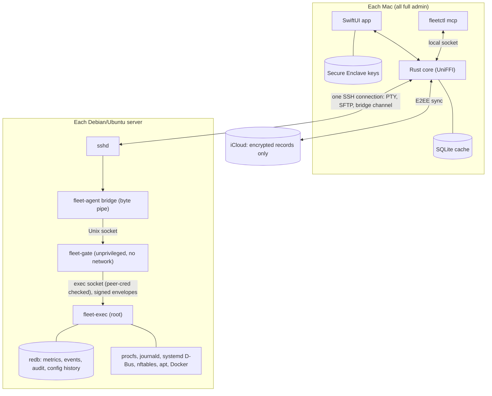
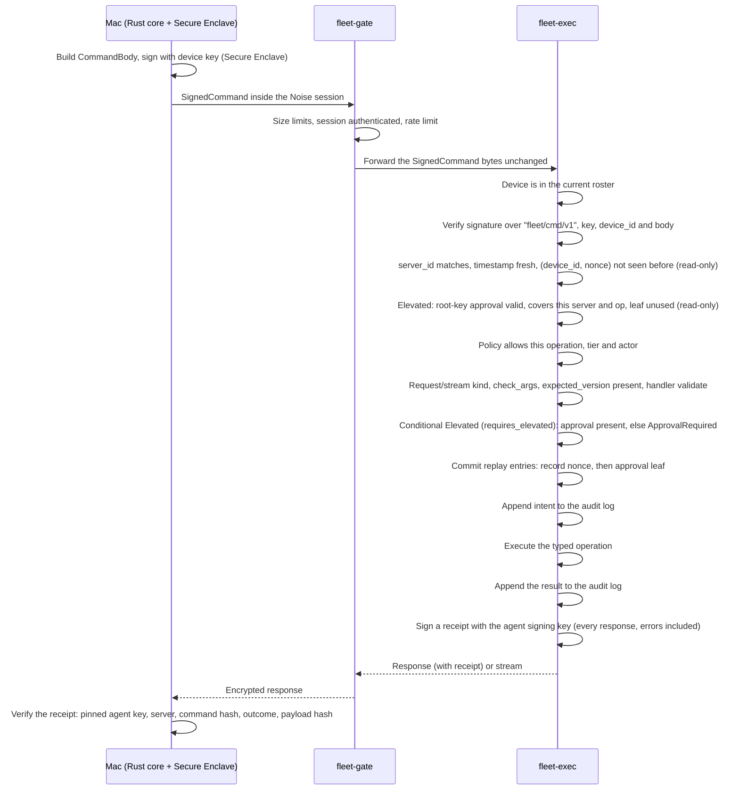
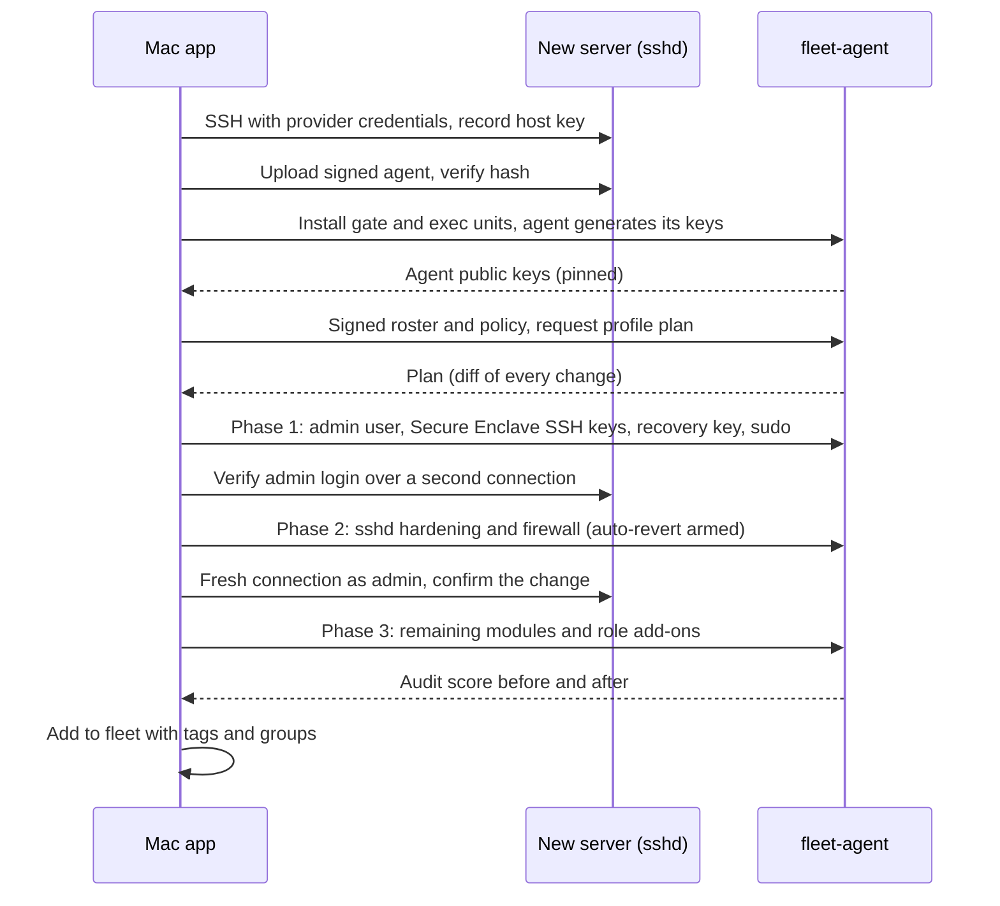

# Fleet: Linux Server Control Plane for macOS

**Design document** · Version 0.2 · September 2026 · Status: draft for review (0.2 applies the first design review)
*"Fleet" is a working name.*

---

## Contents

1. [Overview](#1-overview)
2. [Feature specification](#2-feature-specification)
3. [System architecture](#3-system-architecture)
4. [Server agent](#4-server-agent)
5. [Security architecture](#5-security-architecture)
6. [Wire protocol](#6-wire-protocol)
7. [Mac application](#7-mac-application)
8. [AI integration (MCP)](#8-ai-integration-mcp)
9. [Provisioning](#9-provisioning)
10. [Agent lifecycle](#10-agent-lifecycle)
11. [Performance budgets](#11-performance-budgets)
12. [Tech stack and repository layout](#12-tech-stack-and-repository-layout)
13. [Testing and verification](#13-testing-and-verification)
14. [Roadmap](#14-roadmap)
15. [Open questions](#15-open-questions)

---

## 1. Overview

Fleet is a native macOS control plane for a personal fleet of 10–100 Debian and Ubuntu servers. It has two parts:

- **`fleet-agent`**, a lean Rust agent on each server. It collects telemetry, records history and events, and performs typed operations, each one cryptographically authorized.
- **The Fleet app**, a SwiftUI app with a Rust core, installed on each of the operator's Macs. It provides the dashboard, terminal, file access, administration tools, server provisioning, and an MCP server for AI agents.

### 1.1 Design principles

1. **Security first.** The agent performs no action without a signature from a hardware-backed key on an enrolled Mac.
2. **Lean.** The agent uses a few MB of RAM, near-zero CPU when idle, and opens no network ports.
3. **Don't reinvent `sshd`.** The terminal and file transfer use SSH directly. The agent handles structured data and control only.
4. **Every change is reversible or auditable, ideally both.**
5. **Fleet-first.** Every feature works the same on one server or a hundred.

### 1.2 Goals

- One app to monitor, access, administer and provision every server.
- Live metrics with 7 days of history on every server.
- Fast enough to feel local: the dashboard opens instantly from cache, and live data arrives in under 250 ms plus network latency.
- Maximum security: end-to-end encryption, signed commands, signed policies, hardware-backed keys, and a tamper-evident audit log.
- Full access from several Macs, with keys synced end-to-end encrypted.
- Safe, full-power access for AI agents through MCP.

### 1.3 Non-goals

- Several human users with different roles. There is one operator, possibly on several Macs.
- Kubernetes (explicitly dropped).
- Distributions other than Debian/Ubuntu, and systems without systemd.
- Push notifications when no Mac is running.
- Mobile, Windows or Linux clients.
- Replacing general configuration-management tools beyond provisioning profiles.

### 1.4 Decision log

| # | Topic | Decision | Rationale |
|---|---|---|---|
| 1 | Users and scale | Single operator, 10–100 servers | No per-user permissions needed; bulk actions across many servers matter |
| 2 | Reachability | Public IPs, SSH open | Existing SSH can be reused as the transport |
| 3 | Transport | Everything tunneled through SSH; no new ports | Reuses a hardened, audited daemon; nothing new exposed to the internet |
| 4 | Distributions | Debian/Ubuntu only | Target systemd, journald, apt and nftables directly, without abstraction layers |
| 5 | Mac client | Native SwiftUI, with a Rust core via UniFFI | Best Mac experience; protocol code shared with the agent |
| 6 | Agent installation | Installed and updated by the Mac app over SSH | No extra tooling needed |
| 7 | Agent privileges | Split into an unprivileged gate and a root executor | Revised from "runs as root" to meet the maximum-security goal |
| 8 | History | 7 days on each agent | About 30–60 MB per server |
| 9 | Alerts | Shown in the app only; agents keep recording events while Macs are offline | No outbound traffic from agents |
| 10 | AI | MCP server with full operational access, except that Elevated operations and large bulk actions need the operator's Touch ID | Cannot touch keys, the device roster or policies; prompt injection can't reach root-equivalent actions unattended |
| 11 | Encryption | Noise end-to-end encryption inside SSH, per-command signatures, signed policies | Defense in depth |
| 12 | Recovery | Printed 24-word code kept in a safe, with an optional memorized passphrase; the code also opens an iCloud escrow of the sync key | Works even if every Mac is lost, without re-discovering servers |
| 13 | Multiple Macs | Each Mac has its own hardware keys; all are full admins | Access from every Mac |
| 14 | Kubernetes | Out of scope | Docker Compose covers the needs of a single operator |
| 15 | Provisioning roles | Docker/Compose, web/reverse proxy, game server | The operator's actual workloads |
| 16 | Risk tiers | Root-equivalent operations are **Elevated** and need a root-key approval (Touch ID), one approval per batch | A device-key signature alone must not be enough to gain root on a server |
| 17 | Recovery time lock | Without a passphrase, a recovery roster activates after a delay (72 h by default) that any enrolled Mac can veto | A stolen paper code alone can't take the fleet instantly |
| 18 | Monitor key | A per-Mac key usable while the app is locked, limited to read-only telemetry and events | Alerts keep arriving while the app is locked |

---

## 2. Feature specification

Priorities: **P0** is required for the v1 launch, **P1** is part of v1 but can follow shortly after, and **P2** comes later.

### 2.1 Fleet management

| Pri | Feature |
|---|---|
| P0 | Server inventory: add a server manually or import from `~/.ssh/config` or a Termius export; groups, tags and search |
| P0 | Fleet table columns: health, CPU/RAM/disk, uptime, kernel version, pending updates (security updates counted separately), reboot needed, agent version, last seen |
| P0 | Jump host support (`ProxyJump`) |
| P0 | Command palette (⌘K) that reaches every action; the whole app is usable from the keyboard |
| P1 | Cloud discovery: read-only import from the Hetzner, DigitalOcean and AWS APIs |

### 2.2 Monitoring and alerts

| Pri | Feature |
|---|---|
| P0 | Live metrics: CPU per core (including steal and iowait), load, memory, swap, disk usage and I/O per device, network per interface, and temperatures where available |
| P0 | Process view: sort, kill and renice; CPU, memory and I/O per process |
| P0 | 7-day history: native-resolution samples for the last hour (1 second while a Mac shows the server, 10 seconds otherwise), then 1-minute rollups (minimum, average, maximum) |
| P0 | Alert rules evaluated on the agent: disk, memory, load, service down, brute-force attempts, certificate expiry, new listening port and others; shown in the app |
| P0 | "While you were away" digest when the app launches or the Mac wakes |
| P1 | Per-process history: the top 10 processes by CPU and by memory, recorded every minute |
| P1 | Network connections and bandwidth per process |
| P1 | Health checks: HTTP and TCP probes run by the agent against local services |

### 2.3 Access

| Pri | Feature |
|---|---|
| P0 | Terminal (SwiftTerm) with tabs and splits; sessions survive disconnects because they're backed by tmux on the server |
| P0 | File browser over SFTP: browse, drag-and-drop upload and download, edit in place with a diff shown before saving, change permissions and ownership |
| P0 | Saved command snippets |
| P1 | Typing into several terminals at once |
| P1 | Session recording and replay (asciicast v2), stored locally on the Mac |
| P1 | Disk explorer (like `ncdu`) and large-file finder |
| P1 | Runbooks: snippets with parameters, multiple steps, conditions and schedules |

### 2.4 Logs and security

| Pri | Feature |
|---|---|
| P0 | Log viewer: query and live-tail journald by unit, priority and time range; full-text search; web access logs |
| P0 | Login history: successful and failed SSH logins, source IP and country, sessions |
| P0 | Built-in intrusion blocking: detects SSH brute force and web scanners and bans them for a set time; the operator's own IPs are never banned |
| P0 | Change alerts: new listening port, new user or sudoer, `authorized_keys` changed, login from a new IP or country, critical file changed |
| P0 | Open ports, each mapped to its process |
| P0 | Hardening audit with a score and one-click fixes (it uses the same modules as provisioning) |
| P1 | Vulnerability matching: installed packages checked against the Debian Security Tracker and Ubuntu security notices |
| P1 | TLS certificate discovery and expiry monitoring |

### 2.5 System administration

| Pri | Feature |
|---|---|
| P0 | systemd services: status, start, stop, restart, enable, disable, and each unit's logs |
| P0 | Firewall: view and edit rules, with auto-revert (see 4.10) |
| P0 | Packages: update and upgrade (everything or security only), install, remove, hold and unhold, history |
| P0 | Docker: containers, images, volumes, networks, logs and stats; deploy and update Compose projects |
| P0 | SSH key management: the operator's non-Mac keys (the extra section of `/etc/fleet/authorized_keys/<user>`, section 5.9) across the fleet, with rotate and revoke |
| P1 | Cron jobs and systemd timers: view and edit |
| P1 | User and group management |
| P1 | WireGuard mesh: a private encrypted network between selected servers |
| P2 | Rolling reboots, one group at a time |

### 2.6 Change safety

| Pri | Feature |
|---|---|
| P0 | Auto-revert for firewall, `sshd` and network changes unless confirmed within 60 seconds from a fresh connection |
| P0 | Config history for `/etc`: every change, whether made by Fleet or anything else, is versioned, with diffs and one-click rollback |
| P0 | Canary bulk actions: run on one server first, then the rest; stop on the first failure; preview changes with a dry run |
| P0 | Conflict protection: each command states the version it expects, and outdated commands are rejected |
| P1 | Drift detection: find configuration differences between servers in the same group |

### 2.7 Fleet intelligence

| Pri | Feature |
|---|---|
| P1 | Fleet search: packages and versions, open ports, processes, users, files and logs across every server at once |
| P1 | Unified timeline, per server and fleet-wide: metric spikes, logins, restarts, package changes, config changes and AI actions |

### 2.8 Provisioning

| Pri | Feature |
|---|---|
| P0 | One-click provisioning of a fresh server, designed so you can't lock yourself out |
| P0 | Baseline and Strict profiles; any rule can be turned off per server |
| P0 | Role add-ons: Docker/Compose, web/reverse proxy |
| P0 | Re-applying a profile at any time is safe, so it doubles as drift enforcement |
| P1 | Game server role add-on |
| P1 | cloud-init export |

### 2.9 AI (MCP)

| Pri | Feature |
|---|---|
| P1 | MCP server exposing typed tools for every feature |
| P1 | Every AI action is audited and attributed; global pause switch |
| P1 | Elevated operations and bulk actions above a threshold require the operator's Touch ID, even for AI |
| P1 | Server-sourced content (logs, files) is marked as untrusted in tool results, to limit prompt injection |
| P1 | "Explain" buttons on log lines, alerts and config files, using an LLM provider the operator configures (off by default; secrets redacted before sending) |

### 2.10 Multiple Macs and recovery

| Pri | Feature |
|---|---|
| P0 | Hardware keys on each Mac; a signed device roster; adding a Mac with a QR code and verification code; revoking a Mac |
| P0 | End-to-end encrypted sync of app data through iCloud |
| P0 | Printed recovery code |
| P0 | App lock with Touch ID, FileVault check, alerts when the device roster changes |
| P1 | Recovery drill |

---

## 3. System architecture



### 3.1 Components

| Component | Where it runs | Responsibilities |
|---|---|---|
| SwiftUI app | Mac | All UI; Secure Enclave key operations (CryptoKit); Touch ID (LocalAuthentication); iCloud sync (CloudKit); terminal (SwiftTerm) |
| Rust core | Mac, inside the app | SSH connections (russh), Noise sessions, protocol, bulk-action execution, local cache, provisioning orchestration, sync merge logic, vulnerability matching |
| `fleetctl mcp` | Mac, launched by the AI client | MCP server over stdio; forwards tool calls to the running app |
| `fleet-agent bridge` | Server, started for each SSH connection | Unprivileged byte pipe from the SSH channel to the gate socket; holds no keys |
| `fleet-gate` | Server, long-running, unprivileged | Noise handshake, device authentication, decryption, size and rate limits; forwards chunks without reassembling them |
| `fleet-exec` | Server, long-running, root | Re-verifies every signed command and approval, enforces policy, runs typed operations, signs receipts for every response and signs events, telemetry, storage, events, intrusion blocking, config history, auto-revert |
| `sshd` | Server | Transport, terminal sessions and SFTP; unchanged apart from hardening |

### 3.2 Transport

- **One SSH connection per server**, opened by the Rust core with `russh`, carrying several channels at once:
  - **Terminal sessions:** PTY channels, attached to tmux sessions.
  - **Files:** the SFTP subsystem (`russh-sftp`).
  - **Agent channel:** an exec channel running `fleet-agent bridge`. This deliberately uses an exec channel rather than Unix-socket forwarding, so it keeps working when hardening sets `AllowStreamLocalForwarding no` and `AllowTcpForwarding no`.
- **Two layers of encryption:** SSH protects the network path, and a Noise session inside the agent channel runs end-to-end between the Rust core and `fleet-gate`. If SSH is ever compromised, the attacker still can't talk to the agent. The Noise session ends at the gate, so the gate sees agent traffic in plaintext; the executor's signed receipts (section 5.6) keep a compromised gate from forging results.
- **Keepalive and reconnection:** SSH keepalive every 15 seconds. Reconnection uses exponential backoff from 1 to 60 seconds with jitter, and at most 20 handshakes run at once so waking the Mac doesn't flood the network.
- **Host key pinning:** `sshd` host keys are recorded at provisioning or adoption, and a changed host key blocks the connection with a clear warning. Servers created from a Fleet cloud-init file get host keys generated on the Mac and injected, so there is no trust-on-first-use (section 9.7). Elsewhere the first connection is trust-on-first-use, and the app shows the fingerprint for comparison with the provider's console. When Fleet itself replaces a host key (hardening), the new key is reported over the existing Noise session and the pin is updated before `sshd` reloads.

---

## 4. Server agent

### 4.1 Process model

A single static binary, `fleet-agent` (musl, `#![forbid(unsafe_code)]` in all first-party crates), runs in one of four modes.

| Mode | Runs as | Lifetime | Network access |
|---|---|---|---|
| `gate` | System user `fleet-gate` | systemd service | None (`PrivateNetwork=yes`; only filesystem Unix sockets work) |
| `exec` | root | systemd service | Yes (needed by apt, SteamCMD, and local RCON) |
| `bridge` | The SSH login user (admin or recovery) | One per SSH channel | Only the Unix socket |
| `install` | root, once | Installer | n/a |

**Socket:** `/run/fleet/agent.sock`, owned by `fleet-gate:fleet` with mode `0660`. The admin user belongs to the `fleet` group. Connecting to the socket grants nothing on its own; the Noise handshake and device authentication are still required.

**Gate ↔ exec:** the executor listens on `/run/fleet-exec/exec.sock`. The directory is `root:fleet-gate 0710` (tmpfiles.d, and re-asserted by exec at start with `lchown`): the gate can traverse it and connect, but never create, rename or replace entries. The socket is `root:fleet-gate 0660` (connecting needs write permission on the socket inode, not the directory; the gate unit gets `SupplementaryGroups=fleet-gate` and keeps `/run/fleet-exec` out of `ReadWritePaths`). Exec binds it as `.tmp/exec.sock.new` inside a root-only (`0700`) scratch directory that it recreates on every start, sets mode and group there, and renames it into place, so no root `chmod`/`chown` ever resolves a path the gate could swap for a symlink. Exec checks `SO_PEERCRED` on every connection: only the `fleet-gate` uid is accepted. The two services keep separate sandboxes.

**Symlink rules for root code:** the only gate-writable locations are `/run/fleet` and `/var/lib/fleet/gate`. Root never follows a path there: ownership is set with `lchown`, modes with `fchmod` on a descriptor or on paths inside root-only directories, temp files are created `O_EXCL | O_NOFOLLOW`, and key files are read with `O_NOFOLLOW` straight into zeroizing buffers. `install` writes the gate's Noise key in the root-only exec directory, sets its owner and mode there, and renames it into the gate directory (the rename replaces, never follows, a planted symlink). Directories are checked not to be symlinks after creation; each has a root-owned parent, so the check can't be raced. `O_NOFOLLOW` is a per-target constant (no `libc` dependency, no `unsafe`).

**Limits:** exec accepts at most 64 concurrent gate connections and 32 MiB of reassembly buffers across them (a connection that exceeds the total is closed); stream frames are read incrementally, so an announced length reserves no memory. Streams are capped at `limits.max_stream_sessions` overall, 8 per device and 16 per gate connection (`Busy`, signed, before the nonce is consumed). The gate never rate-limits `StreamCancel` (it only frees resources), so a client over its limit can still stop its streams without losing the session. The gate caps sessions still in setup at 64; when that pool is full the **oldest** setup is dropped to admit the new one, so unauthenticated floods can slow a real client but never lock it out. Connections that send the recovery mode byte move to a separate setup pool of 8 (also oldest-evicted), so normal-mode floods can't crowd out a recovery login. Unauthenticated sessions count against no per-uid or per-device cap (all Macs share the admin uid); after `DeviceAuth`, live sessions are capped at 8 per device id (`Busy` beyond that); setup (handshake, `DeviceAuth`, exec connect) must finish within 15 s. The gate forwards signed command envelopes byte-for-byte. **The executor never trusts the gate**: it verifies every signature, approval, the policy and freshness itself (section 5.6), and signs a receipt for every response to a command it could decode. A compromised gate can read agent traffic and deny service, but can't issue commands or forge results.

**Roster in the gate:** the gate needs the roster to authenticate sessions. It keeps one long-lived **control connection** to exec (first message `ControlOpen`), over which exec sends the current signed roster and limits at connect time and whenever they change; the gate starts listening on `agent.sock` only once it has a roster, and reconnects if exec restarts. A bridge session reaches exec only after its `DeviceAuth` passed against that roster; the gate then opens the session's own exec connection and re-checks `DeviceAuth` against the roster exec sends on it. The gate refuses a roster older than one it has seen and re-checks each open session's `DeviceAuth` against every new roster, ending sessions of removed devices; exec re-checks the device on every command anyway, so the gate's copy is never an authorization input.

**Gate ↔ exec IPC:** one exec-socket connection per authenticated gate session (no multiplexing) plus the control connection, so session lifetime and backpressure are the stream's. Messages are stream frames carrying postcard `IpcMsg`: exec → gate `RosterUpdate { roster, grace_remaining_ms }` (the gate counts the grace down on its own monotonic clock) and `Limits { commands_per_minute }` on connect and on change; gate → exec `SessionOpen { mode, device_id, key }` after `DeviceAuth` (informational: exec passes the key kind to verification, which can only narrow what the command's own signature allows); then `Chunk`s both ways, starting with exec's `Hello`. The gate forwards one decrypted chunk at a time and decodes a frame only if it fits in one chunk (to refuse wrong-mode commands early); exec reassembles. Exec's frame ids have the top bit clear, gate-originated refusals set it. A `DeviceAuth` failure is answered with `Response { id: 0, Err(Unauthorized) }` before the gate closes. Both sockets are bound under a temporary name and renamed into place once listening. Exec is `Type=notify` (`READY=1`, and `WATCHDOG=1` every `WATCHDOG_USEC/2` via `$NOTIFY_SOCKET`). An IPC frame must hold exactly one message (trailing bytes close the connection).

**`fleet-gate` sandbox (systemd):**

```ini
[Service]
User=fleet-gate
Group=fleet
SupplementaryGroups=fleet-gate
NoNewPrivileges=yes
CapabilityBoundingSet=
AmbientCapabilities=
PrivateNetwork=yes
RestrictAddressFamilies=AF_UNIX
ProtectSystem=strict
ProtectHome=yes
PrivateTmp=yes
PrivateDevices=yes
ProtectKernelTunables=yes
ProtectKernelModules=yes
ProtectKernelLogs=yes
ProtectControlGroups=yes
ProtectClock=yes
ProtectHostname=yes
ProtectProc=invisible
RestrictNamespaces=yes
RestrictRealtime=yes
RestrictSUIDSGID=yes
LockPersonality=yes
MemoryDenyWriteExecute=yes
SystemCallArchitectures=native
SystemCallFilter=@system-service
SystemCallFilter=~@privileged @resources
ReadWritePaths=/run/fleet
MemoryMax=32M
TasksMax=32
```

**`fleet-exec` limits:** `MemoryMax=128M`, `CPUQuota=15%`, `TasksMax=256`, `LimitNOFILE=1024`, `WatchdogSec=30`, and `Restart=on-failure` with backoff. Hardening that root exec and apt tolerate: `ProtectKernelLogs`, `ProtectClock`, `ProtectHostname`, `RestrictRealtime`, `LockPersonality`, `SystemCallArchitectures=native`, `ProtectHome=read-only` (relax when user-management ops land), `PrivateTmp`. Deliberately not set: `ProtectKernelModules` (hides `/usr/lib/modules`, which kernel package installs write), `RestrictNamespaces` (the Docker role runs compose helpers from exec), and anything that removes root's filesystem write access or capabilities. **Operation dispatch:** exec looks up each verified op by its wire tag in a `fleet_ops::Registry`. Generic handlers live in the `fleet-ops` crate and run against an injectable `SysCtx` (filesystem root, child-process runner with fixed absolute paths, cleared environment, timeout and output cap, clock, `/proc` reader), so they are tested against a temp directory and canned command output; handlers bound to exec's own state (`roster.*`, `policy.update`, `agent.health`) are registered by exec behind the same `OpHandler` trait. A handler's `validate` (no side effects) runs before the nonce is consumed; `handle` runs after the audit intent and returns a `Payload` or an `OpStream`. Each request runs as its own task (at most 16 per gate connection), so a long operation doesn't hold up others or a `StreamCancel`; everything from verification to the start of `handle` runs without yielding. Operations that start long-running child processes (apt, SteamCMD, `docker compose pull`) run in their own transient systemd scopes named `fleet-op-<id>.scope` (`<id>` is the audit intent seq; built by `fleet_ops::scope::scoped`, `/usr/bin/systemd-run --scope --quiet --collect --unit fleet-op-<id> -- <program> <args>`), so the agent's limits don't throttle them and file changes can be attributed to the operation (section 4.9). Blocking work (file hashing, `/etc` scans, database compaction) runs on the blocking thread pool so it never delays the watchdog. Anything that must survive an exec crash (auto-revert and update rollback deadlines) is armed as an independent transient systemd timer, not as an in-process timer (sections 4.10 and 10.2).

### 4.2 Operation catalog

The agent has **no general-purpose command interface**. Every capability is a typed operation implemented in Rust:

- Arguments are validated against strict types, such as `UnitName` (`^[A-Za-z0-9@._-]+\.(service|timer|socket)$`), `Port`, `Cidr`, `DebPackageName`, and `AbsPath` restricted to allowed root directories.
- External programs are called with fixed absolute paths and a list of arguments. Nothing is passed to a shell, so injection is impossible by construction.

The **capability group** in the first column is the name the policy uses (section 5.4). `fleet-proto` holds the authoritative mapping from every `Op` variant to its group and tier, and a test fails if an operation has no mapping.

**The authoritative catalog is `crates/fleet-proto/src/v1/op/`**; the table below is a summary. There, each operation has its wire tag and name (`op::tag`, `op::NAMES`), typed arguments (validated newtypes in `v1/args`, checked again on decode), tier (`Op::tier`, computed from arguments for the conditional cases), `authorization`, `is_stream`, `monitor_allowed`, `recovery_allowed`, `auto_revert`, `requires_expected_version`, `may_escalate` and `check_args` (collection bounds and cross-field rules). Results are `Payload` variants and pushed events are `Event` variants in the same crate. The catalog also holds operations that complete features listed in section 2 but not named below: `processes.history`, `connections.list`, `events.query`, `health_checks.list/update`, `system.reboot`, `logfiles.list`, `weblog.query`, `bans.config.get/set`, `unit.reload`, `changes.list`, `pkg.history/refresh`, `docker.volumes.*`, `docker.networks.list`, `compose.list/status/restart`, `users.delete`, `users.groups.set`, `groups.create`, `config.paths.get/set`, `search.users`, `mesh.peers.set`, `game.status/backups.list/remove`, `alert_rules.get/update`. Notes:

- Operations without side effects are Read even when not named `*.list`/`*.get`/`*.query`/`*.status`: `audit.run`, `integrity.status`, `profile.check/plan`, `du.scan`, `find.large`, `logfile.tail`, `docker.logs`, `docker.stats`, `config.history`, `processes.history`, `game.backups.list`.
- `alert_rules.update` is Elevated (section 4.5); `health_checks.update` is Change (loopback probes only).
- Conditional Elevated: `cron.set` for `root` from its arguments, and exec escalates for a user in a privileged group; `users.create` and `users.groups.set` when the groups include any of `root`, `sudo`, `docker`, `disk`, `shadow`, `lxd`, and exec escalates them (`may_escalate`) when sudoers grants any of the groups privilege; `config.rollback` is Elevated by default and Change only for paths below `/srv` and for `/etc` files that aren't protected (protected: those of section 4.9 plus `/etc/passwd`, `/etc/group`, `/etc/gshadow`, `/etc/pam.d/` and `/etc/security/`); `config.paths.set` when any tracked or secret path lies outside `/etc`, `/srv`, `/opt`, `/usr/local/etc` (the handler enforces the same allow-list); `profile.apply` of a custom profile (`ProfileSpec::source` is `Builtin { level, roles }` or `Custom(toml)`; built-ins ship with the reviewed agent release). `compose.deploy` is tier Change in the catalog and exec escalates it after parsing the file against the deny-list below. The structural check is `fleet_ops::compose::validate` (pure, no I/O), and the Mac runs the same check to know when to ask for Touch ID. **Escalation hook:** for ops with `Op::may_escalate`, exec calls the handler's `OpHandler::requires_elevated` after `validate` (helpers in `fleet_ops::escalation`: `compose_deploy`, `cron_set`/`user_is_privileged` from `/etc/passwd` and `/etc/group`); `true` without a verified root approval on the command is `ApprovalRequired`, before the nonce is consumed.
- **Pipeline checks in exec** (section 5.6), all before the nonce is consumed: `Request` only for non-stream ops and `StreamOpen` only for `Op::is_stream` ops (`Unsupported` otherwise), `Op::check_args` (`InvalidArgument`), `expected_version` present where `requires_expected_version` (`InvalidArgument`), auto-revert ops only when a snapshot module exists for their kind (`Unsupported`). A signed body that doesn't decode gets a signed `InvalidArgument` receipt; the gate forwards such bodies instead of refusing them unsigned.
- **Path arguments** under an allow-list are opened with `fleet_ops::allowed::open_allowed`: longest matching root (canonicalized, so a symlinked root is trusted), `lstat` of every component below it refusing symlinks, `O_NOFOLLOW | O_NONBLOCK` open, `fstat` identity check, and on Linux `/proc/self/fd` to confirm the opened file is under the root (closes the swap-a-directory race; `std` has no `openat`).
- `firewall.apply`, `authorized_keys.set`, `cron.set`, `health_checks.update`, `alert_rules.update`, `bans.config.set`, `config.paths.set` and `mesh.peers.set` replace versioned state wholesale and require `CommandBody::expected_version`.
- Auto-revert ops (`firewall.apply`, `authorized_keys.set`, `profile.apply`, `mesh.join/leave/peers.set`) answer `Payload::ChangePending { change_id, deadline_ms, … }`. `change.confirm` confirms any of them.
- Streams (`StreamOpen` only): `metrics.subscribe`, `journal.follow`, `logfile.tail`, `docker.logs`, `docker.stats`. Each `StreamData` chunk is one postcard `Payload`. The monitor subset is `agent.health`, `metrics.subscribe` and `events.query`.
- `events.query { since_run_id, since_seq, limit ≤ 1000 }` pages the agent's event log (section 4.4) as `Payload::SignedEvents { events, more }`: the signed events exactly as pushed, oldest first, strictly after `(since_run_id, since_seq)` (from the oldest kept when `None` or when that run is no longer stored). The Mac verifies each like a live event.
- Mesh arguments: every peer's `allowed_ips` must lie within the mesh `network` (`mesh.join`), and no `allowed_ips` entry may be a default route or shorter than /16 (IPv4) or /48 (IPv6).
- Arguments never carry secrets (no WireGuard preshared keys, no `.env` contents), because operation arguments are stored in the audit log.
- `services` (`fleet_ops::services`) talks to systemd over the system bus (`zbus`, behind a `SystemdApi` trait): `ListUnits` merged with `ListUnitFiles` (disabled units aren't loaded), `LoadUnit` + `GetAll` for status, `Start/Stop/Restart/ReloadUnit` in mode `replace` waiting for the job's `JobRemoved` (120 s, then `Timeout`; the job itself keeps running), `Enable/DisableUnitFiles` then `Reload`. Refused with `PolicyDenied` before the nonce is consumed: any change to a `fleet-*` unit, and `unit.stop`/`unit.disable` of `ssh.service`, `sshd.service` or `ssh.socket` (lockout; restart and reload stay allowed). `PropertiesChanged` signals on unit objects feed `service.state_changed` events and the `ServiceDown` rule.
- `packages` (`fleet_ops::packages`) calls only `/usr/bin/apt-get`, `/usr/bin/apt-mark` and `/usr/bin/dpkg-query`. Mutations run in the op's scope with `DEBIAN_FRONTEND=noninteractive`, `UCF_FORCE_CONFFOLD=1`, `--force-confdef --force-confold` and `DPkg::Lock::Timeout=60` (lock still held after a minute → `Busy`). Every apt transaction is first simulated (`-s`), and refused if it would remove `openssh-server`, `openssh-sftp-server`, `sudo`, `systemd`, `systemd-sysv`, `dbus`, `nftables` or a `fleet*` package, whatever the cause. `pkg.upgradable` parses `apt-get -s dist-upgrade` (`Debug::NoLocking`, so it never waits on a running apt); an upgrade is security when any origin contains `-security`; held packages never appear there. `pkg.upgrade{All}` is `apt-get upgrade --with-new-pkgs` (never removes; upgrades that need removals stay listed). `SecurityOnly` is `apt-get install --only-upgrade name=candidate…` for exactly the security set (not `unattended-upgrade`, whose effect depends on local config, including automatic reboots), and restores the auto-installed marks `install` clears. Results are the `dpkg-query` diff before and after. `pkg.refresh` answers the new `Upgradable`. `pkg.history` is `history.log` plus `dpkg.log` entries apt didn't log (plain `dpkg -i`); both are read as UTC (the baseline sets it). `dpkg.log` is tailed for `packages.changed` events.
- `docker` (`fleet_ops::docker`) talks to the Engine API over `/var/run/docker.sock` (`bollard`, Unix socket transport only, no TCP/TLS; connected lazily, so servers without Docker just answer `Internal`) behind a `DockerApi` trait. `docker.containers.get` redacts every `Config.Env` value. `docker.logs` requests timestamps, clips lines at 16 KiB and batches up to 256 lines per item; `docker.stats` samples one-shot stats every 2 s and computes CPU and rates from its own deltas (`latest_only`). Container events (known actions only; health-check `exec_*` noise dropped) become `container` events and `ContainerDown` levels. `compose.*` runs `/usr/bin/docker compose -f /srv/<p>/compose.yaml --project-directory /srv/<p> -p <p>` with the cleared environment plus `HOME=/root`; mutations run in the op's scope. Deploy refuses (`PolicyDenied`) a symlink in `/srv`, `/srv/<p>` or any in-project host path the file uses (`ComposeVerdict::host_paths`), a non-root-owned directory on the way, and a `.env` that sets any `COMPOSE_*`/`DOCKER_*` key; `expected_version`, when given, is the BLAKE3 version of the current `compose.yaml`. `compose.pull` only pulls; an update is `compose.deploy{pull: true}`. Image update checks are Mac-side (registry digest vs `docker.images.list` digests).
- `cron` (`fleet_ops::cron`): `cron.list` parses the spool, `/etc/crontab` and `/etc/cron.d` without following symlinks; `cron.set` pipes the rendered crontab to `/usr/bin/crontab -u <user> -` (runner stdin); its version is the BLAKE3 version of the spool file. `timers.list` uses `systemctl list-timers --output=json` (falling back to `list-units` names on systemd < 251) plus `systemctl show` for schedules.
- `users` (`fleet_ops::users`) calls `/usr/sbin/{useradd,usermod,userdel,groupadd}` with `--` before the name. Accounts are created without a password. `users.lock` is `--lock --expiredate 1` (expiry blocks key login too); unlock clears the expiry and unlocks only a real locked hash. Refused before the nonce is consumed: root/uid 0, system accounts (outside `UID_MIN..=UID_MAX`), `fleet*` names, and lock/delete/group change of a user whose key file has a roster section (the admin). `users.list` never returns shadow hashes. `authorized_keys.set` rewrites only the extra section (plain `algo base64 comment` lines, no options, no duplicates), keeps every roster block byte for byte, refuses symlinks and unterminated blocks, and versions the extra section only (roster rewrites don't conflict). Its `Revertible` restores the snapshotted extra section under the then-current roster blocks. Exec's roster writer shares the file-format code.

| Group | Operations |
|---|---|
| `system` | `system.info`, `metrics.subscribe`, `metrics.query`, `processes.list`, `process.signal`, `process.renice` |
| `logs` | `journal.query`, `journal.follow`, `logfile.tail` (paths on an allow-list) |
| `security` | `logins.query`, `bans.list/add/remove`, `ports.list`, `certs.list`, `audit.run`, `integrity.status` |
| `services` | `unit.list/status/start/stop/restart/enable/disable` (never on `fleet-*` units) |
| `firewall` | `firewall.get`, `firewall.apply` (auto-revert armed), `change.confirm` |
| `packages` | `pkg.list`, `pkg.upgradable`, `pkg.upgrade{scope}`, `pkg.install`, `pkg.remove`, `pkg.hold` |
| `docker` | `docker.containers.*`, `docker.images.*`, `docker.stats`, `compose.deploy/pull/down` |
| `cron` | `cron.list`, `cron.set`, `timers.list` |
| `users` | `users.list/create/lock`, `authorized_keys.get/set` |
| `files` | `du.scan`, `find.large` (file reads and writes themselves go over SFTP) |
| `config` | `config.history`, `config.diff`, `config.rollback` |
| `profile` | `profile.check`, `profile.plan`, `profile.apply` |
| `search` | `search.packages/ports/processes/files/journal` |
| `mesh` | `mesh.join`, `mesh.leave`, `mesh.status` |
| `game` | `game.install/update/backup/restore`, `game.rcon` |
| `agent` | `roster.update`, `roster.pending`, `roster.veto`, `policy.update`, `agent.update.stage/commit/rollback`, `agent.health` |
| `shell` | `shell.exec`: **policy-gated and off by default**; runs as a chosen user with a timeout and output cap; the full command text goes into the audit log |

**Risk tiers.** Typed operations stop injection, but several of them are still root-equivalent in effect. Every operation therefore has a tier:

| Tier | Signature needed | Operations |
|---|---|---|
| **Read** | Device key, or the monitor key for the monitor subset (section 5.2) | `*.list`, `*.get`, `*.query`, `*.status`, `metrics.*`, `journal.follow`, `config.diff`, `search.*`, `agent.health` |
| **Change** | Device key | Everything not listed as Read or Elevated |
| **Elevated** | Device key **plus a root-key approval** (Touch ID, section 6.4) | `shell.exec`; `cron.set` for root or any sudo-group user; `users.create` into sudo or `docker` groups; `authorized_keys.set`; `compose.deploy` with any feature on the Compose deny-list below; `config.rollback` outside `/srv` and unprotected `/etc` files (section 4.9); `config.paths.set` outside the config roots; `profile.apply` of a custom profile; `roster.update` and `agent.update.stage` (authorized by their self-signed payloads, section 6.4); `roster.veto`, `policy.update`, `agent.update.commit/rollback` |

The policy can move operations into Elevated but never out of it. One approval covers a whole batch (a bulk run, a policy push to many servers), so an operator touches Touch ID once per decision rather than once per server.

**Compose validation.** Without Elevated approval, `compose.deploy` rejects `privileged`, `cap_add` outside a small allow-list, `pid: host`, `ipc: host`, `network_mode: host`, `userns_mode: host`, `devices`, `security_opt` that disables AppArmor or seccomp, and bind mounts outside `/srv/<project>/`. Any of these would give a container root on the host.

`fleet_ops::compose` implements it on an event-level YAML parser (`yaml-rust2`, pure Rust; `serde_yaml` is deprecated and `serde_yaml_ng` wraps `unsafe-libyaml`) and returns `ComposeVerdict { ok, requires_elevated: Vec<Finding>, errors }`:

- **Errors** (`InvalidArgument`): input over 256 KiB, nesting over 32, more than 100,000 nodes, anchors or aliases (no billion-laughs expansion, no shared nodes), tags, merge keys (`<<`, quoted or not), duplicate or non-scalar keys, more than one document, wrong shapes for checked keys.
- **Findings** (Elevated): `privileged` (also `build.privileged`, `build.entitlements`), `cap_add` outside `CHOWN, DAC_OVERRIDE, FOWNER, SETGID, SETUID, NET_BIND_SERVICE, KILL` (`CAP_` prefix and case ignored), `pid`/`ipc`/`network_mode`/`userns_mode`/`cgroup`/`build.network: host`, a top-level network that is the host network, `devices`, `device_cgroup_rules`, `security_opt` other than `no-new-privileges` and `apparmor=docker-default`, bind mounts in short and long syntax and volume `driver_opts.device` outside `/srv/<project>/` (relative paths resolved lexically against it, `~` always outside, unknown mount types count), host files Compose reads outside it (`env_file`, `label_file`, secret and config `file`, build context, Dockerfile, additional contexts), `include` and `extends.file` (their content isn't validated), and `$` in any of these values (interpolation reads `.env`, which the check can't see). A boolean counts as false only for an explicit false/`no`/`off`/`0`/null.
- **Deploy handler obligations:** write `/srv/<project>/compose.yaml` and run Compose with exactly that `-f` and `--project-directory`, so no `compose.override.yaml` or `COMPOSE_FILE` from `.env` is merged in; check `/srv/<project>` for symlinks a relative bind source could resolve through.

Bulk commands and snippets use `shell.exec` on servers where the policy allows it. Elsewhere they fall back to a plain SSH exec channel, which is authorized by the hardware SSH key, runs as the unprivileged admin user without sudo, and is logged in the Mac's audit log.

### 4.3 Telemetry collection

- **Sources:** `/proc/stat`, `/proc/meminfo`, `/proc/loadavg`, `/proc/diskstats`, `/proc/net/dev`, `/proc/[pid]/{stat,status,io}`, `/sys/class/hwmon`, `statvfs`, and the Docker stats API.
- **Adaptive sampling:** every second while any Mac has the server on screen (a `metrics.subscribe` at 1-second resolution), every 10 seconds otherwise. Connected Macs subscribe at 10 seconds by default (section 7.2).
- **Series cap:** at most 256 series per server. Beyond that, the busiest disks and interfaces are kept individually and the rest are summed; CPU cores beyond 64 are reported in aggregate groups.
- **Streaming:** only values that changed are sent, as compact binary.
- **Per-process history:** each minute, the top 10 processes by CPU and the top 10 by memory are stored.
- **Implementation notes** (`fleet-ops` `telemetry`):
  - Series names: `cpu.{busy,user,system,iowait,steal}`, `cpu.{busy,iowait,steal}:<core or group>`, `load.{1,5,15}`, `mem.*`, `swap.*`, `disk.{used,inodes}:<mount>` (percent), `disk.free:<mount>`, `disk.{read,write}:<dev>`, `net.{rx,tx}:<if>`, `temp:<chip>/<label>`.
  - Family budgets keep a tick at about 230 series or fewer: 32 core groups, the 12 busiest whole disks and interfaces (the rest summed as `…:other`), 16 largest filesystems, 16 sensors. The 256 cap is still enforced as a hard limit.
  - Series ids persist in the store, so history keeps its ids across restarts. An id is reused only after its series has been gone longer than the retention.
  - A subscription gets the catalog first, then only the values that changed since its own previous item. Every value is re-sent every 10 minutes, which repairs items dropped under `latest_only` backpressure.
  - A 10-second subscription skips 1-second ticks, so it gets at most one item per 10 seconds.
  - `process.signal`/`process.renice` refuse pid 1, kernel threads (`PF_KTHREAD`), exec itself, anything with comm `fleet-agent`, and anything whose `/proc/<pid>/exe` is exec's binary.
  - `statvfs`, `kill` and `setpriority` go through `rustix`, so first-party code stays free of `unsafe`.

### 4.4 Storage

The agent stores everything in a `redb` database (pure Rust, crash-safe) at `/var/lib/fleet/exec/state.redb`.

| Table | Contents | Retention |
|---|---|---|
| `metrics_raw` | Native-resolution samples (1–10 seconds), flushed from an in-memory ring buffer every 60 seconds | 1 hour |
| `metrics_1m` | Per-minute minimum, average and maximum, delta-encoded and zstd-compressed in blocks | 7 days |
| `top_procs` | Top processes each minute | 7 days |
| `events`, `event_runs` | Every signed event as emitted, keyed `(run ordinal, seq)` (the ordinal counts exec starts, so key order is emission order although `run_id` is random); read by `events.query` and by a lagging connection to re-send what its broadcast queue dropped | 7 days and at most 20,000 events, oldest pruned first |
| `audit` | Hash-chained audit log | 90 days, then archived as zstd-compressed files |
| `config_blobs`, `config_log` | Config history (BLAKE3 content-addressed, zstd-compressed) | 90 days or 200 versions per file |
| `replay` | `(device_id, nonce)` of accepted commands and `(approval_id, leaf hash)` of used approval leaves | Until the command's or approval's expiry plus clock-skew tolerance |
| `meta` | Current signed roster, hashes of the current epoch's rosters, local rotation time (§5.3 rule 6), pending recovery roster, policy TOML with its approval, server id, admin user, latest checkpoint | Current values |
| `security` | Ban state (config, active bans, strikes, learned Mac addresses), integrity baseline, sources of successful logins, sshd journal cursor (§4.7) | Current values; bans/strikes/learned addresses by their own expiry |

**Pending auto-revert changes are files, not a table.** redb locks the database for one process, so the independent `revert` process (§4.10) couldn't open `state.redb` while exec runs. Each change is `/var/lib/fleet/exec/pending/<id>.bin` (postcard, 0600, written temp + fsync + rename). `fleet-agent revert <id>` reads only that file, restores the snapshot, writes `reverted/<id>.bin`, then deletes the pending file; it never touches redb. Exec, at startup and on a periodic maintenance tick, turns each marker into an `Actor::System` audit entry with `Outcome::Reverted` (or `Failed(Internal)` if restoring failed), emits `change.reverted`, and deletes the marker. At startup it also reverts expired pending files that have no marker yet.

**Metrics storage as built.** Only the unflushed minute is kept in memory, at most 60 frames. Keeping a full hour of 1-second frames in memory would cost about 5 MB of exec's 20 MB budget. Once a minute, one write transaction stores:

- the minute's raw frames
- the minute's rollups, merged into per-series hour blocks keyed `(hour, series id)`
- the minute's top processes
- a changed series catalog

zstd isn't in the dependency set. Rollup blocks therefore use a 60-bit minute bitmap followed by zigzag-varint deltas of `value × 100`. Raw frames use varint id deltas plus `f32` values. `metrics.query` answers on a regular grid. When the answer would exceed 60 000 points (about 720 KB, inside one frame), the step widens, and a widened raw grid returns real per-bucket min, average and max. Alert rules live in `telemetry_meta` beside the catalog.

The disk budget is 64 MB excluding audit archives. At the 256-series cap, 7 days of 1-minute rollups are about 30 MB before compression. Metrics are written in batches rather than one transaction per sample, to limit write amplification and flash wear. Pruning runs hourly; the file itself is compacted (`redb` `compact()`) at most daily, only when at least 8 MB and a quarter of the file are unused. It starts only while no request is running (open streams don't hold it back: they touch the database only between items and wait for it like everyone else), and runs anyway once it has been deferred for 3 days. Compaction needs exclusive access to the database, so the table views share it through a read/write lock that compaction takes with `try_write` (never waits; retried at the next maintenance tick). It runs on the blocking thread pool (`Store::compactor`), so exec's own thread keeps serving the watchdog and sockets unless it touches the database meanwhile. Its duration is bounded by the 64 MB budget and logged.

### 4.5 Events and alert rules

- Alert rules are part of each server's signed configuration and are evaluated on the agent. They're edited in the app and pushed as Elevated commands, so one Touch ID approval covers a rule change across the whole fleet (section 6.4).
- **Evaluation** (`fleet-ops` `telemetry::alert`):
  - Metric rules are checked on every sample.
  - A condition must hold for `for_s` before `alert.fired`.
  - A fired alert clears only after the value has fallen below the threshold minus 5% of the threshold (at least 1), and stayed there for `min(for_s, 60 s)`.
  - `BruteForce` counts failures in a sliding `for_s` window.
  - Change kinds (new port, user, keys, login source, integrity) fire once per occurrence and never clear.
  - Changing or removing a rule clears its fired alerts.
  - Other sources report through `AlertInput::observe` (`Observation::Level` / `Occurrence`).
  - `alert_rules.update` requires `expected_version` equal to the current version, and a strictly newer set version.
- When a rule fires, the agent records an event. Connected Macs receive it immediately; others read it in the "while you were away" digest. Every event is written to the `events` table before it is broadcast, so a Mac that was offline, or whose feed lagged, fetches what it missed with `events.query` (a lagging connection also re-sends up to 256 missed events from the log itself). Every source, config history included, emits through the one event bus (queued while exec's state is busy, oldest dropped past 1,024, flushed at every maintenance tick and at shutdown).
- Built-in event sources: service state changes (systemd D-Bus signals), logins and bans, package changes (dpkg log), config changes, new listening ports, user and group changes, `authorized_keys` changes, integrity violations, certificate expiry, and Docker container events.
- **Event plumbing as built** (exec `events`/`sources`): one event bus. Every source emits through it; each event is signed and broadcast, then mapped to alert observations: `service.state_changed` → `ServiceDown` level (failed/inactive = 1), `port.new`, `user.changed`, `authorized_keys.changed`, `integrity.violation` and a successful `login` from a new source → occurrences. Failed SSH logins feed `BruteForce` directly, and the certificate poller reports each certificate's days left as a `CertExpiry` level. Background sources run on exec's single-threaded `LocalSet`: the sshd journal follower and the systemd signal subscription restart with exponential backoff (1 s to 5 min); ports (1 min), certificates (6 h), integrity (15 min), dpkg log (5 s) and web logs (2 s) are polled. The system bus is connected lazily: exec starts and serves without D-Bus, and `unit.*` then answers `Internal`. On every (re)subscribe the units named by `ServiceDown` rules are seeded with their current state, so a unit that was already down still fires.
- **Integrity vs. package upgrades:** `dpkg` changes seen while a Fleet `pkg.install/upgrade/remove` runs (and right after it ends) re-baseline only the watched files listed in those packages' `/var/lib/dpkg/info/<pkg>[:<arch>].list`; the integrity poll is skipped while such an op runs. A `dpkg` run outside Fleet stays a violation. (A foreign `dpkg` run concurrent with a Fleet op would be attributed to Fleet.)

### 4.6 Log and login sources

- **journald** is the primary source. The agent runs `journalctl -o json` with cursors to resume where it left off. It spawns the tool rather than linking `libsystemd`, to keep the binary static.
- Classic `/var/log/auth.log` is read if rsyslog is installed. Debian 12+ doesn't install rsyslog by default, so journald must be enough.
- **Sessions** come from `wtmp`/`wtmpdb` (Debian 13+ moved to `wtmpdb` because of the year-2038 problem) and `btmp`. `lastlog2` is read where present.
- **Key fingerprints:** `sshd` runs with `LogLevel VERBOSE` (set by the baseline and at adoption), so each login is logged with its key fingerprint. That lets the agent map sessions to enrolled Macs and end a revoked Mac's sessions.
- **Trusted sshd lines** (exec's sshd follower, `exec::sshd`): besides `_UID=0` (in the `journalctl` match), each line must have `_COMM` `sshd`/`sshd-session` or `_SYSTEMD_UNIT` `ssh.service`/`sshd.service`, and no `CONTAINER_ID` (dockerd, also root, forwards a container's `sshd` output with it). All are trusted journal fields. The cursor is saved after each processed auth event (at most once a second) and on every persist tick.
- **Logins by process:** each `Accepted publickey … SHA256:<fp>` records `(_PID, fingerprint, roster device and key role, time)` (at most 1,024, dropped on `Disconnected from user …`/`session closed`). `change.confirm` reads it (section 4.10), and after a roster change exec sends SIGTERM (`rustix` `kill`) to the per-connection sshd process of every removed or replaced device and monitor SSH key — only a pid whose `/proc/<pid>/stat` comm is `sshd`/`sshd-session` with an `sshd` parent other than init, so never the listener or a reused pid.
- **Web access logs** are read in JSON format from Caddy or nginx when the web role is installed.
- **Implementation notes** (`fleet-ops` `logs`/`security`):
  - `journalctl -o json` gets an argv of single `--flag=value` elements built from the validated query. The message filter is a literal substring match done by the agent; it is never passed to `--grep` (PCRE). A query without a cursor reads `--reverse` and stops at `limit` matches (bounded by a scan cap and a deadline); a query with a cursor pages forward. `journal.follow` runs `journalctl --follow`, batches entries arriving within 200 ms, and the child is killed when the stream is dropped. Field values may be strings, byte arrays or `null`. Lines over 256 KiB are skipped and messages are cut to 16 KiB.
  - `logfile.tail` accepts paths under `/var/log` except the binary login databases and `/var/log/journal`. Every directory below the root is checked with `lstat` and the file is opened `O_NOFOLLOW`. Follow polls once a second and detects rotation (a new inode at the path; the old file is drained first) and truncation (size below the read offset).
  - Logins are journald SSH events (`SYSLOG_IDENTIFIER=sshd` or `sshd-session`, since OpenSSH 9.8 logs under the latter) joined with sessions from `wtmpdb last --json` (falling back to 384-byte `wtmp` records) for the session end. Console sessions come from `wtmp`/`wtmpdb` only; `btmp` is used only when journald reported no failures. `lastlog2` isn't read, because `wtmpdb` already has the full history. The country field is left empty for the Mac.

### 4.7 Intrusion blocking

- **Detectors:** SSH authentication failures, invalid users, pre-authentication disconnects, and web scanner patterns (`/.env`, `/wp-login.php`, `/.git/`, and similar).
- **Default policy:** 5 failures within 10 minutes triggers a 1-hour ban. Repeat offenders escalate to 24 hours, then 7 days. All thresholds are configurable.
- **Mechanism:** bans are entries with timeouts in the `@banned4` and `@banned6` nftables sets inside the `inet fleet` table. IPv4 bans cover one address; IPv6 bans cover the whole `/64`, because a single host usually controls at least that much.
- **Never banned:** the public IPs of your enrolled Macs, learned from the source addresses of successful Fleet logins, plus any ranges you configure. The exemption set is checked before the ban sets. Learned addresses expire 7 days after the last successful login from them, so a shared café or carrier-NAT address doesn't stay exempt.
- **What counts as a failure:** `Failed password`/`keyboard-interactive`, `Invalid user`, `maximum authentication attempts exceeded`, and pre-authentication disconnects, resets, timeouts and negotiation failures. `Failed publickey` doesn't count, because clients offer every key in their agent and `LogLevel VERBOSE` logs each rejected one. A web scanner hit is a request that matches a scanner pattern and gets a 4xx response (a real WordPress site answers `/wp-login.php` with 200). Failures are counted per ban key (an IPv4 address or an IPv6 /64). Offences escalate through `ban_steps_s`, with the last step repeating, and are forgotten after 30 days without an offence. Loopback, unspecified and multicast addresses are never banned.
- **nftables:** `nft add element inet fleet banned4 { <addr> timeout <n>s }` is run with fixed argv; the element is always formatted from a parsed IP address. Escalating an existing ban deletes and re-adds the element in one transaction, which resets the timeout. The sets `banned4/6` and `exempt4/6` need `flags interval, timeout`. Learned Mac addresses that are already inside a configured exempt range aren't added again, because overlapping intervals conflict. If the nft call fails, the in-memory ban is rolled back.
- **Persistence:** ban state (config, active bans, strikes within 30 days, learned addresses within 7 days) is saved to the `security` table whenever it changed (checked every 30 s and at shutdown) and re-validated on load (canonical ban keys, expired entries dropped, sizes bounded). At startup exec lists each set (`nft -j list set inet fleet <set>`) and re-adds its elements, with their remaining timeouts, **only if the set is empty**: the kernel keeps elements across an exec restart and loses them on reboot or ruleset reload. A set that can't be listed (firewall table not set up yet) is skipped.
- **Detector input:** exec follows `journalctl --follow -o json _UID=0 SYSLOG_IDENTIFIER=sshd SYSLOG_IDENTIFIER=sshd-session`, resuming after the persisted cursor (else `--lines=0`). `_UID` is a trusted journal field: any local user can log under `SYSLOG_IDENTIFIER=sshd` (`logger -t sshd`) but not as uid 0, so forged lines can neither ban an address nor vouch for a Mac's. Failures older than 10 minutes (backlog after a restart) are neither counted nor banned. Failed-login `login` events are capped at 30 per minute; bans and the `BruteForce` rule still see every failure. JSON access logs (`/var/log/caddy/access.log`, `/var/log/nginx/access.log`) are tailed only when they exist, from their end, following rotation.
- **Learning Mac addresses** needs two independent observations that agree within ±60 s:
  1. `fleet-agent bridge` reads `SSH_CONNECTION` and sends the client address to the gate as a header extension (mode byte with bit `0x80`, then `len ≤ 45` and the address text; the Noise prologue binds only the mode). The gate passes it on in `SessionOpen.client_ip`. This is an **untrusted hint**: anyone who can reach the gate socket can send any value, and the gate itself is untrusted. Exec records it only once exec has itself verified a command on that session, from the device the gate named, on a normal (non-recovery) session.
  2. The sshd follower sees `Accepted publickey … from <addr>` whose key fingerprint (`SHA256:…`, logged under `LogLevel VERBOSE`) is that same device's roster SSH key.

  Only then is the address added to `exempt4/6` (7-day timeout, refreshed by later logins). A forged hint with no matching sshd entry, an sshd entry with a key outside the roster, or a hint and entry for different addresses or devices learn nothing. The recovery SSH key has no device id and never teaches an address. Correlation tables hold at most 256 entries per side.

### 4.8 Firewall (cooperative mode)

Fleet **owns only `table inet fleet`**. It never runs `nft flush ruleset` and never modifies tables or chains it doesn't own, including Docker's and ufw's. The table runs in one of two modes:

- **Managed** (provisioned servers): the input chain drops by default and allows established connections, loopback, rate-limited essential ICMP/ICMPv6, SSH, and whatever the server's roles require.
- **Bans only** (adopted servers that already have a firewall, such as ufw): the table's chains accept by default and contain only the ban sets. The existing firewall stays the source of truth, and Fleet shows its rules read-only. Switching to Managed is an explicit, auto-reverted step.

**nftables semantics.** Every base chain on a hook sees the packet, and a drop anywhere is final. An accept in Fleet's table can't override another table's drop, and Fleet's default drop also blocks ports that other software opens. Everything that should be reachable (role ports, the WireGuard mesh, Tailscale, operator rules) must therefore be declared to Fleet. When a new listening port appears that the Managed chain would block, the "new listening port" alert says so and offers to allow it.

**Containers.** Published container ports are filtered in a `forward` chain inside `inet fleet`, matching on `ct status dnat` and `ct original proto-dst` (the port as published, before DNAT). This works the same whether Docker uses its iptables or its nftables backend, and doesn't rely on the iptables-only `DOCKER-USER` chain.

Every rule change goes through auto-revert (section 4.10).

**Implementation notes** (`fleet_ops::firewall`).

- **Model.** `FirewallRuleSet { mode, rules }`; each rule is chain (input or forward), action, protocol, 1–16 port ranges, optional source CIDR, optional per-source rate limit and a comment (`FwComment`: `[A-Za-z0-9 ._:/-]`, at most 64 bytes). The canonical form sorts and merges each rule's port ranges (nftables refuses overlapping intervals and lists them sorted). The **version** is BLAKE3 (derive-key `"fleet firewall model v1"`) of the postcard-encoded canonical model, first 8 bytes; `0` means the table doesn't exist. `firewall.apply` needs `expected_version` equal to the current version (`VersionConflict { current }` otherwise) and reports the new one in `ChangePending::new_version`.
- **Rendering** is pure and produces one `nft -f -` transaction (script on stdin): `add table inet fleet`; `add set` for `banned4/6` and `exempt4/6` (`flags interval, timeout`, the same declaration every time, so the sets and their elements are never deleted and live bans survive every apply); `add chain` + `delete chain` for `input` and `forward` (the idiom that doesn't fail when they're absent); `add set` + `delete set` for all 16 meter slots `m4_<n>`/`m6_<n>` (meter entries keep the rate of the rule that created them, so meters are always recreated); then `table inet fleet { … }` with the meters in use and both chains. Nothing outside `inet fleet` is named and nothing is flushed.
- **Input chain.** Managed: policy drop; `iif lo` accept; ban drops (`ip saddr != @exempt4 ip saddr @banned4 drop`, same for IPv6, so the exemption is checked first and bans also cut established connections); established/related accept; invalid drop; ICMP errors (100/s) and echo (10/s) rate limited; ICMPv6 errors and echo the same; neighbour discovery with `ip6 hoplimit 255` and MLD from `fe80::/10` unlimited; DHCPv6 replies (`fe80::/10` port 547 → 546); the sshd ports (from `sshd_config` and `sshd_config.d/*.conf`) accepted from the exempt sets, so enrolled Macs and configured ranges keep SSH even under a source-restricted SSH rule; then operator rules in order. Bans only: policy accept, only the ban drops.
- **Forward chain.** Policy accept in both modes; ban drops; in Managed mode established/related accept, the operator's forward rules (`ct status dnat meta l4proto <p> ct original proto-dst <ports>`), then `ct status dnat drop`. Only DNAT'd traffic is filtered; other forwarding is left alone. Hairpin traffic from one container to another's published port is DNAT'd too and needs a forward rule.
- **Rate limits** (SSH, game ports): an accept rule with a limit renders, per address family, `<match> ct state new meta nfproto ipv4 update @m4_<n> { ip saddr limit rate over <r>/minute burst <b> packets } drop` followed by `<match> accept`. Limits are allowed on accept rules only; at most 16 limited rules.
- **Comments** carry the structure: fixed rules are `"base"`, operator rules `"r<index>[ <comment>]"` (each nft rule of one operator rule has the same comment).
- **Parsing** `nft -j list table inet fleet`: operator rules are rebuilt from the JSON expressions (`payload`, `ct`, `meta` matches, the `set` or older `meter` statement, verdicts) and grouped by comment index; the input chain's policy gives the mode. Anything the renderer wouldn't produce (a rule without a comment, a foreign statement, another chain or set) makes the table *unrecognized*: `firewall.get` reports no rules and says why, the version is a digest of the chains, rules and set declarations without handles or elements (bans don't change it), and the next apply replaces the table.
- **Read-only context.** `firewall.get` adds a summary of `nft -j list ruleset` (every other table with chain and rule counts and recognised owners: ufw, Docker, firewalld, fail2ban, Tailscale, libvirt) and the output of `ufw status verbose`, in `foreign_ruleset` (capped at 32 KiB, control characters removed). A server without the table reports bans-only with version 0.
- **Checks before anything runs** (`validate` and again in `handle`): the rule set's own limits, rate limits only on accept rules, and in Managed mode at least one input TCP accept rule covering an sshd port and no input drop or reject from any source covering one.
- **Auto-revert.** `FirewallRevert` is registered for `ChangeKind::Firewall` in `Reverters::with_generic`. The snapshot is the table as found: absent (restore deletes the table), a recognized model (restore re-renders it; bans stay as they are now) or, for an unrecognized table, the text of `nft list table inet fleet` (restore deletes the table and loads that text, including its set elements). `Revertible` is synchronous, so it runs nft through `CommandRunner::run_blocking`.
- **Not yet verified against a real kernel** (Lima VM tests, section 13): the exact `nft -j` shapes for set statements with an embedded limit across nft 1.0.2–1.0.9, and that one transaction may delete a meter set right after deleting the chain whose rules used it.

### 4.9 Config history

- **Tracked paths:** `/etc` by default, plus role-specific files (`/srv/*/compose.yaml`, the Caddyfile or nginx sites, game server configs).
- **Change detection:** fanotify watches, backed up by a full scan every 5 minutes (size and mtime first, hashing only on a mismatch). Each change is stored as a BLAKE3-addressed blob.
- **Secrets are never stored.** Files on the secret list are tracked by hash only, so a change raises an event but no content is kept, diffed, mirrored, synced or shown to AI. The default list: `/etc/shadow`, `/etc/gshadow` and their `-` backups, `/etc/ssh/ssh_host_*_key`, private keys under `/etc/letsencrypt` and `/etc/ssl/private`, `/etc/wireguard/*`, files whose content contains a `PRIVATE KEY` block, and `.env` files under `/srv`. The operator can add paths.
- **Attribution:** fanotify reports the writing process. Writes from exec itself are tagged with the operation it's running, and writes from a process inside `fleet-op-<id>.scope` are tagged with that operation. Everything else is `external` (for example, someone editing a file in the terminal). When the source can't be determined, for example during a full-scan catch-up, the change is tagged `unknown` rather than guessed.
- **Rollback** is itself a signed operation, and it's recorded in history too. Rolling back a **protected path** (`/etc/sudoers*`, `/etc/shadow`, `/etc/ssh/`, `/etc/fleet/`) is Elevated. Fleet's own state and unit files can't be rolled back through config history at all.

**Config history as built** (`fleet_ops::confighist`, tables in `fleet-agent/src/store/config.rs`):

- **Change detection.** `rustix` has no fanotify binding and the agent adds no FFI, so events come from **inotify** (`rustix::fs::inotify`): one watch per tracked directory (at most 8192), new directories watched as they appear, events debounced for 300 ms, queue overflow or a moved/deleted directory triggers a full scan. The full scan runs at start and every 5 minutes: size, mtime, inode, mode and owner first, hashing only on a mismatch; bounded to 100 000 walked entries, 20 000 files, 30 s and 256 MiB read per scan, yielding to exec's loop every 512 entries. A cut-short scan doesn't infer deletions. The first scan (empty history) records the baseline without events. Tracked by default: `/etc` and `/srv/*/{compose,docker-compose}.{yaml,yml}` and `/srv/*/Caddyfile`; `/var/lib/fleet` and `/run/fleet` never. Symlinks are never followed or tracked: every path is resolved with `openat(…, O_NOFOLLOW)` one component at a time.
- **Versions.** A version is recorded when content (BLAKE3), mode or owner changes, or the file disappears. Content up to 1 MiB is kept as a DEFLATE blob (`miniz_oxide`, pure Rust; zstd would bring its C library) addressed by hash and reference-counted, so identical content (a rollback) is stored once. Larger files are hash-only. A blob is inflated with a size limit and re-hashed before any diff or rollback uses it.
- **Secrets.** The built-in list matches `/etc/shadow`, `/etc/gshadow` and their `-` backups, `/etc/ssh/ssh_host_*_key`, `/etc/letsencrypt/**/privkey*`, everything under `/etc/ssl/private` and `/etc/wireguard`, and `/srv/**/.env` (hashed only if an operator rule tracks it). Rules are paths (covering everything below) or globs (`*`, `?`, `**`). Any file containing `PRIVATE KEY-----` (checked across read chunks) is a secret too. `config.paths.set` adding a secret rule drops the kept content of matching history at once. `config.diff` on a secret answers a hash-and-size summary, even against the live file.
- **Attribution.** Handlers that write tracked files record the write themselves (`ConfigTracker::note_write`, as `config.rollback` does), so it's `Fleet{op_tag, audit_seq}` before the watch event arrives. inotify carries no pid: a watch event is `External` while exec runs no operation and `Unknown` while one is in flight (exec implements `AttributionContext`; until it does, `Unattributed` makes every pid-less change `Unknown`). The pid path for a future fanotify source is implemented and tested: exec's own pid → the current op, `/proc/<pid>/cgroup` naming `fleet-op-<seq>.scope` → that op, anything else `External{comm}`, a vanished pid `Unknown`. Scans are always `Unknown`.
- **Diff.** Myers with 3 lines of context after trimming the common prefix and suffix; past 600 edits the middle becomes one replace hunk. Output is capped at 512 KiB (`\ diff truncated`). Non-UTF-8 or NUL-containing content, or content not kept, answers a summary with `binary: true`.
- **Rollback** (`config.rollback`) needs a kept, non-secret, non-deletion version of a tracked path. `/etc/fleet` is refused like Fleet-owned paths (its files have typed, versioned ops of their own), in addition to the Elevated tier for protected paths. The write is a temp file in the same directory (`O_CREAT|O_EXCL|O_NOFOLLOW`, 0600), owner and mode of the current file (or the version's, if the file is gone) set before `fsync` and `renameat`; a target that is a symlink or not a regular file is refused. It isn't an auto-revert op: rolling back again undoes it. The answer is the new version.
- **Retention.** Hourly: versions older than 90 days or beyond the newest 200 per file are dropped (the latest version of a file is always kept), then the oldest kept content is dropped until blobs fit 32 MiB.
- **Tables.** `config_log` (path, version) → record; `config_blobs` and `config_blob_refs` by hash; `config_time` (time, path, version) for fleet-wide history; `config_files` (last observed state per path); `config_meta` (operator paths with their version, total blob bytes). Each change is one write transaction.
- **Files and search** (same lane). `du.scan` and `find.large` walk with the same symlink-free walker, stay on the start path's filesystem, and stop at 2 000 000 entries or 20 s (`truncated`); hard links count once. `search.{packages,ports,processes,files,journal}` reuse `packages::list`, `security::ports::collect`, `telemetry::procs` and the journal argv/parser; `search.files` walks only under `/etc`, `/srv`, `/opt`, `/home`, `/root`, `/var`, `/usr/local` (default: the first four) with a 200 000-entry, 10 s bound. The catalog makes all of these requests, so each answer is one bounded `Response` (≤ 768 KiB of rows).

### 4.10 Auto-revert protocol

1. The executor snapshots the current state (ruleset, `sshd_config.d`, network config) and writes the snapshot to `pending/<id>.bin` (section 4.4), marked `applying`, before touching anything. At most one change per `ChangeKind` is applying or pending (a second one is `Busy`, before its nonce is consumed): a second snapshot would capture the first, unconfirmed change, and the two reverts would fight. The kind's lock is held from the snapshot through the apply.
2. It arms an independent transient **guard** timer, `systemd-run --on-active=<apply timeout + window + 30> --timer-property=AccuracySec=1s --unit=fleet-revert-<id>-guard /usr/lib/fleet/fleet-agent revert <id>`, then applies the change, abandoning the handler after `apply_timeout` (30 s, well below the window) with `Timeout` and restoring at once. Once the apply finished it rewrites the pending file (only while it is still pending, via an atomic rename, so a change a revert already claimed is never resurrected) with `new_version`, the confirm deadline and exec's connection counter, arms the **confirm** timer `fleet-revert-<id>` for the full window (60 seconds by default, configurable in the policy) and stops the guard. The timers don't depend on exec, so an exec crash, watchdog restart or OOM kill can't cancel the revert; the guard covers a crash mid-apply and never fires before the confirm deadline. `systemd-run`/`systemctl` run through `fleet_ops::CommandRunner::run_blocking` with a 10 s timeout.
3. The Mac opens a **new** SSH connection and Noise session and sends `change.confirm{change_id}`. A fresh connection proves access still works after the change. Exec refuses it while the change is still applying (`Busy`), over a gate connection opened before the apply finished (`PolicyDenied`; compared by exec's per-run connection counter, any connection of a later exec run counts as new), and, on production agents, unless sshd's journal shows the confirming device's **device** SSH key logging in at or after the change's creation (section 4.6; waited for up to 5 s, else `PolicyDenied`). Exec then stops both timers and deletes the pending entry.
4. If no confirmation arrives in time, the timer restores the snapshot, reloads the affected service, and leaves a `reverted/<id>.bin` marker; exec records it in the audit log and emits a `change.reverted` event. **Version check:** a revert restores only while the state's current version (`Revert::current_version`: the firewall model version, the authorized-keys extra-section version) still equals the change's `new_version`. If it moved on (changed again since), the change is kept and audited `Failed(VersionConflict { current })`, with no `change.reverted`; an unknown version restores (the lockout-safe side).
5. **After a reboot**, exec checks `pending/` at startup and reverts any change whose deadline has passed without confirmation or that was still `applying` (exec crashed mid-apply), and re-arms confirm timers (remaining seconds) for the rest, since transient timers don't survive a reboot. An update interrupted mid-rename (`<id>.updating`) is repaired first. Its maintenance tick also reverts anything past its deadline, in case a timer was lost, skipping changes whose apply is still running.
6. **Claiming:** whoever reverts (the timer's `revert <id>` or exec) first renames `<id>.bin` to `<id>.claimed`; `rename` is atomic, so exactly one wins. A `.claimed` file found at startup is a revert that crashed midway and is finished then.
7. **Corrupt files** in `pending/` or `reverted/` are moved to `quarantine/` and audited (`Actor::System`, `Failed(Internal)`); one bad file never blocks startup.
8. **Plumbing.** Exec runs this protocol generically for every op with `Op::auto_revert`; handlers only apply the change. Each change kind (`payload::ChangeKind`: firewall, mesh, profile, authorized keys, …; `fleet_ops::revertible::change_kind` maps ops to kinds) has a `fleet_ops::Revertible { snapshot(ctx, op), restore(ctx, bytes) }` registered in `fleet_ops::Reverters`. After the audit intent exec snapshots, writes `pending/<id>.bin` (kind, snapshot, deadline, intent seq, `applying`, and origin: device, session, op tag, time, run, connection counter, `new_version`), arms the guard timer (no timer, no apply) and calls the handler; the answer is `Payload::ChangePending` (the handler may return one to report `new_version`). If the handler fails or times out, exec restores at once and stops the timers. An auto-revert op whose kind has no module is refused with `Unsupported` before the nonce is consumed. `fleet-agent revert <id>` and exec's own deadline checks restore through `revert::RegistryRevert`, which dispatches by kind to the same `Reverters`; a kind without a module fails, so the revert is audited as failed rather than falsely claiming success. Restore modules so far: firewall (section 4.8).
9. **Confirming.** Exec gives every gate connection (one authenticated Noise session) a random session id and a per-run counter of its own; `change.confirm` over the session that applied the change, or over any session opened before the apply finished, is refused with `PolicyDenied`, so a confirmation always proves that a new session could be established after the change (step 3 adds the sshd login check). Confirming unlinks `pending/<id>.bin` (racing the timer's claiming rename: exactly one wins; `NotFound` if the revert won), then stops both timers. `changes.list` lists what is pending.

---

## 5. Security architecture

### 5.1 Threat model

**Assets to protect:** control over every server, confidentiality of server data, integrity of the audit trail, and the operator's keys.

| Adversary | Capability | Outcome under this design |
|---|---|---|
| Network attacker in the middle | Intercepts or modifies traffic | Sees only SSH ciphertext. Can't impersonate a server (host key and agent key are pinned) or a Mac (hardware-backed keys) |
| Holder of a stolen SSH credential | SSH login as the admin user | Hardware-backed keys can't be exported. With a legacy credential, the attacker gets a shell but **no agent actions** (a device-key signature is required). Can't add a persistent SSH key, because authorized keys live in a root-owned file (section 5.9). **Not root yet, but treat it as a path to root:** anyone with the admin shell can try to capture the sudo password the next time the operator types it. Shell startup files are root-owned and watched to make that harder, and the operator is steered to agent operations instead of sudo |
| Unprivileged local user or compromised service | Code running on the server | Can't read agent keys. Can reach the socket only if in the `fleet` group, and even then can't authenticate |
| Compromised `fleet-gate` | Controls the gate process | **Sees agent traffic in plaintext** (not terminal or SFTP traffic, which bypass the gate) and can drop or delay messages. Can't forge or replay commands, because the executor re-verifies everything. Can't forge results of state-changing operations, events or audit checkpoints, which the executor signs |
| Compromised build machine or malicious update | Supplies a tampered agent binary | The root-key signature only records the operator's approval, so the app refuses to sign a build unless its hash matches an independent reproducible build (section 5.7). Agents reject unsigned builds and downgrades |
| Stolen Mac, locked | Physical device | The root key needs the current enrolled fingerprints, with no password fallback, so knowing the login password isn't enough to change the roster, policies or agents. The login password alone unlocks device-key operations only if the operator allowed a password fallback for app unlock. Revoke it from another Mac |
| Stolen Mac, app unlocked | Live session | Change-tier access until the app auto-locks (15 minutes idle, or on sleep); Elevated operations still need the owner's fingerprint. Revoking it and roster alerts limit the damage |
| Malware on a Mac | Code running as the user | Can drive Change-tier operations while the app is unlocked, and can type into open terminals (an admin shell). **Can't run Elevated (root-equivalent) operations, extract keys, add SSH keys, or change the roster, policies or agent binaries**, because those need Touch ID. Can try to trick the operator into approving a Touch ID prompt; each prompt names the operation and target servers |
| Prompt injection through server content | Text crafted to manipulate an AI agent | Content is marked as untrusted; every AI action is audited and attributed; pause switch; Elevated operations and bulk actions above a threshold need the operator's Touch ID; AI has no access to keys, roster or policy |
| Root on a server | Anything on that server | **Can't be prevented by any agent.** Detected through the hash-chained audit log (mirrored to connected Macs as it's written), config history, integrity alerts, and chain checkpoints stored on the Mac |
| Loss of every Mac | No enrolled device left | Recovered with the printed code (section 5.11). Server list and pinned keys come back from the iCloud escrow |
| Theft of the recovery paper | Knows the 24 words | Useless without the passphrase, if one is set. Without a passphrase, a recovery roster only activates after the recovery delay (72 hours by default), and any enrolled Mac can veto it in that window. Every server and every connected Mac raises a critical alert as soon as it's submitted |
| Compromised Mac rewrites the roster | Tricks the operator into a root-key signature, then removes the other Macs | Servers may split between competing rosters. The recovery key resolves it: a recovery roster starts a new epoch that supersedes every branch (section 5.3) |

### 5.2 Key inventory

| Key | Algorithm | Stored in | Protection | Purpose |
|---|---|---|---|---|
| Mac root key | P-256 ECDSA | Secure Enclave, one per Mac | Touch ID on every use (`.biometryCurrentSet`, no password fallback) | Signs rosters, approvals for Elevated operations (including policies and alert rule sets), recovery vetoes, and agent release manifests |
| Mac device key | P-256 ECDSA | Secure Enclave | `.userPresence`; signs with the unlock `LAContext`, usable while the app is unlocked | Signs commands; binds each Noise session to the device |
| Mac monitor key | P-256 ECDSA | Secure Enclave | Usable by the app while locked | Authenticates read-only monitor sessions: telemetry subscriptions, events and `agent.health` only |
| Mac SSH key | P-256 (`ecdsa-sha2-nistp256`) | Secure Enclave | `.userPresence`; signs with the unlock `LAContext`, usable while the app is unlocked | SSH authentication |
| Mac monitor SSH key | P-256 (`ecdsa-sha2-nistp256`) | Secure Enclave | Usable by the app while locked | SSH authentication for monitor sessions only: `authorized_keys` pins it to `fleet-agent bridge --monitor` (section 5.9) |
| Cache integrity key | 32-byte BLAKE3 key | Keychain, this device only | Access restricted to the app | MACs over pins, server addresses, settings and roster copies in the local cache (section 7.4) |
| Mac Noise key | X25519 | Keychain, this device only | Access restricted to the app | Noise handshake. The Secure Enclave can't do X25519, so the device key binds this key instead |
| Mac sync key-agreement key | P-256 | Secure Enclave | Usable while the app is unlocked | Receives the sealed sync key during enrollment |
| Sync key | AES-256-GCM | Keychain, this device only | Access restricted to the app | Encrypts iCloud records |
| Agent Noise key | X25519 | `/var/lib/fleet/gate/` (`0600 fleet-gate`) | File permissions | Server side of the Noise handshake |
| Agent signing key | Ed25519 | `/var/lib/fleet/exec/` (`0600 root`) | File permissions | Signs audit checkpoints, events and receipts for every response |
| Recovery key | Ed25519, derived from the code | Paper only | Offline; optional passphrase | Emergency roster rotation |
| Recovery SSH key | Ed25519, derived from the code | Paper only | Restricted to a forced command | Reaching the agent in an emergency |
| Recovery escrow key | X25519, derived from the code | Paper only | Offline; optional passphrase | Opens the escrowed sync key in iCloud after every Mac is lost |

For SSH, the Rust core never holds private key material. It asks Swift to produce each signature through a UniFFI callback, and Swift calls the Secure Enclave via CryptoKit.

**Enrolled fingerprints change.** `.biometryCurrentSet` invalidates the root key when fingerprints are added or removed. The Mac then generates a new root key, and another Mac (or the recovery key, for a single-Mac operator) signs a roster that replaces it. The device, monitor and SSH keys (both) are unaffected. The app warns before the operator edits fingerprints.

### 5.3 Device roster

The roster is the list of trusted Macs that every agent holds. It's signed and versioned.

```rust
struct Roster {
    fleet_id: FleetId,            // 16 bytes
    epoch: u32,                   // incremented only by a recovery roster
    version: u64,                 // strictly increasing across epochs
    prev_hash: [u8; 32],          // BLAKE3 of the previous signed roster
    issued_at_ms: u64,            // signing Mac's clock; non-decreasing, ≤ verifier clock + 5 min
    devices: Vec<Device>,
    recovery_key: Ed25519Public,
    recovery_ssh_key: Ed25519Public,
    recovery_escrow_key: X25519Public,
    recovery_delay_s: u32,        // 0 when a passphrase is set; 72 h by default otherwise
    prev_recovery: Option<PrevRecovery>,  // rotation grace (rule 6)
}

struct PrevRecovery {
    recovery_key: Ed25519Public,
    recovery_ssh_key: Ed25519Public,
    recovery_escrow_key: X25519Public,
    recovery_delay_s: u32,        // the replaced roster's delay
    valid_until_ms: u64,          // old keys accepted strictly before this (agents may extend, rule 6)
}

struct Device {
    id: DeviceId,
    name: BoundedString<64>,      // "MacBook Pro 16"
    role: Role,                   // Admin for now; the field is kept for future use
    root_key: P256Public,
    device_key: P256Public,
    monitor_key: P256Public,
    ssh_key: P256Public,
    monitor_ssh_key: P256Public,  // forced to `bridge --monitor` (section 5.9)
    noise_static: X25519Public,
    added_at: u64,
    added_by: DeviceId,
}

struct SignedRoster { roster: Roster, signer: KeyRef, signature: Signature }  // 64 bytes
```

**Genesis** (installed by `fleet-agent install`, pinned by the operator): epoch 0, version 1, zero `prev_hash`, no `prev_recovery`, `issued_at_ms` at most 5 minutes ahead of the installer's clock, self-signed by a root key it lists.

**Rules for accepting a new roster:**

1. **Normal update:** same `epoch`, `version` equals the current version + 1, `prev_hash` matches the current roster, and the signer is a root key listed in the current roster. Older rosters are rejected, so a revoked Mac can't come back through a replayed roster.
2. **Catch-up:** a server that missed several versions receives the whole chain from the Mac, and each link is checked in order under rule 1. Macs keep every signed roster (it's small) for this.
3. **Recovery:** signed by the recovery key in the current roster — or, while a rotation's grace window is open, **only** by `prev_recovery.recovery_key` (rule 6) — with `epoch` equal to the current epoch + 1 and a higher `version`. `prev_hash` may point to any roster in the current epoch, so a recovery roster supersedes every branch after a fork. It must install new recovery keys (different from both the current and the `prev_recovery` set) and set `prev_recovery` to none. Old epochs are never accepted again.
4. **Recovery delay:** if the current roster's `recovery_delay_s` is non-zero, a recovery roster is stored as *pending* and a critical event goes to every connected Mac. It activates when the delay expires, unless a Mac in the current roster sends `roster.veto{pending_hash}` with a root-key approval first.
   - **One at a time:** while a recovery is pending, another submission that would also be pending is refused with `Busy` (signed receipt). It can neither replace the pending roster nor restart its countdown; a veto (or activation) is the only way to clear it. `Busy` rather than `VersionConflict` because the condition is temporary and says nothing about roster versions.
   - **Monotonic countdown:** exec stores the time *remaining* (`remaining_ms`), not a wall-clock deadline. Each maintenance tick subtracts the elapsed `Instant` time and the value is persisted about once a minute; activation happens when it reaches zero. Setting the clock forward can't hurry activation; downtime doesn't count (the delay only gets longer). `activates_at_ms` on the wire is `now + remaining`, for display and veto checks. The agent-local rotation grace (rule 6) is counted down the same way.
   - **Failed activation:** if the pending roster no longer validates against the current roster when its delay runs out (or installing it fails), exec audits the real result (`Actor::System`, `Failed(code)`), drops the pending entry and emits `RecoveryVetoed { hash }`, so it never retries in a loop.
5. After accepting a roster, the executor rewrites `/etc/fleet/authorized_keys/<admin>` from it (section 5.9) and then ends the `sshd` sessions of removed devices and of replaced SSH keys (device and monitor), matched by key fingerprint (section 4.6). tmux sessions left behind can only be reattached through a new, authorized login.
6. **Recovery-key rotation grace:** a compromised Mac could otherwise publish a normal root-signed roster that replaces `recovery_key` and so locks out the real recovery code. A normal update that changes any recovery key must set `prev_recovery` to the current roster's keys with `issued_at_ms + 72 h ≤ valid_until_ms ≤ issued_at_ms + 73 h`, and is rejected while the current `prev_recovery` is still active (one rotation per window). A normal update that doesn't change recovery keys must carry `prev_recovery` forward unchanged, or drop it once expired. **While the window is open, only the old recovery key** signs recovery rosters, recovery-session `DeviceAuth` and recovery commands (and only the old recovery SSH key goes into `authorized_keys`); the rotated-in key is not accepted for recovery until the window closes. Otherwise a compromised Mac could rotate in its own key with delay 0 and recover with it at once, locking the real code out. The upper bound on `valid_until_ms` keeps a rotation from disabling the new key indefinitely. A pending recovery (rule 4) is judged at the time it was submitted, so activation after the window closes still succeeds.
   - **Recovery settings** are the three keys *and* `recovery_delay_s`: changing the delay alone is a rotation too, and the grace record carries the old delay. While the window is open, a recovery roster waits the **previous** delay (the one the real code was set up with), so a compromised Mac can't lengthen or shorten the delay through a rotation.
   - **Agent clock:** each agent treats the window as open until `max(valid_until_ms, local end)`, where the local end is 72 h after *that agent* accepted the rotating roster. Exec keeps it as grace *remaining* (`meta` `grace_remaining`), counted down on the monotonic clock and persisted about once a minute like the recovery countdown (downtime doesn't count; a wall-clock change can't stretch or cut it); it is reset to 72 h on a rotation, carried while `prev_recovery` is carried forward, and cleared when it is dropped, runs out, or a recovery roster installs. `fleet-crypto` stays pure: callers pass `RecoveryClock::with_grace_remaining(now, remaining)`. A pending recovery records the projected local end at submission and is judged against it at activation. A server that was offline during the rotation therefore still gets the full 72 hours. The same window governs "no second rotation" and "drop only once expired", so Macs should carry `prev_recovery` forward rather than drop it.

`recovery_delay_s` is chosen when the recovery code is generated: 0 with a **strong** passphrase (paper alone is useless, and recovery must be able to beat a compromised Mac without being vetoed), 72 hours otherwise. "Strong" is a simple, documented estimate aiming at ~60 bits (`fleet_crypto::recovery::passphrase_is_strong`, on the NFKD-normalized, trimmed passphrase): at least 12 characters from at least 3 of {lowercase, uppercase, digits, other}, or at least 5 distinct words of 3+ letters separated by spaces, `-`, `_` or `.`. A weaker passphrase is still mixed into the derivation but keeps the delay: paper plus a guessable passphrase must not beat a veto. Without a strong passphrase, a compromised Mac can veto recovery, so the app shows the rule and strongly recommends one.

**Offline servers** receive the new roster chain the next time any Mac connects. The app lists servers still waiting for an update. Until they receive it, those servers still trust a revoked Mac, so revoking one shows this list prominently.

**Removed from the roster.** When a server rejects this Mac's SSH key, or answers `DeviceAuth` with `Unauthorized`, the Mac shows a critical "this Mac may have been removed from the fleet" alert, since a hostile roster change would otherwise be silent to the Macs it removed.

### 5.4 Server policy

Each server has its own policy, delivered by an Elevated `policy.update` command and stored in exec's `meta` table (section 4.4) as the TOML together with its root-key approval and Merkle proof. At every start exec re-parses and re-validates it (fleet and server id); re-verifying the approval signature against the roster at start is still open.

```toml
version = 12
fleet_id = "f_2b81…"
server_id = "srv_7f3a9c"

[capabilities]
# Group names from the operation catalog (section 4.2).
allow = ["system", "logs", "security", "services", "firewall", "packages",
         "docker", "cron", "users", "files", "config", "search", "profile",
         "mesh", "game"]
shell_exec = false            # enables the "shell" group
shell_exec_users = ["ops"]

[elevated]
extra = []                    # operations to move into the Elevated tier (can't remove any);
                              # names must be in the agent's op catalog, unknown names reject the policy

[actors]
ai = "full"                   # full | read-only | none (the operator's current choice: full)
ai_bulk_confirm_above = 5     # AI bulk actions on more servers than this need Touch ID
ai_commands_per_minute = 60

[limits]
commands_per_minute = 240
max_stream_sessions = 32

[safety]
auto_revert_seconds = 60
```

**Rules for accepting a policy:** `version` is strictly greater than the current one (so an older policy with more permissions can't be replayed), `fleet_id` and `server_id` match, and the approving root key belongs to a Mac in the roster at the time of acceptance.

The `agent` group (`roster.update`, `policy.update`, `agent.update.*`) is always allowed, but always Elevated: a device-key signature alone isn't enough.

`change.confirm` belongs to the `firewall` group but confirms every auto-revert change (mesh, profile, authorized keys). The device that made a pending change may always confirm it, whatever the policy allows: its original command already passed policy, and refusing the confirmation would only revert an allowed change. Other devices need the `firewall` group. The actor rules still apply.

The actor recorded in a command is asserted by the Mac app, which is the only thing that can sign. Policy limits on the AI actor protect against a misbehaving AI client, not against a compromised app.

### 5.5 Session setup

1. The SSH connection opens and the host key is checked against its pinned value.
2. An exec channel starts `fleet-agent bridge`, which connects to `/run/fleet/agent.sock` and sends a mode byte: 0 normal, 1 recovery (`--recovery`), 2 monitor (`--monitor`). Restricted keys fix the flag with a forced command; the bridge ignores `SSH_ORIGINAL_COMMAND` and any other argv, and the most restricted flag present wins.
3. A **Noise handshake** runs using `Noise_XX_25519_ChaChaPoly_BLAKE2s` (the `snow` crate) with prologue `"fleet/noise/v1" ‖ mode byte`, so both sides agree on the mode. The Mac checks the agent's static key against its pinned value before sending the final handshake message.
4. The Mac sends `DeviceAuth { device_id, key, sig }`, where `sig` is a signature over `"fleet/auth/v1" ‖ key ‖ device_id ‖ handshake_hash` (so the claimed identity is signed too). The gate checks that the device is in the roster and that its registered Noise key matches the key used in the handshake. `key` selects the session mode:
   - `Device`: a full session.
   - `Monitor`: a read-only session. Only telemetry subscriptions, events (`events.query`) and `agent.health` are accepted, and exec checks this again per command. A locked app uses it to keep receiving data and alerts. Accepted on a normal bridge and on a monitor bridge; a monitor bridge (the Mac's monitor SSH key) accepts **only** `Monitor`.
   - `Recovery`: signed by the recovery key (only the rotated-out one while a rotation's grace window is open, section 5.3 rule 6), and accepted only on a bridge started with `--recovery` (section 5.9). The Noise key isn't in the roster yet, so the signature binds it instead. Commands must carry `Actor::Recovery`. Only `Hello`, `system.info`, `roster.update` and `roster.pending` are accepted.
5. Protocol version negotiation (section 6.5): the Mac refuses an agent whose `[proto_min, proto_max]` doesn't include its version. `Hello` carries the server's clock; if it differs from the Mac's by more than 10 seconds, the app warns before commands start failing with `Stale`. **`Hello` is advisory:** it isn't signed by the agent key, so its roster status and `pending_recovery` are unauthenticated hints (a compromised gate could hide a pending recovery). At session start the Mac confirms them with a signed read: an `agent.health` response (which carries `roster_epoch`, `roster_version` and `pending_recovery`) or `roster.pending`, both with receipts (section 5.6).
6. **Rekey:** each direction's session key is renewed every 10 minutes or every 2³² messages, whichever comes first. The sender sends a `Rekey` control message (a one-chunk frame) under the old key and then rekeys its outgoing cipher (Noise `REKEY`); the receiver rekeys its incoming cipher right after decrypting it. The gate (agent side) and the Mac core handle it; it never reaches exec. The gate recognizes it, like every frame kind, from the frame's first byte via `Message::kind_tag`.

### 5.6 Command authorization pipeline



- **Freshness:** `issued_at` must fall within the command's time-to-live (60 seconds by default) with 30 seconds of clock-skew tolerance. Chrony keeps server clocks accurate.
- **Replay protection:** the executor records `(device_id, nonce)` for every accepted command in the `replay` table until its time-to-live plus skew has passed, and rejects repeats. Verification only *checks* the table; the nonce and the approval leaf are *consumed* (`VerifiedCommand::commit`) after policy and argument checks pass, just before the audit intent, so a command rejected by policy doesn't burn its approval (a Touch ID). `commit` re-checks both and fails with `Replay` if either appeared in between; exec is single-threaded, so verify → policy → commit → intent runs for one command at a time. The key is the signed body's nonce, not a hash of the envelope: ECDSA signatures are malleable (`(r, s)` and `(r, n−s)` both verify), so an envelope hash would let a modified copy through. Verifiers also reject high-S signatures. The table is persisted, so an exec restart doesn't reopen the window. This holds even if the gate is compromised.
- **Replayed identical command → original answer:** for every command that consumed its nonce, exec stores the response (result and signed receipt) keyed by `command_hash` in the `replay` table, with the nonce's expiry, pruned with it. When the exact same `SignedCommand` arrives again it returns that original response unchanged, before any verification: a gate that drops exec's `Ok` reply and re-forwards the command gets the real receipt, not a signed `Replay` "failure" for a command that ran. A command whose nonce is consumed is marked in flight (by `command_hash`) until its answer is stored, so a re-forward that arrives while it still runs waits for and gets that same answer. A different envelope reusing the nonce or approval leaf still gets `Replay` (a reused leaf reports `Replay` too, not `ApprovalInvalid`). The Mac treats a signed `Replay` for a state-changing op as **outcome unknown**, never as a failure.
- **Server binding:** `server_id` is part of the signed body, so a command signed for one server fails on every other server.
- **Signed receipts:** for **every** response to a command it could decode — success or error, reads included — exec returns `Receipt { server_id, command_hash, audit_seq: Option<u64>, outcome, payload_hash, time_ms }` signed with the agent signing key (`"fleet/receipt/v1"`). `outcome` is `Ok` or `Failed(code)` matching the response; `payload_hash` is BLAKE3 of the encoded `Payload` (zeros for errors); `audit_seq` is `None` when the command was rejected before an audit intent. The Mac checks all of it (`receipt::verify_response`), so the gate can neither forge success for, say, a roster update that never happened, nor turn a real success into an error or alter a payload. A response without a receipt comes only from the gate (rate limit, session mode) or from a frame exec couldn't decode; for a state-changing op the Mac treats it as **outcome unknown**, never as proof of failure. A read without a valid receipt is an error too (its claimed error code, e.g. the gate's `Busy`, is shown as advisory only).
- **Streams:** `StreamOpen` runs this same pipeline; instead of one receipt, exec signs running-hash checkpoints and a final seal over the stream's data (section 6.3).
- **Signed events:** the Mac accepts an `Event` only if `receipt::verify_event` passes (pinned agent key, this server), its `run_id` is the one in the signed `agent.health` read at connect, its `time_ms` is not before the session start minus skew (30 s), and its `seq` is above the last one accepted in the session (exec's counter restarts with exec, which also ends the session). Events that arrive before that read are held until it completes; recovery sessions (no `agent.health`) accept none. A `seq` that skips ahead is accepted and counted as a gap. Others are dropped and counted. At most 1,024 events are buffered between reads; the oldest are dropped first.
- **Replay entries** (nonce, approval leaf) are consumed only after policy and argument checks pass, so a refused command doesn't burn its approval. `policy.update` enforces `expected_version` when given (`VersionConflict { current }`).
- **AI rate:** exec enforces `actors.ai_commands_per_minute` per device and AI client over a sliding minute (`Busy`, before the nonce is consumed). `ai_bulk_confirm_above` spans servers, so the Mac enforces it.
- **Signed events:** events carry `SignedEvent { server_id, run_id, seq, time_ms, event, sig }`, signed by the agent key over `"fleet/event/v1" ‖ postcard((server_id, run_id, seq, time_ms, event))`. `run_id` is random per exec start and also reported in `AgentHealth`. The Mac verifies the signature, the run and freshness, and tracks `seq` for gaps or repeats, so a gate can't inject, replay (from an earlier run) or suppress-and-replace alerts.
- **Interrupted operations:** at startup, exec appends a `Result: Interrupted` entry for every audit intent that has no result.

### 5.7 Supply chain

- **Reproducible builds:** pinned toolchain (`rust-toolchain.toml`), `cargo build --locked`, fixed `SOURCE_DATE_EPOCH`, and musl static linking. Anyone can rebuild the agent and check that the hash matches.
- **Dependency checks:** `cargo-deny` (licenses, security advisories, banned crates) and `cargo-vet` (audited dependencies) run in CI.
- **Independent build verification:** a root-key signature only proves the operator approved a build, not that the build is honest. The app therefore signs only when the build's hash matches at least two independent reproducible builds (for example, CI plus a build on a second machine or provider), and shows both attestations in the approval prompt.
- **Release signing:** a Mac root key signs a `ReleaseManifest { version, blake3, min_proto }`, which requires Touch ID, once for the whole fleet. Agents refuse updates without a valid manifest signature from a Mac in the current roster, and refuse any `version` lower than the running one. The only exception is the automatic rollback during the health window (section 10.2).
- **Mac app:** Hardened Runtime and a signed, notarized build.

### 5.8 Audit log

```rust
struct AuditEntry {
    seq: u64,
    time: u64,
    prev_hash: [u8; 32],
    actor: Actor,              // Human | Ai { client, session } | Runbook { id } | Recovery | System
    device_id: DeviceId,
    command_hash: [u8; 32],    // BLAKE3 of the SignedCommand
    signature: Signature,      // the device signature (64 bytes), stored for later verification
    op: OpSummary,             // { tag: u16, args: Vec<u8> }; full command text for shell.exec
    phase: Phase,              // Intent | Result
    result: ResultSummary,     // Pending | Done(Outcome: Ok | Failed(ErrorCode) | Interrupted | Reverted)
}
// Actor::System marks agent-originated entries (auto-revert); it is never
// valid in a signed command.
// entry_hash = BLAKE3(prev_hash ‖ postcard(entry))
```

- **Chaining:** each entry includes the previous entry's hash, and entries are only ever appended. `redb` itself isn't an append-only file, so integrity comes from the chain and the checkpoints held on Macs, not from the storage format. Changing or deleting any entry breaks the chain.
- **Signed checkpoints:** every hour, the executor signs the latest `(seq, entry_hash)` with the agent signing key.
- **Checks from the Mac:** each Mac stores the last checkpoint it saw for each server. On reconnect, it checks that the chain continues from that point. Any truncation or rewrite raises a critical alert, which catches tampering even by root.
- **Mirroring:** entries are streamed to connected Macs as they're written and included in sync, so the history survives even if a server is wiped. A root attacker can only rewrite entries that no Mac has seen yet.
- **Pruning:** when entries older than 90 days are archived, the hash of the last archived entry stays as the chain anchor, so Macs can still verify continuity from their checkpoints.

### 5.9 SSH hardening

- **Mac SSH keys** live in the Secure Enclave (`ecdsa-sha2-nistp256`). `sshd` must therefore accept `ecdsa-sha2-nistp256` (Mac keys) and `ssh-ed25519` (recovery key and the operator's other keys) for client keys.
- **Root-owned authorized keys:** `AuthorizedKeysFile /etc/fleet/authorized_keys/%u` (root-owned, `0644`), so users can't add keys for themselves and a compromised admin shell can't plant a persistent key. `~/.ssh/authorized_keys` is not read. Each file has two sections:
  - the **roster section**, rewritten by exec from the roster on every roster change (every `BEGIN`/`END` managed block is stripped, duplicates included, and one fresh block is prepended; a `BEGIN` without `END` makes exec log and leave the file untouched rather than guess);
  - the **extra section**, for the operator's other keys (CI, other machines), managed with the Elevated `authorized_keys.set`, which never touches the roster section.
- **Recovery SSH key** entry in the roster section, restricted so it can only open the agent bridge:
  `restrict,command="/usr/lib/fleet/fleet-agent bridge --recovery" ssh-ed25519 AAAA… fleet-recovery`
- **Monitor SSH keys:** each device's `monitor_ssh_key`, right after its SSH key, restricted to the monitor bridge (monitor sessions only, section 5.5):
  `restrict,command="/usr/lib/fleet/fleet-agent bridge --monitor" ecdsa-sha2-nistp256 AAAA… fleet-monitor-<device>`
  A monitor key equal to the device's SSH key (a Mac that has none of its own yet) gets no line; sshd would match the unrestricted line first anyway.
- **sudo requires a password** for interactive use. The agent never needs sudo because its executor already runs as root, which is why the agent is the preferred way to make changes.
- **sudo password:** generated per server by the app (random, 24 characters), stored in the Keychain and synced end-to-end encrypted. It's revealed only on request, behind Touch ID, and never typed automatically. Different servers never share a password.
- **Admin shell integrity:** the admin user's shell startup files (`.profile`, `.bashrc`, `.bash_profile`, `.bash_logout`, `.inputrc`, `.tmux.conf`) are root-owned and read-only, the admin's `PATH` contains no user-writable directories, `PermitUserEnvironment no` is set, and integrity alerts cover these files. This makes capturing the sudo password harder, not impossible: a shell running as the admin user should be treated as one sudo prompt away from root.
- **P2:** FIDO2 security keys (`sk-ssh-ed25519@openssh.com`) and short-lived SSH certificates.

### 5.10 Mac-side protections

- **App lock:** the app locks on launch, on sleep and screen sleep, when the screen is locked or the screensaver starts, and after 15 minutes idle (configurable, at most 8 hours). Unlocking takes Touch ID, which opens a LocalAuthentication context that gates use of the device key and SSH key: those keys are created with `.privateKeyUsage` + `.userPresence` and sign with that context as `authenticationContext`; locking invalidates it. (Keys created before this ACL keep `.privateKeyUsage` only and are gated in software; moving them over means new keys and a roster update.) The root key is never cached: each signature builds it from its enclave blob with a fresh context whose Touch ID prompt names the operation and the number of servers, then invalidates the context. A missing key is an error, never silently regenerated after enrollment; an invalidated root key (fingerprints changed) is reported as such, not as a cancel. AI activity doesn't count as operator activity for the idle timer.
- **Terminal:** server output can't reach the Mac clipboard (OSC 52 writes ignored, reads never answered), title reports and DECRQSS/XTGETTCAP replies are not sent back, and OSC 8 links open only after the operator sees the real host. SwiftTerm is pinned to an exact version.
- **Downloads** from servers are quarantined (`LSFileQuarantineEnabled`, plus quarantine properties on each file); downloads over 1 GiB need confirmation.
- **Server text** in FFI rows (file names, log lines, unit names, stderr…) has C0/C1 controls and bidi overrides escaped before it reaches the UI.
- **While locked:** existing SSH connections stay up and switch to monitor sessions (section 5.5). Metrics, events and alerts keep arriving, and the menu bar shows alert counts. After a network change, servers reconnect with the monitor key. Nothing can be signed with the device key: terminals are hidden, commands and MCP calls fail with `Locked`, and details that need a full session wait until the operator unlocks.
- **FileVault check:** the app warns if disk encryption is off.
- **Roster change alerts:** when a Mac is added or revoked, every other Mac shows an alert naming the Mac that made the change, with a one-click revoke.
- **MCP socket:** `~/Library/Application Support/Fleet/mcp.sock` with mode `0600`. The app checks the connecting process's code signature (via `LOCAL_PEERTOKEN`) and accepts only its own signed `fleetctl`. That only proves the binary is genuine, since any local process can start `fleetctl`. So each new MCP client (identified by the code signature of `fleetctl`'s parent process and the client name from the MCP handshake) must also be approved once in the app with Touch ID. Approved clients are listed in Settings → AI and can be removed.

### 5.11 Recovery code

**Generation:**

1. The app creates 256 bits of random entropy and encodes it as 24 words with a checksum (the BIP-39 word list). A matching QR code is also shown.
2. Optionally, the operator chooses a passphrase to memorize and never write down.
3. Key derivation:
   - `seed = Argon2id(entropy, salt = "fleet-recovery-v1" ‖ NFKD(passphrase), m = 256 MiB, t = 3, p = 1)`. The passphrase (and the typed words) are Unicode-NFKD normalized first, as in BIP-39, so composed and decomposed input (e.g. `é` vs `e` + combining accent, which differ between keyboards and OSes) derive the same keys.
   - `recovery_key = Ed25519(HKDF-SHA256(seed, "fleet/recovery-sign/v1"))`
   - `recovery_ssh_key = Ed25519(HKDF-SHA256(seed, "fleet/recovery-ssh/v1"))`
   - `recovery_escrow_key = X25519(HKDF-SHA256(seed, "fleet/recovery-escrow/v1"))`
4. Only the three public keys go into the roster, together with `recovery_delay_s` (0 if a strong passphrase was set, 72 hours otherwise; section 5.3). The operator must re-type 4 randomly chosen words before continuing. The secret is then wiped from memory with `zeroize`.
5. Guidance: write the words by hand from the screen, because network printers may keep copies of print jobs. If printing, use a USB printer.

**Sync escrow:** whenever the sync key is created or rotated, the app seals it to `recovery_escrow_key` (HPKE, X25519) and stores the sealed copy in iCloud. After every Mac is lost, this brings back the server list, pinned host and agent keys, audit mirrors and profiles. Without it, recovery would mean retyping every server address and trusting every host key on first use.

**Recovery procedure (for example, on a new Mac):**

1. Install the app, choose "Recover fleet", and enter the 24 words and passphrase. The keys exist only in memory.
2. The app opens the escrowed sync key and restores the synced records, including pinned keys. If iCloud is also unavailable, the operator enters server addresses by hand. Host keys and agent keys are then trusted on first use, and each server must present a roster whose recovery public key matches the code.
3. The new Mac creates its own Secure Enclave keys.
4. For each server:
   1. Connect with the recovery SSH key, which opens only the bridge in recovery mode (section 5.5).
   2. Send `roster.update` with a roster signed by the recovery key: a new epoch that adds the new Mac, removes lost Macs, and **installs a new recovery key** (section 5.3).
   3. The server records a `Recovery` event in its audit log and raises a critical event. If the roster has a recovery delay, it stays pending until the delay passes without a veto, and the app shows a countdown per server.
5. The app shows the new recovery code, which replaces the one just used, since that code was typed into a new machine and used against the servers. The sync escrow is re-sealed to the new code.

**Recovery drill (P1):** once or twice a year, the app asks for the code (and passphrase) on an enrolled Mac and checks that the derived public keys match the roster on every server. Nothing is changed on the servers. The drill does type the code into a machine, but only into one that already holds a root key. The rule that forces a new code after recovery exists because recovery runs on a new, less trusted machine. After a drill the app offers to rotate the code, and recommends it if the Mac has had any security alert.

### 5.12 Adding and removing Macs

**Adding a Mac:**

1. The new Mac creates its keys (root, device, monitor, SSH, Noise, sync key agreement) and displays a QR code containing `{device public keys, Noise key, one-time nonce}`.
2. An enrolled Mac scans it. Both screens show a 6-digit code derived from both devices' keys and the nonce, and the operator confirms they match.
3. The enrolled Mac approves with Touch ID (root key), then builds and signs roster version *v+1* and pushes it to every server.
4. It seals the sync key to the new Mac's key-agreement key (HPKE with P-256) and sends it along with the pinned server keys through iCloud.
5. Every Mac shows a "Mac added by …" alert.

**Revoking a Mac:** from any other Mac, choose Revoke and confirm with Touch ID. A new roster is pushed to all servers, the revoked Mac's SSH key is removed and its live sessions are closed, and the sync key is rotated (re-encrypted for the remaining Macs and re-sealed to the recovery escrow key).

---

## 6. Wire protocol

### 6.1 Layers

```
SSH exec channel ─▶ fleet-agent bridge ─▶ Unix socket ─▶ Noise transport ─▶ application frames
```

- Noise messages are at most 65,535 bytes. Larger application frames are split into chunks and reassembled on the other side.
- **The gate never reassembles.** It decrypts each chunk and forwards it to exec immediately, so its memory per session is bounded to a few chunks regardless of frame size. Only exec reassembles.
- An application frame can be at most 1 MiB. Anything larger (history exports, search results, Compose bundles) is sent as a stream. Agent binaries are uploaded over SFTP to a staging directory, and the operation refers to them by hash.
- **Bridge mode header:** the first byte `fleet-agent bridge` writes to `agent.sock` is the mode: `0` normal, `1` recovery (`bridge --recovery`, forced by the recovery key's `command=`), `2` monitor (`bridge --monitor`, forced by a Mac's monitor SSH key; monitor sessions only). Any other value closes the connection. Monitor-mode connections share the normal setup pool. After it, the bridge copies bytes unchanged in both directions and exits when either side closes; it holds no keys.
- **Stream frames:** on the bridge ↔ gate stream (after the mode byte) and the gate ↔ exec socket, every message is `len: u32 BE ‖ payload`. On bridge ↔ gate a payload is one Noise message (at most 65,535 bytes); on gate ↔ exec it is one decrypted chunk. A larger length prefix closes the connection before any allocation.
- **Chunks:** each Noise plaintext is `frame_id: u32 BE ‖ flags: u8 ‖ data`, where flags bit 0 marks the last chunk of the frame and the other bits must be zero. Chunk data is at most 65,535 − 16 (tag) − 5 (header) = 65,514 bytes. Exec reassembles per `frame_id` with at most 4 partial frames per session, each at most 1 MiB; any violation ends the session.

### 6.2 Encoding

- All messages use `postcard` (compact, serde-based). Types live in the shared `fleet-proto` crate, which both the agent and the Rust core use.
- **Postcard is positional and not self-describing.** There are no field tags, so an added struct field breaks older decoders, `#[serde(default)]` doesn't help, and an unknown enum variant is a decode error. (`#[non_exhaustive]` only affects Rust code, not the wire.) Compatibility is therefore explicit:
  - Message structs never change within a protocol version. Changing one means a new protocol version, and `fleet-proto` keeps the types for versions N and N−1 in separate modules (`v7`, `v8`).
  - `Op` is encoded as `(variant tag, length-prefixed payload)`, so an agent that doesn't know a tag skips the payload and answers `Unsupported` instead of failing to decode the frame. `Payload` (response bodies) and `Event` use the same encoding with their own explicit tag constants (`payload_tag::*`, `event_tag::*`); an unknown tag decodes to `Unknown { tag }`, so an older app survives a newer agent.
  - Golden test vectors for each protocol version are kept in the repository and checked by both sides (`crates/fleet-proto/tests/vectors/v<N>/*.hex`).
- **Op tags** are a varint `u16`, explicit constants (never derived from variant order), never reused. Each capability group owns a block of 100; an unknown tag still maps to its group by range:

  | Tags | Group | Tags | Group | Tags | Group |
  |---|---|---|---|---|---|
  | 0–99 | `system` | 600–699 | `docker` | 1200–1299 | `search` |
  | 100–199 | `logs` | 700–799 | `cron` | 1300–1399 | `mesh` |
  | 200–299 | `security` | 800–899 | `users` | 1400–1499 | `game` |
  | 300–399 | `services` | 900–999 | `files` | 1500–1599 | `agent` |
  | 400–499 | `firewall` | 1000–1099 | `config` | 1600–1699 | `shell` |
  | 500–599 | `packages` | 1100–1199 | `profile` | | |

  Within a group, each resource owns a sub-block of 10 (for example `unit.list` 300 and `unit.status` 301, then `unit.start`…`unit.disable` 310–315). Phase 0 tags are frozen: `system.info` 0, `agent.health` 1500, `roster.update` 1510, `roster.pending` 1511, `roster.veto` 1512, `policy.update` 1520. `roster.pending` only reads the pending recovery state, so it is tier Read. The other tags are the `op::tag` constants in `fleet-proto`, which is the source of truth, together with `payload_tag::*` (for example 10–17 system, 20–23 logs, 30–36 security, 50–52 firewall and pending changes) and `event_tag::*` (0–4 as in Phase 0, 10–23 for alerts and change events). All three enums are generated from one catalog macro (`tagged_enum!`), so a variant can't exist without a tag and a name.
- **Argument and result types:** arguments are validated newtypes that reject bad input on decode as well as on construction, so a frame with a malformed argument doesn't decode. Result and event fields that come from the server are plain strings, so an unexpected unit or path name on a server can't make a response undecodable.
- **Concrete encodings:** P-256 public keys are 33-byte SEC1 compressed (CryptoKit `compressedRepresentation`); Ed25519 and X25519 keys are 32 bytes; every signature is a fixed 64-byte `Signature` (P-256 `r ‖ s` low-S, Ed25519 `R ‖ S`), with no length prefix on the wire. `DeviceId`/`FleetId` are 16 raw bytes (`d_`/`f_` + hex in TOML). A frame decodes only if it is at most 1 MiB and has no trailing bytes.
- **Signed messages** are `domain ‖ payload` with prefixes `fleet/{cmd,auth,approve,roster,receipt,checkpoint,release,event}/v1`. Commands sign `"fleet/cmd/v1" ‖ key ‖ device_id ‖ body` and `DeviceAuth` signs `"fleet/auth/v1" ‖ key ‖ device_id ‖ handshake_hash`, where `key` is the one-byte postcard encoding of `KeyKind` and `device_id` is the raw 16 bytes, so the signer's claimed identity (and the replay key) is authenticated for every key kind; roster, receipt, checkpoint and release signatures cover `postcard(value)`. `ApprovalItem.op_digest` is BLAKE3 of `postcard((op, expected_version))`.
- Streams and large transfers are compressed with zstd.

### 6.3 Message types

| Direction | Message | Purpose |
|---|---|---|
| Mac → agent | `DeviceAuth { device_id, key, sig }` | Binds the session to a device, monitor or recovery key (section 5.5) |
| Both | `Hello { proto_min, proto_max, agent_version, server_id, time_ms, roster_epoch, roster_version, pending_recovery }` | Version negotiation, clock-skew check; roster status is an unsigned hint, confirmed by a signed `agent.health` (section 5.5) |
| Mac → agent | `Request { id, SignedCommand }` | Single request and response |
| Agent → Mac | `Response { id, Result<Payload, Error>, receipt: Option<SignedReceipt> }` | Result of a request; every exec response carries an exec-signed receipt. `None` only for gate replies and undecodable frames ("outcome unknown") |
| Mac → agent | `StreamOpen { id, SignedCommand }` | Starts a subscription (metrics, log follow, terminal-like streams) |
| Agent → Mac | `StreamData { id, seq, chunk }` / `StreamEnd { id, status }` | Stream payload and end |
| Mac → agent | `StreamCancel { id }` | Stops a stream |
| Agent → Mac | `Event(SignedEvent { server_id, run_id, seq, time_ms, event, sig })` | Pushed events (alerts, state changes), signed by the agent key; `run_id` (random per exec start, also in `AgentHealth`) binds them to the current exec run |
| Both | `Rekey` | Noise rekey of the sender's outgoing direction (section 5.5); gate ↔ Mac only |

The first byte of every encoded frame is the variant index (`MessageKind`: `DeviceAuth` 0, `Hello` 1, `Request` 2, `Response` 3, `StreamOpen` 4, `StreamData` 5, `StreamEnd` 6, `StreamCancel` 7, `Event` 8, `Rekey` 9), exposed as `Message::kind_tag(bytes)` and pinned by tests, so the gate can classify a chunk without reassembling or hardcoding postcard indices. Variants are only ever appended.

```rust
struct Receipt {
    server_id: ServerId,
    command_hash: [u8; 32],   // BLAKE3(postcard(SignedCommand))
    audit_seq: Option<u64>,   // None: rejected before an audit intent
    outcome: Outcome,         // Ok | Failed(ErrorCode) | Interrupted | Reverted
    payload_hash: [u8; 32],   // BLAKE3(postcard(Payload)) for Ok, zeros for errors
    time_ms: u64,
}
struct SignedReceipt { receipt: Receipt, signature: Signature }   // "fleet/receipt/v1"
```

**Streams.** `StreamOpen { id, cmd }` goes through the full pipeline of section 5.6 (verify, policy, handler argument checks, `limits.max_stream_sessions` across the whole exec — `Busy` beyond it — nonce, audit intent) before any data flows; the handler must declare that it supports streaming, otherwise `Unsupported`. The gate forwards stream frames like requests (it refuses `StreamOpen` early only for rate limit and session mode, with an unsigned `StreamEnd`). Each `StreamData.chunk` is `postcard(StreamChunk)`:

```rust
enum StreamChunk {
    Data(Vec<u8>),                   // postcard(Payload), hashed exactly as sent
    Checkpoint(SignedStreamSeal),    // outcome: None
    Final(SignedStreamSeal),         // outcome: Some; always right before StreamEnd
}
struct StreamSeal {
    server_id: ServerId,
    command_hash: [u8; 32],   // of the StreamOpen's SignedCommand
    audit_seq: Option<u64>,   // checkpoint: intent; final: result entry (None if refused before intent)
    count: u64,               // data chunks covered
    chain: [u8; 32],          // chain_n = BLAKE3(chain_{n-1} ‖ n: u64 BE ‖ BLAKE3(data_n)), chain_0 = 0
    outcome: Option<Outcome>,
    time_ms: u64,
}
struct SignedStreamSeal { seal: StreamSeal, signature: Signature }   // "fleet/stream/v1"
```

- `StreamData.seq` counts every `StreamData` of the stream from 0 (data, checkpoints and the final seal alike); the Mac rejects gaps.
- Exec signs a checkpoint after at most 32 data chunks, and after 5 seconds when unsealed data is pending; the Mac refuses a stream that sends a 33rd data chunk without one, so at most 32 items are ever unauthenticated. Data is shown as provisional until a seal covers it.
- The final seal is sent for **every** stream exec could decode, including refusals (`Failed(code)`, `audit_seq: None`), so a stream refusal is as authentic as a `Response` receipt. `StreamEnd` itself is unsigned: a `StreamEnd` without a verified final seal before it means "outcome unknown" (a gate refusal or a cut stream).
- `StreamCancel`, or the connection closing, ends the stream with `Ok`; every admitted stream gets its audit result entry. A reused nonce (the same `StreamOpen` envelope again) is refused with `Replay`; streams have no stored-answer replay.
- **Backpressure.** Exec's queue towards the gate is bounded. A stream marked *latest-only* (metrics) drops items the queue can't take; dropped items never enter the chain. Any other stream waits up to 10 seconds per chunk, then ends with `Busy` (if the client is still stalled, the final seal can be lost too: "outcome unknown").
- Chunks are not compressed yet (no zstd dependency in the agent so far); each item must encode to less than 1 MiB.
- The wire types are `fleet_proto::stream::{StreamChunk, StreamSeal, SignedStreamSeal, CHECKPOINT_EVERY}` with the domain `fleet_proto::domain::STREAM` (golden vectors `stream_chunk_*.hex`); the running hash, `StreamSealer` and the Mac side `StreamVerifier` are in `fleet_crypto::stream`, which re-exports the types.
- Only ops with `Op::is_stream` are accepted as `StreamOpen`, and those only as `StreamOpen`.

### 6.4 Signed command

```rust
struct SignedCommand {
    body: Vec<u8>,            // postcard(CommandBody), signed exactly as sent
    device_id: DeviceId,      // signed; recovery sessions: the recovering Mac's new id
    key: KeyKind,             // Device | Monitor | Recovery
    signature: Signature,     // 64 bytes, over "fleet/cmd/v1" ‖ key ‖ device_id ‖ body
    approval: Option<RootApproval>,   // required for Elevated operations
}

struct CommandBody {
    v: u16,
    fleet_id: FleetId,
    server_id: ServerId,
    issued_at_ms: u64,
    ttl_ms: u32,
    nonce: [u8; 16],
    actor: Actor,             // Recovery iff key == Recovery; never System
    op: Op,                   // the typed operation enum
    expected_version: Option<u64>,
}

struct RootApproval {
    device_id: DeviceId,      // the Mac whose root key signed
    body: Vec<u8>,            // postcard(ApprovalBody), signed exactly as sent
    signature: Signature,     // root key over "fleet/approve/v1" ‖ body
    proof: MerkleProof,       // from this command's ApprovalItem to items_root
}

struct ApprovalBody {
    fleet_id: FleetId,
    approval_id: [u8; 16],
    issued_at_ms: u64,
    expires_at_ms: u64,       // at most 30 minutes after issued_at_ms
    items_root: [u8; 32],     // Merkle root over ApprovalItem hashes
}

struct ApprovalItem {
    server_id: ServerId,
    op_digest: [u8; 32],      // BLAKE3(postcard(op, expected_version))
}
```

**Signature encoding:** P-256 signatures are raw 64-byte `r ‖ s` with low S. The Secure Enclave returns DER; the Mac converts and normalizes. Verifiers reject DER, high-S and any other encoding.

**Approvals.** One Touch ID covers one decision across many servers. The Mac builds an `ApprovalItem` for each target server, signs the Merkle root with the root key, and the prompt names the operation and the number of servers. Each server's command still carries its own device-key signature, created at dispatch time with a fresh `issued_at`, so canary runs can wait between servers. Exec checks that:

- the approving root key belongs to a Mac in the current roster;
- the approval hasn't expired;
- the proof leads from `(own server_id, digest of this command's op)` to `items_root`;
- `(approval_id, leaf)` hasn't been used before. It's recorded in the `replay` table until the approval expires, but only at commit, after policy and argument checks pass (section 5.6), so a rejected command leaves the approval usable.

Changes for servers that are offline past the approval's expiry are queued on the Mac and approved again, once for all of them, when they come back.

**Self-signed payloads.** `roster.update` carries a `SignedRoster`, which is already root- or recovery-signed and valid indefinitely, so it doesn't need a separate approval. The same goes for the `ReleaseManifest` in `agent.update.stage`. Their envelopes are signed with the device key, or with the recovery key in a recovery session.

### 6.5 Versioning

- Each agent supports its own protocol version N and the previous version N−1. The app supports every version currently running in the fleet.
- If an operation isn't supported by an older agent, the app offers to update that agent.

### 6.6 Errors

The protocol uses fixed error codes: `Unauthorized`, `SignatureInvalid`, `Stale`, `Replay`, `PolicyDenied`, `ApprovalRequired`, `ApprovalInvalid`, `InvalidArgument`, `VersionConflict { current }`, `NotFound`, `Busy`, `Timeout`, `Unsupported`, `Internal`. (`Locked` exists only between the app and MCP clients.) User-facing messages are generated on the Mac; the agent never sends free-form error text that the UI or an AI would interpret as instructions.

### 6.7 Concurrency

- **Version checks:** each managed resource (firewall ruleset, unit files, Compose projects, crontabs, `authorized_keys`, config files) has a version number. Changes carry the version the sender last saw, and a mismatch returns `VersionConflict`. The app then shows the difference and lets the operator retry.
- **Serialization:** the executor handles changes to any one resource one at a time. Changes to different resources run in parallel.

---

## 7. Mac application

### 7.1 Layers

| Layer | Technology | Responsibilities |
|---|---|---|
| UI | SwiftUI, SwiftTerm | Views, navigation, command palette, terminal |
| Platform | CryptoKit, LocalAuthentication, CloudKit, Keychain | Secure Enclave keys, Touch ID, sync transport, secrets |
| Core | Rust via UniFFI | Connections, protocol, Noise, bulk actions, cache, provisioning, sync merging, vulnerability data |
| MCP | `fleetctl` (Rust, `rmcp`) | Stdio MCP server that forwards to the app |

Rust asks Swift to perform all signing through UniFFI callbacks, so private keys never leave the Secure Enclave. The single callback interface (`fleet_core::signer::DeviceSigner`):

```text
enum KeyRole { Root, Device, Monitor, Ssh };
callback interface DeviceSigner {
  [Throws=SignerError] bytes public_key(KeyRole role);        // 33-byte compressed SEC1
  [Throws=SignerError] bytes sign(KeyRole role, bytes msg);   // 64-byte r‖s over SHA-256(msg)
};
enum SignerError { Unavailable, Cancelled, Failed };
```

- Swift hashes (CryptoKit `signature(for:)`) and may return high-S; Rust normalizes to low-S.
- Calls block and may raise Touch ID (root key), so the core never calls them on the main thread.
- `RoleSigner` adapts one role to `fleet_crypto::sig::Signer`, which the session (`CommandSigner::P256`) and SSH (`P256SshSigner`) take. The recovery keys are in-memory `Ed25519Signer`s during recovery only.
- **SSH signing:** russh's agent-style path (`authenticate_publickey_with`) hands the core the RFC 4252 to-be-signed bytes; the core asks `sign(Ssh, data)` and returns the `ecdsa-sha2-nistp256` signature blob. No private key ever enters russh.

**FFI surface** (`crates/fleet-core-ffi`, UniFFI proc-macro mode, namespace `fleet_core`). Kept small and typed; Swift never sees protocol types.

```text
object FleetCore {
  [Throws=FleetError] constructor open(string cache_path, DeviceSigner signer, KeyStore key_store);
  boolean is_enrolled();                          // fleet_id + device_id in cache settings
  list_groups / add_group(name) / remove_group(id)
  list_servers() -> sequence<ServerRow>;          // cache + live ConnState
  add_server(NewServer) / remove_server(id)       // validated in Rust (host, port, user, tags)
  [Throws] start(CoreListener listener);          // NotEnrolled until enrollment exists
  set_session_kind(SessionKind) / session_kind()  // lock → Monitor, unlock → Device
  reconnect(id) / accept_host_key(id) / reject_host_key(id)
  [Async, Throws] system_info(id) -> SystemInfoRow;
  [Async, Throws] agent_health(id) -> AgentHealthRow;
  // enrollment (§5.3, §5.11) and agent install (§10.1)
  [Throws] create_fleet(fleet_name, device_name) -> Enrollment;
  string? fleet_name(); [Throws] ssh_public_key() -> string;   // "ecdsa-sha2-nistp256 … fleet"
  [Async, Throws] probe_host_key(id) -> HostKeyPrompt;          // TOFU connect + auth, pin via accept_host_key
  [Async, Throws] install_agent(id, string? admin_user, string artifact_path, InstallListener) -> AgentHealthRow;
  // typed operations (validated with fleet_proto::args before signing)
  [Async, Throws] metrics_query / processes_list / journal_query / unit_list / unit_status /
                  unit_action / pkg_upgradable / pkg_refresh / pkg_upgrade / logins_query /
                  ports_list / certs_list / bans_list / firewall_get;
  // streams: reopen after reconnects; cancel() or drop stops them on the agent
  [Throws] subscribe_metrics(id, boolean one_second, MetricsSink) -> StreamHandle;
  [Throws] follow_journal(id, JournalQueryArgs, JournalSink) -> StreamHandle;
  // access over the server's SSH connection (Ready servers only)
  [Async, Throws] open_terminal(id, u32 slot, boolean tmux, u32 cols, u32 rows, TerminalSink) -> TerminalSession;
  [Async, Throws] file_home / file_list / file_stat / file_read / file_write(expected size+mtime) /
                  file_rename / file_mkdir / file_remove / file_chmod / file_download / file_upload;
};
object Enrollment { recovery_words() /* once */; challenge() -> sequence<u32>; confirm_words(answers) -> boolean;
                    [Async] finish(passphrase) -> EnrollmentResult; cancel(); };
object TerminalSession { write(bytes); resize(cols, rows); close(); };
object StreamHandle { cancel(); };
callback interface KeyStore { bytes? load_noise_key(); store_noise_key(bytes secret); };
callback interface CoreListener {
  on_state(StateChange); on_host_key(HostKeyPrompt); on_event(AgentEventRow); on_resync();
  on_metrics(ServerMetricsRow);                  // fleet table: CPU / memory / disk from 10 s telemetry
};
callback interface MetricsSink { on_catalog(series); on_sample(sample); on_status(StreamStatus); };
callback interface JournalSink { on_entries(JournalPageRow); on_status(StreamStatus); };
callback interface TerminalSink { on_output(bytes); on_closed(u32? exit_status, string? error); };
callback interface InstallListener { on_progress(InstallProgress); };
callback interface TransferListener { on_progress(u64 done, u64 total); };
```

- `DeviceSigner` is the interface above. The FFI adapter checks lengths (33-byte key, 64-byte signature) and normalizes every signature to low-S before it reaches `RoleSigner`.
- **The one secret that crosses** is the X25519 Noise static key (`KeyStore`): it lives in the Keychain (the enclave can't do X25519, section 5.2), is generated by the core on first start and held zeroized. Enclave keys only ever cross as public keys and signatures.
- **Threading:** `start` spawns one `fleet-core` thread with a current-thread tokio runtime and a `LocalSet` running the `ConnectionManager`. Async requests are spawned onto it and awaited by Swift's executor. `CoreListener` runs on that thread and must hop to the main actor and return. The thread ends when `FleetCore` is dropped.
- **Enrollment inputs:** `start` reads `fleet_id` and `device_id` (16 raw bytes each) from the cache `settings` table. Only servers with pinned agent keys are handed to the manager; first-use SSH host keys are reported through `on_host_key` (or returned by `probe_host_key`) and pinned by `accept_host_key`, which also pins first-use jump host keys seen on the same connection.
- **Enrollment (first Mac, `fleet_core::enroll`):** `create_fleet` draws `fleet_id`, `device_id` and a `RecoveryCode`. The 24 words cross to Swift once (`recovery_words`), for display; the operator re-types four random words (`challenge`, `confirm_words`). `finish(passphrase)` runs on its own thread (Argon2id 256 MiB, then Touch ID): it derives the recovery publics and delay (0 with a strong passphrase, 72 h otherwise), builds the genesis roster listing this Mac's four enclave public keys and Noise key, root-signs it, checks it with the agent's `verify_genesis`, stores it in `roster_chain` and writes `fleet_name`, `device_name`, `device_id`, `fleet_id` (the ids last). The entropy stays in Rust (zeroizing) and is dropped on success, `cancel`, or 30 minutes after `create_fleet`; a failed `finish` (e.g. Touch ID cancelled) keeps it so the operator can retry with the written words. The window is excluded from screen capture while the words are on screen. Before an agent install, the cached genesis is checked to list exactly this Mac's keys (root, device, monitor, SSH, Noise) and to be signed by its root key.
- **Streams:** `Session::open_stream` sends `StreamOpen` and checks every `StreamData` with `StreamVerifier` (pinned agent key, this server, this command's hash). Items are held until the next signed checkpoint or final seal covers them (≤ 32 chunks or ~5 s; more than 64 unsealed items fail the stream) and only then delivered, followed by `Verified`: the UI and the fleet-table metrics only ever see verified items. A seal mismatch ends the stream with a verification error and drops the held items, and a `StreamEnd` without a verified final seal is "outcome unknown", never success. Stream frames are routed from every read loop, so streams flow while requests wait. A consumer that falls 1024 items behind gets the stream cancelled with `TooSlow`; one that drops its receiver gets it cancelled quietly (`StreamCancel` is sent on the next write; the serve loop also flushes every 2 s). Each stream reserves a queue slot for its `End`, so the end is never lost to a full queue. Monitor sessions accept `metrics.subscribe` only.
- **Access channels:** while a server is Ready its `SshConnection` is shared (`ManagerHandle::ssh`) for terminals (PTY) and SFTP, so there is still one SSH connection per server. When the session reconnects (lock/unlock, link loss) those channels close; tmux keeps the shell, and the app reattaches.
- **Terminal command:** SSH exec/PTY requests are strings the remote shell parses, so rule 4 is met by never interpolating text: the PTY runs the fixed template `command -v tmux … && exec tmux new-session -A -s fleet-<slot> || exec "${SHELL:-/bin/sh}" -l`, where only the integer slot varies.
- **Errors:** `FleetError` is a fixed enum (`NotEnrolled`, `NotReady { state }`, `Locked`, `Timeout`, `Agent { code }`, …); the app words them.
- **Unsafe code:** `#![forbid(unsafe_code)]` holds in `fleet-core-ffi` as in every first-party crate; the FFI glue's `unsafe` lives in the third-party `uniffi` crates.
- **Build:** `scripts/build-core.sh` builds `libfleet_core_ffi.a` (`aarch64-apple-darwin`, release, `--locked`) and runs the crate's `uniffi-bindgen` bin in library mode to generate `apple/Fleet/Generated/` (gitignored). The Xcode target runs it as a pre-build phase and links the static library.

### 7.2 Connection manager

- **Always connected:** every server keeps one SSH connection and one Noise session (a monitor session while the app is locked, section 5.10). Metrics arrive every 10 seconds, or every second for servers visible on screen.
- **Connection states:** `Disconnected → Connecting → Authenticating → Ready → Degraded (retrying) → Offline`.
  - `Connecting`: waiting for a handshake slot, then TCP/SSH (host key pinned, section 3.2). `Authenticating`: agent exec channel, Noise, `DeviceAuth`, signed status read.
  - `Degraded`: the last attempt failed; retry with exponential backoff from 1 to 60 seconds with equal jitter (`[d/2, d]`). After 5 consecutive failures the state is `Offline`, still retrying at the ceiling.
  - **Fatal failures** (host key changed, host key not yet confirmed, agent Noise key mismatch, SSH key refused, device unauthorized in the *signed* status read) go straight to `Offline` and stop retrying until the operator reconnects the server. Unsigned gate answers (`Hello` naming another server or protocol range, a `DeviceAuth` refusal) retry with backoff instead: a lying gate can't park a server Offline.
  - **First-use host keys** block the connection: if any hop has no pin, the connection is closed before anything else happens, the observation goes to the UI, and the SSH connection is never published. `accept_host_key(server, fingerprint, jump_fingerprints)` pins only if the fingerprints equal what was seen (constant-time) and no pin exists yet; changing a pin is `replace_host_key(server, old_fp, new_fp)` after a `probe_host_key`.
- **On wake:** all servers reconnect with the monitor key, with at most 20 handshakes at a time (a global semaphore; a slot is released when the session is `Ready`). They upgrade to full sessions once the operator unlocks: changing the session kind reconnects every server with the new key, without backoff (the SSH connection is reopened too; reusing it is a later optimization).
- **Requests** are routed to the server's worker. While it is connecting they queue (bounded, with a per-request timeout; a request whose caller gave up is not sent); while it backs off they fail at once with the current state. Once Ready, requests run concurrently: the serve loop signs and sends each one and a local task awaits its reply (matched by request id in any read loop), at most 16 in flight per server. Timeouts are per operation (30 s; 30 min for long ones such as `pkg.upgrade`, image pulls, deploys and scans). Lock/unlock, removal and reconnects never wait for in-flight requests; those fail with `NotReady`. A monitor session refuses anything but `agent.health` and `metrics.subscribe` locally. Stream opens (`ManagerHandle::open_stream`) take the same queue; the returned `ManagedStream` cancels its stream when dropped, and its receiver closes when the link drops.
- **Fleet table telemetry:** each time a server becomes Ready the FFI layer opens a 10-second `metrics.subscribe` and reports CPU (`cpu.busy`), memory (`mem.used / mem.total`) and root disk (`disk.used:/`) through `CoreListener::on_metrics`.
- **Events** from every session fan out on one broadcast channel together with state changes and first-use host key observations (the UI pins the key in the cache after the operator compares fingerprints).
- **Threading:** a session borrows its signer and is not `Send`, so the manager and its per-server workers run on one core thread (`LocalSet`); the `ManagerHandle` the UI and MCP use is `Send + Sync`. The transport is behind a `Connector` trait (`SshConnector` in the app, in-memory fakes in tests).
- **Agent channel:** `fleet-agent bridge` writes the mode byte to the gate itself, so over SSH the core uses `Session::connect_bridged`, which sends none and binds the mode into the Noise prologue only. `Session::connect` (sends the byte) is for direct gate-socket connections in tests.

### 7.3 Bulk action engine

- Runs on 16 servers at a time by default (configurable).
- **Canary mode:** runs on the first server, waits for success and health checks, then runs on the rest. With stop-on-failure on, the first failure stops it.
- **Dry run:** calls `*.plan` operations and shows the combined diff before anything runs.
- **Signing:** each server's command is signed when it's dispatched, not up front. An Elevated run gets one root-key approval covering every target server before it starts (section 6.4).
- Results stream back per server. Each server has its own timeout, and the run can be cancelled.

### 7.4 Local cache

SQLite (`rusqlite`, WAL mode) holding:

- servers, groups and tags
- snippets and runbooks
- provisioning profiles and alert rules
- pinned keys (host keys and agent keys)
- a mirror of each server's audit log, with the last verified checkpoints
- a metrics cache (the last 24 hours at 1-minute resolution, for instant charts)
- the vulnerability database

Schema v1 (tables; migrations are append-only, recorded in `schema_migrations`, and a database from a newer app version is refused):

| Table | Contents |
|---|---|
| `groups` | id, name, sort |
| `servers` | id, name, host, port, user, `proxy_jump` (`user@host:port` hops, first hop first, like `ssh -J`), group |
| `server_tags` | server, tag |
| `pinned_keys` | per server: SSH host key (OpenSSH blob), agent Noise key, agent signing key |
| `jump_pins` (v2; replaces `jump_host_keys`) | host key pins for jump hosts, by route (the `host:port` hops before it), host and port |
| `audit_entries` | per server and seq: raw entry bytes and entry hash (re-verifiable) |
| `audit_checkpoints` | per server: last verified signed checkpoint |
| `metrics_1m` | server, metric, minute, value; pruned after 24 hours |
| `settings` | key → bytes |
| `roster_chain` | every roster copy by epoch and version, with its hash (a cache: servers are authoritative) |

Foreign keys are on: deleting a server removes its tags, pins, audit mirror and metrics. Snippets, runbooks, profiles, alert rules and vulnerability data get their own migrations when those features land. The audit mirror and metrics tables exist but are unused until the offline audit mirror lands.

**Integrity (schema v2).** Rows that decide whom the Mac trusts carry a keyed BLAKE3 MAC (`mac` column): server address rows (id, host, port, user, jump chain), `pinned_keys`, `jump_pins`, `settings` and `roster_chain`. The 32-byte key lives in the Keychain (this device only) via the `KeyStore` callback and is generated on first launch. Every read of such a row checks the MAC; a mismatch, a missing MAC, or an enrolled cache whose key is gone is a hard error the app shows as a security alert. Deleting rows can't be detected but only leads back to first-use confirmation. A v1 database is sealed once on upgrade (trust on upgrade); its jump host pins are dropped because they can't be attributed to a route.

### 7.5 UI structure

- **Sidebar:** groups, servers, alerts inbox, runbooks, provisioning.
- **Fleet table:** sortable and filterable, with multi-select for bulk actions.
- **Server detail tabs:** Overview, Terminal, Files, Logs, Security, Services, Firewall, Packages, Docker, Cron, Config history, Timeline.
- **Bulk action sheet:** choose the target servers, preview, set up the canary, then show live progress.
- **Provisioning wizard:** enter credentials, choose a profile and roles, review the plan, apply, and see the score.
- **Settings:** Devices (roster), Recovery, AI (MCP and the pause switch), Sync, Alert rules.
- **Menu bar extra:** fleet health, alert count, AI pause toggle.

### 7.6 Sync between Macs

- **Transport:** CloudKit private database. Every record is encrypted with AES-256-GCM using the sync key, so Apple sees only ciphertext plus metadata (sizes and timing).
- **What syncs:** servers, groups, tags, snippets, runbooks, profiles, alert rules, pinned keys, roster copies (the whole chain), audit mirrors, sudo passwords and settings. Metrics and logs are not synced.
- **Escrow:** the sync key is also stored sealed to the recovery escrow key (section 5.11). CloudKit record names are random, so they reveal nothing about servers.
- **Merging:** each record carries a hybrid logical clock, and the newest version of a record wins. For text documents (snippets, runbooks, profiles), concurrent edits produce a conflict prompt instead.
- **The server is authoritative:** the roster on each server is always the source of truth. A synced roster copy is only a cache.

### 7.7 Vulnerability data

- **Sources:** the Mac downloads the Debian Security Tracker JSON and Ubuntu security data (USN/OSV) daily while the app runs. Agents never contact the internet for this.
- **Matching:** package inventories from each server are compared on the Mac, using a Rust implementation of dpkg's version comparison.

---

## 8. AI integration (MCP)

- **Transport:** the AI client launches `fleetctl mcp` over stdio, and it connects to the running app's socket (section 5.10). Each new MCP client is approved once in the app. If the app is locked or not running, tools return an error (`Locked`, `NotRunning`) explaining why.
- **Permissions:** the operator chose full access. MCP tools can call every operation the policy allows, including bulk actions. Two kinds of call wait for the operator's Touch ID, with a prompt naming the operation, arguments and target servers:
  - **Elevated operations** (section 4.2), which are root-equivalent;
  - **bulk actions** on more servers than `ai_bulk_confirm_above` (5 by default).

  Everything else runs without confirmation, within the AI rate limit in the policy. Tools for changing the roster, policy, agent binaries, recovery or the sync key **don't exist**.
- **Attribution:** every AI command carries `actor = Ai { client, session }` and appears in the audit log and timeline with its own marker.
- **Untrusted content:** tool results put server-derived text (logs, file contents, command output) in dedicated `untrusted_content` fields with explicit markers, truncated to size limits. The app never acts on text found in such content. Markers reduce prompt injection but don't prevent it, which is why root-equivalent and wide-reaching actions need a human (above).
- **Secrets:** files on the config-history secret list (section 4.9) are never returned to MCP tools, and obvious secrets (private key blocks, `password=` and token patterns) are redacted from logs and file contents before they're returned.
- **"Explain" buttons:** the app sends the selected event, log lines or config file to an LLM provider the operator configures in Settings → AI (off by default; the API key is kept in the Keychain). The same redaction applies, and the app shows exactly what will be sent the first time.
- **Pause switch:** a global toggle, in the app and the menu bar, that instantly rejects all MCP calls.
- **Tools:** `fleet_list_servers`, `fleet_search`, `metrics_query`, `processes_list`, `logs_query`, `logins_query`, `service_action`, `firewall_get`, `firewall_apply`, `packages_upgrade`, `docker_action`, `compose_deploy`, `config_diff`, `config_rollback`, `bulk_run` (canary mode enforced), `shell_exec` (where the policy allows it), `profile_check`, `explain_event`.

---

## 9. Provisioning

### 9.1 Flow



**Lockout safety:** root and password login are disabled only after a separate connection has proven that admin login works. `sshd` and firewall changes are confirmed from a fresh connection, or they revert automatically.

**Host key trust:** the first SSH connection uses host keys injected by the Fleet cloud-init file when there is one (section 9.7), so nothing is trusted on first use. Otherwise the fingerprint is shown for comparison with the provider's console before it's pinned.

**Package locks:** provisioning waits for any running `unattended-upgrades` or `apt` to release the dpkg lock before Phase 1, and package operations return `Busy` rather than fighting over the lock.

### 9.2 Profile format

```toml
[profile]
name = "web-docker-prod"
extends = "baseline"          # baseline | strict
roles = ["docker", "web"]

[admin]
user = "ops"                  # default: the agent's --admin-user (roster keys)
password_hash = "$y$…"        # optional: crypt(3) hash of the sudo password, made on the Mac

[ssh]
allow_from = []               # empty means anywhere; otherwise a CIDR allow-list (sshd AllowUsers)

[updates]
reboot_window = "Sun 04:00-05:00 UTC"

[skip]
modules = []                  # e.g. ["kernel.modules.usb-storage"]

[exceptions]                  # declared by roles; shown in the audit as accepted exceptions
"sysctl.net.ipv4.ip_forward" = "required by role: docker"
```

Profiles are TOML files kept under version control in the app and synced between Macs.

### 9.3 Module contract

```rust
pub trait Module {
    fn id(&self) -> &'static str;                                 // e.g. "ssh.hardening"
    fn check(&self, ctx: &Ctx) -> Result<Status>;                 // Compliant | Drifted(diff) | NotApplicable
    fn plan(&self, ctx: &Ctx) -> Result<Vec<Change>>;             // human-readable diff
    fn apply(&self, ctx: &mut Ctx, plan: &[Change]) -> Result<Applied>;
    fn revert(&self, ctx: &mut Ctx, applied: &Applied) -> Result<()>;
}
```

Modules can be run repeatedly without side effects. Each change is recorded in config history, and the hardening audit (section 2.4) runs the same `check` methods.

### 9.4 Baseline profile

**Accounts and SSH**

- An admin user with sudo (a per-server generated password, section 5.9), the enrolled Macs' SSH keys, and the restricted recovery key, all in `/etc/fleet/authorized_keys/<admin>`. The admin's shell startup files are root-owned (section 5.9).
- `sshd_config.d/10-fleet.conf` settings:
  - `PermitRootLogin no`, `PasswordAuthentication no`, `KbdInteractiveAuthentication no`, `AuthenticationMethods publickey`
  - `AuthorizedKeysFile /etc/fleet/authorized_keys/%u`, `PermitUserEnvironment no`, `LogLevel VERBOSE`
  - `AllowUsers <admin>`, `MaxAuthTries 3`, `LoginGraceTime 20`
  - forwarding off: `X11Forwarding no`, `AllowTcpForwarding no`, `AllowStreamLocalForwarding no`, `AllowAgentForwarding no`, `PermitTunnel no`
  - post-quantum hybrid key exchange where supported, plus `curve25519-sha256`
  - `chacha20-poly1305` and AES-GCM ciphers, encrypt-then-MAC MACs only
  - `PubkeyAcceptedAlgorithms ecdsa-sha2-nistp256,ssh-ed25519`
- Umask `027` for interactive logins only (`pam_umask`). A system-wide `027` makes files installed by packages and scripts unreadable to the service users that need them. Unused system accounts are locked.

**Network**

- The `inet fleet` nftables table: drop inbound by default, rate-limited SSH (optionally only from allowed ranges), essential ICMPv6, same rules for IPv4 and IPv6.
- Kernel network settings: `rp_filter=1`; redirects and source routing off; `tcp_syncookies=1`; `log_martians=1`; `ip_forward=0`.
- The agent's built-in intrusion blocking (section 4.7).

**Kernel**

- `kptr_restrict=2`, `dmesg_restrict=1`, `yama.ptrace_scope=1`
- `unprivileged_bpf_disabled=1`, `bpf_jit_harden=2`
- `fs.protected_{symlinks,hardlinks}=1`, `fs.protected_{fifos,regular}=2`, `suid_dumpable=0`
- Unneeded kernel modules blacklisted: `dccp`, `sctp`, `rds`, `tipc`, `cramfs`, `freevxfs`, `hfs`, `hfsplus`, `jffs2`.

**Updates**

- `unattended-upgrades` for security updates, `needrestart` in automatic mode, and an optional reboot window.
- `needrestart` never restarts `fleet-*` units; the agent is restarted only through `agent.update` or its own watchdog. The installer drops `packaging/needrestart/fleet.conf` into `/etc/needrestart/conf.d/` (`$nrconf{override_rc}` entries for `^fleet-`, `^fleet@`, `^fleet\.`). Restarting `fleet-exec` from an apt hook would also cut off the package operation that triggered it.
- `unattended-upgrades` and Fleet's own `pkg.*` operations share the dpkg lock: an operation waits up to 60 s for it, then answers `Busy` (section 4.2).

**Services**

- Unneeded services removed or disabled (avahi, cups, rpcbind, legacy remote shells). Afterwards, `sshd` must be the only service listening on public addresses.

**Auditing and logs**

- `auditd` rules covering identity files, sudoers, `sshd` config, time changes, kernel module loading, and privileged commands.
- Persistent journald with a size cap (`SystemMaxUse=1G`), and sudo logging with `use_pty`.

**Integrity and platform**

- AppArmor enforcing.
- The agent hashes critical files and raises alerts on changes.

**Basics**

- Hostname, UTC time zone, chrony, locale, a swap file (the smaller of RAM or 4 GB), tmux, logrotate, core dumps disabled.

### 9.5 Strict profile (additions, similar to CIS Level 2)

- `/tmp` as tmpfs, plus `/dev/shm` and `/var/tmp`, all mounted `noexec,nosuid,nodev`. This breaks some installers, which is why it's only in Strict.
- `yama.ptrace_scope=2`, and `accept_ra=0` on servers with static IPv6.
- `usb-storage` blacklisted; cron and at restricted to an allow-list.
- sudo input/output logging; `auditd` rules made immutable (`-e 2`, so changing them requires a reboot). Re-applying the profile can't change immutable rules in place: `check` reports them as `PendingReboot` rather than `Drifted`, and the new rules load at the next reboot.
- SSH allowed only from the configured source ranges, with a lower `MaxSessions`.
- A password-quality policy (`pam_pwquality`) for the sudo password.

### 9.6 Role add-ons

Each role is a manifest that declares its packages, ports, kernel-setting overrides, baseline exceptions, health checks, extra metrics and config paths to track. Roles can be combined; Docker plus web is the common pairing, with Caddy in front of Compose apps.

#### Docker / Compose

- **Installation:** Docker Engine and the Compose plugin from Docker's official apt repository, pinned to a major version.
- **`daemon.json`:**
  ```json
  {"log-driver":"local","log-opts":{"max-size":"20m","max-file":"5"},
   "live-restore":true,"no-new-privileges":true,"icc":false,
   "userland-proxy":false,"ip":"127.0.0.1"}
  ```
  `"ip": "127.0.0.1"` makes ports published without an explicit address listen on localhost only. Public exposure has to be declared explicitly.
- **Firewall:** exposed container ports are filtered in the `forward` chain of `inet fleet` (section 4.8), which works with both of Docker's firewall backends.
- **Access:** the admin user is **not** added to the `docker` group, since that's equivalent to root. The agent's executor talks to the Docker socket instead.
- **Compose projects:** stored in `/srv/<project>/` and tracked in config history (`.env` files by hash only). Deploying validates against the Compose deny-list (section 4.2), pulls and starts the project. The app checks for image updates by comparing digests and runs scheduled cleanup. The agent writes `compose.yaml` itself (0640, root; the directory 0750, root) and refuses a project directory with symlinks on the file's host paths or a `.env` that sets `COMPOSE_*`/`DOCKER_*` keys (section 4.2 `docker` notes). Secrets stay in `.env`, which operation arguments never carry.
- **Optional:** user-namespace remapping per server (it breaks some images).
- **Baseline exceptions:** `ip_forward=1` and `br_netfilter`.

#### Web / reverse proxy

- **Server:** Caddy by default (automatic HTTPS), or nginx from the distribution.
- **Ports:** 80/tcp, 443/tcp and 443/udp (HTTP/3).
- **TLS and headers:**
  - TLS 1.2 minimum (1.3 preferred) with modern ciphers
  - HSTS for 1 year (no preload by default)
  - `X-Content-Type-Options: nosniff`, `Referrer-Policy: strict-origin-when-cross-origin`, `frame-ancestors 'self'`, a minimal `Permissions-Policy`
  - server version hidden
- **Limits:** request size and timeout limits; rate limiting with nginx `limit_req`. With Caddy, coarse limits come from per-IP nftables meters on 80 and 443 plus the agent's scanner bans. Custom Caddy builds (for `caddy-ratelimit`) are out of scope, because they'd need their own signed update path instead of Caddy's apt repository.
- **Sites:** mapping a domain to a Compose service is a single action in the app. Certificates are added to expiry monitoring automatically.
- **Access logs:** JSON format, parsed by the agent into error rates, top clients and scanner detection.
- **Optional Cloudflare origin lock:** 80 and 443 accept traffic only from Cloudflare's published IP ranges, and the web server requires Cloudflare Authenticated Origin Pulls (mTLS). IP ranges alone aren't enough, because any Cloudflare customer can send traffic through them. The Mac refreshes the list and pushes it as a signed firewall update.

#### Game server

- **Template manifest per game:** installation method (SteamCMD app ID or container image), UDP/TCP ports, resource limits, RCON settings, backup paths, update command and health check. The first templates are listed as an open question.
- **Isolation:** each game runs as its own user `game-<name>` under a hardened systemd unit (`ProtectSystem=strict`, `ReadWritePaths=/srv/games/<name>`, `NoNewPrivileges`, `PrivateTmp`, `ProtectHome`, `MemoryMax`), or as a container through the Docker role.
- **Firewall:** only the game's ports, with per-IP connection-rate limits (nftables meters) and an optional player allow-list. Large-scale DDoS protection has to come from the hosting provider, and the app reminds the operator of this.
- **Tuning:** `performance` CPU governor where the hardware exposes one, larger `rmem_max`/`wmem_max` for UDP, and a higher `netdev_max_backlog`.
- **In-app features:**
  - RCON console and player count metric
  - automatic restart on crash (`Restart=on-failure`)
  - scheduled restarts with in-game warnings sent over RCON
  - updates through SteamCMD
  - scheduled world backups (zstd-compressed, with retention), optionally copied to another fleet server over the WireGuard mesh
- **Baseline exceptions:** public game ports and higher resource limits.

### 9.7 cloud-init export

The app can generate a cloud-init file that creates the admin user with the enrolled Macs' public keys, installs `sshd` host keys generated on the Mac (and pinned there at the same moment), and installs a small bootstrap script. On the first SSH connection the Mac app takes over and applies the full profile, so the server is never exposed with default settings.

### 9.8 Profile testing

Every profile and role runs in CI against throwaway VMs (Lima or Multipass) for each supported OS version. Tests cover applying from scratch, re-applying, reverting, and deliberately breaking SSH access to confirm auto-revert restores it.

### 9.9 Implementation notes (`fleet-hardening`)

- **Profiles as data.** `profiles/baseline.toml`, `strict.toml` (`extends = "baseline"`) and `roles/{docker,web,game}.toml` are compiled into the agent. They hold the module list (apply order) and every setting (sysctl keys, blacklist, services to disable, SSH session/rate limits, sudo I/O logging, immutable audit rules, journald cap, packages); role manifests add packages, an apt repository with a pinned key fingerprint, firewall rules, sysctl overrides, kernel modules to load, exceptions, tracked paths and health checks. Operator TOML (§9.2) is parsed with `deny_unknown_fields`, may extend only `baseline` or `strict`, and can only choose roles, the admin (and a sudo password **hash**, `$y$`/`$6$`, applied with `chpasswd --encrypted` over stdin, never in argv or a plan diff), `ssh.allow_from`, the reboot window, and skip or except known module ids or items (`sysctl.<key>`, `kernel.modules.<name>`, `services.<unit>`). Without `[admin]`, the admin is the one user with a roster section under `/etc/fleet/authorized_keys/`.
- **Modules.** `admin.user`, `admin.shell`, `sudo.policy` (phase 1); `ssh.hardening`, `firewall.baseline` (phase 2); `sysctl`, `kernel.modules`, `coredump`, `updates`, `services.disable`, `auditd`, `journald`, `apparmor`, `umask`, `accounts.lock`, `time`, `basics`, `swap` (phase 3); Strict adds `mounts.tmp`, `cron.allow`, `sudo.pwquality`; roles add `role.docker`, `role.web`, `role.game`. `check` is "the plan is empty" unless a module knows better (`PendingReboot` for immutable audit rules and `/tmp` mounts, `NotApplicable` without an admin, AppArmor disabled on the kernel command line is drifted but not fixable).
- **Plans.** A plan is a list of changes, each a human-readable description and diff plus exact actions (file writes, argv commands, apt installs in the op's scope, validated key fetches, the firewall model). `plan_hash` is BLAKE3 (derive-key `"fleet profile plan v1"`) of the postcard-encoded plan including every action, so `profile.apply` re-plans and refuses with `VersionConflict` unless the hash is unchanged. `ProfileSpec::only` selects the provisioning phase or a one-click audit fix.
- **Validation before reload.** `sshd -t`, `visudo -c`, `caddy validate`, `nginx -t` run after the module's files are written; a failure puts every file of that module back before the error. `ssh.hardening` also refuses unless the admin exists with a login shell and a roster section in its authorized-keys file. PQ hybrid key exchange (`mlkem768x25519-sha256`, `sntrup761x25519-sha512@openssh.com`) is listed only when `ssh -Q kex` reports it.
- **`ssh.allow_from`** is enforced by sshd (`AllowUsers admin@cidr …`), not by the firewall: `firewall::model::check` refuses a Managed table without an unrestricted SSH accept. The SSH rule is rate-limited per source. Operator rules (comments not starting with `profile:`) are kept on every re-apply.
- **Admin shell files** are made `root:root` 0644 through an fd opened without following symlinks and refused unless it is a single-link regular file of the user or root; `.profile` and `.bash_profile` get fixed content with a PATH of root-owned directories.
- **Third-party apt keys** are downloaded with `curl` (HTTPS only, 64 KiB cap), checked with `gpg --show-keys --with-colons` (exactly one primary key with the manifest's fingerprint), then written to `/etc/apt/keyrings/fleet-<name>.asc`; sources are deb822 with `Signed-By`. Docker is pinned to one major version (`Pin-Priority: 990` for the major, `-1` for every other version).
- **Auto-revert.** `profile.apply` is `ChangeKind::Profile`. `ProfileRevert` snapshots every file the in-scope modules may write (content and mode, or absence), the firewall table when `firewall.baseline` is in scope, and the reload commands (`sshd -t` + `systemctl try-reload-or-restart ssh.service`, `sysctl --ignore --system`, …; restore accepts only a fixed program list). Package installs, enabled units and created users are not undone. `new_version` is `None`, so a revert always restores.
- **Audit.** `audit.run` checks the built-in level without roles; the score is the weighted share of compliant modules (pending reboot counts, skipped and not-applicable don't). Findings name the module (`fixable` when drifted and fixable: `profile.apply` with `only = [module]`), and accepted item exceptions appear as `Skipped`.
- **cloud-init** (`fleet_hardening::cloudinit`, pure, for the Mac): admin with the Macs' keys and a locked password, `disable_root`, no password SSH, the Mac-generated Ed25519/ECDSA host keys (`ssh_deletekeys`, no generated types) and a `05-fleet-bootstrap.conf` drop-in. YAML comes from a typed tree with every value double-quoted and escaped.
- **Not yet:** a `PendingReboot` wire status (reported as `Compliant` with a "pending reboot" detail); exec's 30 s `apply_timeout` is too short for phase 3 package installs, and exec answers `ChangePending` rather than `ProfileApplied` (per-module results and before/after scores); per-game templates, CPU governor, hostname/locale, `accept_ra` for static IPv6, the "only sshd listens publicly" check; recording changes in config history.

---

## 10. Agent lifecycle

### 10.1 Installing on existing servers

1. Connect with the operator's SSH access and pin the host key.
2. Upload the signed binary and verify its hash.
3. The package creates the `fleet-gate` user, `fleet` group and units; `fleet-agent install --genesis <signed roster> --policy <toml> --server-id <id> [--admin-user <name>]` creates the directories with their modes (ownership only when run as root), generates the gate Noise static key and the exec Ed25519 signing key (kept if present), verifies the genesis roster, stores roster and policy, and prints both public keys as hex for the app to pin. `--root <dir>` before any mode re-roots every path for development.
4. Push the roster and policy, then run the hardening audit to show the current score. Nothing is hardened without explicit approval.
5. Moving SSH keys to `/etc/fleet/authorized_keys/` (section 5.9) is a separate step. The admin user's existing keys are imported into the extra section, `sshd` is switched over with auto-revert armed, and the step is confirmed from a fresh connection. The firewall starts in bans-only mode (section 4.8).

**As implemented in the app** (`fleet_core::install`, FFI `probe_host_key` → `accept_host_key` → `install_agent`):

- **Access:** the Mac's Secure Enclave SSH key, which the operator adds to the admin user's `authorized_keys` beforehand (the app shows it). No passwords are handled; the user needs passwordless `sudo` (or is root). `probe_host_key` connects without a pin and authenticates, so a refused key shows up before anything else; the operator compares the fingerprint and `accept_host_key` pins it (and first-use jump host keys). The install itself refuses to run without a pinned host key.
- **Upload:** SFTP on the same connection, each file created with `O_EXCL` under a random name: `/tmp/fleet-agent.<rand>[.deb]` (0700 binary / 0600 package), `/tmp/fleet-genesis.<rand>` (hex `SignedRoster`, the cached epoch-0 roster), `/tmp/fleet-policy.<rand>.toml` (default policy: every allowable group, `shell_exec = false`, AI `full`, design limits). `sha256sum` of the upload is compared with the local file, which only catches transport errors: nothing on the server is trusted to vouch for the agent (manifest checks come with `agent.update.*`).
- **Install:** a `.deb` is installed with `dpkg -i` (users, units, `/usr/lib/fleet/fleet-agent`) and the installed binary runs `install`; a bare binary runs from `/tmp` (development: the package's users and units must already exist). The printed `noise_static=` / `signing_key=` keys are pinned with the host key, `systemctl enable --now fleet-exec.service fleet-gate.service` starts the agent, the temp files are removed, the server joins the connection manager, and a signed `agent.health` read over the new session confirms it end to end.
- **Command lines:** SSH exec requests are shell strings, so every one is built from tokens matching `[A-Za-z0-9_./=-]+` (values may not start with `-`) and joined with spaces; anything else is refused before it is sent. No quoting is ever attempted.
- **Not yet:** pushing a roster chain newer than genesis after install, and the hardening audit (step 4).

### 10.2 Updating

1. Import the new build into the app. Its hash is checked against independent reproducible builds, and a Mac root key signs the `ReleaseManifest` (Touch ID, once for the fleet; section 5.7).
2. The binary is uploaded over SFTP to `/var/lib/fleet/staging/`, and `agent.update.stage` checks its hash, the manifest signature against the current roster, and that the version is higher than the running one.
3. `agent.update.commit` records the update as a pending change file (section 4.4), arms an independent transient rollback timer (the same mechanism as auto-revert, section 4.10), and switches the binary atomically, keeping the previous one. The new version must pass `agent.health` within 30 seconds, which cancels the timer; otherwise the timer restores the previous binary and restarts the units. A crashed or hung new version can't block its own rollback.
4. **State migrations:** a new version that changes the database schema migrates into a copy (`state.redb.v<N>`) and leaves the old file untouched until the update is confirmed. A rollback returns to the old file, losing at most the data written during the health window.
5. Across the fleet, updates roll out through the canary engine: 1 server, then 10%, then the rest.

### 10.3 Uninstalling

`fleet-agent uninstall` first copies the keys from `/etc/fleet/authorized_keys/` back to each user's `~/.ssh/authorized_keys` and restores the default `AuthorizedKeysFile`, confirmed from a fresh connection, so removing Fleet can't lock the operator out. It then removes the units, users, socket, the `inet fleet` table (after confirmation, since it may be the only firewall) and the agent's data. Audit archives can optionally be kept.

---

## 11. Performance budgets

| Metric | Target |
|---|---|
| Agent binary (all modes) | < 10 MB, static |
| `fleet-gate` memory at idle | < 5 MB |
| `fleet-exec` memory at idle | < 20 MB |
| Agent CPU at idle (10-second sampling) | < 0.2% of one core |
| Agent CPU while streaming 1-second metrics | < 1% of one core |
| Agent disk (excluding audit archives) | < 64 MB |
| Mac app memory with 100 servers connected | < 400 MB |
| Cold start to cached dashboard | < 1 s |
| Live metric latency | < 250 ms plus network round trip |
| Bulk command across 100 servers (dispatch and collect) | < 5 s plus the slowest server's run time |
| Reconnect all servers after wake | < 10 s |

These are measured in CI (section 13), and a regression beyond 10% fails the build.

---

## 12. Tech stack and repository layout

**Rust:** `tokio`, `russh`, `russh-sftp`, `snow`, `p256`, `ed25519-dalek`, `blake3`, `argon2`, `hkdf`, `zeroize`, `serde`, `postcard`, `zstd`, `redb`, `rusqlite`, `zbus`, `bollard`, `uniffi`, `rmcp`, `proptest`, `cargo-fuzz`.

`uniffi` is MPL-2.0; `deny.toml` allows it for the `uniffi*` crates only.

**Swift:** SwiftUI, CryptoKit (Secure Enclave, HPKE), LocalAuthentication, Security (Keychain), CloudKit, SwiftTerm.

```
fleet/
├── crates/
│   ├── fleet-proto/       # messages, Op enum, CommandBody, roster/policy types
│   ├── fleet-crypto/      # Noise sessions, envelope signing/verification, recovery derivation
│   ├── fleet-agent/       # single binary: gate, exec, bridge, install
│   ├── fleet-ops/         # typed operation implementations
│   ├── fleet-hardening/   # provisioning modules (check/plan/apply/revert)
│   ├── fleet-core/        # Mac core: connections, bulk actions, cache, sync merging, vulnerability matching
│   ├── fleet-core-ffi/    # UniFFI bindings
│   └── fleetctl/          # MCP server and command-line tool
├── apple/Fleet/           # SwiftUI app, Secure Enclave key management, CloudKit, SwiftTerm
├── profiles/
│   ├── baseline.toml
│   ├── strict.toml
│   └── roles/{docker,web,game}.toml, games/*.toml
├── fuzz/                  # fuzz targets
└── tests/vm/              # Lima VM integration tests
```

---

## 13. Testing and verification

- **Unit and property tests:** argument validation, dpkg version comparison, parsers (journald, auth events, access logs, nftables JSON), roster acceptance rules.
- **Fuzzing (`cargo-fuzz`):** frame decoding, postcard messages, `SignedCommand` and `RootApproval` verification, Merkle proofs, log parsers. Runs continuously in CI.
- **Cryptography:** Noise test vectors; tests that tampered, replayed, stale, wrongly bound or revoked-device commands are rejected; tests that a compromised gate can't get commands executed or forge receipts. Also:
  - malleated (high-S) and DER-encoded signatures are rejected;
  - replays are rejected across an exec restart; an identical replayed command gets its original response and receipt back (also after a restart), never a signed `Replay`;
  - an approval leaf can't be reused, applied to another server or another op, or used after it expires;
  - Elevated operations without an approval and monitor-key sessions attempting changes are rejected;
  - roster catch-up chains are accepted, while fork, old-epoch and vetoed recovery rosters are handled as specified.
- **Protocol compatibility:** golden vectors for protocol versions N and N−1; an unknown `Op` tag returns `Unsupported` without breaking the session.
- **Gate limits:** oversized and slow-drip frames can't push the gate past its memory limit.
- **Docker integration harness (current stand-in for VMs):** `tests/vm/run.sh [debian12|ubuntu24]` cross-builds the static musl agent inside a Docker `rust` container (`scripts/build-agent-linux.sh`, aarch64 native on Apple Silicon, x86_64 emulated), builds a systemd-as-PID-1 image (`tests/vm/docker/`: sshd, D-Bus, journald, sudo, nftables, tmux, an `ops` sudo user) and runs `crates/fleet-it` (all tests `#[ignore]`, so plain `cargo test` skips them). One privileged container (`--privileged --cgroupns=private`, tmpfs `/run` and `/tmp`; works on Docker Desktop's cgroup v2) is shared by all tests; a minimal install (`install-agent.sh`: users and groups, binary, `packaging/` units and tmpfiles, `fleet-agent install`, `systemctl enable --now`) stands in for the app's install flow. Tests connect with fleet-core over real SSH → bridge → gate → exec and check receipted reads (`system.info`, `agent.health`, `journal.query`, `unit.list`, `pkg.list`, `ports.list`), a verified `metrics.subscribe` stream, revocation by `roster.update`, the gate sandbox (`systemd-analyze security`, uid, network namespace) and idle RSS against the budgets (advisory). Containers share the host kernel, so kernel-level cases (reboots, kernel updates, lockout of a real sshd over the network) still need the VM matrix below.
- **VM integration (Lima/Multipass, later):** a matrix of Debian 12 and 13 and Ubuntu 22.04 and 24.04 LTS, covering provisioning end to end, auto-revert when locked out (including killing exec and rebooting during the window), agent update rollback with a crashing new version, recovery with and without a delay, and adding and revoking Macs. Firewall tests run against Docker with both its iptables and nftables backends.
- **Performance:** agent memory and CPU benchmarks in CI; a 100-server simulation using lightweight VMs or containers for the Mac core.
- **Security review:** an external review of the cryptographic design and the gate/exec boundary before 1.0. `cargo-deny` and `cargo-vet` must pass.

---

## 14. Roadmap

| Phase | Scope | Done when |
|---|---|---|
| **0: Security foundation** | `fleet-proto` (with versioned encoding), `fleet-crypto`, gate/exec split, Noise, Secure Enclave keys, device roster (single Mac, epochs), policy, root approvals and risk tiers, persisted replay cache, signed receipts, audit chain, recovery code, agent install over SSH | A signed `system.info` round-trip works; the rejection tests pass; recovery works on a VM |
| **1: Monitoring** | Telemetry, storage, fleet table, dashboards, groups and tags, alert rules, digest | 100 simulated servers within the performance budgets |
| **2: Access and logs** | Terminal (tmux), SFTP browser, log viewer, login history, timeline, open ports | Daily use replaces Termius |
| **3: Administration and change safety** | Services, firewall (cooperative mode), packages, Docker, cron, SSH keys, auto-revert, config history, intrusion blocking | Firewall lockout tests pass; rollback works |
| **4: Provisioning** | Baseline and Strict profiles, Docker and web roles, hardening audit and score, cloud-init, VM test matrix | A fresh VM is provisioned to a target score in under 5 minutes |
| **5: Scale and AI** | Bulk actions with canary, snippets and runbooks, fleet search, vulnerability matching, MCP server | An AI agent completes a scripted incident drill, fully audited |
| **6: Multiple Macs** | Adding and revoking Macs, E2EE sync, roster alerts, recovery drill, game server role, WireGuard mesh | Two Macs work in parallel with conflicts handled; a revoked Mac is locked out everywhere |

The v1 launch is the end of Phase 6. P0 features are spread across the phases, so P0 means "required for v1", not "built first".

**Later (P2 and beyond):** rolling reboots, FIDO2 keys and SSH certificates, drift dashboards, a mobile companion app, more distributions, a port-forwarding manager.

---

## 15. Open questions

1. **Product name.**
2. **Minimum OS versions:** proposed Debian 12+ and Ubuntu 22.04+.
3. **First game templates:** Minecraft (Paper), Valheim, CS2, Palworld, or others?
4. **Cloud providers** to support for discovery and cloud-init.
5. **Sync backend:** iCloud only, or also a self-hosted option (for example, encrypted records stored on one of the fleet's own servers)?
6. **Default for `shell.exec`** on provisioned servers: off (maximum security) or on (convenient bulk shell commands)?
7. **GeoIP data source** and its licensing for login locations.
8. **Default ban thresholds** and escalation schedule.
9. **Distribution model:** personal tool only, or a possible product later? This affects notarization, licensing and support for other distributions.
10. **Session recordings:** keep them on each Mac only, or sync them (they're large and may contain secrets)?
11. **Default Elevated list:** is the list in section 4.2 right, or should more operations (for example `pkg.install`, `firewall.apply`) be Elevated by default?
12. **Recovery delay:** is 72 hours right when there's no passphrase, and should a delay also be offered with a passphrase?
13. **"Explain" provider:** which LLM providers to support, and whether to allow a local model.
14. **Reproducible-build attestations:** which second build environment provides the independent hash (a second CI provider, or a build on one of the operator's Macs)?
